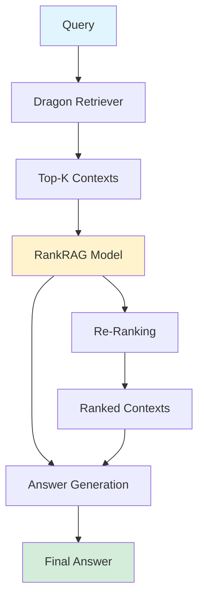

## RankRAG: NVIDIA's Dual-Purpose Re-Ranker/Generation Models

*Curiosity:* How can a single model handle both context re-ranking and answer generation? What happens when we instruction-tune for both tasks?

**NVIDIA introduces RankRAG 8B & 70B**—dual-purpose re-ranker/generation models that outperform GPT-4 across 9 RAG benchmarks.

{: .light .shadow .rounded-10 w='1212' h='668' }

> **Paper**: <https://arxiv.org/pdf/2407.02485>
{: .prompt-info}

### The Challenge

*Retrieve:* Traditional RAG limitations.

| Problem | Description | Impact |
|:--------|:------------|:-------|
| **Too Many Contexts** | Exceed generation context window | ⚠️ Truncation |
| **Too Few Contexts** | Poor recall when k is small | ⚠️ Missing information |
| **Separate Models** | Re-ranker and generator separate | ⚠️ Complexity |

**Result**: Suboptimal RAG performance.

### RankRAG Solution

*Innovate:* Single model for both tasks.

**Key Innovation**: Instruction-tune a single LLM for both:
- Context re-ranking
- Answer generation

**Benefits**:
- ✅ Identify relevant contexts from larger k
- ✅ Deliver high-quality answers
- ✅ Simplified architecture
- ✅ Better performance

### RankRAG Architecture

*Retrieve:* How RankRAG works.

### Training Method

*Retrieve:* RankRAG's training process.

| Step | Process | Purpose |
|:-----|:---------|:--------|
| **1. Instruction Tuning** | Multiple datasets (Flan, Dolly) | ⬆️ Base capabilities |
| **2. Data Merging** | Combine instruction, QA, RAG QA, ranking data | ⬆️ Specialized training |
| **3. Fine-Tuning** | Combined specialized datasets | ⬆️ Dual-purpose optimization |
| **4. Evaluation** | Open QA, fact verification, conversational QA | ⬆️ Performance assessment |
| **5. Deployment** | Dragon retriever + RankRAG | ⬆️ Production system |

### Performance Results

*Innovate:* RankRAG's impressive achievements.

**Benchmark Performance**:

| Model | Average Score | vs. GPT-4 |
|:------|:--------------|:----------|
| **GPT-4** | 43.5 | Baseline |
| **RankRAG 8B** | 52.6 | +9.1 points |
| **RankRAG 70B** | 56.1 | +12.6 points |

**Key Achievements**:
- ✅ Surpasses GPT-4 across 9 RAG benchmarks
- ✅ Notable gains over ChatQA 1.5
- ✅ Strong generalization (matches GPT-4 on 5 biomedical benchmarks)
- ✅ Exceeds specialized re-ranking models
- ✅ Significant improvements with just 1% ranking data

### Key Insights

*Retrieve:* What makes RankRAG effective.

| Insight | Description | Impact |
|:--------|:------------|:-------|
| **Dual-Purpose** | Single model for both tasks | ⬆️ Efficiency |
| **Instruction Tuning** | Specialized training data | ⬆️ Performance |
| **Generalization** | Works across domains | ⬆️ Versatility |
| **Data Efficiency** | 1% ranking data helps | ⬆️ Practical |

### Key Takeaways

*Retrieve:* RankRAG demonstrates that a single instruction-tuned LLM can handle both context re-ranking and answer generation, outperforming GPT-4 across 9 RAG benchmarks.

*Innovate:* By training a dual-purpose model with specialized datasets combining instruction, QA, and ranking data, RankRAG achieves superior performance while simplifying the RAG architecture.

*Curiosity → Retrieve → Innovation:* Start with curiosity about improving RAG performance, retrieve insights from RankRAG's dual-purpose approach, and innovate by implementing unified re-ranking and generation models in your RAG systems.

**Next Steps**:
- Read the full paper
- Understand RankRAG architecture
- Experiment with dual-purpose training
- Deploy RankRAG in your systems

 Translate to Korean 

* * * 

## 8개의 RAG 벤치마크에서 GPT-4를 능가하는 이중 목적 재랭커/생성 모델 👇👇👇

기존의 RAG 방법은 LLM을 사용하여 답변을 생성하기 위해 데이터베이스에서 top-k 컨텍스트를 검색하지만, 생성 컨텍스트 창을 초과하는 컨텍스트가 너무 많거나 k가 너무 작을 때 재현율이 낮을 때 문제가 발생합니다. 

RankRAG 프레임워크는 컨텍스트 재순위 지정과 답변 생성 모두를 위해 단일 LLM을 명령어 튜닝하여 이러한 문제를 극복하고, 더 큰 검색된 k에서 관련 컨텍스트를 식별하고 고품질 답변을 제공하는 능력을 향상시킵니다.

메서드:
- 1️⃣ 여러 데이터 세트(예: Flan, Dolly 등)를 사용하여 명령어 튜닝을 수행합니다.
- 2️⃣ 원본 지침 데이터를 QA 데이터, RAG QA 데이터, 컨텍스트 순위 데이터 및 RAG 순위 데이터와 병합합니다.
- 3️⃣ 이러한 결합된 특수 데이터 세트에서 모델을 다시 미세 조정합니다.
- 4️⃣ 개방형 QA, 사실 확인 및 대화형 QA 데이터 세트에 대해 평가합니다.
- 5️⃣ 컨텍스트 검색에는 드래곤 리트리버를 사용하고 순위 및 답변 생성에는 RankRAG를 사용합니다.

통찰:
- 🔸 RankRAG 8B 및 70B 모델은 9개의 RAG 벤치마크에서 GPT-4를 능가합니다.
- 🔸 평균 점수: GPT-4 = 43.5, RankRAG 8B = 52.6, RankRAG 70B = 56.1.
- 🔸 RankRAG는 ChatQA 1.5에 비해 특히 초기 검색의 어려움으로 인해 까다로운 벤치마크에서 눈에 띄는 성능 향상을 보여줍니다.
- 🔸 RankRAG는 5개의 생물의학 RAG 벤치마크에서 GPT-4의 성능과 일치하는 강력한 일반화를 보여줍니다.
- 🔸 RankRAG는 또한 더 큰 데이터 세트에서 훈련된 특수 순위 재지정 모델의 성능을 능가합니다.
- 🔸 1%의 순위 데이터만 지침 데이터와 통합하면 상당한 개선이 이루어집니다.

