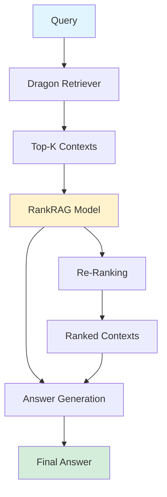

## RankRAG: NVIDIA's Dual-Purpose Re-Ranker/Generation Models

*Curiosity:* How can a single model handle both context re-ranking and answer generation? What happens when we instruction-tune for both tasks?

**NVIDIA introduces RankRAG 8B & 70B**—dual-purpose re-ranker/generation models that outperform GPT-4 across 9 RAG benchmarks.

{: .light .shadow .rounded-10 w='1212' h='668' }

> **Paper**: <https://arxiv.org/pdf/2407.02485>
{: .prompt-info}

### The Challenge

*Retrieve:* Traditional RAG limitations.

| Problem | Description | Impact |
|:--------|:------------|:-------|
| **Too Many Contexts** | Exceed generation context window | ⚠️ Truncation |
| **Too Few Contexts** | Poor recall when k is small | ⚠️ Missing information |
| **Separate Models** | Re-ranker and generator separate | ⚠️ Complexity |

**Result**: Suboptimal RAG performance.

### RankRAG Solution

*Innovate:* Single model for both tasks.

**Key Innovation**: Instruction-tune a single LLM for both:
- Context re-ranking
- Answer generation

**Benefits**:
- ✅ Identify relevant contexts from larger k
- ✅ Deliver high-quality answers
- ✅ Simplified architecture
- ✅ Better performance

### RankRAG Architecture

*Retrieve:* How RankRAG works.

```mermaid
graph TB
    A[Query] --> B[Dragon Retriever]
    B --> C[Top-K Contexts]
    C --> D[RankRAG Model]
    D --> E[Re-Ranking]
    D --> F[Answer Generation]
    E --> G[Ranked Contexts]
    G --> F
    F --> H[Final Answer]
    
    style A fill:#e1f5ff
    style D fill:#fff3cd
    style H fill:#d4edda
```

### Training Method

*Retrieve:* RankRAG's training process.

| Step | Process | Purpose |
|:-----|:---------|:--------|
| **1. Instruction Tuning** | Multiple datasets (Flan, Dolly) | ⬆️ Base capabilities |
| **2. Data Merging** | Combine instruction, QA, RAG QA, ranking data | ⬆️ Specialized training |
| **3. Fine-Tuning** | Combined specialized datasets | ⬆️ Dual-purpose optimization |
| **4. Evaluation** | Open QA, fact verification, conversational QA | ⬆️ Performance assessment |
| **5. Deployment** | Dragon retriever + RankRAG | ⬆️ Production system |

### Performance Results

*Innovate:* RankRAG's impressive achievements.

**Benchmark Performance**:

| Model | Average Score | vs. GPT-4 |
|:------|:--------------|:----------|
| **GPT-4** | 43.5 | Baseline |
| **RankRAG 8B** | 52.6 | +9.1 points |
| **RankRAG 70B** | 56.1 | +12.6 points |

**Key Achievements**:
- ✅ Surpasses GPT-4 across 9 RAG benchmarks
- ✅ Notable gains over ChatQA 1.5
- ✅ Strong generalization (matches GPT-4 on 5 biomedical benchmarks)
- ✅ Exceeds specialized re-ranking models
- ✅ Significant improvements with just 1% ranking data

### Key Insights

*Retrieve:* What makes RankRAG effective.

| Insight | Description | Impact |
|:--------|:------------|:-------|
| **Dual-Purpose** | Single model for both tasks | ⬆️ Efficiency |
| **Instruction Tuning** | Specialized training data | ⬆️ Performance |
| **Generalization** | Works across domains | ⬆️ Versatility |
| **Data Efficiency** | 1% ranking data helps | ⬆️ Practical |

### Key Takeaways

*Retrieve:* RankRAG demonstrates that a single instruction-tuned LLM can handle both context re-ranking and answer generation, outperforming GPT-4 across 9 RAG benchmarks.

*Innovate:* By training a dual-purpose model with specialized datasets combining instruction, QA, and ranking data, RankRAG achieves superior performance while simplifying the RAG architecture.

*Curiosity → Retrieve → Innovation:* Start with curiosity about improving RAG performance, retrieve insights from RankRAG's dual-purpose approach, and innovate by implementing unified re-ranking and generation models in your RAG systems.

**Next Steps**:
- Read the full paper
- Understand RankRAG architecture
- Experiment with dual-purpose training
- Deploy RankRAG in your systems

 Translate to Korean 

* * * 

## A dual-purpose reranker/generation model that outperforms GPT-4 on 8 RAG benchmarks 👇👇👇

Traditional RAG methods retrieve the top-k context from a database to generate answers using an LLM, but problems arise when there is too much context exceeding the generation context window or when k is too small and recall is low. 

The RankRAG framework overcomes these issues by instruction-tuning a single LLM for both context reranking and answer generation, improving its ability to identify relevant context from a larger retrieved k and deliver high-quality answers.

Method:
- 1️⃣ Perform instruction tuning using multiple datasets (e.g., Flan, Dolly, etc.).
- 2️⃣ Merge the original instruction data with QA data, RAG QA data, context ranking data, and RAG ranking data.
- 3️⃣ Re-fine-tune the model on these combined specialized datasets.
- 4️⃣ Evaluate on open-domain QA, fact verification, and conversational QA datasets.
- 5️⃣ Use the Dragon retriever for context retrieval and RankRAG for ranking and answer generation.

Insights:
- 🔸 RankRAG 8B and 70B models outperform GPT-4 on 9 RAG benchmarks.
- 🔸 Average scores: GPT-4 = 43.5, RankRAG 8B = 52.6, RankRAG 70B = 56.1.
- 🔸 RankRAG shows notable performance improvements on challenging benchmarks compared to ChatQA 1.5, particularly due to difficulties in initial retrieval.
- 🔸 RankRAG demonstrates strong generalization, matching GPT-4's performance on 5 biomedical RAG benchmarks.
- 🔸 RankRAG also outperforms specialized reranking models trained on larger datasets.
- 🔸 Integrating just 1% of ranking data with instruction data yields significant improvements.

