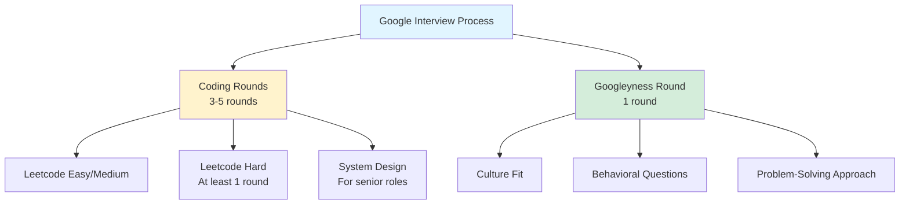
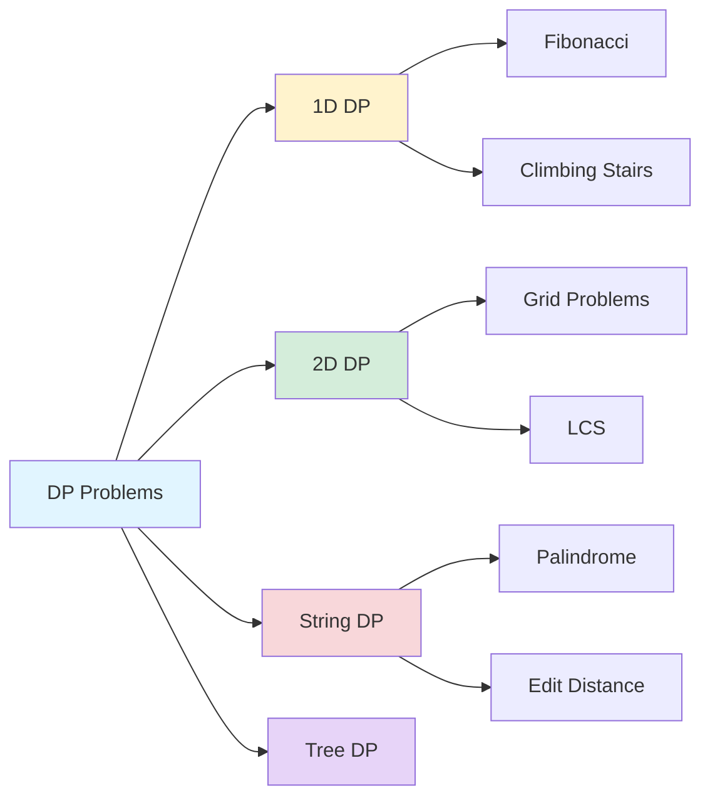

{: .light .shadow .rounded-10 w='1212' h='668' }

## How to Prepare for a Google Interview: A Systematic Approach

*Curiosity:* How can we systematically prepare for technical interviews at top tech companies? What knowledge should we retrieve to maximize our chances of success?

**Preparing for a Google interview** requires a structured approach that combines fundamental knowledge, problem-solving skills, and consistent practice. This guide will help you retrieve the essential concepts and innovate your preparation strategy.

### Interview Structure Overview



### Interview Requirements

| Role Level | Coding Rounds | Problem Difficulty | Time per Round |
|:-----------|:--------------|:-------------------|:---------------|
| **Internship** | 3-4 rounds | Medium to Hard | 45 minutes |
| **Entry Level (L3)** | 3-5 rounds | At least 1 Hard | 45 minutes |
| **Mid Level (L4)** | 4-5 rounds | Hard + System Design | 45-60 minutes |
| **Senior (L5+)** | 5+ rounds | Hard + Architecture | 60 minutes |

**Key Insight**: For internships and entry-level roles (L3), Google typically conducts 3-5 coding rounds followed by 1 round focused on Googleyness. To ace a Google coding round, you need to be prepared to solve a **Leetcode hard problem with working code in 45 minutes**.

### Preparation Roadmap

#### Phase 1: Foundation - Data Structures

Master these fundamental data structures first:

| Data Structure | Key Concepts | Practice Resources | Link |
|:---------------|:-------------|:-------------------|:-----|
| **Stack** | LIFO, push/pop, applications | GeeksforGeeks | [Link](https://www.geeksforgeeks.org/stack-data-structure/) |
| **Heap** | Min/Max heap, priority queue | GeeksforGeeks | [Link](https://www.geeksforgeeks.org/heap-data-structure/) |
| **Queue** | FIFO, enqueue/dequeue, BFS | GeeksforGeeks | [Link](https://www.geeksforgeeks.org/queue-data-structure/) |
| **Graphs** | Adjacency list/matrix, traversal | GeeksforGeeks | [Link](https://www.geeksforgeeks.org/graph-data-structure-and-algorithms/) |

**Sample Implementation**:

```python
# Stack implementation
class Stack:
    def __init__(self):
        self.items = []
    
    def push(self, item):
        self.items.append(item)
    
    def pop(self):
        if not self.is_empty():
            return self.items.pop()
        return None
    
    def is_empty(self):
        return len(self.items) == 0
    
    def peek(self):
        if not self.is_empty():
            return self.items[-1]
        return None

# Usage example
stack = Stack()
stack.push(1)
stack.push(2)
print(stack.pop())  # Output: 2
```

#### Phase 2: Core Algorithms

Build proficiency in these essential algorithms:

| Algorithm | Time Complexity | Use Cases | Practice Resources |
|:----------|:----------------|:----------|:-------------------|
| **Sorting** | O(n log n) average | Array manipulation | [Link](https://www.geeksforgeeks.org/sorting-algorithms/) |
| **BFS** | O(V + E) | Level-order traversal, shortest path | [Link](https://www.geeksforgeeks.org/breadth-first-search-or-bfs-for-a-graph/) |
| **DFS** | O(V + E) | Tree/graph traversal, backtracking | [Link](https://www.geeksforgeeks.org/depth-first-search-or-dfs-for-a-graph/) |

**BFS Implementation**:

```python
from collections import deque

def bfs(graph, start):
    """Breadth-First Search implementation"""
    visited = set()
    queue = deque([start])
    visited.add(start)
    result = []
    
    while queue:
        node = queue.popleft()
        result.append(node)
        
        for neighbor in graph.get(node, []):
            if neighbor not in visited:
                visited.add(neighbor)
                queue.append(neighbor)
    
    return result

# Example usage
graph = {
    'A': ['B', 'C'],
    'B': ['D', 'E'],
    'C': ['F'],
    'D': [],
    'E': [],
    'F': []
}
print(bfs(graph, 'A'))  # Output: ['A', 'B', 'C', 'D', 'E', 'F']
```

#### Phase 3: Language Proficiency

**Choose your language and master it**:

- **C++ 17**: Excellent for STL (Standard Template Library)
  - Optimized implementations for arrays, sorting, stacks, heaps, queues
  - Strong performance for competitive programming
  
- **Python**: Great for rapid prototyping
  - Clean syntax, extensive libraries
  - Good for system design discussions

- **Java**: Enterprise-friendly
  - Strong typing, good for large codebases
  - Extensive standard library

**Key Practice**: Write as much code as possible. Translating thoughts into code should become second nature.

#### Phase 4: Advanced Data Structures

Move to more complex structures:

| Structure | Key Properties | Practice Resources |
|:----------|:---------------|:-------------------|
| **Trees** | Hierarchical, recursive properties | [Link](https://www.geeksforgeeks.org/tree-data-structure/) |
| **Deque** | Double-ended queue | [Link](https://www.geeksforgeeks.org/deque-cpp-stl/) |
| **Sets** | Unique elements, O(1) lookup | [Link](https://www.geeksforgeeks.org/set-in-cpp-stl/) |
| **Maps** | Key-value pairs, hash tables | [Link](https://www.geeksforgeeks.org/map-associative-containers-the-c-standard-template-library-stl/) |

#### Phase 5: Problem-Solving Techniques

Master these essential patterns:

| Technique | Description | Practice Resources |
|:----------|:------------|:-------------------|
| **Sliding Window** | Fixed/variable window size | [Link](https://www.geeksforgeeks.org/window-sliding-technique/) |
| **Binary Search on Answer** | Search in solution space | [Link](https://www.geeksforgeeks.org/binary-search-on-answer-tutorial-with-problems/) |
| **Matrix Traversal** | 2D array problems | [Link](https://www.geeksforgeeks.org/depth-first-traversal-dfs-on-a-2d-array/) |
| **Topological Sort** | DAG ordering | [Link](https://www.geeksforgeeks.org/topological-sorting/) |

**Sliding Window Example**:

```python
def max_sum_subarray(arr, k):
    """Find maximum sum of subarray of size k"""
    if len(arr) < k:
        return 0
    
    # Calculate sum of first window
    window_sum = sum(arr[:k])
    max_sum = window_sum
    
    # Slide the window
    for i in range(k, len(arr)):
        window_sum = window_sum - arr[i - k] + arr[i]
        max_sum = max(max_sum, window_sum)
    
    return max_sum

# Example
arr = [1, 4, 2, 10, 2, 3, 1, 0, 20]
k = 4
print(max_sum_subarray(arr, k))  # Output: 24
```

#### Phase 6: Dynamic Programming

**Dynamic Programming** deserves a dedicated study plan:



**DP Pattern Recognition**:

1. **Optimal Substructure**: Solution contains optimal solutions to subproblems
2. **Overlapping Subproblems**: Same subproblems solved multiple times
3. **Memoization/Tabulation**: Store results to avoid recomputation

### Study Schedule Recommendation

| Week | Focus | Daily Practice | Goal |
|:-----|:------|:---------------|:-----|
| **1-2** | Data Structures | 2-3 problems | Master basics |
| **3-4** | Algorithms | 3-4 problems | Understand patterns |
| **5-6** | Problem Techniques | 4-5 problems | Recognize patterns |
| **7-8** | Dynamic Programming | 3-4 problems | Master DP |
| **9-10** | Mock Interviews | 2-3 problems | Time management |
| **11-12** | Review & Hard Problems | 2-3 problems | Confidence building |

### Key Takeaways

*Retrieve:* Google interviews require strong fundamentals in data structures, algorithms, and problem-solving techniques. Systematic preparation is essential.

*Innovate:* Create a personalized study plan based on your current level. Focus on weak areas while maintaining strength in fundamentals.

*Curiosity → Retrieve → Innovation:* Start with curiosity about interview success, retrieve knowledge from practice problems, and innovate your problem-solving approach through consistent practice.

**Next Steps**: Evaluate where you are in your preparation journey and use this guide to create your personalized roadmap. Follow for more tips on mastering Data Structures and Algorithms (DSA).

