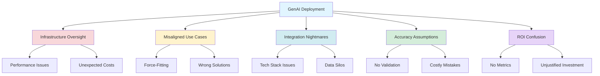
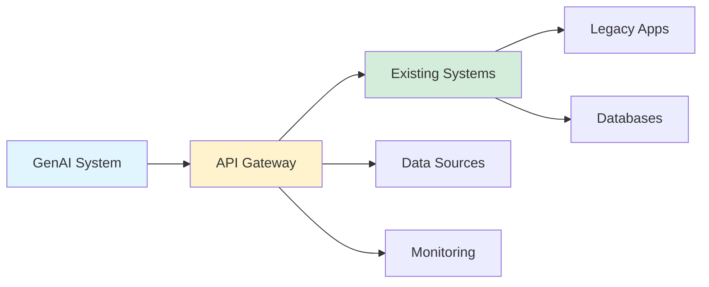

## Generative AI Application Ecosystem: Challenges and Best Practices

*Curiosity:* What challenges do organizations face when deploying Generative AI? How can we avoid common pitfalls and build successful GenAI applications?

**In the race to leverage Generative AI**, many organizations sprint towards deployment without considering long-term implications. Understanding common challenges helps build successful, sustainable GenAI applications.

{: .light .shadow .rounded-10 w='1212' h='668' }

### Common Deployment Challenges



### 5 Critical Challenges

| # | Challenge | Description | Impact | Solution |
|:--|:----------|:------------|:-------|:---------|
| **1** | **Infrastructure Oversight** | Underestimating computational demands | ⚠️ Performance issues, unexpected costs | Proper capacity planning |
| **2** | **Misaligned Use Cases** | Force-fitting GenAI into wrong scenarios | ⚠️ Poor ROI, user dissatisfaction | Use case validation |
| **3** | **Integration Nightmares** | Systems don't integrate with existing tech | ⚠️ Data silos, inefficiency | Architecture planning |
| **4** | **Accuracy Assumptions** | Blind trust in AI outputs | ⚠️ Costly mistakes, reputation damage | Validation frameworks |
| **5** | **ROI Confusion** | No clear success metrics | ⚠️ Unjustified investment | Define KPIs |

### 1. Infrastructure Oversight

*Retrieve:* Companies often underestimate GenAI computational demands.

**Problems**:
- Performance bottlenecks
- Unexpected cloud costs
- Scalability issues
- Resource constraints

**Solutions**:
- Capacity planning
- Cost estimation
- Scalability testing
- Resource monitoring

**Example**:

```python
# Infrastructure planning example
def estimate_genai_costs(
    requests_per_day,
    avg_tokens_per_request,
    model_cost_per_1k_tokens
):
    """Estimate GenAI infrastructure costs"""
    daily_tokens = requests_per_day * avg_tokens_per_request
    daily_cost = (daily_tokens / 1000) * model_cost_per_1k_tokens
    monthly_cost = daily_cost * 30
    
    # Add compute costs
    compute_cost = estimate_compute_requirements(requests_per_day)
    
    return {
        'monthly_api_cost': monthly_cost,
        'monthly_compute_cost': compute_cost,
        'total_monthly': monthly_cost + compute_cost
    }
```

### 2. Misaligned Use Cases

*Innovate:* Excitement can lead to force-fitting GenAI into wrong scenarios.

**Warning Signs**:
- GenAI used where simpler solutions work
- Over-engineering simple problems
- User needs not met
- Poor performance

**Best Practices**:
- Validate use case fit
- Consider alternatives
- Start with pilot projects
- Measure actual value

### 3. Integration Nightmares

*Retrieve:* Rushing deployment creates integration problems.

**Issues**:
- Incompatible tech stacks
- Data silos
- Broken workflows
- Maintenance complexity

**Solutions**:
- API-first design
- Standardized interfaces
- Integration testing
- Documentation

**Architecture**:



### 4. Accuracy Assumptions

*Retrieve:* GenAI outputs need rigorous validation.

**Risks**:
- Hallucinations
- Incorrect information
- Bias propagation
- Compliance issues

**Validation Framework**:

```python
# Validation example
def validate_genai_output(output, source_data, validation_rules):
    """Validate GenAI output"""
    checks = {
        'factual_accuracy': check_facts(output, source_data),
        'bias_detection': detect_bias(output),
        'compliance': check_compliance(output, validation_rules),
        'safety': check_safety(output)
    }
    
    if all(checks.values()):
        return {'valid': True, 'output': output}
    else:
        return {
            'valid': False,
            'issues': [k for k, v in checks.items() if not v],
            'output': None
        }
```

### 5. ROI Confusion

*Innovate:* Define clear metrics for GenAI success.

**Key Metrics**:
- User satisfaction
- Task completion rate
- Cost per transaction
- Time savings
- Quality improvements

**ROI Framework**:

| Metric | Measurement | Target |
|:-------|:------------|:-------|
| **User Satisfaction** | NPS, surveys | > 70% |
| **Task Completion** | Success rate | > 90% |
| **Cost Efficiency** | Cost per task | < Baseline |
| **Time Savings** | Hours saved | > 20% |
| **Quality** | Error rate | < 5% |

### Best Practices

*Retrieve:* Learn from successful deployments.

**Recommendations**:
1. **Start Small**: Pilot projects before full deployment
2. **Measure Everything**: Define metrics upfront
3. **Validate Outputs**: Never trust blindly
4. **Plan Infrastructure**: Estimate costs and capacity
5. **Integrate Properly**: Design for existing systems

### Key Takeaways

*Retrieve:* Common GenAI deployment challenges include infrastructure oversight, misaligned use cases, integration problems, accuracy assumptions, and ROI confusion.

*Innovate:* By understanding these challenges and implementing best practices—proper planning, validation, integration, and metrics—organizations can successfully deploy GenAI applications.

*Curiosity → Retrieve → Innovation:* Start with curiosity about GenAI deployment, retrieve insights from common challenges, and innovate by implementing thoughtful planning and best practices.

**Next Steps**:
- Assess your use case fit
- Plan infrastructure carefully
- Design integration strategy
- Implement validation
- Define success metrics
