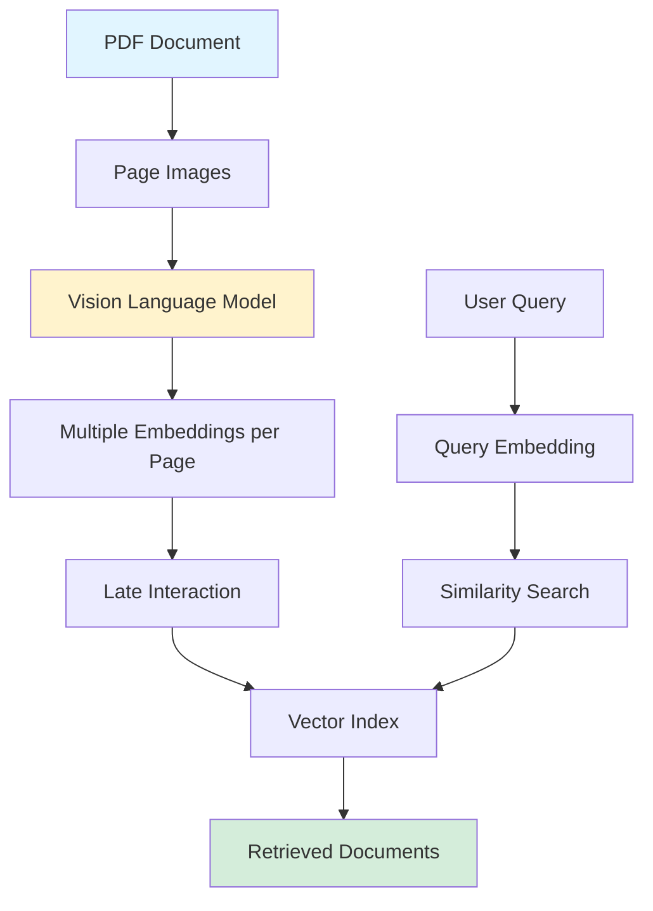

{: .light .shadow .rounded-10 w='1212' h='668' }

## ColPali: Efficient Document Retrieval with Vision Language Models

*Curiosity:* How can we simplify PDF document retrieval in RAG systems? What happens when we embed document images directly instead of extracting text?

**ColPali** solves one of the biggest problems in RAG with PDF documents. This research project introduces an efficient approach to document retrieval using Vision Language Models.

> **Resources**:
> - **📝 Paper**: <https://arxiv.org/abs/2407.01449>
> - **🗃️ Benchmark**: <https://huggingface.co/vidore>
> - **👀 Model**: <https://huggingface.co/vidore/colpali>
> - **📰 Blog Post**: <https://huggingface.co/blog/manu/colpali>
{: .prompt-info}

**Collaborators**: Hugues Sibille, Tony W., Bilel Omrani, Gautier Viaud (ILLUIN Technology), Celine Hudelot, Pierre Colombo (CentraleSupélec), with compute funding from CINES.

### The Problem

*Retrieve:* Challenges with traditional document retrieval.

**Traditional Approach**:
1. Parse PDF documents (OCR, segmentation, captioning)
2. Embed textual content
3. Store vectors in index database
4. Match queries to documents

**Limitations**:
- ❌ Complex and slow indexing
- ❌ Ignores visual elements (tables, figures, images, fonts, colors)
- ❌ Loses important information

### ColPali Solution

*Innovate:* Direct image embedding approach.

### Key Innovations

*Retrieve:* ColPali's breakthrough concepts.

| Innovation | Description | Benefit |
|:-----------|:------------|:--------|
| **Direct Image Embedding** | Embed page images directly | ⬆️ Preserves visual information |
| **Vision Language Models** | Read text, tables, figures | ⬆️ Comprehensive understanding |
| **Late Interaction** | Multiple embeddings per page | ⬆️ Maximizes information |
| **Fast Query Matching** | Maintains speed | ⬆️ Performance |

**Key Concept**:
- Instead of extracting text, embed document page images directly
- Leverage Vision Language Models for understanding
- Use late interaction for multiple embeddings per page
- Maintain fast query-matching speeds

### Performance

*Innovate:* ColPali's impressive results.

**Results**:
- ✅ **Largely outperforms** strong baselines on visually rich documents
- ✅ **Orders of magnitude faster** indexing speeds
- ✅ Preserves visual information (tables, figures, formatting)
- ✅ Research community hit

**Impact**: Enables efficient, accurate document retrieval for RAG systems.

### Key Takeaways

*Retrieve:* ColPali demonstrates that embedding document page images directly using Vision Language Models can outperform traditional text extraction approaches while enabling much faster indexing.

*Innovate:* By leveraging Vision Language Models and late interaction mechanisms, ColPali preserves visual information that traditional methods lose, making it ideal for visually rich document retrieval in RAG systems.

*Curiosity → Retrieve → Innovation:* Start with curiosity about efficient document retrieval, retrieve insights from ColPali's image-based approach, and innovate by applying Vision Language Models to your document retrieval systems.

**Next Steps**:
- Read the paper
- Explore the model on Hugging Face
- Try the benchmark
- Apply to your RAG systems

> - 📝 The paper: <https://arxiv.org/abs/2407.01449>
> - 🗃️ The benchmark: <https://huggingface.co/vidore>
> - 👀 The model: <https://huggingface.co/vidore/colpali>
> - 📰 The blogpost: <https://huggingface.co/blog/manu/colpali>
{: .prompt-info}

Joint work with Hugues Sibille Tony W. Bilel Omrani Gautier Viaud from ILLUIN Technology, and Celine Hudelot + Pierre Colombo from CentraleSupélec, with compute funding from the amazing team at CINES !

