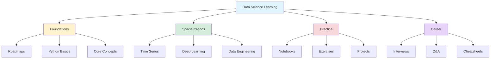
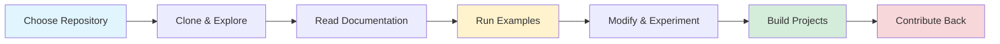

## GitHub: The Free University for Data Science

*Curiosity:* How can we leverage GitHub as a learning platform? What knowledge can we retrieve from the vast repository of open-source data science resources?

**GitHub is indeed a free university**—a treasure trove of knowledge, code, and learning resources. Yet, 99% of people don't realize its full potential as an educational platform. This curated list of 20 best GitHub repositories will help you retrieve knowledge systematically and innovate in your data science journey.

### Learning Path Architecture



### 20 Best GitHub Repositories for Data Science

| # | Repository | Category | Description | Stars | Link |
|:--|:-----------|:---------|:------------|:------|:-----|
| 1 | **Data Scientist Roadmap** | 🗺️ Roadmap | Comprehensive learning path for data scientists | ⭐ | [Link](https://github.com/MrMimic/data-scientist-roadmap) |
| 2 | **Learn Data Science** | 📚 Learning | Interactive tutorials and notebooks | ⭐ | [Link](https://github.com/nborwankar/LearnDataScience) |
| 3 | **Awesome Python** | 🐍 Resources | Curated list of Python resources | ⭐⭐⭐ | [Link](https://github.com/vinta/awesome-python) |
| 4 | **Data Science in Python** | 📊 Tutorials | Python-based data science tutorials | ⭐ | [Link](https://github.com/r0f1/datascience) |
| 5 | **DS Python Notebooks** | 📓 Notebooks | Collection of data science notebooks | ⭐⭐⭐ | [Link](https://github.com/donnemartin/data-science-ipython-notebooks) |
| 6 | **Awesome Data Science** | 📚 Resources | Comprehensive data science resource list | ⭐⭐⭐ | [Link](https://github.com/academic/awesome-datascience) |
| 7 | **Self Taught DS** | 🎓 Curriculum | Open-source data science curriculum | ⭐⭐⭐ | [Link](https://github.com/ossu/data-science) |
| 8 | **Time Series Forecasting** | 📈 Specialization | Microsoft's time series forecasting guide | ⭐ | [Link](https://microsoft.github.io/forecasting/) |
| 9 | **Master Data Science** | 🎓 Curriculum | Complete data science master's program | ⭐ | [Link](https://github.com/datasciencemasters/go) |
| 10 | **Keras Resources** | 🤖 Deep Learning | Best practices and resources for Keras | ⭐ | [Link](https://github.com/fchollet/keras-resources) |
| 11 | **Pandas Exercises** | 💪 Practice | Hands-on pandas exercises | ⭐⭐⭐ | [Link](https://github.com/guipsamora/pandas_exercises) |
| 12 | **Best DS Resources** | 📚 Resources | Curated collection of data science resources | ⭐ | [Link](https://github.com/Mohitkr95/Best-Data-Science-Resources) |
| 13 | **Data Engineering HowTo** | 🔧 Engineering | Guide to becoming a data engineer | ⭐ | [Link](https://github.com/adilkhash/Data-Engineering-HowTo) |
| 14 | **Awesome Data Engineering** | 🔧 Engineering | Data engineering tools and resources | ⭐⭐⭐ | [Link](https://github.com/igorbarinov/awesome-data-engineering) |
| 15 | **DS Cheatsheets** | 📝 Reference | Quick reference cheatsheets | ⭐⭐⭐ | [Link](https://github.com/FavioVazquez/ds-cheatsheets) |
| 16 | **1000+ DS Blogs** | 📰 Blogs | Comprehensive list of data science blogs | ⭐ | [Link](https://github.com/rushter/data-science-blogs) |
| 17 | **Free DS Books** | 📖 Books | Collection of free data science books | ⭐ | [Link](https://github.com/chaconnewu/free-data-science-books) |
| 18 | **Data Science Q&A** | ❓ Q&A | Question and answer repository | ⭐ | [Link](https://github.com/jayinai/data-science-question-answer) |
| 19 | **DS Interviews** | 💼 Career | Interview preparation resources | ⭐⭐⭐ | [Link](https://github.com/alexeygrigorev/data-science-interviews) |

### Repository Categories Breakdown

#### 🗺️ Roadmaps & Learning Paths

**1. Data Scientist Roadmap**
- *Retrieve:* Structured learning path from beginner to advanced
- *Innovate:* Customize your journey based on career goals
- Link: <https://github.com/MrMimic/data-scientist-roadmap>

**2. Self Taught Data Science**
- *Retrieve:* Open-source curriculum equivalent to university programs
- *Innovate:* Learn at your own pace with community support
- Link: <https://github.com/ossu/data-science>

#### 📚 Comprehensive Resources

**3. Awesome Python**
- *Retrieve:* Curated list of Python libraries and tools
- *Innovate:* Discover new tools for your projects
- Link: <https://github.com/vinta/awesome-python>

**4. Awesome Data Science**
- *Retrieve:* Comprehensive collection of data science resources
- *Innovate:* Find the right tool for every task
- Link: <https://github.com/academic/awesome-datascience>

#### 📓 Hands-on Practice

**5. Data Science Python Notebooks**
- *Retrieve:* Real-world examples and implementations
- *Innovate:* Learn by studying production-ready code
- Link: <https://github.com/donnemartin/data-science-ipython-notebooks>

**6. Pandas Exercises**
- *Retrieve:* Practice problems for data manipulation
- *Innovate:* Build muscle memory for common operations
- Link: <https://github.com/guipsamora/pandas_exercises>

### How to Use These Repositories

```python
# Example: Cloning and exploring a repository
import subprocess
import os

def explore_repo(repo_url, local_path):
    """Clone and explore a GitHub repository"""
    # Clone the repository
    subprocess.run(['git', 'clone', repo_url, local_path])
    
    # List contents
    contents = os.listdir(local_path)
    print(f"Repository contents: {contents}")
    
    # Find notebooks
    notebooks = [f for f in contents if f.endswith('.ipynb')]
    print(f"Found {len(notebooks)} notebooks")
    
    return notebooks

# Example usage
repo_url = "https://github.com/donnemartin/data-science-ipython-notebooks"
local_path = "./data-science-notebooks"
notebooks = explore_repo(repo_url, local_path)
```

### Learning Workflow



### Specialized Learning Paths

#### Time Series Analysis
- **Resource**: Microsoft Time Series Forecasting
- *Retrieve:* Industry best practices for forecasting
- *Innovate:* Apply to your domain-specific problems
- Link: <https://microsoft.github.io/forecasting/>

#### Deep Learning
- **Resource**: Keras Resources
- *Retrieve:* Best practices for building neural networks
- *Innovate:* Create custom architectures
- Link: <https://github.com/fchollet/keras-resources>

#### Data Engineering
- **Resource**: Data Engineering HowTo
- *Retrieve:* Pipeline design patterns and tools
- *Innovate:* Build scalable data infrastructure
- Link: <https://github.com/adilkhash/Data-Engineering-HowTo>

### Career Preparation

#### Interview Resources
- **Data Science Interviews**: <https://github.com/alexeygrigorev/data-science-interviews>
- *Retrieve:* Common interview questions and answers
- *Innovate:* Develop your unique problem-solving approach

#### Q&A Repository
- **Data Science Q&A**: <https://github.com/jayinai/data-science-question-answer>
- *Retrieve:* Answers to common questions
- *Innovate:* Contribute your own insights

### Key Takeaways

*Retrieve:* GitHub hosts an incredible wealth of free educational resources—from roadmaps to hands-on exercises, covering every aspect of data science.

*Innovate:* By systematically exploring these repositories, you can build a personalized learning path that matches your career goals and interests.

*Curiosity → Retrieve → Innovation:* Start with curiosity about a topic, retrieve knowledge from these repositories, and innovate by applying what you learn to real-world problems.


## Multi-GPU Training Diagram by Avi Chawla

*Curiosity:* Includes:


- ▶ Model Parallelism
- ▶ Tensor Parallelism
- ▶ Data Parallelism
- ▶ Pipeline Parallelism

{: .light .shadow .rounded-10 w='1212' h='668' }