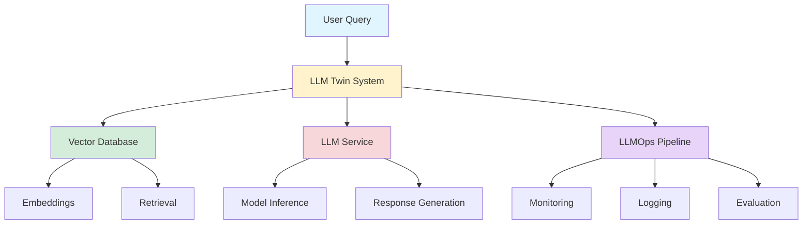

## The LLM Engineer's Handbook: Building Production-Ready LLM Applications

*Curiosity:* How do we bridge the gap between LLM research and production deployment? What engineering practices enable us to build reliable, scalable LLM applications?

**The LLM Engineer's Handbook** represents a comprehensive guide to building production-ready LLM applications, focusing on best engineering practices, reproducible pipelines, and end-to-end deployment—everything currently lacking in the ecosystem.

{: .light .shadow .rounded-10 w='1212' h='668' }

### Book Overview

**Goal**: Provide everything you need to know to build LLM applications, all in one comprehensive resource.

**Focus Areas**:
- Best engineering practices
- Reproducible pipelines
- End-to-end deployment
- Production-ready systems

### LLM Twin Course

> **LLM Twin Course** - A practical learning resource
> - **GitHub**: <https://github.com/decodingml/llm-twin-course>
> - **Focus**: LLMs, vector DBs, and LLMOps good practices
{: .prompt-info}

{: .light .shadow .rounded-10 w='1212' h='668' }

### LLM Twin Architecture

### Key Contributors

| Contributor | Role | Contribution |
|:------------|:-----|:-------------|
| **Paul Iusztin** | Co-author | LLM Twin Course creator |
| **Alex Vesa** | Co-author | Engineering practices expert |

**Collaboration**: The team has created the excellent [LLM Twin Course on GitHub](https://github.com/decodingml/llm-twin-course), an amazing resource for learning about LLMOps.

### What's Covered

| Topic | Description | Importance |
|:------|:------------|:-----------|
| **Engineering Practices** | Best practices for LLM development | ⭐⭐⭐ Critical |
| **Reproducible Pipelines** | Version control, testing, CI/CD | ⭐⭐⭐ Critical |
| **End-to-End Deployment** | Production deployment strategies | ⭐⭐⭐ Critical |
| **Vector Databases** | Embedding storage and retrieval | ⭐⭐ High |
| **LLMOps** | MLOps for LLM applications | ⭐⭐ High |

### Why This Book Matters

*Retrieve:* The LLM ecosystem currently lacks comprehensive engineering guidance. This book fills that gap by providing:

1. **Practical Examples**: Real-world implementations
2. **Best Practices**: Industry-proven patterns
3. **Complete Workflows**: From development to deployment
4. **Production Focus**: Scalable, maintainable systems

*Innovate:* By following the practices in this handbook, you can build LLM applications that are:
- Reliable and maintainable
- Scalable and efficient
- Production-ready from day one

### Pre-order Information

📙 **Pre-order on Amazon**: <https://www.amazon.com/dp/1836200072>

**Note**: Everything online is free, but pre-ordering helps support the work and increases visibility on Amazon.

### Key Takeaways

*Retrieve:* This handbook provides comprehensive guidance on building production-ready LLM applications, covering everything from development practices to deployment strategies.

*Innovate:* Apply these engineering practices to create reliable, scalable LLM systems that can handle real-world production workloads.

*Curiosity → Retrieve → Innovation:* Start with curiosity about production LLM systems, retrieve knowledge from this handbook, and innovate by building robust applications that solve real problems.

 10 Data Engineering architectures to crack your next interview 

1. Hadoop Architecture :
<https://medium.com/@shubhankarmayank/hdfs-and-architecture-of-hadoop-5cfacffcdfc0>

2. Hive Architecture :
<https://medium.com/@shubhankarmayank/hdfs-and-architecture-of-hadoop-5cfacffcdfc0>

3. Spark Architecture :
<https://medium.com/@knoldus/introduction-to-spark-architecture-5a2a6a304bec>

4. Hbase Architecture :
<https://tsaiprabhanj.medium.com/hbase-architecture-e46be95cc7d3>

5. Kafka Architecture :
<https://amsayed.medium.com/apache-kafka-architecture-real-time-cdc-and-python-integration-1846f5e49b39>

6. Airflow Architecture :
<https://premvishnoi.medium.com/apache-airfllow-architecture-4417c5f167f0>

7. BigQuery’s Architecture :
<https://medium.com/@vkrntkmrsngh/bigquerys-architecture-and-working-mechanism-dad5038ebc28>

8. Snowflake Architecture :
<https://medium.com/snowflake/2024-revisiting-snowflakes-architecture-in-a-nutshell-01f0970701a6>

9. Databricks Architecture :
<https://premvishnoi.medium.com/data-engineer-databricks-architecture-and-services-8965a02274ba>

10. MongoDB Architecture : <https://premvishnoi.medium.com/data-engineer-databricks-architecture-and-services-8965a02274ba>

𝗚𝗲𝘁 𝘁𝗵𝗲 𝗙𝘂𝗹𝗹 𝗜𝗻𝘁𝗲𝗿𝘃𝗶𝗲𝘄 𝗽𝗿𝗲𝗽 𝗸𝗶𝘁 𝗳𝗼𝗿 𝗗𝗮𝘁𝗮 𝗘𝗻𝗴𝗶𝗻𝗲𝗲𝗿𝘀 𝗵𝗲𝗿𝗲 -
<https://topmate.io/shubham_wadekar/1038815>

