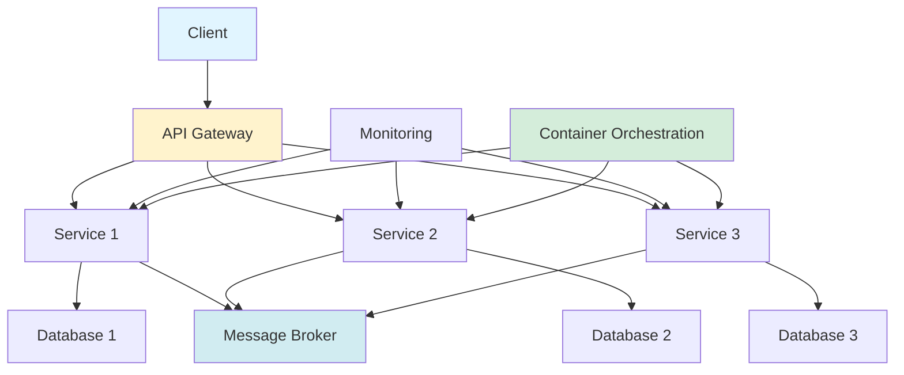

## Microservices: Popular Architectural Style for Modern Applications

*Curiosity:* How can we build scalable, maintainable applications? What makes microservices architecture effective for modern systems?

**Microservices** are a popular architectural style for building applications as a collection of small, independent services. Each service is responsible for a specific business function and communicates with other services through APIs.

**Benefits**: This approach improves scalability, maintainability, and resilience of applications.

### Microservices Architecture

*Retrieve:* Understanding the architecture.

### Architecture Components

*Innovate:* Key components overview.

| Component | Options | Purpose |
|:----------|:--------|:--------|
| **Databases** | SQL (MySQL, PostgreSQL), NoSQL (DynamoDB, Cassandra) | ⬆️ Data persistence |
| **Monitoring** | Prometheus, Grafana, Kibana | ⬆️ Health & performance |
| **Message Brokers** | Kafka, RabbitMQ, Amazon SQS | ⬆️ Async communication |
| **CI/CD** | Jenkins, GitLab Actions, CircleCI | ⬆️ Automation |
| **Languages** | Java, Node.js, Python, Go | ⬆️ Development |
| **Cloud Providers** | AWS, Azure, GCP | ⬆️ Deployment |
| **Security** | API authorization, TLS encryption | ⬆️ Protection |
| **Orchestration** | Kubernetes, Docker Swarm, OpenShift | ⬆️ Container management |

### Detailed Components

*Retrieve:* Understanding each component.

**1. Databases**:
- **SQL**: MySQL, PostgreSQL
- **NoSQL**: DynamoDB, Cassandra
- **Selection**: Depends on application needs

**2. Monitoring**:
- **Tools**: Prometheus, Grafana, Kibana
- **Purpose**: Monitor health and performance

**3. Message Brokers**:
- **Tools**: Kafka, RabbitMQ, Amazon SQS
- **Purpose**: Asynchronous messaging between services

**4. CI/CD**:
- **Tools**: Jenkins, GitLab Actions, CircleCI
- **Purpose**: Automate build, test, and deployment

**5. Languages**:
- **Options**: Java, Node.js, Python, Go
- **Flexibility**: Choose based on service needs

**6. Cloud Providers**:
- **Options**: AWS, Azure, GCP
- **Purpose**: Scalable deployment platforms

**7. Security**:
- **Considerations**: API authorization, TLS encryption
- **Importance**: Critical for microservices architecture

**8. Container Orchestration**:
- **Tools**: Kubernetes, Docker Swarm, OpenShift
- **Purpose**: Manage deployment and scaling

### Key Benefits

*Innovate:* Why microservices matter.

**Advantages**:
- ✅ **Scalability**: Scale services independently
- ✅ **Maintainability**: Easier to maintain small services
- ✅ **Resilience**: Failure isolation
- ✅ **Technology Diversity**: Use best tool for each service
- ✅ **Team Autonomy**: Independent development

### Key Takeaways

*Retrieve:* Microservices architecture uses small, independent services communicating via APIs, with components including databases, monitoring, message brokers, CI/CD, languages, cloud providers, security, and orchestration.

*Innovate:* By implementing microservices with proper components (databases, monitoring, message brokers, CI/CD, orchestration), you can build scalable, maintainable, and resilient applications that can evolve independently.

*Curiosity → Retrieve → Innovation:* Start with curiosity about scalable architectures, retrieve insights from microservices components, and innovate by building applications that can scale and evolve independently.

**Next Steps**:
- Design service boundaries
- Choose appropriate components
- Implement communication patterns
- Set up monitoring and CI/CD

I hope this infographic is helpful!

{: .light .shadow .rounded-10 w='1212' h='668' }
