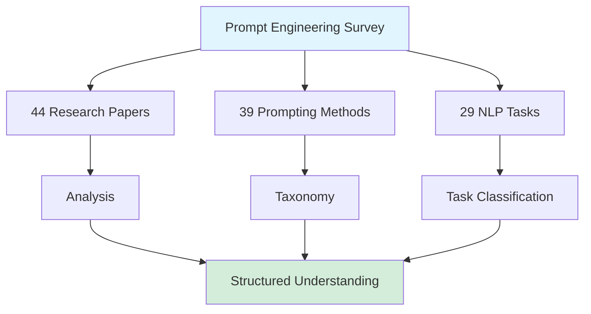
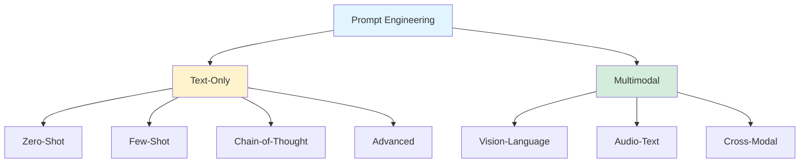

## A Survey of Prompt Engineering Methods in Large Language Models

*Curiosity:* What are the most effective prompt engineering techniques? How can we systematically understand and apply prompt engineering methods across different NLP tasks?

**This comprehensive survey** is the ultimate guide to prompt engineering, providing a structured taxonomy, comprehensive vocabulary, and analysis of 58 text-only and 40 multimodal prompting techniques.

> **Paper**: <https://arxiv.org/abs/2407.12994>
{: .prompt-info}

### Survey Overview

### Key Features

| Feature | Description | Impact |
|:--------|:------------|:-------|
| **Standardization** | Structured taxonomy of techniques | ⬆️ Clarity |
| **Comprehensive** | 39 prompting methods analyzed | ⬆️ Coverage |
| **Task-Specific** | 29 NLP tasks covered | ⬆️ Practicality |
| **SoTA Methods** | Best methods per task | ⬆️ Performance |

### Survey Scope

*Retrieve:* Extensive analysis of prompt engineering research.

**Analysis Coverage**:
- **44 Research Papers**: Comprehensive literature review
- **39 Prompting Methods**: Diverse techniques analyzed
- **29 NLP Tasks**: Wide range of applications
- **58 Text-Only Techniques**: Text-focused methods
- **40 Multimodal Techniques**: Cross-modal approaches

### What Makes This Survey Special

*Innovate:* This survey provides structured understanding and standardization.

**Unique Contributions**:
1. **Standardization**: Structured taxonomy of prompt engineering techniques
2. **Task Classification**: NLP tasks organized by dataset and strategy
3. **SoTA Methods**: Best prompting methods identified for each task
4. **Comprehensive Vocabulary**: 33 terms defined and explained

### Prompt Engineering Techniques

**Text-Only Techniques (58 methods)**:
- Zero-shot prompting
- Few-shot prompting
- Chain-of-thought
- Self-consistency
- And 54 more...

**Multimodal Techniques (40 methods)**:
- Vision-language prompts
- Audio-text prompts
- Cross-modal reasoning
- And 37 more...

### Taxonomy Structure

### NLP Task Coverage

*Retrieve:* 29 different NLP tasks analyzed with optimal prompting strategies.

**Task Categories**:
- Classification tasks
- Generation tasks
- Question answering
- Summarization
- Translation
- And 24 more...

**For Each Task**:
- Dataset information
- Applied prompting strategies
- SoTA methods identified
- LLM models used

### Who Should Read This

| Audience | Benefit | Use Case |
|:---------|:--------|:---------|
| **AI Researchers** | Latest trends in prompting | Research and development |
| **NLP Developers** | Task-optimized methods | Application development |
| **LLM Engineers** | Systematic approaches | Production systems |
| **AI Educators** | Comprehensive materials | Teaching and training |

### Key Takeaways

*Retrieve:* This survey provides a comprehensive, structured overview of prompt engineering methods, analyzing 44 papers, 39 methods, and 29 NLP tasks.

*Innovate:* By understanding the taxonomy and SoTA methods, you can select optimal prompting strategies for your specific tasks, improving LLM performance systematically.

*Curiosity → Retrieve → Innovation:* Start with curiosity about prompt engineering, retrieve insights from this comprehensive survey, and innovate by applying optimal methods to your LLM applications.

**Why It Matters**: Prompt engineering is essential for effectively using Claude, ChatGPT, and other LLMs. This survey helps you discover techniques you might have missed, with clear categorization for easy reference.

**Next Steps**:
- Read the full paper
- Explore techniques for your tasks
- Experiment with SoTA methods
- Apply to your LLM applications 

{: .light .shadow .rounded-10 w='1212' h='668' }
