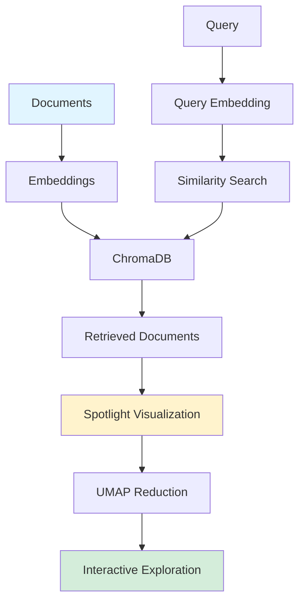

## Visualize Your RAG Data: EDA for Retrieval-Augmented Generation

*Curiosity:* How can we visualize RAG embedding data to understand retrieval quality? What insights can interactive visualizations reveal about our RAG systems?

**This tutorial** provides a step-by-step guide to creating interactive visualizations for RAG embedding data using Renumics Spotlight. Visualizing results is crucial for understanding and improving RAG applications.

> **Resources**:
> - **📝 Tutorial**: <https://github.com/Renumics/renumics-rag/blob/main/notebooks/visualize_rag_tutorial.ipynb>
> - **💻 Spotlight GitHub**: <https://github.com/Renumics/spotlight>
> - **📰 Article**: <https://itnext.io/visualize-your-rag-data-eda-for-retrieval-augmented-generation-0701ee98768f>
> - **👤 Author**: <https://www.linkedin.com/in/markus-stoll-b39a42138/>
{: .prompt-info}

### What You'll Build

*Retrieve:* Interactive RAG visualization system.

**Components**:
- LangChain Retrieval-Augmented Generation Application
- ChromaDB vector database
- OpenAI text-embedding-ada-002
- GPT-4 for generation
- Renumics Spotlight for visualization

**Demo Data**: Formula One Dataset from Wikipedia (easily replaceable with your data)

### Visualization Overview

*Innovate:* Understanding RAG data through visualization.

### Key Features

*Retrieve:* What Spotlight visualization provides.

| Feature | Description | Benefit |
|:--------|:------------|:--------|
| **UMAP Visualization** | Dimensionality reduction | ⬆️ Understand embedding space |
| **Relevance Coloring** | Color by query relevance | ⬆️ Identify patterns |
| **Interactive Exploration** | Explore embeddings | ⬆️ Debug retrieval |
| **Document Inspection** | View retrieved documents | ⬆️ Quality assessment |

**Example**: UMAP shows embeddings colored by relevance to "Who built the Nürburgring?"

### Visualization Benefits

*Innovate:* Why visualize RAG data.

**Insights**:
- ✅ Understand embedding space structure
- ✅ Identify retrieval patterns
- ✅ Debug retrieval issues
- ✅ Optimize chunk sizes
- ✅ Assess embedding quality

**Use Cases**:
- EDA for RAG development
- Quality assessment
- Performance optimization
- Debugging retrieval issues

### Key Takeaways

*Retrieve:* Interactive visualization with Renumics Spotlight enables exploratory data analysis of RAG embeddings, helping understand retrieval quality and optimize RAG systems.

*Innovate:* By visualizing RAG embedding data with UMAP and interactive tools, you can identify patterns, debug issues, and optimize your retrieval systems for better performance.

*Curiosity → Retrieve → Innovation:* Start with curiosity about RAG data visualization, retrieve insights from Spotlight's capabilities, and innovate by building interactive visualizations that improve your RAG applications.

**Next Steps**:
- Follow the tutorial
- Try with your data
- Explore embeddings
- Optimize your RAG system

{: .light .shadow .rounded-10 w='1212' h='668' }
