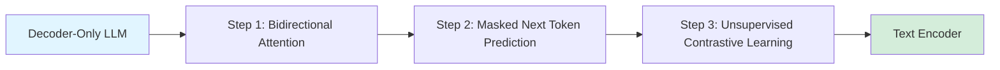

## LLM2Vec: Transform LLMs into Embedding Models

*Curiosity:* Can we transform decoder-only LLMs into powerful text encoders? What happens when we enable bidirectional attention and contrastive learning in LLMs?

**LLM2Vec** is a simple unsupervised approach that transforms any decoder-only LLM into a strong text encoder. This method achieves SOTA results on the MTEB benchmark without expensive adaptation or synthetic GPT-4 data.

> **Paper**: <https://mcgill-nlp.github.io/llm2vec/>
{: .prompt-info}

### Method Overview

*Retrieve:* LLM2Vec consists of three simple steps.

### Three-Step Process

| Step | Description | Purpose |
|:-----|:------------|:--------|
| **1. Bidirectional Attention** | Enable forward and backward context | Context understanding |
| **2. Masked Next Token Prediction** | Predict masked tokens | Language understanding |
| **3. Unsupervised Contrastive Learning** | Learn representations | Embedding quality |

### Performance

*Retrieve:* LLM2Vec achieves strong performance across tasks.

**Results**:
- ✅ Outperforms encoder-only models on word-level tasks
- ✅ **New SOTA on MTEB benchmark**
- ✅ No expensive adaptation needed
- ✅ No synthetic GPT-4 data required

**Advantages**:

| Advantage | Description | Benefit |
|:----------|:------------|:--------|
| **Simple** | Three-step process | ⬆️ Easy implementation |
| **Unsupervised** | No labeled data needed | ⬇️ Data requirements |
| **Cost-Effective** | No expensive adaptation | ⬇️ Costs |
| **SOTA Performance** | Best on MTEB | ⬆️ Quality |

### Key Takeaways

*Retrieve:* LLM2Vec demonstrates that decoder-only LLMs can be transformed into powerful text encoders through bidirectional attention, masked prediction, and contrastive learning.

*Innovate:* By applying LLM2Vec, you can leverage existing LLMs as embedding models, achieving SOTA performance without expensive fine-tuning or synthetic data generation.

*Curiosity → Retrieve → Innovation:* Start with curiosity about LLM-to-encoder transformation, retrieve insights from LLM2Vec's approach, and innovate by applying it to create powerful embedding models.

**Next Steps**:
- Read the full paper
- Experiment with LLM2Vec
- Apply to your embedding needs
- Compare with encoder-only models

