> LLMs Course Github 👉 <https://github.com/peremartra/Large-Language-Model-Notebooks-Course/tree/main/3-LangChain>
> {: .prompt-info}

## Introduction to LangChain and Agents: Building Intelligent Applications

_Curiosity:_ How can we build sophisticated LLM applications that go beyond simple prompts? What patterns and frameworks enable us to create intelligent agents that can reason, retrieve information, and take actions?

**LangChain** is a powerful framework for building LLM applications with chains, agents, and memory. This course section introduces LangChain through practical examples, from RAG systems to intelligent agents capable of data analysis and specialized assistance.

### Course Structure Overview

```mermaid
graph TB
    A[LangChain Course] --> B[🔷 RAG with LangChain]
    A --> C[🔷 Moderation Systems]
    A --> D[🔷 Data Analyst Agent]
    A --> E[🔷 Medical Assistant]

    B --> B1[DataFrame Querying]
    C --> C1[OpenAI Models]
    C --> C2[Open Source Models]
    D --> D1[CSV Analysis]
    E --> E1[ChromaDB Integration]

    style A fill:#e1f5ff
    style B fill:#fff3cd
    style C fill:#d4edda
    style D fill:#f8d7da
    style E fill:#e7d4f8
```



### 🔷 Part 1: RAG System with LangChain

_Retrieve:_ Learn how to build RAG systems using LangChain's powerful abstractions for document loading, vector stores, and retrieval.

**Key Concepts:**

- Document loaders and text splitters
- Vector store integration
- Retrieval chains
- Query processing

**Resources:**

- **Article**: [Query DataFrames with LLMs using LangChain](https://pub.towardsai.net/query-your-dataframes-with-powerful-large-language-models-using-langchain-abe25782def5)
- **Notebook**: [RAG LangChain Implementation](https://github.com/peremartra/Large-Language-Model-Notebooks-Course/blob/main/3-LangChain/3_1_RAG_langchain.ipynb)

**Example Implementation**:

```python
from langchain.document_loaders import DataFrameLoader
from langchain.vectorstores import Chroma
from langchain.embeddings import OpenAIEmbeddings
from langchain.chains import RetrievalQA
from langchain.llms import OpenAI

# Load DataFrame
loader = DataFrameLoader(df, page_content_column="text")
documents = loader.load()

# Create vector store
embeddings = OpenAIEmbeddings()
vectorstore = Chroma.from_documents(documents, embeddings)

# Create QA chain
qa_chain = RetrievalQA.from_chain_type(
    llm=OpenAI(),
    chain_type="stuff",
    retriever=vectorstore.as_retriever()
)

# Query
result = qa_chain.run("What is the average sales by region?")
print(result)
```

### 🔷 Part 2: Self-Moderated Commentary System

_Innovate:_ Build moderation systems where one model moderates content before another model responds, ensuring safe and appropriate interactions.

**Architecture**:


**Three Implementation Approaches:**

| Model Type        | Use Case                    | Resources                                                                                                                                                                                                                                                           |
| :---------------- | :-------------------------- | :------------------------------------------------------------------------------------------------------------------------------------------------------------------------------------------------------------------------------------------------------------------ |
| **OpenAI Models** | Production-ready moderation | [Article](https://pub.towardsai.net/create-a-self-moderated-commentary-system-with-langchain-and-openai-406a51ce0c8d) / [Notebook](https://github.com/peremartra/Large-Language-Model-Notebooks-Course/blob/main/3-LangChain/3_2_OpenAI_Moderation_Chat.ipynb)      |
| **Llama 2**       | Open-source alternative     | [Article](https://levelup.gitconnected.com/create-a-self-moderated-comment-system-with-llama-2-and-langchain-656f482a48be) / [Notebook](https://github.com/peremartra/Large-Language-Model-Notebooks-Course/blob/main/3-LangChain/3_2_LLAMA2_Moderation_Chat.ipynb) |
| **GPT-J**         | Cost-effective solution     | Similar pattern to Llama                                                                                                                                                                                                                                            |

**Moderation Flow**:

```python
from langchain.chains import LLMChain
from langchain.prompts import PromptTemplate

# Moderation prompt
moderation_prompt = PromptTemplate(
    input_variables=["input"],
    template="Is this input appropriate? {input}\nAnswer:"
)

# Response prompt
response_prompt = PromptTemplate(
    input_variables=["input"],
    template="Respond to: {input}"
)

# Create chains
moderation_chain = LLMChain(llm=moderation_llm, prompt=moderation_prompt)
response_chain = LLMChain(llm=response_llm, prompt=response_prompt)

# Moderation check
def moderated_response(user_input):
    moderation_result = moderation_chain.run(user_input)
    if "appropriate" in moderation_result.lower():
        return response_chain.run(user_input)
    else:
        return "I cannot respond to that input."
```

### 🔷 Part 3: Data Analyst Agent

_Retrieve:_ Create intelligent agents that can analyze tabular data and answer questions using natural language.

**Capabilities:**

- CSV file interpretation
- Data analysis and visualization
- Natural language queries
- Automated insights generation

**Resources:**

- **Article**: [Create Data Analyst Assistant with LangChain Agents](https://pub.towardsai.net/create-your-own-data-analyst-assistant-with-langchain-agents-722f1cdcdd7e)
- **Notebook**: [Data Analyst Agent](https://github.com/peremartra/Large-Language-Model-Notebooks-Course/blob/main/3-LangChain/3_3_Data_Analyst_Agent.ipynb)

**Agent Architecture**:


**Example Usage**:

```python
from langchain.agents import create_pandas_dataframe_agent
from langchain.llms import OpenAI
import pandas as pd

# Load data
df = pd.read_csv("sales_data.csv")

# Create agent
agent = create_pandas_dataframe_agent(
    OpenAI(temperature=0),
    df,
    verbose=True
)

# Query
result = agent.run("What are the top 5 products by sales?")
print(result)
```

### 🔷 Part 4: Medical Assistant Chatbot

_Innovate:_ Build specialized domain assistants using RAG with domain-specific knowledge bases.

**Features:**

- Medical knowledge base integration
- ChromaDB vector storage
- Context-aware responses
- Specialized domain expertise

**Resources:**

- **Notebook**: [Medical Assistant Agent](https://github.com/peremartra/Large-Language-Model-Notebooks-Course/blob/main/3-LangChain/3_4_Medical_Assistant_Agent.ipynb)

**System Architecture**:

```python
from langchain.vectorstores import Chroma
from langchain.embeddings import OpenAIEmbeddings
from langchain.chains import ConversationalRetrievalChain
from langchain.memory import ConversationBufferMemory

# Load medical documents
medical_docs = load_medical_documents()

# Create vector store
embeddings = OpenAIEmbeddings()
vectorstore = Chroma.from_documents(medical_docs, embeddings)

# Create memory
memory = ConversationBufferMemory(
    memory_key="chat_history",
    return_messages=True
)

# Create conversational chain
qa_chain = ConversationalRetrievalChain.from_llm(
    OpenAI(),
    vectorstore.as_retriever(),
    memory=memory
)

# Chat
response = qa_chain({"question": "What are the symptoms of diabetes?"})
print(response["answer"])
```

### LangChain Components Summary

| Component         | Purpose               | Example Use Case             |
| :---------------- | :-------------------- | :--------------------------- |
| **Chains**        | Sequential operations | RAG, moderation pipelines    |
| **Agents**        | Tool-using LLMs       | Data analysis, web search    |
| **Memory**        | Conversation history  | Chatbots, assistants         |
| **Vector Stores** | Document retrieval    | RAG systems, knowledge bases |
| **Tools**         | External integrations | APIs, databases, calculators |

### Key Takeaways

_Retrieve:_ LangChain provides powerful abstractions for building complex LLM applications, from simple RAG systems to sophisticated agents.

_Innovate:_ By combining LangChain's components—chains, agents, memory, and vector stores—you can create intelligent applications that go far beyond simple prompt engineering.

_Curiosity → Retrieve → Innovation:_ Start with curiosity about building intelligent applications, retrieve knowledge about LangChain patterns, and innovate by creating specialized agents for your domain.

**📚 Course Repository**: <https://github.com/peremartra/Large-Language-Model-Notebooks-Course/tree/main/3-LangChain>

**Next Steps**:

- Explore LangChain documentation
- Build your first RAG system
- Create a specialized agent
- Integrate with your domain knowledge

---

# I just finished reviewing the Large Language Models Evaluation section of the free course available on GitHub.

## 🔷 It starts with a brief introduction to n-grams and classic evaluation metrics like Bleu for translations and ROUGE for summaries.

▪️Evaluating translations with BLEU.

- Notebook: <https://github.com/peremartra/Large-Language-Model-Notebooks-Course/blob/main/4-Evaluating%20LLMs/4_1_bleu_evaluation.ipynb>

▪️Evaluating Summarisations with ROUGE.

- Article: <https://pub.towardsai.net/rouge-metrics-evaluating-summaries-in-large-language-models-d200ee7ca0e6>
- Notebook: <https://github.com/peremartra/Large-Language-Model-Notebooks-Course/blob/main/4-Evaluating%20LLMs/4_1_rouge_evaluations.ipynb>

## 🔷 Once introduced to the world of metrics, the course moves on to using a tool like LangSmith, first to monitor the internal calls of an agent created with LangChain, and then to measure the quality of summaries using the distance between embeddings.

This second example is used to introduce LangSmith's evaluators and shows how to use it to measure more than one metric at a time and detect harmful content in summaries.

▪️Evaluating the quality of summaries using Embedding distance with LangSmith.

- Article: <https://pub.towardsai.net/evaluating-llm-summaries-using-embedding-distance-with-langsmith-5fb46fdae2a5>
- Notebook: <https://github.com/peremartra/Large-Language-Model-Notebooks-Course/blob/main/4-Evaluating%20LLMs/4_2_Evaluating_summaries_embeddings.ipynb>

## 🔷 Finally, a very powerful tool called Giskard is presented, which serves, among other things, to evaluate RAG solutions. Like LangSmith, Giskard uses Large Language Models to evaluate other Large Language Models.

This is one of the evaluation trends that seems to be gaining more notoriety.

▪️Evaluating a RAG solution with Giskard.

- Notebook: <https://github.com/peremartra/Large-Language-Model-Notebooks-Course/blob/main/4-Evaluating%20LLMs/4_3_evaluating_rag_giskard.ipynb>

The evaluation of tools built with Language Models is one of the fastest evolving fields. The complexity of evaluating whether a result is correct or not is often leading to relying on one of the most advanced Large Language Models to evaluate the results of other specialized ones.

In these examples, you see everything from the most classic metrics to the latest tools that not only evaluate the quality of the text produced by the Large Language Model but also all the layers that are part of a RAG solution.

This is just an introduction because several books could be written about this field. But if you go through all the examples, you will have a fairly broad overview and will have learned about different tools.
