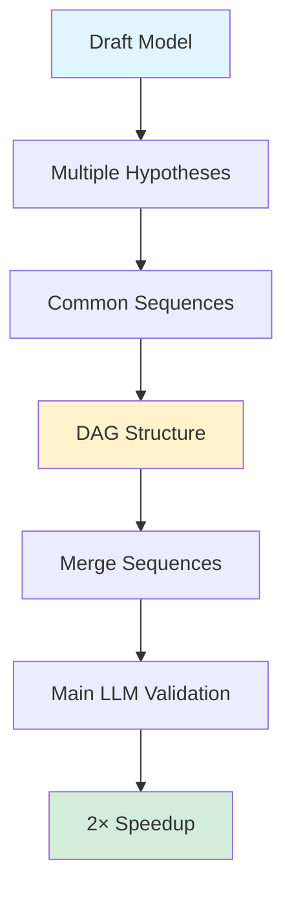
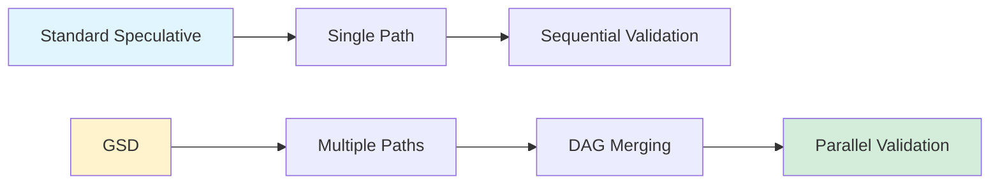

## Accelerating LLMs by 2× with Graph-Structured Speculative Decoding

*Curiosity:* How can we make LLM inference faster? What happens when we use graph structures to optimize speculative decoding?

**Researchers have developed** Graph-structured Speculative Decoding (GSD), making speculative decoding up to **2× faster** by generating multiple hypotheses and merging them into a directed acyclic graph (DAG).

{: .light .shadow .rounded-10 w='1212' h='668' }

> **Source**: <https://www.llmwatch.com/p/a-historic-week-for-open-source-ai>
{: .prompt-info}

### Speculative Decoding Overview

*Retrieve:* Speculative decoding uses a smaller draft model to generate hypotheses validated by the main LLM.

**Standard Process**:
1. Draft model generates hypothesis
2. Main LLM validates hypothesis
3. Accept or reject tokens
4. Speedup from parallel validation

**Limitation**: Single hypothesis path, limited efficiency.

### Graph-Structured Speculative Decoding (GSD)

*Innovate:* GSD generates multiple hypotheses and merges them using a DAG.

**Key Insight**: Hypotheses often share common token sequences.

**GSD Process**:

**Benefits**:
- ✅ Multiple hypotheses
- ✅ Efficient merging
- ✅ Reduced draft model cost
- ✅ Significant speedup

### Performance Results

*Retrieve:* GSD achieves substantial speedups across LLM sizes.

| Model | Speedup | Improvement |
|:------|:--------|:------------|
| **LLaMA-2 70B** | 1.73× to 1.96× | ⬆️ Near 2× |
| **Other LLMs** | Similar gains | ⬆️ Consistent |

**Speedup Range**: **1.73× to 1.96×** (nearly 2× faster!)

### Architecture Comparison

### Key Advantages

| Advantage | Description | Impact |
|:----------|:------------|:-------|
| **Multiple Hypotheses** | Generate several paths | ⬆️ Better coverage |
| **DAG Merging** | Efficient sequence sharing | ⬇️ Redundant computation |
| **Cost Reduction** | Less draft model compute | ⬇️ Costs |
| **Speedup** | 1.73× to 1.96× faster | ⬆️ Performance |

### Key Takeaways

*Retrieve:* Graph-structured speculative decoding achieves 1.73× to 1.96× speedups by generating multiple hypotheses and efficiently merging common sequences using a DAG.

*Innovate:* By leveraging GSD, you can significantly accelerate LLM inference, reducing computational costs while maintaining quality, making large models more accessible.

*Curiosity → Retrieve → Innovation:* Start with curiosity about inference acceleration, retrieve insights from GSD's graph-based approach, and innovate by applying it to speed up your LLM applications.

**Next Steps**:
- Explore GSD implementation
- Test on your models
- Measure speedup gains
- Deploy in production

