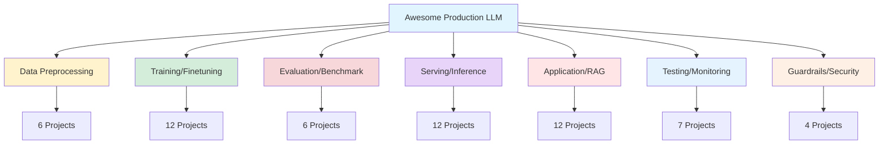
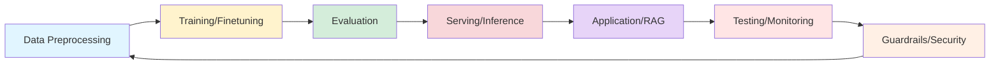
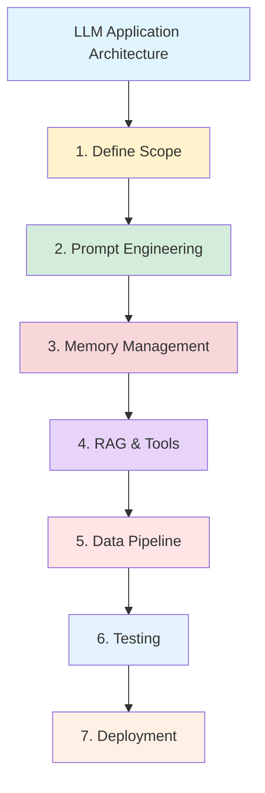
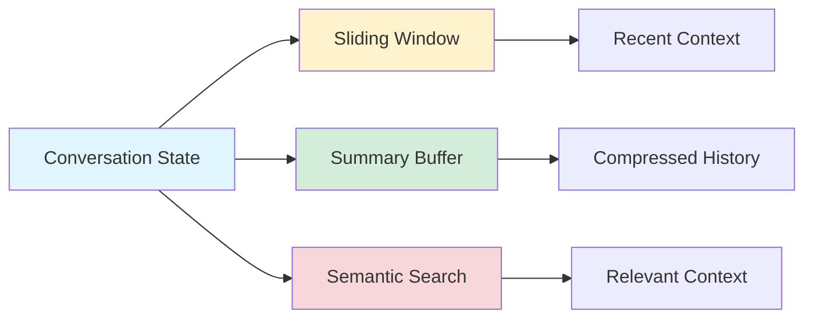
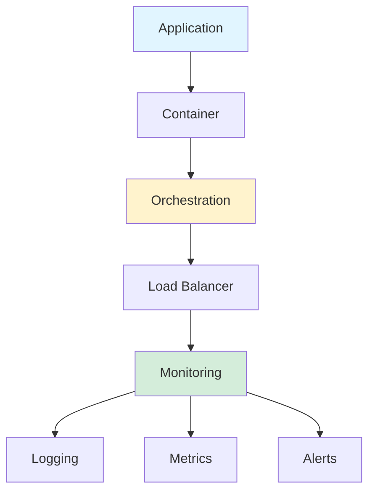

## Awesome Production LLM: Curated Open-Source Libraries

*Curiosity:* What are the best open-source libraries for building production-ready LLM applications? How can we systematically organize tools across the LLM development lifecycle?

**This repository** contains a curated list of awesome open-source libraries for production large language models. 59 projects are selected with high standards, covering the entire LLM application development lifecycle.

> **GitHub Repository**: <https://github.com/jihoo-kim/awesome-production-llm>
{: .prompt-info}

### Repository Overview

*Retrieve:* Comprehensive collection of production LLM tools organized by category.

### Library Categories

| Category | Count | Description | Key Focus |
|:---------|:------|:------------|:----------|
| **📚 Data Preprocessing** | 6 | Data preparation and cleaning | Quality, format conversion |
| **🤖 Training / Finetuning** | 12 | Model training and adaptation | Efficiency, customization |
| **📊 Evaluation / Benchmark** | 6 | Performance assessment | Metrics, comparisons |
| **🚀 Serving / Inference** | 12 | Model deployment | Latency, scalability |
| **🛠️ Application / RAG** | 12 | Application frameworks | RAG, tool use, agents |
| **🧐 Testing / Monitoring** | 7 | Quality assurance | Observability, debugging |
| **🛡️ Guardrails / Security** | 4 | Safety and security | Content filtering, safety |

### LLM Development Lifecycle

*Innovate:* Tools organized across the complete development workflow.

### Category Breakdown

#### 📚 LLM Data Preprocessing (6 projects)

*Retrieve:* Tools for preparing and cleaning data for LLM training.

**Focus Areas**:
- Data cleaning and normalization
- Format conversion
- Quality assurance
- Dataset preparation

#### 🤖 LLM Training / Finetuning (12 projects)

*Retrieve:* Frameworks for training and adapting LLMs.

**Focus Areas**:
- Efficient training methods
- Parameter-efficient fine-tuning (LoRA, QLoRA)
- Distributed training
- Model optimization

#### 📊 LLM Evaluation / Benchmark (6 projects)

*Retrieve:* Tools for assessing LLM performance.

**Focus Areas**:
- Benchmark datasets
- Evaluation metrics
- Model comparison
- Performance analysis

#### 🚀 LLM Serving / Inference (12 projects)

*Innovate:* Solutions for deploying LLMs in production.

**Focus Areas**:
- Low-latency inference
- Scalability
- Model serving
- Optimization techniques

#### 🛠️ LLM Application / RAG (12 projects)

*Innovate:* Frameworks for building LLM applications.

**Focus Areas**:
- RAG implementations
- Tool use and agents
- Application frameworks
- Integration patterns

#### 🧐 LLM Testing / Monitoring (7 projects)

*Retrieve:* Tools for quality assurance and observability.

**Focus Areas**:
- Testing frameworks
- Monitoring and logging
- Performance tracking
- Debugging tools

#### 🛡️ LLM Guardrails / Security (4 projects)

*Retrieve:* Safety and security solutions.

**Focus Areas**:
- Content filtering
- Safety mechanisms
- Security best practices
- Risk mitigation

{: .light .shadow .rounded-10 w='1212' h='668' }

### 7-Step Technical Framework for LLM Applications

*Innovate:* Comprehensive framework for architecting robust LLM-powered applications.

#### 1️⃣ Define Application Scope and User Interaction Model

*Retrieve:* Establish clear requirements and interaction patterns.

**Key Activities**:
- Identify core use cases and potential edge cases
- Design user interaction flow (multi-turn dialogues, single-query responses)
- Consider scalability and performance requirements

**Considerations**:

| Aspect | Considerations |
|:-------|:---------------|
| **Use Cases** | Core functionality, edge cases, error handling |
| **Interaction** | Single-turn vs. multi-turn, context management |
| **Scalability** | Expected load, response time requirements |
| **Performance** | Latency targets, throughput needs |

#### 2️⃣ Engineer Prompt Chain Architecture

*Innovate:* Design robust prompt engineering systems.

**Key Activities**:
- Implement prompt engineering techniques (few-shot learning, chain-of-thought)
- Develop robust prompt template system with version control
- Optimize for token efficiency and response coherence

**Prompt Engineering Techniques**:

| Technique | Purpose | Use Case |
|:----------|:--------|:---------|
| **Few-shot Learning** | Provide examples | Task-specific adaptation |
| **Chain-of-Thought** | Step-by-step reasoning | Complex problem solving |
| **Template System** | Consistency and versioning | Production stability |
| **Token Optimization** | Cost and latency reduction | Efficiency |

#### 3️⃣ Implement Stateful Conversations with Advanced Memory Buffers

*Retrieve:* Manage conversation context effectively.

**Key Activities**:
- Choose appropriate memory structures (sliding window, summary buffers)
- Implement efficient serialization and deserialization of conversation state
- Design memory management strategies for long-running sessions

**Memory Strategies**:

#### 4️⃣ Integrate Retrieval-Augmented Generation (RAG) and Tool Use

*Innovate:* Enhance LLM capabilities with external knowledge and tools.

**Key Activities**:
- Implement vector databases for semantic search capabilities
- Develop flexible tool-use framework (OpenAI function calling paradigm)
- Design fall-back mechanisms for API failures or out-of-domain queries

**RAG & Tool Integration**:

| Component | Function | Implementation |
|:----------|:---------|:---------------|
| **Vector Database** | Semantic search | Pinecone, Weaviate, Qdrant |
| **Tool Framework** | Function calling | OpenAI functions, LangChain tools |
| **Fallback** | Error handling | Default responses, retry logic |

#### 5️⃣ Establish Robust Data Processing Pipeline

*Retrieve:* Build efficient data ingestion and processing systems.

**Key Activities**:
- Implement ETL processes for diverse data sources
- Develop efficient indexing strategies for quick retrieval
- Design data validation and sanitization protocols

**Data Pipeline Components**:

#### 6️⃣ Rigorous Testing and Iterative Refinement

*Retrieve:* Ensure quality through comprehensive testing.

**Key Activities**:
- Implement comprehensive unit and integration testing suites
- Develop metrics for response quality, latency, and coherence
- Utilize A/B testing for prompt and model optimization

**Testing Strategy**:

| Test Type | Focus | Tools |
|:----------|:------|:------|
| **Unit Tests** | Individual components | pytest, unittest |
| **Integration Tests** | End-to-end flows | pytest, testcontainers |
| **A/B Testing** | Prompt/model comparison | Custom frameworks |
| **Quality Metrics** | Response evaluation | Custom metrics, LLM-as-judge |

#### 7️⃣ Production Deployment and Monitoring

*Innovate:* Deploy and monitor LLM applications in production.

**Key Activities**:
- Containerize application for consistent deployment
- Implement robust logging and telemetry
- Design auto-scaling mechanisms to handle variable load

**Deployment Architecture**:

### Key Takeaways

*Retrieve:* The Awesome Production LLM repository provides 59 curated open-source libraries organized across 7 categories, covering the complete LLM development lifecycle.

*Innovate:* By following the 7-step framework and leveraging these tools, you can build robust, scalable, and production-ready LLM applications with proper architecture, testing, and monitoring.

*Curiosity → Retrieve → Innovation:* Start with curiosity about production LLM tools, retrieve knowledge from this curated repository, and innovate by applying the 7-step framework to build enterprise-grade LLM applications.

**Next Steps**:
- Explore the GitHub repository
- Select tools for your use case
- Apply the 7-step framework
- Build production-ready LLM applications

