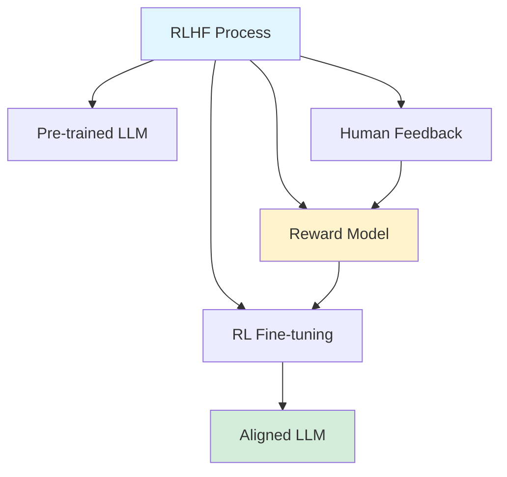
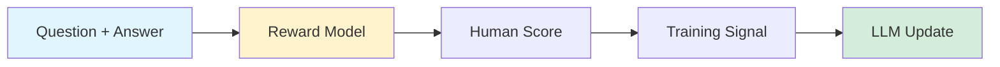

## Unlocking the Power of RLHF in Large Language Models

*Curiosity:* How do LLMs learn to align with human preferences? What is Reinforcement Learning from Human Feedback (RLHF) and how does it work?

**All large language models (LLMs)** go through a final stage called **Alignment**. This is where they learn to understand human preferences and generate texts that people tend to like or prefer. The popular method used to achieve this is **RLHF (Reinforcement Learning from Human Feedback)**.

> **Resource**: <https://www.linkedin.com/pulse/reinforcement-learning-human-feedback-rlhf-shubham-prajapati-xsjsc/?trackingId=eAJHZpWFS8S0xZa%2B4Yz9%2Bg%3D%3D>
{: .prompt-info}

### RLHF Overview

*Retrieve:* RLHF is the process of aligning LLMs with human preferences using reinforcement learning.

### How Does RLHF Work?

*Innovate:* RLHF uses a reward model to guide LLM training toward human preferences.

#### Reward Model: The Human Stand-In

**Function**:
- **Mimics Human Scoring**: Trained on questions, answers, and human scores
- **Acts as Human Stand-In**: Scores model responses to help improve
- **Guides Training**: Provides feedback signal for reinforcement learning

**Reward Model Architecture**:

**Key Insight**: RLHF ensures that the original LLM balances its learnings, maintaining task performance while aligning with human preferences. It's about fine-tuning without forgetting!

### RLHF Process Overview

| Stage | Description | Purpose |
|:------|:------------|:--------|
| **1. Pre-training** | Train on large text corpus | Build foundational knowledge |
| **2. Human Feedback** | Collect human evaluations | Understand preferences |
| **3. Reward Model** | Train reward predictor | Automate feedback |
| **4. RL Fine-tuning** | Optimize with RL | Align with preferences |
| **5. Iterative Refinement** | Continuous improvement | Maintain alignment |

### Detailed RLHF Steps

#### 1. Pre-training the Language Model 📚

*Retrieve:* Build foundational knowledge through large-scale pre-training.

**Process**:
- **Data Collection**: Gather a large corpus of text data from diverse sources
- **Training**: Use unsupervised learning techniques (next-word prediction, masked language modeling)
- **Objective**: Build general language understanding and generation capabilities

#### 2. Collecting Human Feedback 🧑🤝🧑

*Retrieve:* Gather human evaluations to understand preferences.

**Process**:
- **Sample Generation**: Generate outputs from pre-trained model based on various prompts
- **Human Evaluation**: Humans evaluate outputs based on criteria (relevance, coherence, accuracy, ethics)
- **Feedback Annotation**: Collect ratings, rankings, or annotations indicating quality

#### 3. Designing the Reward Model 🏅

*Innovate:* Create an automated feedback system using a reward model.

**Process**:
- **Data Preparation**: Create dataset of (prompt, response, feedback) tuples
- **Reward Signal**: Design reward function quantifying response quality
- **Training**: Train neural network to predict human feedback scores

#### 4. Reinforcement Learning Fine-Tuning 🎯

*Innovate:* Optimize LLM using RL algorithms guided by reward model.

**Process**:
- **Policy Initialization**: Use pre-trained LLM as initial policy
- **Policy Optimization**: Use RL algorithms (PPO) to fine-tune:
  - Generate responses using current policy
  - Evaluate responses with reward model
  - Update policy to maximize expected reward

**PPO (Proximal Policy Optimization)**:
- Prevents large policy updates
- Maintains stability during training
- Balances exploration and exploitation

#### 5. Iterative Refinement 🔄

*Retrieve:* Continuously improve through feedback loops.

**Process**:
- **Continuous Feedback Loop**: Regularly collect new human feedback
- **Reward Model Update**: Retrain reward model with new feedback
- **Policy Re-training**: Continue fine-tuning with updated reward model

### RLHF Benefits

| Benefit | Description | Impact |
|:--------|:------------|:-------|
| **Human Alignment** | Models learn human preferences | ⬆️ User satisfaction |
| **Task Performance** | Maintains original capabilities | ⬆️ Quality preservation |
| **Ethical Outputs** | Aligns with ethical guidelines | ⬆️ Safety |
| **Iterative Improvement** | Continuous refinement | ⬆️ Long-term quality |

### Key Takeaways

*Retrieve:* RLHF is a multi-stage process involving pre-training, human feedback collection, reward model training, RL fine-tuning, and iterative refinement.

*Innovate:* By using a reward model as a human stand-in, RLHF enables efficient alignment of LLMs with human preferences while maintaining task performance.

*Curiosity → Retrieve → Innovation:* Start with curiosity about LLM alignment, retrieve knowledge of RLHF steps and mechanisms, and innovate by applying RLHF to create better-aligned language models.

📺 **Video Explanation**: Watch Aishwarya Naresh Reganti's excellent explanation on this topic!


