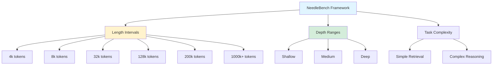
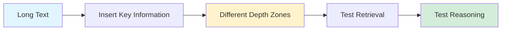
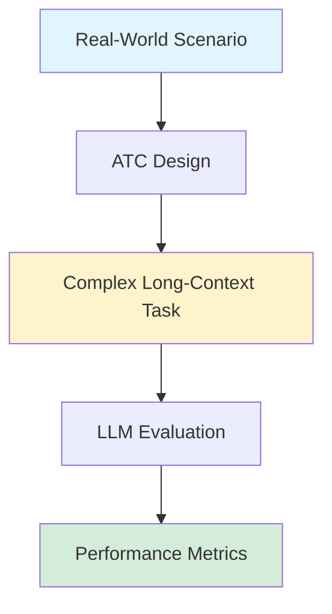
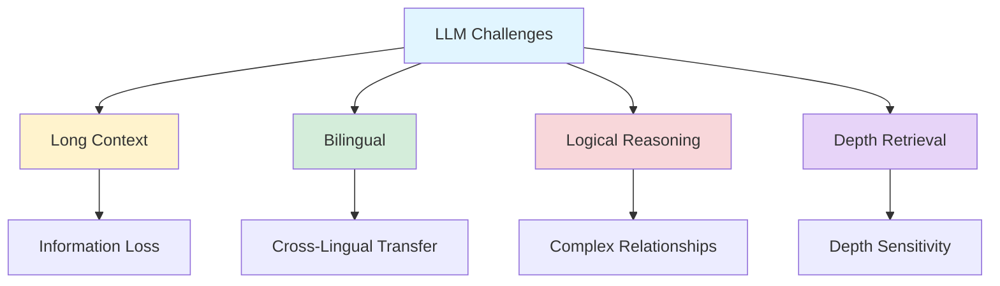

## GPT-4's Struggle with Long-Context Bilingual Reasoning

*Curiosity:* Despite being one of the leading LLMs, GPT-4 struggles with long-context bilingual reasoning tasks, even with text lengths shorter than 2K tokens. What are the challenges and how can we evaluate them?

**An interesting benchmark paper** evaluated the long-context capabilities of standard LLMs in an English-Chinese setting, revealing significant challenges even for state-of-the-art models.

> **Paper**: <https://arxiv.org/pdf/2407.11963>
{: .prompt-info}

### NeedleBench Framework Overview

*Retrieve:* NeedleBench is a comprehensive framework for evaluating long-context LLM capabilities.

### Key Findings

| Finding | Description | Impact |
|:--------|:------------|:-------|
| **Bilingual Challenge** | English-Chinese setting reveals limitations | ⚠️ Cross-lingual reasoning issues |
| **Short Context Issues** | Struggles even with <2K tokens | ⚠️ Not just long-context problem |
| **Logical Relationships** | Difficulty with complex logical structures | ⚠️ Reasoning limitations |
| **Depth Sensitivity** | Performance varies by information depth | ⚠️ Retrieval challenges |

### NeedleBench Features

*Innovate:* Strategic evaluation approach for long-context capabilities.

#### 1. Strategic Information Insertion

**Feature**: NeedleBench assesses how well leading open-source models can identify key information and apply it to reasoning within long bilingual texts. The framework allows strategic insertion of critical data points in different text depth zones to rigorously test models' retrieval and reasoning capabilities.

**Benefits**:
- Tests information retrieval at various depths
- Evaluates reasoning with retrieved information
- Simulates real-world long-context scenarios

#### 2. Ancestral Trace Challenge (ATC)

*Retrieve:* ATC simulates complex long-context tasks in real-world scenarios.

**Function**:
- Provides a simple method for evaluating LLMs
- Simulates complicated long-context situations
- Tests both retrieval and reasoning capabilities

**ATC Workflow**:

#### 3. Model Evaluation

*Retrieve:* Comprehensive evaluation of mainstream LLMs.

**Evaluated Models**:
- GPT-4 Turbo
- Claude 3
- GLM-4
- Other leading models

**Evaluation Metrics**:
- Information identification accuracy
- Reasoning quality
- Cross-lingual performance
- Depth-based retrieval performance

**Performance Comparison**:

| Model | Short Context | Long Context | Bilingual | Reasoning |
|:------|:--------------|:-------------|:----------|:----------|
| **GPT-4 Turbo** | ⚠️ Struggles | ⚠️ Struggles | ⚠️ Limited | ⚠️ Limited |
| **Claude 3** | ✅ Better | ⚠️ Mixed | ⚠️ Limited | ✅ Better |
| **GLM-4** | ⚠️ Struggles | ⚠️ Struggles | ✅ Better | ⚠️ Limited |

#### 4. Experimental Results

*Innovate:* Key insights from evaluation results.

**Key Findings**:

1. **Complex Logical Relationships**: Existing LLMs face challenges in handling complex logical relationships in long-context texts
2. **Bilingual Reasoning**: Cross-lingual reasoning remains a significant challenge
3. **Depth Sensitivity**: Performance degrades as information is placed deeper in the context
4. **Short Context Issues**: Problems exist even with relatively short contexts (<2K tokens)

**Challenges Identified**:

### Implications

*Retrieve:* Despite recent advancements, models show significant room for improvement.

**Areas for Improvement**:
- Better long-context understanding
- Enhanced bilingual reasoning
- Improved logical relationship handling
- More robust depth-based retrieval

**Research Directions**:
- Architecture improvements for long contexts
- Better cross-lingual training
- Enhanced reasoning mechanisms
- Improved attention mechanisms

### Key Takeaways

*Retrieve:* NeedleBench reveals that even state-of-the-art LLMs like GPT-4 struggle with long-context bilingual reasoning, even in relatively short contexts.

*Innovate:* The framework provides systematic evaluation methods (strategic insertion, ATC) to identify specific weaknesses and guide future improvements in long-context LLM capabilities.

*Curiosity → Retrieve → Innovation:* Start with curiosity about LLM limitations, retrieve insights from NeedleBench evaluations, and innovate by developing better architectures and training methods for long-context bilingual reasoning.

{: .light .shadow .rounded-10 w='1212' h='668' }

