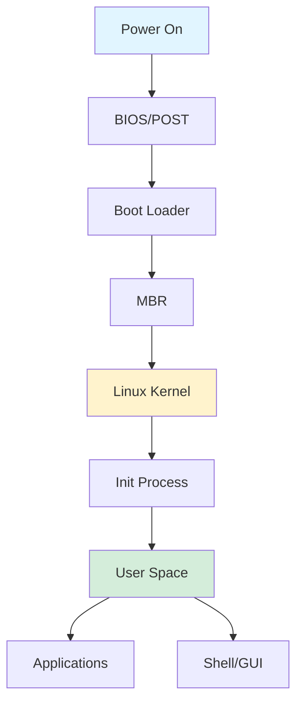
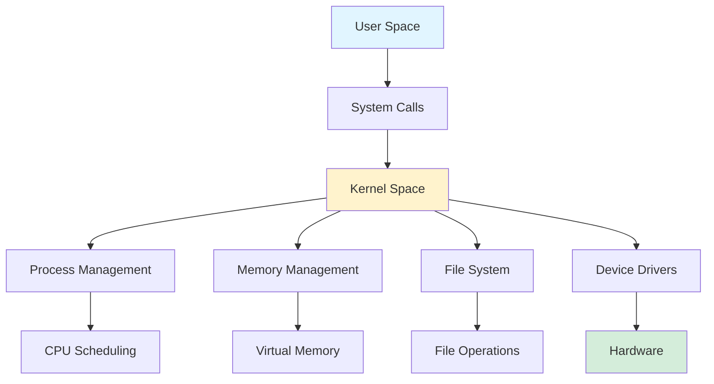
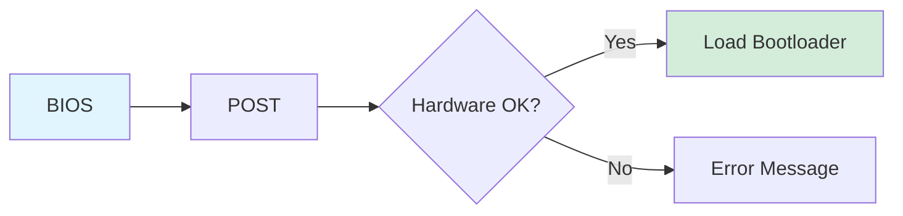
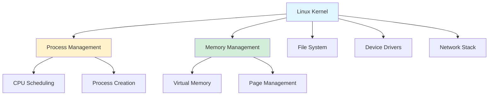
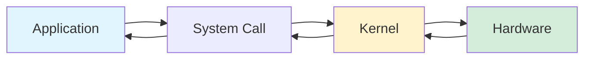
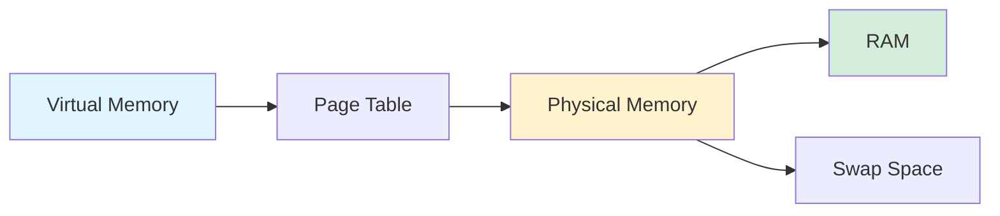

## How Linux Works: A Comprehensive Guide

*Curiosity:* How does Linux boot and operate? What are the key components and processes that make Linux work?

**Linux** is a powerful, open-source operating system that manages hardware resources and provides a platform for applications. This guide breaks down the key components and processes involved in how Linux works.

### Linux Boot Process Overview

### Linux System Architecture

### Linux Boot Process Components

| Component | Function | Description |
|:----------|:---------|:------------|
| **Power On** | System initialization | Computer is powered on |
| **BIOS/ROM** | Hardware check | Performs POST, loads bootloader |
| **Boot Loader** | Kernel loading | Loads Linux kernel from disk |
| **MBR** | Boot information | Contains bootloader and partition table |
| **Kernel** | Core OS | Manages hardware and system resources |
| **Init Process** | Process management | First process (PID 1) |
| **User Space** | Application layer | Where applications run |

### 1. Power On ⚡

*Retrieve:* The boot process begins when the computer is powered on.

- System initialization starts
- Hardware components are activated
- Power-On Self Test (POST) begins

### 2. BIOS (Basic Input/Output System) & ROM 💻

*Retrieve:* BIOS performs initial hardware checks and loads the bootloader.

**Function**:
- **Firmware Program**: Stored in ROM chip
- **POST**: Checks basic hardware functionality
- **Bootloader Loading**: Loads the bootloader from storage

**Process**:

### 3. Boot Loader 🔄

*Retrieve:* The bootloader loads the Linux kernel into memory.

**Function**:
- Small program that loads the Linux kernel
- Reads kernel from hard disk
- Transfers control to the kernel

**Common Bootloaders**:
- GRUB (Grand Unified Bootloader)
- LILO (Linux Loader)
- systemd-boot

### 4. Master Boot Record (MBR) 💾

*Retrieve:* MBR contains boot information and partition table.

**Function**:
- First sector of the hard disk
- Contains bootloader code
- Includes partition table
- Points to active partition

### 5. Kernel 🧠

*Innovate:* The kernel is the core of Linux, managing all system resources.

**Key Responsibilities**:

| Responsibility | Function | Impact |
|:---------------|:---------|:-------|
| **Hardware Management** | Manages CPU, memory, devices | System operation |
| **Security** | Enforces permissions, isolation | System protection |
| **Resource Allocation** | CPU scheduling, memory allocation | Performance |
| **System Calls** | Interface for applications | Application support |

**Kernel Components**:

### 6. User Space (Applications) 💼

*Retrieve:* User space is where applications run, isolated from the kernel.

**Characteristics**:
- Isolated from kernel for security
- Runs user applications
- Examples: web browsers, word processors, games
- Protected by kernel security mechanisms

**User Space vs Kernel Space**:

| Aspect | User Space | Kernel Space |
|:-------|:-----------|:-------------|
| **Access** | Limited | Full system access |
| **Isolation** | Process isolation | Direct hardware access |
| **Security** | User permissions | Root privileges |
| **Examples** | Applications | Device drivers, kernel modules |

### 7. System Calls 📞

*Retrieve:* System calls provide the interface between user space and kernel.

**Function**:
- Applications request kernel services
- Examples: file operations, process creation, network communication
- Bridge between user and kernel space

**Common System Calls**:

| System Call | Function | Example |
|:------------|:---------|:--------|
| **open()** | Open file | File access |
| **read()** | Read data | File reading |
| **write()** | Write data | File writing |
| **fork()** | Create process | Process creation |
| **exec()** | Execute program | Program execution |

**System Call Flow**:

### 8. Process Management 🔄

*Innovate:* The kernel manages all running processes efficiently.

**Functions**:
- **Process Creation**: fork(), exec()
- **Resource Allocation**: CPU time, memory
- **Scheduling**: Determines which process runs
- **Termination**: Cleanup when processes end

**Process States**:

| State | Description |
|:------|:------------|
| **Running** | Currently executing |
| **Ready** | Waiting for CPU |
| **Blocked** | Waiting for I/O |
| **Zombie** | Terminated, waiting for parent |

### 9. Memory Management 🧠

*Retrieve:* The kernel manages system memory efficiently.

**Functions**:
- **Allocation**: Allocates memory to processes
- **Virtual Memory**: Maps virtual to physical addresses
- **Page Management**: Handles memory pages
- **Swapping**: Moves data to disk when needed

**Memory Management Concepts**:

### 10. Device Drivers 🖥️

*Retrieve:* Device drivers enable kernel communication with hardware.

**Function**:
- Software programs for hardware communication
- Translate kernel requests to hardware commands
- Handle hardware-specific operations

**Driver Types**:
- Character devices (keyboard, mouse)
- Block devices (hard drives, SSDs)
- Network devices (Ethernet, Wi-Fi)

### 11. File System Management 🗄️

*Retrieve:* The kernel manages file organization and storage.

**Functions**:
- Organizes files on storage devices
- Handles file operations (create, read, write, delete)
- Manages directories and permissions
- Provides file system abstraction

**Common File Systems**:
- ext4 (Extended File System 4)
- XFS (High-performance file system)
- Btrfs (Copy-on-write file system)
- ZFS (Advanced file system)

### 12. Shell (or GUI) 

*Retrieve:* Shell and GUI provide user interfaces to interact with Linux.

**Shell (Command-Line Interface)**:
- Text-based interface
- Users type commands
- Examples: bash, zsh, fish
- Powerful for automation

**GUI (Graphical User Interface)**:
- Visual interface with icons and windows
- User-friendly interaction
- Examples: GNOME, KDE, XFCE
- Easier for beginners

**Shell vs GUI**:

| Aspect | Shell | GUI |
|:-------|:------|:-----|
| **Interface** | Text commands | Visual elements |
| **Efficiency** | Fast for experts | Easy for beginners |
| **Automation** | Excellent | Limited |
| **Resource Usage** | Low | Higher |

### Key Takeaways

*Retrieve:* Linux boot process involves BIOS, bootloader, kernel loading, and initialization. The kernel manages hardware, processes, memory, and provides system calls for applications.

*Innovate:* Understanding Linux architecture helps in system administration, troubleshooting, and optimizing performance. The separation between kernel and user space provides security and stability.

*Curiosity → Retrieve → Innovation:* Start with curiosity about how operating systems work, retrieve knowledge of Linux components and processes, and innovate by applying this understanding to system administration and development.

{: .light .shadow .rounded-10 w='1212' h='668' }
