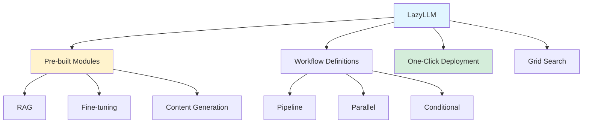
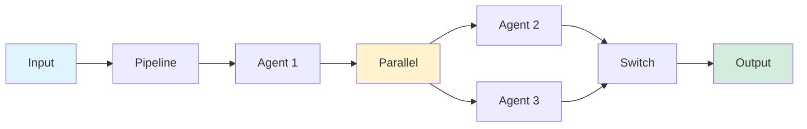

## LazyLLM: Low-Code Framework for Multi-Agent Applications

*Curiosity:* What if building multi-agent systems could be as simple as connecting building blocks? How can we make LLM application development accessible to developers from diverse backgrounds?

**LazyLLM** is a super simple, low-code, open-source framework for building multi-agent applications. It supports RAG, fine-tuning, content generation, and more, with intuitive workflow definitions.

{: .light .shadow .rounded-10 w='1212' h='668' }

> **GitHub Repository**: <https://github.com/LazyAGI/LazyLLM>
{: .prompt-info}

### Framework Overview

### Key Features

*Retrieve:* LazyLLM simplifies multi-agent application development.

| Feature | Description | Benefit |
|:--------|:------------|:--------|
| **Pre-built Modules** | Ready-to-use components | ⬆️ Easy assembly |
| **Data Flows** | Visual workflow design | ⬆️ Intuitive |
| **One-Click Deployment** | Automated setup | ⬆️ Fast POC |
| **Multi-Platform** | Various infrastructure | ⬆️ Flexibility |
| **Grid Search** | Auto-optimization | ⬆️ Performance |

### Workflow Types

*Innovate:* LazyLLM defines various workflow patterns for different use cases.

| Workflow | Description | Use Case |
|:---------|:------------|:---------|
| **Pipeline** | Sequential execution | Step-by-step processing |
| **Parallel** | Concurrent execution | Independent tasks |
| **Diverter** | Route to different paths | Conditional flows |
| **If** | Conditional logic | Decision making |
| **Switch** | Multi-way branching | Complex routing |
| **Loop** | Iterative execution | Repeated tasks |

**Workflow Example**:

### Application Support

*Retrieve:* LazyLLM supports diverse LLM applications.

**Supported Applications**:
- **RAG**: Retrieval-augmented generation
- **Fine-tuning**: Model customization
- **Content Generation**: Text/image generation
- **Multi-Agent Systems**: Collaborative agents

### Deployment Features

*Innovate:* One-click deployment simplifies the development process.

**Deployment Capabilities**:
- ✅ Sequential service startup
- ✅ Automatic configuration
- ✅ LLM and embedding setup
- ✅ Multi-platform support

**Infrastructure Support**:
- Bare-metal servers
- Slurm clusters
- Public clouds (AWS, GCP, Azure)

### Grid Search & Optimization

*Retrieve:* Built-in grid search for automatic optimization.

**Optimization Targets**:
- Model configurations
- Retrieval strategies
- Fine-tuning parameters
- Performance metrics

**Benefits**:
- Automatic exploration
- Best configuration discovery
- Performance optimization
- Reduced manual tuning

### Framework Philosophy

*Retrieve:* LazyLLM prioritizes simplicity and accessibility.

**Design Principles**:
- ✅ Straightforward approach
- ✅ Low-code development
- ✅ Easy for diverse backgrounds
- ✅ Quick prototyping

**Status**: New repository, actively developed, community-driven.

### Key Takeaways

*Retrieve:* LazyLLM provides a low-code framework for building multi-agent applications with pre-built modules, workflow definitions, and one-click deployment.

*Innovate:* By using LazyLLM, developers from diverse backgrounds can quickly build prototypes and production applications without deep LLM expertise, accelerating development cycles.

*Curiosity → Retrieve → Innovation:* Start with curiosity about multi-agent systems, retrieve insights from LazyLLM's approach, and innovate by building applications with simplified workflows and deployment.

**Next Steps**:
- Explore the GitHub repository
- Try building a simple application
- Experiment with workflows
- Deploy to your infrastructure