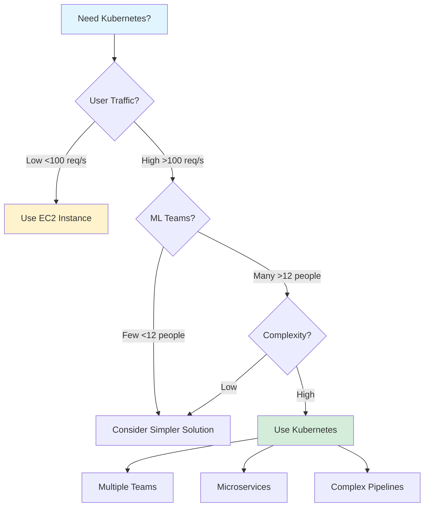
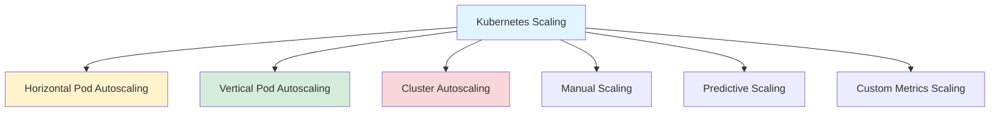
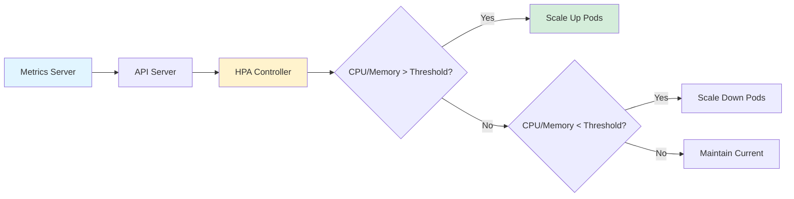

{: .light .shadow .rounded-10 w='1212' h='668' }

### Even 𝗡𝗩𝗜𝗗𝗜𝗔 𝗡𝗜𝗠 𝗶𝘀 𝗿𝘂𝗻𝗻𝗶𝗻𝗴 𝗼𝗻 𝗞𝘂𝗯𝗲𝗿𝗻𝗲𝘁𝗲𝘀, what is 𝗞𝘂𝗯𝗲𝗿𝗻𝗲𝘁𝗲𝘀 and why is it worth learning 𝗮𝘀 𝗠𝗟𝗢𝗽𝘀/𝗠𝗟/𝗗𝗮𝘁𝗮 𝗘𝗻𝗴𝗶𝗻𝗲𝗲𝗿?

👉 Today we look into the Kubernetes system from a bird's eye view.

# 𝗦𝗼, 𝘄𝗵𝗮𝘁 𝗶𝘀 𝗞𝘂𝗯𝗲𝗿𝗻𝗲𝘁𝗲𝘀 (𝗞𝟴𝘀)?

1. It is a container orchestrator that performs the scheduling, running and recovery of your containerised applications in a horizontally scalable and self-healing way.

## Kubernetes architecture consists of two main logical groups:

2. Control plane - this is where K8s system processes that are responsible for scheduling workloads defined by you and keeping the system healthy live.
3. Worker nodes - this is where containers are scheduled and run.

## 𝗛𝗼𝘄 𝗱𝗼𝗲𝘀 𝗞𝘂𝗯𝗲𝗿𝗻𝗲𝘁𝗲𝘀 𝗵𝗲𝗹𝗽 𝘆𝗼𝘂?

4. You can have thousands of Nodes (usually you only need tens of them) in your K8s cluster, each of them can host multiple containers. Nodes can be added or removed from the cluster as needed. This enables unrivaled horizontal scalability.
5. Kubernetes provides an easy to use and understand declarative interface to deploy applications. Your application deployment definition can be described in yaml, submitted to the cluster and the system will take care that the desired state of the application is always up to date.
6. Users are empowered to create and own their application architecture in boundaries pre-defined by Cluster Administrators.

- ✅ In most cases you can deploy multiple types of ML Applications into a single cluster, you don’t need to care about which server to deploy to - K8s will take care of it.
- ✅ You can request different amounts of dedicated machine resources per application.
- ✅ If your application goes down - K8s will make sure that a desired number of replicas is always alive.
- ✅ You can roll out new versions of the running application using multiple strategies - K8s will safely do it for you.
- ✅ You can expose your ML Services for other Product Apps to use with few intuitive resource definitions.
- ✅ …

❗️Having said this, while it is a bliss to use, usually the operation of Kubernetes clusters is what is feared. It is a complex system.

❗️Master Plane is an overhead, you need it even if you want to deploy a single small application.

* * *

{: .light .shadow .rounded-10 w='1212' h='668' }

### When Should You Use Kubernetes for ML?

*Retrieve:* Decision framework for Kubernetes adoption.

**Decision Criteria**:

| Factor | Low Complexity | High Complexity |
|:-------|:---------------|:----------------|
| **User Traffic** | <100 requests/second | >100 requests/second |
| **ML Teams** | <12 people | >12 people |
| **Applications** | Monolithic | Microservices |
| **Infrastructure** | Simple | Complex pipelines |

**When NOT to Use Kubernetes**:
- ❌ Low user traffic (<100 req/s) - Use EC2 instances
- ❌ Small team (<12 people) - Simpler solutions suffice
- ❌ Simple applications - Monolithic architecture works
- ❌ Single application - Overhead not justified

**When to Use Kubernetes**:
- ✅ High traffic requiring auto-scaling
- ✅ Multiple ML teams with independent deployments
- ✅ Complex microservices architecture
- ✅ Need for resource isolation and management
- ✅ Multiple applications requiring orchestration

**Key Insight**: Most likely not! When a technology is hot, there's a tendency to disregard why the tool is useful. Very few companies have the complexity that justifies Kubernetes. If you have fewer than 12 people deploying models, consider simpler solutions.

* * *

{: .light .shadow .rounded-10 w='1212' h='668' }

### Kubernetes Scaling Strategies

*Innovate:* Multiple scaling approaches for different needs.

#### Scaling Strategies Comparison

| Strategy | Function | Trigger | Use Case |
|:---------|:---------|:--------|:---------|
| **HPA** | Adjust pod replicas | CPU/Memory metrics | Variable load |
| **VPA** | Adjust resource limits | Resource usage | Right-sizing |
| **Cluster Autoscaling** | Adjust node count | Pending pods | Capacity management |
| **Manual Scaling** | Manual replica adjustment | User command | Planned changes |
| **Predictive Scaling** | ML-based prediction | Forecasted load | Proactive scaling |
| **Custom Metrics** | Application-specific | Custom metrics | Business metrics |

**HPA Workflow**:

**Detailed Scaling Strategies**:

1. **Horizontal Pod Autoscaling (HPA)**
   - Function: Adjusts the number of pod replicas based on CPU/memory usage or other select metrics
   - Workflow: Metrics Server → API Server → HPA Controller → Scale pods

2. **Vertical Pod Autoscaling (VPA)**
   - Function: Adjusts resource limits and requests (CPU/memory) for containers within pods
   - Workflow: Metrics Server → API Server → VPA Controller → Adjust resources

3. **Cluster Autoscaling**
   - Function: Adjusts the number of nodes in the cluster to ensure pods can be scheduled
   - Workflow: Scheduler → Cluster Autoscaler → Add/remove nodes

4. **Manual Scaling**
   - Function: Manually adjusts the number of pod replicas
   - Workflow: kubectl command → API Server → Adjust pod count

5. **Predictive Scaling**
   - Function: Uses ML models to predict future workloads and scales resources proactively
   - Workflow: ML Forecast → KEDA → Cluster Controller → Scale resources

6. **Custom Metrics Based Scaling**
   - Function: Scales pods based on custom application-specific metrics
   - Workflow: Custom Metrics Server → HPA Controller → Scale deployment

### Key Takeaways

*Retrieve:* Kubernetes is a powerful container orchestrator that provides horizontal scalability, self-healing, and declarative deployment for ML applications.

*Innovate:* Use Kubernetes when you have high traffic, multiple teams, and complex microservices. For simpler scenarios, consider EC2 instances or simpler container solutions.

*Curiosity → Retrieve → Innovation:* Start with curiosity about container orchestration, retrieve knowledge of Kubernetes architecture and scaling strategies, and innovate by applying it to your ML infrastructure when complexity justifies the overhead.

{: .light .shadow .rounded-10 w='1212' h='668' }