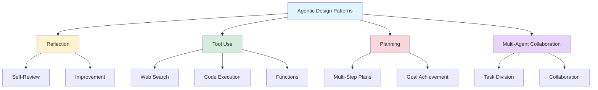
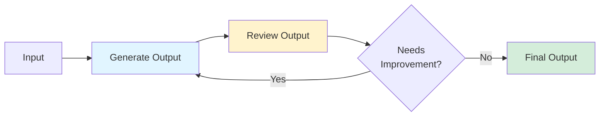
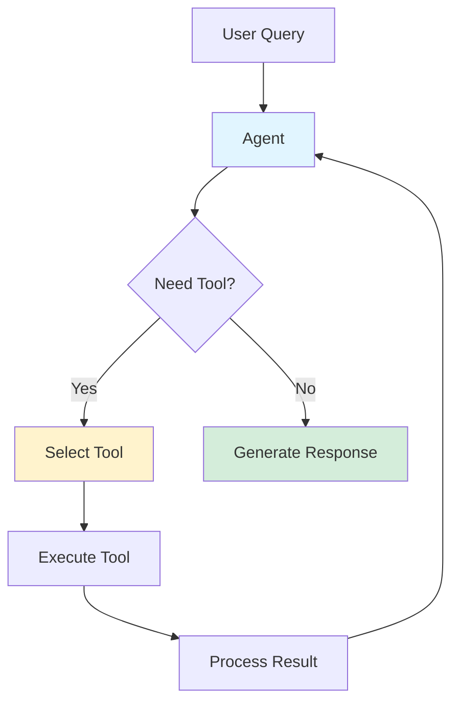
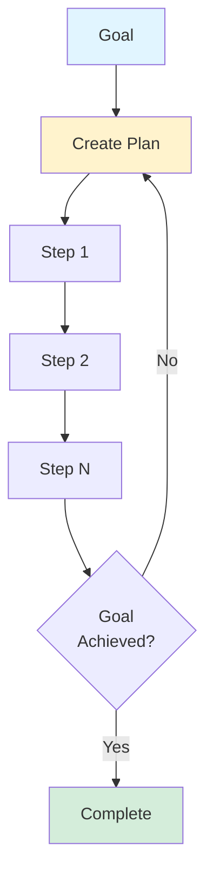
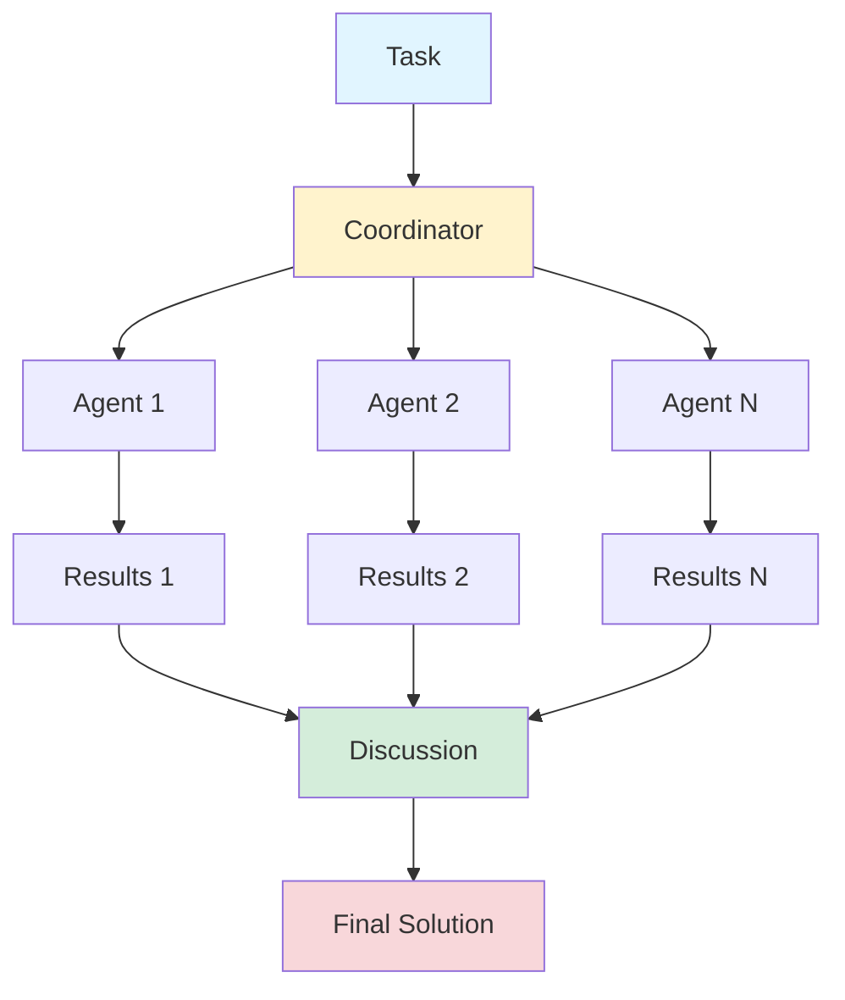
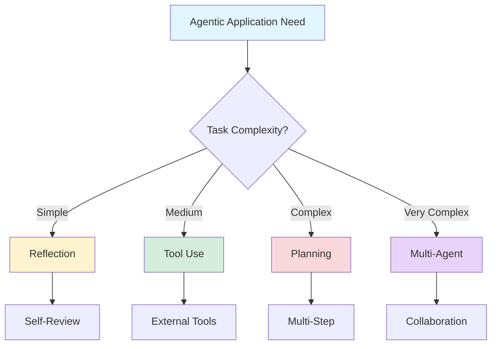

## Agentic Application Design Patterns: Building Intelligent AI Systems

*Curiosity:* How do we design agentic GenAI applications? What patterns enable agents to think, plan, and collaborate effectively?

**Agentic AI** is evolving rapidly, opening possibilities for a new paradigm of applications. When developing agentic applications, choosing the right design patterns is crucial for success.

{: .light .shadow .rounded-10 w='1212' h='668' }

### Design Patterns Overview



### The 4 Key Design Patterns

| Pattern | Description | Use Case | Complexity |
|:--------|:------------|:---------|:-----------|
| **Reflection** | LLM reviews its own work | Quality improvement | ⭐ Low |
| **Tool Use** | LLM equipped with tools | Information gathering | ⭐⭐ Medium |
| **Planning** | Multi-step plan execution | Complex tasks | ⭐⭐⭐ High |
| **Multi-Agent** | Multiple agents collaborate | Large-scale problems | ⭐⭐⭐⭐ Very High |

### 1. Reflection Pattern

*Retrieve:* The LLM reviews its own work to identify ways to improve.

**How It Works**:
- Agent generates initial output
- Reviews and critiques its own work
- Identifies improvements
- Refines output

**Architecture**:



**Example**:

```python
# Reflection pattern
def reflection_agent(query):
    # Initial generation
    output = llm.generate(query)
    
    # Review
    critique = llm.generate(
        f"Review this output and suggest improvements:\n{output}"
    )
    
    # Refine if needed
    if "improve" in critique.lower():
        output = llm.generate(
            f"Original: {output}\nImprovements: {critique}\nGenerate improved version"
        )
    
    return output
```

**Benefits**:
- ✅ Self-improvement
- ✅ Quality enhancement
- ✅ Error correction
- ✅ Iterative refinement

> **Article**: [Reflection Pattern](https://www.deeplearning.ai/the-batch/agentic-design-patterns-part-2-reflection/?ref=dl-staging-website.ghost.io)
{: .prompt-tip}

### 2. Tool Use Pattern

*Innovate:* The LLM is equipped with tools to gather information, take action, or process data.

**Tools Available**:
- 🔍 Web search
- 💻 Code execution
- 📊 Data processing
- 🔧 API calls
- 📁 File operations

**Architecture**:



**Example**:

```python
# Tool use pattern
tools = {
    "web_search": web_search_tool,
    "code_exec": code_execution_tool,
    "calculator": calculator_tool
}

def tool_use_agent(query):
    # Agent decides which tools to use
    tool_selection = llm.select_tools(query, available_tools=tools)
    
    results = []
    for tool_name in tool_selection:
        tool = tools[tool_name]
        result = tool.execute(query)
        results.append(result)
    
    # Generate response using tool results
    return llm.generate(query, context=results)
```

**Benefits**:
- ✅ Extended capabilities
- ✅ Real-time information
- ✅ Action execution
- ✅ Data processing

> **Article**: [Tool Use Pattern](https://www.deeplearning.ai/the-batch/agentic-design-patterns-part-3-tool-use/?ref=dl-staging-website.ghost.io)
{: .prompt-tip}

### 3. Planning Pattern

*Retrieve:* The LLM devises and follows a multi-step plan to achieve a goal.

**Process**:
1. Analyze goal
2. Create step-by-step plan
3. Execute plan steps
4. Monitor progress
5. Adjust if needed

**Architecture**:



**Example**:

```python
# Planning pattern
def planning_agent(goal):
    # Create plan
    plan = llm.generate(
        f"Create a step-by-step plan to achieve: {goal}"
    )
    
    steps = parse_plan(plan)
    
    # Execute plan
    results = []
    for step in steps:
        result = llm.execute_step(step, context=results)
        results.append(result)
        
        # Check if goal achieved
        if check_goal_achieved(goal, results):
            break
    
    return compile_results(results)
```

**Use Cases**:
- Essay writing (outline → research → draft)
- Complex problem solving
- Multi-step workflows
- Project management

> **Article**: [Planning Pattern](https://www.deeplearning.ai/the-batch/agentic-design-patterns-part-4-planning/?ref=dl-staging-website.ghost.io)
{: .prompt-tip}

### 4. Multi-Agent Collaboration Pattern

*Innovate:* Multiple AI agents work together, dividing tasks and discussing ideas.

**Benefits**:
- ✅ Task specialization
- ✅ Better solutions
- ✅ Parallel processing
- ✅ Collective intelligence

**Architecture**:



**Example**:

```python
# Multi-agent collaboration
agents = {
    "researcher": ResearchAgent(),
    "writer": WriterAgent(),
    "editor": EditorAgent()
}

def multi_agent_system(task):
    # Coordinator divides task
    subtasks = coordinator.divide_task(task, agents)
    
    # Agents work in parallel
    results = {}
    for agent_name, subtask in subtasks.items():
        agent = agents[agent_name]
        results[agent_name] = agent.process(subtask)
    
    # Discussion and synthesis
    final_result = coordinator.synthesize(results)
    return final_result
```

**Use Cases**:
- Complex research projects
- Content creation teams
- Software development
- Problem-solving teams

> **Article**: [Multi-Agent Collaboration](https://www.deeplearning.ai/the-batch/agentic-design-patterns-part-5-multi-agent-collaboration/?ref=dl-staging-website.ghost.io)
{: .prompt-tip}

### Pattern Selection Guide



### Combining Patterns

*Innovate:* Patterns can be combined for more powerful systems.

**Example Combinations**:
- **Reflection + Tool Use**: Agent uses tools, then reflects on results
- **Planning + Multi-Agent**: Multiple agents execute a coordinated plan
- **All Patterns**: Comprehensive agentic system

### Key Takeaways

*Retrieve:* Four key design patterns—Reflection, Tool Use, Planning, and Multi-Agent Collaboration—provide frameworks for building agentic GenAI applications.

*Innovate:* By understanding and applying these patterns, you can design intelligent agentic systems that think, plan, use tools, and collaborate to solve complex problems.

*Curiosity → Retrieve → Innovation:* Start with curiosity about agentic design, retrieve insights from these patterns, and innovate by combining them to build powerful agentic applications.

> **Complete Blog Series**: <https://www.deeplearning.ai/the-batch/how-agents-can-improve-llm-performance/?ref=dl-staging-website.ghost.io>
{: .prompt-info}

**Next Steps**:
- Study each pattern in detail
- Choose patterns for your use case
- Implement and test
- Combine patterns as needed
