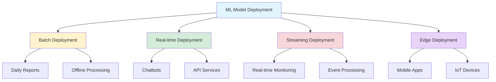
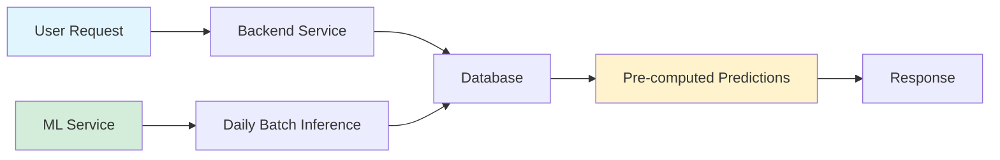
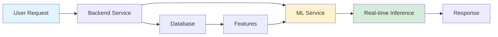
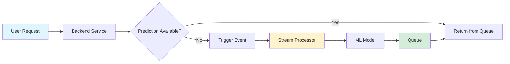
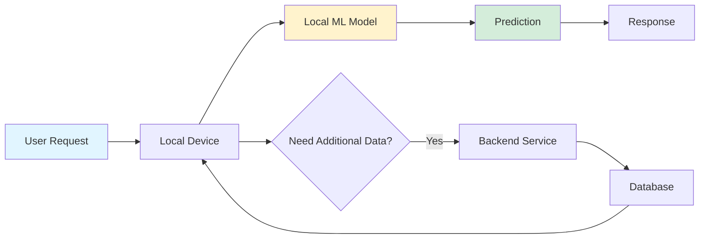
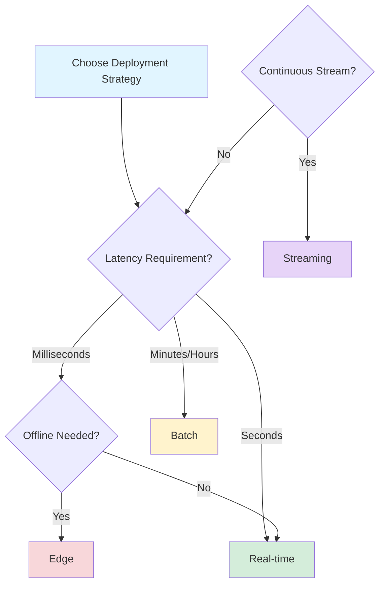

## ML Model Deployment Strategies: A Comprehensive Guide

*Curiosity:* How do we deploy machine learning models in production? What are the different deployment patterns and when should we use each one?

**Deploying ML models** requires choosing the right strategy based on latency requirements, data volume, and infrastructure constraints. This guide explores four fundamental deployment patterns: Batch, Real-time, Streaming, and Edge deployment.

### Deployment Architecture Overview



### Deployment Strategies Comparison

| Strategy | Latency | Use Case | Infrastructure | Best For |
|:---------|:--------|:---------|:---------------|:---------|
| **Batch** | Hours to days | Daily reports, analytics | Database + ML service | Non-urgent predictions |
| **Real-time** | Milliseconds to seconds | Chatbots, APIs | ML service + Database | Immediate responses |
| **Streaming** | Seconds to minutes | Monitoring, events | Stream processor + Queue | Continuous data streams |
| **Edge** | Milliseconds | Mobile apps, IoT | Local device | Low latency, offline |

### 1. Batch Deployment

*Retrieve:* Pre-computed predictions stored in database for fast retrieval.

**Process Flow**:



**Characteristics**:
- **Process**: User requests prediction → Backend service pulls predictions from the database → Daily batch inference by ML service
- **Usage**: Suitable for scenarios where predictions don't need to be immediate, like daily reports
- **Advantages**: Cost-effective, predictable load, efficient resource usage
- **Disadvantages**: Not suitable for real-time needs, requires storage

**Example Use Cases**:
- Daily sales forecasts
- Weekly customer segmentation
- Monthly churn predictions
- Batch recommendation systems

### 2. Real-time Deployment

*Innovate:* On-demand inference for instant responses.

**Process Flow**:



**Characteristics**:
- **Process**: User requests prediction → Backend service requests prediction computation from ML service → Features pulled from the database for real-time inference
- **Usage**: Ideal for applications requiring instant responses, like chatbots
- **Advantages**: Low latency, up-to-date predictions, interactive applications
- **Disadvantages**: Higher infrastructure costs, requires model serving infrastructure

**Example Use Cases**:
- Chatbots and virtual assistants
- Fraud detection
- Real-time recommendations
- Image classification APIs

**Sample Implementation**:

```python
from flask import Flask, request, jsonify
import pickle
import numpy as np

app = Flask(__name__)
model = pickle.load(open('model.pkl', 'rb'))

@app.route('/predict', methods=['POST'])
def predict():
    data = request.json
    features = np.array(data['features']).reshape(1, -1)
    prediction = model.predict(features)
    return jsonify({'prediction': prediction.tolist()})

if __name__ == '__main__':
    app.run(host='0.0.0.0', port=5000)
```

### 3. Streaming Deployment

*Retrieve:* Asynchronous processing for continuous data streams.

**Process Flow**:



**Characteristics**:
- **Process**: User requests prediction → Backend service checks if prediction is available → If not, an event triggers prediction request → Asynchronous computation by model stream processor → Prediction results stored in queue
- **Usage**: Best for continuous data streams, such as real-time monitoring
- **Advantages**: Handles high throughput, decoupled architecture, scalable
- **Disadvantages**: Eventual consistency, requires queue infrastructure

**Example Use Cases**:
- Real-time anomaly detection
- IoT sensor data processing
- Log analysis and monitoring
- Social media sentiment analysis

### 4. Edge Deployment

*Innovate:* On-device inference for privacy and low latency.

**Process Flow**:



**Characteristics**:
- **Process**: User requests prediction on a local device → Local ML model processes data → Backend service serves additional data if needed → Data pulled from database
- **Usage**: Perfect for applications with latency constraints or offline capabilities, like mobile apps
- **Advantages**: Ultra-low latency, privacy-preserving, works offline, reduces server costs
- **Disadvantages**: Limited model complexity, device resource constraints, model update challenges

**Example Use Cases**:
- Mobile app features (face unlock, voice commands)
- Autonomous vehicles
- Smart home devices
- AR/VR applications

### Choosing the Right Deployment Strategy



### Key Takeaways

*Retrieve:* Four deployment strategies—Batch, Real-time, Streaming, and Edge—each optimized for different latency, infrastructure, and use case requirements.

*Innovate:* By understanding these patterns, you can architect ML systems that balance performance, cost, and user experience effectively.

*Curiosity → Retrieve → Innovation:* Start with curiosity about deployment needs, retrieve knowledge of these strategies, and innovate by selecting and combining patterns that best fit your application requirements.

{: .light .shadow .rounded-10 w='1212' h='668' }
