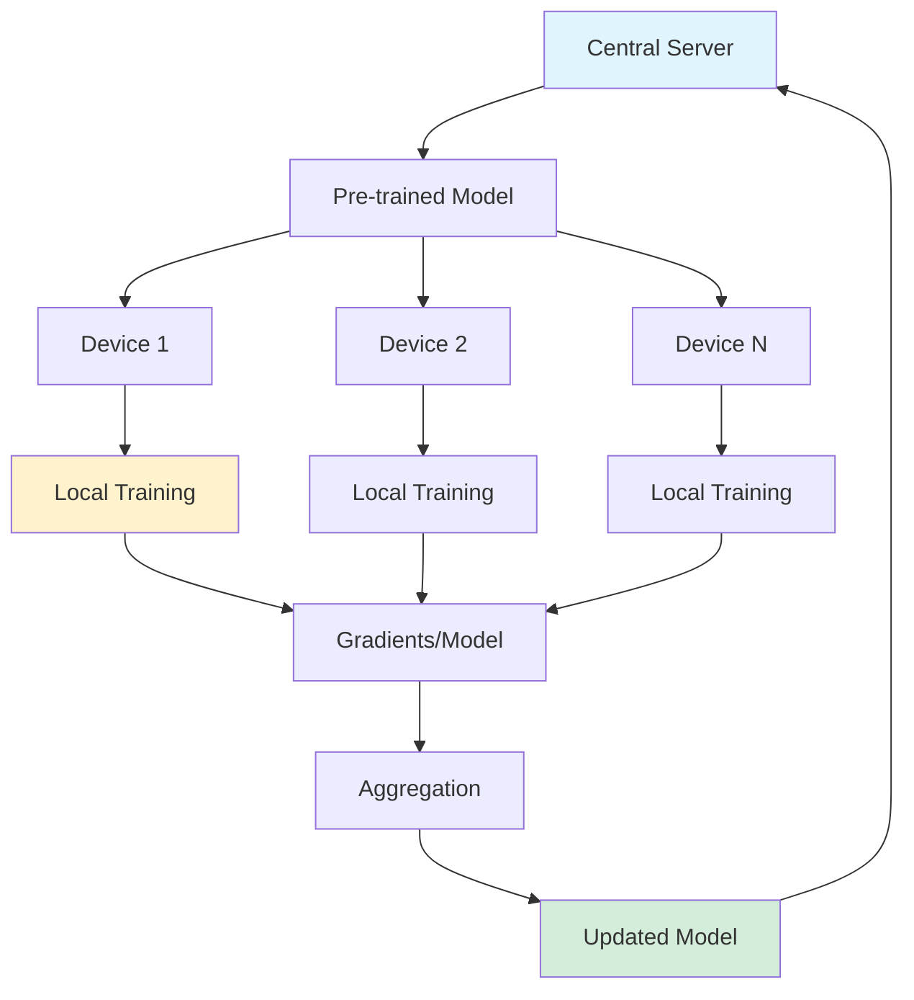

## Federated Learning: Training on Private Data Without Centralization

*Curiosity:* How can we train ML models on private data without centralizing it? What happens when we bring the model to the data instead of bringing data to the model?

**One of the main factors** preventing AI adoption in healthcare and banking is data privacy requirements. Hospitals and banks are reluctant to share sensitive data. **Federated Learning** solves this by training models on distributed data without centralization.

{: .light .shadow .rounded-10 w='1212' h='668' }

### The Challenge

*Retrieve:* Why data privacy blocks AI adoption.

**Problem**: 
- Healthcare and banking require strict data privacy
- Regulations make data sharing risky
- Benefits don't outweigh risks
- Models can't access training data

**Impact**: AI struggles to enter regulated industries.

### Federated Learning Solution

*Innovate:* Bringing models to data instead of data to models.

**Key Concept**: Instead of bringing data to the model, **bring the model to the data**.

**Real-World Examples**:
- Google's query suggestions on Android (Gboard)
- Self-driving car continuous training
- Healthcare model training
- Banking fraud detection

### Federated Learning Process

*Retrieve:* How federated learning works.

### Step-by-Step Process

*Retrieve:* Detailed federated learning workflow.

| Step | Process | Purpose |
|:-----|:---------|:--------|
| **1. Pre-training** | Central server pre-trains model | ⬆️ Initial model |
| **2. Distribution** | Send model to user devices | ⬆️ Local deployment |
| **3. Local Training** | Users interact, model fine-tunes locally | ⬆️ Privacy-preserving |
| **4. Aggregation** | Send gradients/models back to server | ⬆️ Centralized learning |
| **5. Averaging** | Average updates into one model | ⬆️ Global improvement |
| **6. Synchronization** | Sync updated model to devices | ⬆️ Continuous learning |

**Key Benefit**: Train on data from millions of users **without ever storing the data**.

### Advantages

*Innovate:* Why federated learning matters.

| Advantage | Description | Impact |
|:----------|:------------|:-------|
| **Privacy** | Data never leaves devices | ⬆️ Compliance |
| **Regulation** | Meets privacy requirements | ⬆️ Adoption |
| **Scale** | Millions of users | ⬆️ Training data |
| **Efficiency** | Distributed training | ⬆️ Resource use |

### Industry Adoption

*Retrieve:* Growing trend in federated learning.

**Trend**: With increasing data regulations, federated learning usage is growing.

**Major Investors**:
- **Google**: Significant investment in federated learning
- **Meta**: Developing federated learning technology

**Applications**:
- Healthcare (patient data privacy)
- Banking (financial data protection)
- Mobile devices (on-device learning)
- IoT (edge device training)

### Resources

*Retrieve:* Tools and frameworks for federated learning.

> **Resources**:
> - **Google Federated Learning**: <https://federated.withgoogle.com/>
> - **TensorFlow Federated**: <https://www.tensorflow.org/federated/federated_learning>
> - **OpenFL**: <https://github.com/securefederatedai/openfl>
{: .prompt-info}

### Key Takeaways

*Retrieve:* Federated learning enables training on private data by bringing models to data sources instead of centralizing data, solving privacy challenges in regulated industries.

*Innovate:* By implementing federated learning, you can train models on data from millions of users without storing or centralizing sensitive data, enabling AI adoption in healthcare, banking, and other privacy-sensitive domains.

*Curiosity → Retrieve → Innovation:* Start with curiosity about privacy-preserving ML, retrieve insights from federated learning approaches, and innovate by implementing distributed training that respects data privacy regulations.

**Next Steps**:
- Explore TensorFlow Federated
- Try OpenFL
- Design federated architecture
- Deploy federated systems 

> - Here is the dedicated page just for federated learning from Google: 👉 <https://federated.withgoogle.com/>
> - TensorFlow was one of the first to provide a high-level framework for federated learning: 👉 <https://www.tensorflow.org/federated/federated_learning?hl=ko>. 
> - OpenFL is also another open-source project: 👉 <https://github.com/securefederatedai/openfl>
{: .prompt-info}
