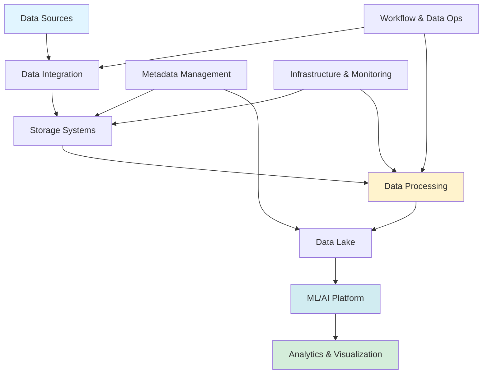

## Explore the Landscape of Open Source Data Engineering

*Curiosity:* What tools and platforms are available in the open-source data engineering ecosystem? How do they work together to build comprehensive data pipelines?

**The open-source data engineering landscape** offers a comprehensive ecosystem of tools for storage, integration, processing, ML/AI, and analytics.

{: .light .shadow .rounded-10 w='1212' h='668' }

### Data Engineering Ecosystem

*Retrieve:* Nine key categories.

| Category | Tools | Purpose |
|:---------|:------|:--------|
| **1. Storage Systems** | PostgreSQL, MySQL, CockroachDB, TiDB, MongoDB, Redis | ⬆️ Data persistence |
| **2. Data Integration** | Kafka Connect, CloudQuery, Airbyte | ⬆️ Data flow & events |
| **3. Infrastructure & Monitoring** | Kubernetes, Docker, Apache Knox, Prometheus, ELK | ⬆️ Management & observability |
| **4. Processing & Computation** | Apache Beam, Spark, Hadoop, Flink, Samza | ⬆️ Data processing |
| **5. ML/AI Platform** | Milvus, MLflow, Kubeflow | ⬆️ ML/AI capabilities |
| **6. Data Lake Platform** | Hadoop HDFS, Iceberg, Parquet | ⬆️ Large-scale data |
| **7. Workflow & Data Ops** | Apache Airflow, Great Expectations, LakeFS | ⬆️ Orchestration & quality |
| **8. Metadata Management** | Amundsen, Apache Atlas, Hive, Schema-registry | ⬆️ Data organization |
| **9. Analytics & Visualization** | Superset, Hue, Cube, AtScale | ⬆️ Analysis & BI |

### Detailed Categories

*Innovate:* Understanding each category.

**1. Storage Systems**:
- **OLTP**: PostgreSQL, MySQL
- **Distributed SQL**: CockroachDB, TiDB
- **NoSQL**: MongoDB, Redis
- **Purpose**: Right storage solution for your needs

**2. Data Integration**:
- **CDC**: Change data capture tools
- **Log/Event Collection**: Event streaming
- **Platforms**: Kafka Connect, CloudQuery, Airbyte
- **Purpose**: Seamless data flow and event management

**3. Data Infrastructure & Monitoring**:
- **Scheduling**: Kubernetes, Docker
- **Security**: Apache Knox
- **Observability**: Prometheus, ELK
- **Purpose**: Manage and monitor infrastructure

**4. Data Processing & Computation**:
- **Unified**: Apache Beam, Spark
- **Batch**: Hadoop
- **Stream**: Flink, Samza
- **Purpose**: Optimize data processing

**5. ML/AI Platform**:
- **Vector Storage**: Milvus
- **MLOps**: MLflow, Kubeflow
- **Purpose**: Empower ML/AI initiatives

**6. Data Lake Platform**:
- **File Systems**: Hadoop HDFS
- **Table Formats**: Iceberg
- **Serialization**: Parquet
- **Purpose**: Manage large-scale data

**7. Workflow & Data Ops**:
- **Orchestration**: Apache Airflow
- **Quality**: Great Expectations
- **Warehousing**: LakeFS
- **Purpose**: Streamline data operations

**8. Metadata Management**:
- **Platforms**: Amundsen, Apache Atlas
- **Security**: Hive, Schema-registry
- **Purpose**: Organize and manage metadata

**9. Analytics & Visualization**:
- **BI Tools**: Superset
- **Query/Collaboration**: Hue
- **Semantic Layers**: Cube, AtScale
- **Purpose**: Enhance analysis and visualization

### Data Engineering Pipeline

*Innovate:* How components work together.

### Key Takeaways

*Retrieve:* The open-source data engineering landscape includes nine key categories (storage, integration, infrastructure, processing, ML/AI, data lake, workflow, metadata, analytics) that work together to build comprehensive data pipelines.

*Innovate:* By leveraging the right combination of open-source tools from each category, you can build scalable, efficient data engineering pipelines that support storage, processing, ML/AI, and analytics.

*Curiosity → Retrieve → Innovation:* Start with curiosity about data engineering tools, retrieve insights from the open-source ecosystem, and innovate by building comprehensive data pipelines using the right tools for your needs.

**Next Steps**:
- Explore each category
- Choose appropriate tools
- Build your pipeline
- Monitor and optimize