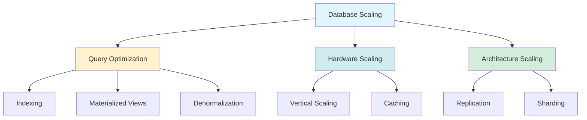

## 7 Must-Know Strategies to Scale Your Database

*Curiosity:* How can we scale databases to handle growing workloads? What strategies work best for different scaling scenarios?

**Database scaling** is essential for handling growing data and traffic. Here are 7 must-know strategies to scale your database effectively.

{: .light .shadow .rounded-10 w='1212' h='668' }

### The 7 Scaling Strategies

*Retrieve:* Comprehensive scaling approaches.

| # | Strategy | Description | Use Case |
|:--|:---------|:------------|:---------|
| **1** | **Indexing** | Create right indexes for query patterns | ⬆️ Query performance |
| **2** | **Materialized Views** | Pre-compute complex query results | ⬆️ Fast access |
| **3** | **Denormalization** | Reduce complex joins | ⬆️ Query speed |
| **4** | **Vertical Scaling** | Add more CPU, RAM, storage | ⬆️ Single server power |
| **5** | **Caching** | Store frequently accessed data | ⬆️ Reduce load |
| **6** | **Replication** | Create read replicas | ⬆️ Read scaling |
| **7** | **Sharding** | Split tables across servers | ⬆️ Write/read scaling |

### Detailed Strategies

*Innovate:* Understanding each approach.

**1. Indexing**:
- Check query patterns of your application
- Create the right indexes
- Improves query performance significantly

**2. Materialized Views**:
- Pre-compute complex query results
- Store them for faster access
- Reduces computation time

**3. Denormalization**:
- Reduce complex joins
- Improve query performance
- Trade-off: Some data redundancy

**4. Vertical Scaling**:
- Boost database server
- Add more CPU, RAM, or storage
- Easier but has limits

**5. Caching**:
- Store frequently accessed data
- Use faster storage layer
- Reduces database load

**6. Replication**:
- Create replicas of primary database
- Deploy on different servers
- Scales reads effectively

**7. Sharding**:
- Split database tables into smaller pieces
- Spread across servers
- Scales both writes and reads

### Scaling Strategy Comparison

*Retrieve:* When to use each strategy.

### Key Takeaways

*Retrieve:* Seven database scaling strategies (indexing, materialized views, denormalization, vertical scaling, caching, replication, sharding) address different scaling needs from query optimization to architecture changes.

*Innovate:* By combining these strategies based on your specific needs—query patterns, read/write ratios, and growth projections—you can effectively scale your database to handle increasing workloads.

*Curiosity → Retrieve → Innovation:* Start with curiosity about database scaling, retrieve insights from these seven strategies, and innovate by implementing the right combination of techniques for your database architecture.

**Next Steps**:
- Analyze your query patterns
- Choose appropriate strategies
- Implement scaling solutions
- Monitor performance 