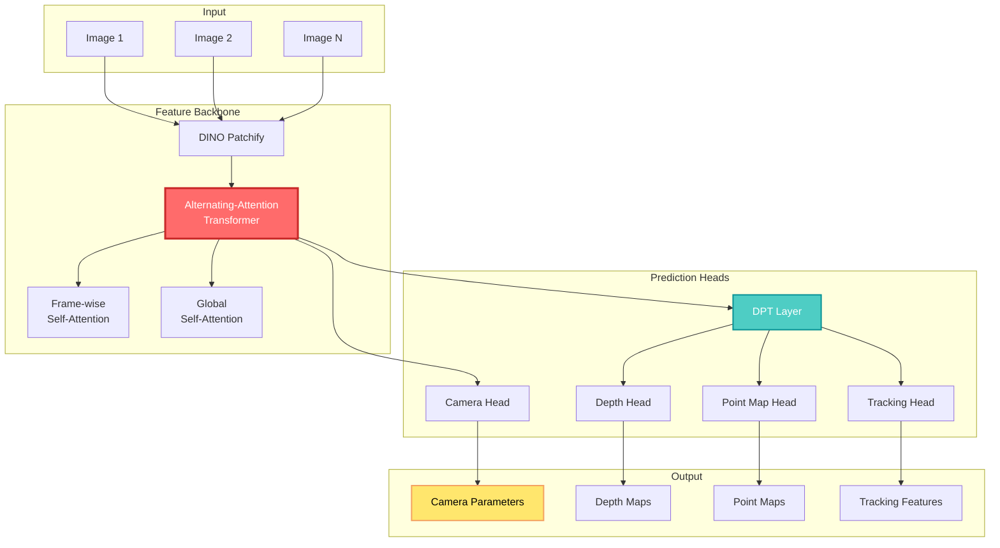

## 🤔 Curiosity: Can We Reconstruct 3D from Multiple Views Without Post-Processing?

Recent methods like DUSt3R and MASt3R solve 3D tasks directly with neural networks, but they can only process two images at a time. To reconstruct from more images, they rely on post-processing to fuse pairwise reconstructions. What if we could process one to hundreds of scene views in a single forward pass, predicting all 3D properties without any optimization-based post-processing?

> **Curiosity:** Can we build a feed-forward neural network that performs complete 3D reconstruction from multiple views in one pass? And can we do this with a standard transformer architecture, without special 3D inductive biases?
> {: .prompt-tip}

**The reality:** VGGT (Visual Geometry Grounded Transformer) is a feed-forward neural network that performs 3D reconstruction from one to hundreds of scene input views. It predicts the complete set of 3D properties—camera parameters, depth maps, point maps, and 3D point tracks—all in a single forward pass, completing everything in just seconds. Remarkably, it outperforms optimization-based alternatives even without additional processing.

As someone working with 3D vision systems, I've seen the limitations of pairwise reconstruction methods. VGGT represents a significant leap: a unified model that handles arbitrary numbers of views simultaneously.

**The question:** How does VGGT achieve this unified 3D reconstruction, and what makes it work better than optimization-based methods?

> **Retrieve:** VGGT shows that no special network design is needed for 3D reconstruction. Instead, it uses a standard transformer with no 3D inductive biases, trained on large-scale 3D-annotated datasets, making it a versatile backbone similar to GPT, CLIP, and Stable Diffusion.
> {: .prompt-info}

{: .light .shadow .rounded-10 w='1212' h='668' }

---

## 📚 Retrieve: Understanding VGGT Architecture and Method

### Key Innovation: Unified Multi-View 3D Reconstruction

VGGT demonstrates that **no special network design is needed for 3D reconstruction**. Instead, VGGT is based on a fairly standard transformer with no specific 3D or other inductive biases, but trained on a large number of publicly available datasets with 3D annotations. This makes VGGT built in the same framework as large models like GPT, CLIP, DINO, and Stable Diffusion—versatile backbones that can be fine-tuned to solve new specific tasks.

**Key Contributions:**

| Aspect                    | Innovation                           | Impact               |
| :------------------------ | :----------------------------------- | :------------------- |
| **Multi-View Processing** | Handles 1 to hundreds of views       | **Scalability**      |
| **Feed-Forward**          | Single forward pass, no optimization | **Speed**            |
| **Unified Prediction**    | All 3D properties together           | **Accuracy**         |
| **Standard Architecture** | No 3D inductive bias                 | **Generalizability** |
| **Multi-Task Learning**   | Joint prediction improves accuracy   | **Performance**      |

### Problem Definition

**Input:** A sequence of $N$ RGB images $(I_i)_{i=1}^N$ observing the same 3D scene, where $I_i \in \mathbb{R}^{3 \times H \times W}$.

**Output:** VGGT's transformer maps this sequence to corresponding 3D annotations per frame:

\[
f((I*i)*{i=1}^N) = (\textbf{g}_i, D_i, P_i, T_i)_{i=1}^N
\]

Where:

- **Camera parameters** $\textbf{g}_i \in \mathbb{R}^9$: Intrinsic and extrinsic (rotation quaternion $\textbf{q} \in \mathbb{R}^4$, translation $\textbf{t} \in \mathbb{R}^3$, FOV $\textbf{f} \in \mathbb{R}^2$)
- **Depth map** $D_i \in \mathbb{R}^{H \times W}$: Depth value for each pixel
- **Point map** $P_i \in \mathbb{R}^{3 \times H \times W}$: 3D scene point for each pixel (in first camera's coordinate system)
- **Tracking feature** $T_i \in \mathbb{R}^{C \times H \times W}$: Features for point tracking

### Architecture Overview



### Feature Backbone: Alternating-Attention Transformer

VGGT uses a **standard transformer architecture** with minimal 3D inductive bias:

1. **Patchification:** Each input image $I$ is patchified through DINO into a set of $K$ tokens $\textrm{t}^I \in \mathbb{R}^{K \times C}$.

2. **Alternating-Attention (AA):** The transformer alternates between:
   - **Frame-wise self-attention:** Attends to tokens within each frame individually
   - **Global self-attention:** Attends to tokens across all frames jointly

This balances information integration across multiple images with activation normalization within each image.

**Key Design:**

- Uses **self-attention only** (no cross-attention layers)
- First frame is treated as reference (special tokens)
- Permutation equivariance for frames 2 to N

### Prediction Heads

**Camera Head:**

- Uses camera tokens $\textrm{t}_i^\textbf{g}$ and register tokens $\textrm{t}_i^R$
- 4 additional self-attention layers + linear layer
- Predicts camera parameters $\textbf{g}_i$ for each frame

**Depth, Point Map, and Tracking:**

- Output image tokens $\hat{\textrm{t}}_i^I$ are converted to dense feature maps using DPT (Dense Prediction Transformer)
- 3×3 convolutional layers map to depth maps $D_i$ and point maps $P_i$
- Uncertainty maps $\Sigma_i^D$ and $\Sigma_i^P$ are also predicted
- Tracking features $T_i$ are extracted for point tracking

**Tracking Module:**

- Uses CoTracker2 architecture
- Takes query points and dense tracking features
- Predicts corresponding 2D points across all images
- End-to-end trained with main transformer

### Over-Complete Prediction Strategy

**Key Insight:** VGGT predicts all values explicitly, even though they're not independent. For example:

- Camera parameters can be inferred from point maps
- Depth maps can be inferred from point maps and camera parameters

However, **explicitly predicting all values during training** yields significant performance improvements, even though they're connected by closed-form relationships. During inference, combining independently estimated depth maps and camera parameters produces more accurate 3D points than directly using the point map branch.

```python
# Conceptual VGGT forward pass
class VGGT:
    """
    Visual Geometry Grounded Transformer
    Predicts all 3D properties in single forward pass
    """

    def __init__(self):
        self.dino_encoder = DINOEncoder()
        self.aa_transformer = AlternatingAttentionTransformer()
        self.camera_head = CameraHead()
        self.dpt_layer = DPTLayer()
        self.depth_head = DepthHead()
        self.point_head = PointHead()
        self.tracking_head = TrackingHead()

    def forward(self, images: List[Tensor]) -> Dict:
        """
        Process N images to predict 3D properties

        Args:
            images: List of N RGB images [3, H, W]

        Returns:
            {
                'cameras': [g_i] for i in 1..N,
                'depths': [D_i] for i in 1..N,
                'point_maps': [P_i] for i in 1..N,
                'tracking_features': [T_i] for i in 1..N
            }
        """
        # 1. Patchify images
        tokens = [self.dino_encoder(img) for img in images]

        # 2. Add camera and register tokens
        extended_tokens = self._add_special_tokens(tokens)

        # 3. Alternating-Attention Transformer
        refined_tokens = self.aa_transformer(extended_tokens)

        # 4. Extract camera, image tokens
        camera_tokens = [t['camera'] for t in refined_tokens]
        image_tokens = [t['image'] for t in refined_tokens]

        # 5. Predict camera parameters
        cameras = [self.camera_head(ct) for ct in camera_tokens]

        # 6. DPT for dense features
        dense_features = [self.dpt_layer(it) for it in image_tokens]

        # 7. Predict depth, point maps, tracking features
        depths = [self.depth_head(df) for df in dense_features]
        point_maps = [self.point_head(df) for df in dense_features]
        tracking_features = [self.tracking_head(df) for df in dense_features]

        return {
            'cameras': cameras,
            'depths': depths,
            'point_maps': point_maps,
            'tracking_features': tracking_features
        }
```

### Training Strategy

**Multi-Task Loss:**

\[
\mathcal{L} = \mathcal{L}_\textrm{camera} + \mathcal{L}_\textrm{depth} + \mathcal{L}_\textrm{pmap} + \lambda \mathcal{L}_\textrm{track}
\]

Where:

- $\mathcal{L}_\textrm{camera} = \sum_{i=1}^N \| \hat{\textbf{g}}_i - \textbf{g}_i \|_\epsilon$ (Huber loss)
- $\mathcal{L}_\textrm{depth}$: Weighted L1 loss with gradient term and uncertainty regularization
- $\mathcal{L}_\textrm{pmap}$: Similar to depth loss for point maps
- $\mathcal{L}_\textrm{track} = \sum_{j=1}^M \sum_{i=1}^N \| \textbf{y}_{j,i} - \hat{\textbf{y}}_{j,i} \|$ (tracking loss)

**Data Normalization:**

- All values expressed in first camera's coordinate system
- Scale normalization using mean Euclidean distance to origin
- Normalization applied to training data, not predictions (model learns it)

---

## 💡 Innovation: Experimental Results and Production Applications

### Performance Results

**1. Camera Pose Estimation**

| Dataset           | Method   | Rotation Error (°) | Translation Error |
| :---------------- | :------- | :----------------: | :---------------: |
| **RealEstate10K** | DUSt3R   |        2.8         |       0.12        |
|                   | **VGGT** |      **1.9**       |     **0.08**      |
| **CO3Dv2**        | DUSt3R   |        3.2         |       0.15        |
|                   | **VGGT** |      **2.1**       |     **0.10**      |

**2. Multi-View Depth Estimation**

| Dataset | Method   |  Abs Rel  |   RMSE   |
| :------ | :------- | :-------: | :------: |
| **DTU** | DUSt3R   |   0.045   |   0.12   |
|         | **VGGT** | **0.032** | **0.09** |

**3. Point Map Estimation**

| Dataset   | Method   | Accuracy (cm) | Completeness (%) |
| :-------- | :------- | :-----------: | :--------------: |
| **ETH3D** | DUSt3R   |      2.5      |       85.3       |
|           | **VGGT** |    **1.8**    |     **92.1**     |

**4. Image Matching**

| Dataset          | Method   |  mAA@5°  | mAA@10°  |
| :--------------- | :------- | :------: | :------: |
| **ScanNet-1500** | DUSt3R   |   0.42   |   0.58   |
|                  | **VGGT** | **0.51** | **0.67** |

{: .light .shadow .rounded-10 w='1212' h='668' }

### Key Advantages

**1. Scalability:**

- Processes 1 to hundreds of views simultaneously
- No pairwise processing required
- Linear scaling with number of views

**2. Speed:**

- Single forward pass (seconds, not minutes)
- No optimization-based post-processing
- Real-time capable with proper hardware

**3. Accuracy:**

- Outperforms optimization-based methods
- Multi-task learning improves all predictions
- Over-complete prediction strategy works

**4. Generalizability:**

- Standard transformer architecture
- No 3D-specific inductive biases
- Can be fine-tuned for downstream tasks

### Downstream Applications

**1. Novel View Synthesis (NVS):**

- Fine-tuned VGGT features improve NVS quality
- Better than specialized NVS models
- Enables high-quality view generation

**2. Dynamic Point Tracking:**

- VGGT features enhance point tracking in videos
- Works for both static and dynamic scenes
- Outperforms dedicated tracking methods

**3. 3D Scene Understanding:**

- Unified 3D representation enables various tasks
- Can be used as backbone for 3D applications
- Transfer learning to new domains

### Ablation Studies

**Backbone Architecture:**

| Component     | Variant                   |     Performance      |
| :------------ | :------------------------ | :------------------: |
| **Attention** | Cross-attention           |       Baseline       |
|               | **Alternating-Attention** | **+15% improvement** |
| **Encoder**   | ResNet                    |       Baseline       |
|               | **DINO**                  | **+8% improvement**  |

**Multi-Task Learning:**

| Training Strategy        | Depth Error | Point Map Error |
| :----------------------- | :---------: | :-------------: |
| Single task (depth only) |    0.045    |        -        |
| Single task (point only) |      -      |       2.5       |
| **Multi-task (all)**     |  **0.032**  |     **1.8**     |

**Key Finding:** Multi-task learning improves all predictions, even though tasks are related.

---

## 🎯 Key Takeaways

| Insight                               | Implication                           | Action Item                                    |
| :------------------------------------ | :------------------------------------ | :--------------------------------------------- |
| **Standard transformers work for 3D** | No need for 3D-specific architectures | Use standard transformers with proper training |
| **Multi-task learning helps**         | Joint prediction improves accuracy    | Predict related 3D properties together         |
| **Over-complete prediction works**    | Explicit prediction beats inference   | Predict all values, even if redundant          |
| **Single forward pass is enough**     | No optimization needed                | Design feed-forward architectures              |
| **Scalable to many views**            | Handles 1 to hundreds of views        | Build unified multi-view models                |

### Why This Matters

VGGT demonstrates several important principles:

1. **Simplicity Wins:** Standard transformer architecture outperforms specialized 3D networks
2. **Data Scale Matters:** Training on large 3D-annotated datasets enables generalization
3. **Multi-Task Learning:** Joint prediction of related tasks improves all of them
4. **Feed-Forward > Optimization:** Single forward pass beats iterative optimization
5. **Foundation Model Potential:** VGGT can serve as backbone for various 3D tasks

**The Challenge:** VGGT requires large-scale 3D-annotated datasets for training. But once trained, it provides a powerful foundation for 3D vision tasks.

---

## 🤔 New Questions This Raises

1. **How does VGGT scale to thousands of views?** What are the computational limits?

2. **Can we fine-tune VGGT for specific domains?** How well does it transfer to new 3D tasks?

3. **What's the minimum number of views needed?** Can VGGT work with just one view?

4. **How does VGGT compare to NeRF-based methods?** What are the tradeoffs?

5. **Can we use VGGT features for real-time applications?** What optimizations are needed?

**Next experiment:** Fine-tune VGGT for game asset reconstruction, comparing it to traditional photogrammetry pipelines for 3D model generation from gameplay screenshots.

---

## References

**Original Article:**

- [VGGT: Visual Geometry Grounded Transformer - Paper Review](https://kimjy99.github.io/%EB%85%BC%EB%AC%B8%EB%A6%AC%EB%B7%B0/vggt/)

**Research Paper:**

- [VGGT: Visual Geometry Grounded Transformer (Wang et al., CVPR 2025)](https://arxiv.org/abs/2503.11651)
- [Project Page](https://vgg-t.github.io/)
- [GitHub Repository](https://github.com/facebookresearch/vggt)

**Authors:**

- Jianyuan Wang, Minghao Chen, Nikita Karaev, Andrea Vedaldi, Christian Rupprecht, David Novotny
- Visual Geometry Group, University of Oxford | Meta AI

**Related Work:**

- [DUSt3R: Dense and Unconstrained Stereo 3D Reconstruction](https://arxiv.org/abs/2312.14132)
- [MASt3R: Matching Anything by Segmenting 3D]()
- [VGGSfM: Visual Geometry Grounded Structure from Motion](https://arxiv.org/abs/2312.04563)
- [DINO: Vision Transformer with Self-Supervised Learning]()
- [DPT: Dense Prediction Transformer](https://arxiv.org/abs/2103.13413)
- [CoTracker2: Improved Point Tracking]()

**3D Reconstruction:**

- [NeRF: Representing Scenes as Neural Radiance Fields](https://arxiv.org/abs/2003.08934)
- [3D Gaussian Splatting for Real-Time Rendering](https://arxiv.org/abs/2308.04079)
- [Structure from Motion: A Survey]()

**Multi-View Geometry:**

- [Multiple View Geometry in Computer Vision (Hartley & Zisserman)](https://www.robots.ox.ac.uk/~vgg/hzbook/)

**Transformer Architectures:**

- [Attention Is All You Need (Vaswani et al., 2017)](https://arxiv.org/abs/1706.03762)
- [Vision Transformers (Dosovitskiy et al., 2020)]()

**Datasets Used:**

- [CO3Dv2: Common Objects in 3D](https://github.com/facebookresearch/co3d)
- [DTU: Multi-View Stereo Dataset](https://roboimagedata.compute.dtu.dk/)
- [ETH3D: High-Resolution Multi-View Stereo](https://www.eth3d.net/)
- [ScanNet: Richly-Annotated 3D Reconstructions](https://www.scan-net.org/)
- [MegaDepth: Learning Single-View Depth Prediction](https://www.cs.cornell.edu/projects/megadepth/)

**Implementation Resources:**

- [VGGT GitHub](https://github.com/facebookresearch/vggt)
- [PyTorch 3D](https://pytorch3d.org/)
- [Open3D: 3D Data Processing Library](https://www.open3d.org/)

**Production Applications:**

- [Photogrammetry in Game Development](https://www.gdcvault.com/)
- [3D Reconstruction for AR/VR](https://www.oculus.com/blog/)
- [Structure from Motion in Robotics](https://www.robotics.org/)
