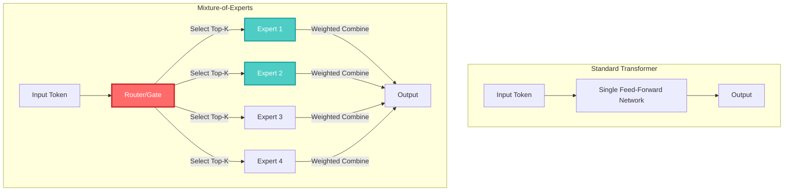
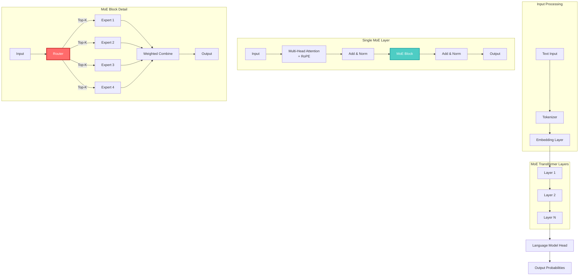

## 🤔 Curiosity: How Do We Scale LLMs Without Proportional Compute Costs?

What if we could build a language model with hundreds of billions of parameters, but only activate a small fraction of them for each input? What if we could achieve GPT-4-level performance at roughly half the inference cost?

{: .light .w-75 .shadow .rounded-10 w='1440' h='810' }

> **Curiosity:** Traditional Transformers activate all parameters for every token. But what if we could create a "team of specialists" where only relevant experts activate per token? How would that change the efficiency equation?
> {: .prompt-tip}

Meta's **LLaMA 4** has sparked significant conversation, not just because of its performance, but because of **how** it achieves that performance. Unlike previous generations, LLaMA 4 doesn't rely solely on the classic Transformer architecture. Instead, it uses a **Mixture-of-Experts (MoE)** approach, activating only a small subset of expert subnetworks per token.

**The result:** LLaMA 4 Maverick uses 128 experts but activates just a few per token, achieving GPT-4-level performance at roughly half the inference cost.

**The question:** How does MoE actually work under the hood? And can we build a miniature, interpretable version from scratch to truly understand the mechanics?

As someone who's built production ML systems, I've always been fascinated by architectures that break the "bigger model = more compute" paradigm. MoE represents one of the most promising approaches to scaling model capacity without proportional compute requirements.

---

## 📚 Retrieve: Understanding Mixture-of-Experts Architecture

### Why Mixture-of-Experts for LLMs?

**The Scaling Problem:**

Large Language Models have grown massively in size, reaching tens or even hundreds of billions of parameters. The traditional approach:

- **More parameters** → **Better performance**
- **But also:** More parameters → **Proportional increase in compute**

**The MoE Solution:**

Instead of every part of the model being active for every input, MoE networks activate only a subset of "expert" sub-networks for each token. This means:

- **Only a fraction** of the model's parameters are used for each forward pass
- **Reduced computation cost** while preserving performance
- **Scale model capacity** without proportional increase in compute

| Approach                     | Parameters | Active per Token |      Compute Cost      |
| :--------------------------- | :--------: | :--------------: | :--------------------: |
| **Standard Transformer**     |    70B     |    70B (100%)    |          High          |
| **MoE (128 experts, top-2)** |    70B     |   ~1.1B (1.6%)   |          Low           |
| **Performance**              |  Similar   |     Similar      | **50% cost reduction** |

### How Do MoEs Work?

**The Core Idea:**

Think of a standard Transformer as a single-agent system—one really smart generalist doing everything. MoE is the **multi-agent version** of model design:

- Instead of one generalist, you build a **team of specialists**
- Each expert specializes in different types of tasks
- A **router** decides which expert(s) should handle each input token
- Only the most relevant experts are activated based on the task



**Key Components:**

1. **Experts:** Multiple feed-forward networks (usually 4-128 experts), each smaller than a standard FFN
2. **Router (Gate):** A small neural network that produces scores for each expert
3. **Top-K Selection:** Only the top-K experts (typically 2-4) are activated per token
4. **Weighted Combination:** Expert outputs are combined using router scores

### The Router Mechanism

{: .light .w-75 .shadow .rounded-10 w='800' h='600' }

**How Routing Works:**

```python
# Conceptual router implementation
class MoERouter:
    """
    Curiosity: How does the router decide which experts to activate?
    Retrieve: Router learns to assign tokens to specialized experts
    Innovation: Sparse activation enables efficient scaling
    """

    def __init__(self, num_experts: int, top_k: int = 2):
        self.num_experts = num_experts
        self.top_k = top_k
        self.gate = nn.Linear(hidden_dim, num_experts)

    def forward(self, token_embedding: torch.Tensor) -> Tuple[torch.Tensor, torch.Tensor]:
        """
        Route token to top-K experts

        Args:
            token_embedding: [batch_size, hidden_dim]

        Returns:
            expert_scores: [batch_size, num_experts] - softmax scores
            expert_indices: [batch_size, top_k] - indices of selected experts
        """
        # 1. Compute scores for each expert
        logits = self.gate(token_embedding)  # [batch_size, num_experts]

        # 2. Add noise during training (prevents expert collapse)
        if self.training:
            noise = torch.randn_like(logits) * 0.1
            logits = logits + noise

        # 3. Select top-K experts
        top_k_scores, top_k_indices = torch.topk(logits, k=self.top_k, dim=-1)

        # 4. Set non-selected experts to -infinity (for softmax)
        mask = torch.full_like(logits, float('-inf'))
        mask.scatter_(1, top_k_indices, top_k_scores)

        # 5. Apply softmax to get probabilities
        expert_probs = F.softmax(mask, dim=-1)

        return expert_probs, top_k_indices
```

**Example:**

For the token "was" in the sentence "Facebook was founded":

- Router examines the token embedding
- Produces scores: [0.1, 0.7, 0.05, 0.15] for 4 experts
- Selects top-2: Expert 1 (0.7) and Expert 3 (0.15)
- Only these two experts process the token
- Outputs are combined with weights 0.7 and 0.15

### Training Challenges and Solutions

**Challenge 1: Expert Collapse**

**Problem:** During training, one expert might get selected repeatedly, leaving others under-trained.

**Solution:**

1. **Add noise** to router logits during training (encourages exploration)
2. **Top-K masking:** Set non-selected expert logits to -infinity before softmax

**Challenge 2: Load Balancing**

**Problem:** Some experts may process more tokens than others, leading to uneven training.

**Solution:**

- **Token capacity limit:** Limit the number of tokens each expert can process
- **Overflow handling:** If an expert reaches capacity, route to the next best expert

```python
def load_balance_loss(expert_usage: torch.Tensor, num_experts: int) -> torch.Tensor:
    """
    Encourage uniform expert usage

    Args:
        expert_usage: [num_experts] - count of tokens processed by each expert

    Returns:
        Load balancing loss (higher = more imbalanced)
    """
    # Coefficient of variation
    mean_usage = expert_usage.mean()
    std_usage = expert_usage.std()
    cv_squared = (std_usage / mean_usage) ** 2

    return cv_squared
```

---

## 💡 Innovation: Building LLaMA 4 from Scratch

### Architecture Overview

{: .light .w-75 .shadow .rounded-10 w='1200' h='800' }

**Complete MoE Transformer Architecture:**



### Implementation: Core Components

#### 1. Character-Level Tokenization

```python
class CharacterTokenizer:
    """
    Simple character-level tokenizer for educational purposes
    In production, use SentencePiece or BPE tokenizers
    """

    def __init__(self, text: str):
        # Build vocabulary from unique characters
        self.chars = sorted(list(set(text)))
        self.vocab_size = len(self.chars)

        # Create mappings
        self.char_to_idx = {ch: i for i, ch in enumerate(self.chars)}
        self.idx_to_char = {i: ch for i, ch in enumerate(self.chars)}

    def encode(self, text: str) -> List[int]:
        """Convert text to token indices"""
        return [self.char_to_idx[ch] for ch in text]

    def decode(self, indices: List[int]) -> str:
        """Convert token indices to text"""
        return ''.join([self.idx_to_char[idx] for idx in indices])
```

#### 2. Rotary Positional Embeddings (RoPE)

```python
def apply_rotary_pos_emb(q: torch.Tensor, k: torch.Tensor,
                         freqs: torch.Tensor) -> Tuple[torch.Tensor, torch.Tensor]:
    """
    Apply rotary positional embeddings to queries and keys

    RoPE encodes position information by rotating the query/key vectors
    in the complex plane, allowing the model to understand relative positions
    """
    # Reshape for complex multiplication
    q_complex = torch.view_as_complex(q.reshape(*q.shape[:-1], -1, 2))
    k_complex = torch.view_as_complex(k.reshape(*k.shape[:-1], -1, 2))

    # Apply rotation
    freqs_cis = torch.polar(torch.ones_like(freqs), freqs)
    q_rotated = q_complex * freqs_cis
    k_rotated = k_complex * freqs_cis

    # Convert back to real
    q_emb = torch.view_as_real(q_rotated).flatten(-2)
    k_emb = torch.view_as_real(k_rotated).flatten(-2)

    return q_emb, k_emb
```

#### 3. Multi-Head Self-Attention with RoPE

```python
class MultiHeadAttention(nn.Module):
    """
    Multi-head self-attention with rotary positional embeddings
    """

    def __init__(self, d_model: int, num_heads: int, max_seq_len: int = 512):
        super().__init__()
        self.d_model = d_model
        self.num_heads = num_heads
        self.head_dim = d_model // num_heads

        # Q, K, V projections
        self.q_proj = nn.Linear(d_model, d_model)
        self.k_proj = nn.Linear(d_model, d_model)
        self.v_proj = nn.Linear(d_model, d_model)
        self.out_proj = nn.Linear(d_model, d_model)

        # RoPE frequencies
        self.register_buffer('freqs', self._compute_freqs(max_seq_len))

    def _compute_freqs(self, max_seq_len: int) -> torch.Tensor:
        """Compute RoPE frequencies"""
        freqs = 1.0 / (10000 ** (torch.arange(0, self.head_dim, 2).float() / self.head_dim))
        positions = torch.arange(max_seq_len).float()
        freqs = torch.outer(positions, freqs)
        return freqs

    def forward(self, x: torch.Tensor, mask: Optional[torch.Tensor] = None):
        batch_size, seq_len, _ = x.shape

        # Project to Q, K, V
        q = self.q_proj(x).view(batch_size, seq_len, self.num_heads, self.head_dim)
        k = self.k_proj(x).view(batch_size, seq_len, self.num_heads, self.head_dim)
        v = self.v_proj(x).view(batch_size, seq_len, self.num_heads, self.head_dim)

        # Apply RoPE
        q, k = apply_rotary_pos_emb(q, k, self.freqs[:seq_len])

        # Reshape for attention
        q = q.transpose(1, 2)  # [batch, heads, seq, head_dim]
        k = k.transpose(1, 2)
        v = v.transpose(1, 2)

        # Scaled dot-product attention
        scores = torch.matmul(q, k.transpose(-2, -1)) / math.sqrt(self.head_dim)

        # Causal mask
        if mask is not None:
            scores = scores.masked_fill(mask == 0, float('-inf'))

        attn_weights = F.softmax(scores, dim=-1)
        attn_output = torch.matmul(attn_weights, v)

        # Concatenate heads and project
        attn_output = attn_output.transpose(1, 2).contiguous()
        attn_output = attn_output.view(batch_size, seq_len, self.d_model)
        output = self.out_proj(attn_output)

        return output
```

#### 4. Mixture-of-Experts Block

```python
class Expert(nn.Module):
    """Single expert: a feed-forward network"""

    def __init__(self, d_model: int, d_ff: int):
        super().__init__()
        self.ff = nn.Sequential(
            nn.Linear(d_model, d_ff),
            nn.GELU(),
            nn.Linear(d_ff, d_model)
        )

    def forward(self, x: torch.Tensor) -> torch.Tensor:
        return self.ff(x)


class MoEBlock(nn.Module):
    """
    Mixture-of-Experts block with router and multiple experts
    """

    def __init__(self, d_model: int, num_experts: int, top_k: int, d_ff: int):
        super().__init__()
        self.num_experts = num_experts
        self.top_k = top_k

        # Router
        self.router = nn.Linear(d_model, num_experts)

        # Experts
        self.experts = nn.ModuleList([
            Expert(d_model, d_ff) for _ in range(num_experts)
        ])

    def forward(self, x: torch.Tensor) -> torch.Tensor:
        """
        Args:
            x: [batch_size, seq_len, d_model]

        Returns:
            output: [batch_size, seq_len, d_model]
        """
        batch_size, seq_len, d_model = x.shape

        # Flatten for routing
        x_flat = x.view(-1, d_model)  # [batch * seq, d_model]

        # Router scores
        router_logits = self.router(x_flat)  # [batch * seq, num_experts]

        # Add noise during training (prevents expert collapse)
        if self.training:
            noise = torch.randn_like(router_logits) * 0.1
            router_logits = router_logits + noise

        # Top-K selection
        top_k_scores, top_k_indices = torch.topk(
            router_logits, k=self.top_k, dim=-1
        )  # [batch * seq, top_k]

        # Create mask for selected experts
        expert_mask = torch.zeros_like(router_logits)
        expert_mask.scatter_(1, top_k_indices, 1.0)

        # Softmax over selected experts only
        router_logits_masked = router_logits.masked_fill(
            expert_mask == 0, float('-inf')
        )
        expert_probs = F.softmax(router_logits_masked, dim=-1)

        # Process through selected experts
        output = torch.zeros_like(x_flat)

        for expert_idx in range(self.num_experts):
            # Find tokens routed to this expert
            expert_mask_idx = (top_k_indices == expert_idx).any(dim=-1)

            if expert_mask_idx.any():
                # Get tokens for this expert
                expert_input = x_flat[expert_mask_idx]

                # Process through expert
                expert_output = self.experts[expert_idx](expert_input)

                # Get weights for this expert
                expert_weights = expert_probs[expert_mask_idx, expert_idx:expert_idx+1]

                # Weighted contribution
                output[expert_mask_idx] += expert_weights * expert_output

        # Reshape back
        output = output.view(batch_size, seq_len, d_model)

        return output
```

#### 5. Complete MoE Transformer Layer

```python
class MoETransformerLayer(nn.Module):
    """Complete MoE Transformer layer"""

    def __init__(self, d_model: int, num_heads: int, num_experts: int,
                 top_k: int, d_ff: int, max_seq_len: int = 512):
        super().__init__()

        # Attention
        self.attention = MultiHeadAttention(d_model, num_heads, max_seq_len)
        self.norm1 = nn.LayerNorm(d_model)

        # MoE block
        self.moe = MoEBlock(d_model, num_experts, top_k, d_ff)
        self.norm2 = nn.LayerNorm(d_model)

    def forward(self, x: torch.Tensor, mask: Optional[torch.Tensor] = None):
        # Self-attention with residual
        attn_out = self.attention(x, mask)
        x = self.norm1(x + attn_out)

        # MoE with residual
        moe_out = self.moe(x)
        x = self.norm2(x + moe_out)

        return x
```

#### 6. Complete Model

```python
class Llama4MoE(nn.Module):
    """
    Miniature LLaMA 4 MoE model from scratch
    """

    def __init__(self, vocab_size: int, d_model: int = 128, num_layers: int = 4,
                 num_heads: int = 8, num_experts: int = 4, top_k: int = 2,
                 d_ff: int = 512, max_seq_len: int = 512):
        super().__init__()

        # Embedding
        self.embedding = nn.Embedding(vocab_size, d_model)

        # Transformer layers
        self.layers = nn.ModuleList([
            MoETransformerLayer(d_model, num_heads, num_experts, top_k,
                              d_ff, max_seq_len)
            for _ in range(num_layers)
        ])

        # Output head
        self.ln_f = nn.LayerNorm(d_model)
        self.head = nn.Linear(d_model, vocab_size)

    def forward(self, x: torch.Tensor, mask: Optional[torch.Tensor] = None):
        # Embedding
        x = self.embedding(x)

        # Through layers
        for layer in self.layers:
            x = layer(x, mask)

        # Output projection
        x = self.ln_f(x)
        logits = self.head(x)

        return logits
```

### Training and Generation

**Training Loop:**

```python
def train_moe_model(model, dataloader, optimizer, num_epochs=10):
    """Training loop with load balancing loss"""
    model.train()

    for epoch in range(num_epochs):
        total_loss = 0

        for batch in dataloader:
            inputs, targets = batch

            # Forward pass
            logits = model(inputs)

            # Cross-entropy loss
            loss = F.cross_entropy(
                logits.view(-1, logits.size(-1)),
                targets.view(-1),
                ignore_index=-1
            )

            # Add load balancing loss (simplified)
            # In practice, track expert usage and add regularization

            # Backward
            optimizer.zero_grad()
            loss.backward()
            optimizer.step()

            total_loss += loss.item()

        print(f"Epoch {epoch+1}, Loss: {total_loss/len(dataloader):.4f}")
```

**Generation (Autoregressive):**

```python
def generate(model, tokenizer, prompt: str, max_length: int = 100,
             temperature: float = 1.0) -> str:
    """Generate text autoregressively"""
    model.eval()

    # Encode prompt
    tokens = tokenizer.encode(prompt)
    tokens = torch.tensor([tokens])

    with torch.no_grad():
        for _ in range(max_length):
            # Forward pass
            logits = model(tokens)

            # Get next token logits
            next_token_logits = logits[0, -1, :] / temperature

            # Sample
            probs = F.softmax(next_token_logits, dim=-1)
            next_token = torch.multinomial(probs, num_samples=1)

            # Append
            tokens = torch.cat([tokens, next_token.unsqueeze(0)], dim=1)

            # Stop if end token
            if next_token.item() == tokenizer.eos_token_id:
                break

    # Decode
    generated = tokenizer.decode(tokens[0].tolist())
    return generated
```

---

## 🎯 Key Takeaways

| Insight                              | Implication                                                   | Next Steps                                                       |
| :----------------------------------- | :------------------------------------------------------------ | :--------------------------------------------------------------- |
| **MoE enables efficient scaling**    | Can build larger models without proportional compute increase | Experiment with different expert counts and top-K values         |
| **Router is critical**               | Expert selection determines model performance                 | Research better routing algorithms (learned routing, hash-based) |
| **Load balancing matters**           | Uneven expert usage hurts training                            | Implement proper load balancing loss and capacity limits         |
| **Sparse activation is key**         | Only activating top-K experts saves compute                   | Optimize expert selection for production inference               |
| **MoE + Foundation Models = Future** | LLaMA 4, Mixtral show MoE's potential                         | Explore MoE for domain-specific models                           |

### Why This Matters for Production

As someone who's shipped ML systems, here's what excites me about MoE:

1. **Cost Efficiency:** 50% reduction in inference cost while maintaining performance
2. **Scalability:** Can scale to hundreds of billions of parameters efficiently
3. **Specialization:** Experts naturally specialize in different tasks/domains
4. **Flexibility:** Can adjust expert count and top-K based on compute budget

**The Challenges:**

- **Router complexity:** Routing decisions add overhead
- **Load balancing:** Ensuring all experts train properly
- **Memory:** Still need to load all expert parameters (though only activate subset)

**What I'd Try First:**

- Build a small MoE model (4-8 experts) for a specific task
- Experiment with different top-K values (1, 2, 4)
- Measure actual speedup vs. standard Transformer
- Test expert specialization (do experts learn different patterns?)

---

## 🤔 New Questions This Raises

1. **Optimal Expert Count:** How many experts is optimal? Is there a sweet spot between specialization and routing overhead?

2. **Dynamic Top-K:** Can we learn the optimal number of experts to activate per token, rather than fixing top-K?

3. **Expert Specialization:** What do experts actually learn? Can we analyze and interpret expert specializations?

4. **Routing Algorithms:** Are there better routing strategies than learned softmax routing? (e.g., hash-based, learned hash)

5. **MoE for Smaller Models:** Can MoE benefit smaller models (<1B parameters), or is it only useful at scale?

6. **Multi-Modal MoE:** How would MoE work for vision-language models? Different experts for different modalities?

**Next Experiment:** Build a 4-expert MoE model on a small dataset, visualize which experts activate for different input types, and measure the actual speedup compared to a standard Transformer of equivalent capacity.

---

## References

**Original Article:**

- [Building LLaMA 4 from Scratch with Python - Daily Dose of Data Science](https://www.dailydoseofds.com/building-llama-4-from-scratch-with-python/)

**Research Papers:**

- [Outrageously Large Neural Networks: The Sparsely-Gated Mixture-of-Experts Layer (Shazeer et al., 2017)](https://arxiv.org/abs/1701.06538)
- [GShard: Scaling Giant Models with Conditional Computation (Lepikhin et al., 2020)](https://arxiv.org/abs/2006.16668)
- [Switch Transformers: Scaling to Trillion Parameter Models (Fedus et al., 2021)](https://arxiv.org/abs/2101.03961)
- [Mixtral of Experts (Jiang et al., 2024)](https://arxiv.org/abs/2401.04088)
- [LLaMA: Open and Efficient Foundation Language Models (Touvron et al., 2023)](https://arxiv.org/abs/2302.13971)

**MoE Architecture:**

- [Mixture-of-Experts Explained - Hugging Face](https://huggingface.co/blog/moe)

**Implementation Resources:**

- [FairScale MoE Implementation](https://github.com/facebookresearch/fairscale)
- [Tutel: An Efficient MoE Implementation](https://github.com/microsoft/tutel)
- [Megablocks: Efficient Sparse Training with Block-Structured Sparsity](https://github.com/stanford-futuredata/megablocks)

**LLaMA 4:**

- [Meta AI LLaMA 4 Announcement](https://ai.meta.com/blog/llama-4/)
- [LLaMA 4 GitHub Repository](https://github.com/meta-llama/llama)

**Related Models:**

- [Mixtral 8x7B - Mistral AI](https://mistral.ai/news/mixtral-of-experts/)
- [GLaM: Generalist Language Model (Du et al., 2022)](https://arxiv.org/abs/2112.06905)
- [PaLM: Pathways Language Model (Chowdhery et al., 2022)](https://arxiv.org/abs/2204.02311)

**PyTorch Resources:**

- [PyTorch Documentation](https://pytorch.org/docs/stable/index.html)
- [PyTorch Transformer Tutorial](https://pytorch.org/tutorials/beginner/transformer_tutorial.html)
- [PyTorch MoE Example](https://github.com/pytorch/examples/tree/main/moe)

**Educational Resources:**

- [The Illustrated Transformer](https://jalammar.github.io/illustrated-transformer/)
