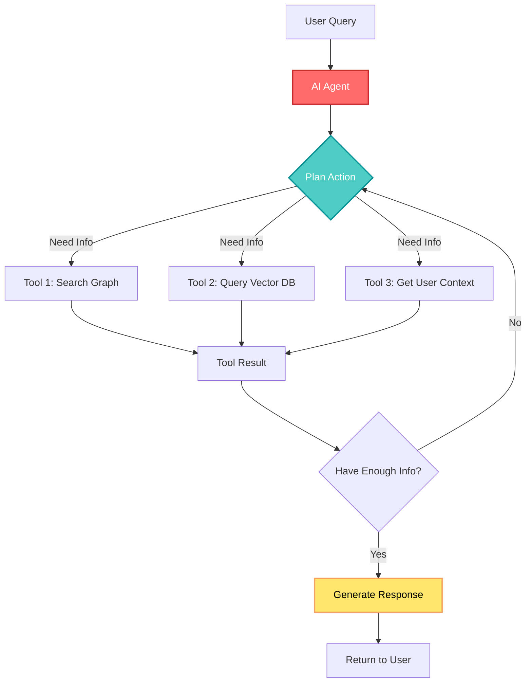
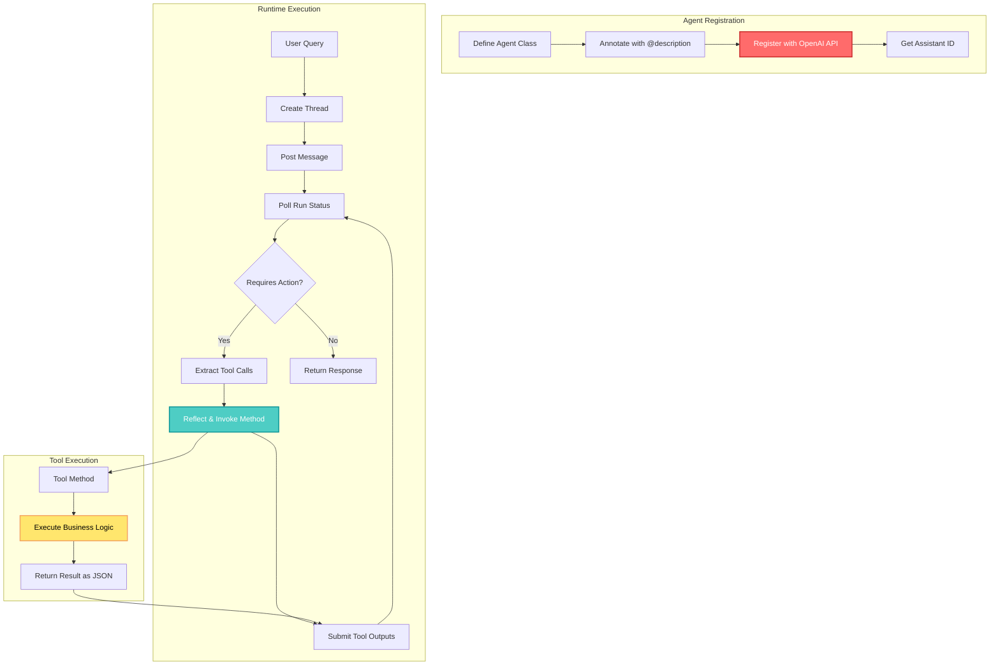
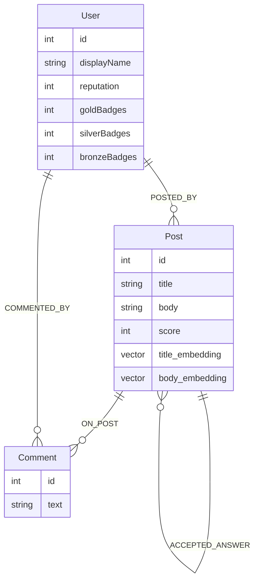
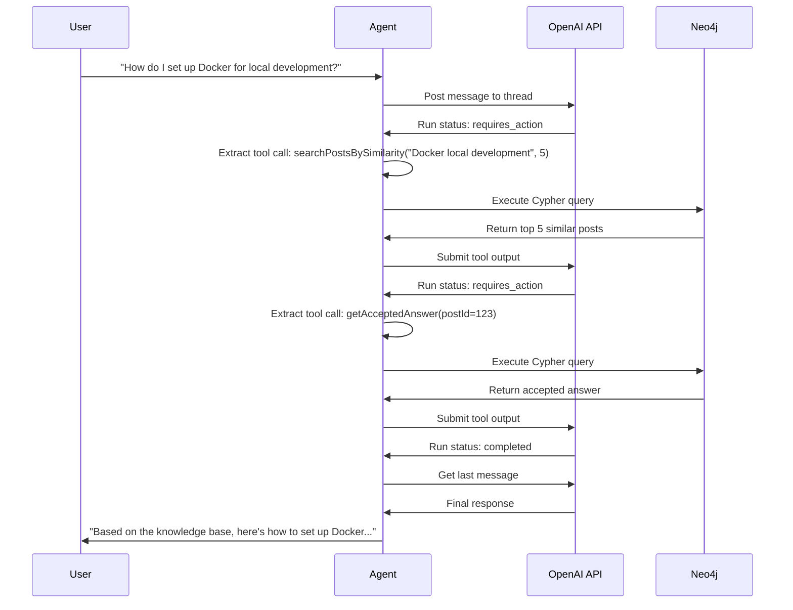

## 🤔 Curiosity: Can AI Agents Navigate Graphs Autonomously?

In my 8 years building AI-powered games, I've seen the evolution from simple rule-based systems to sophisticated LLM-powered assistants. But here's a question that's been nagging at me: **What if we could give AI agents the ability to explore graph databases on their own, deciding what information to retrieve based on the conversation context?**

Traditional GraphRAG works well when you know exactly how to traverse your graph. But what happens when the question could lead down multiple paths? What if the optimal traversal strategy depends on what the agent discovers along the way?

This is where **agentic GraphRAG** comes in. Instead of pre-determining the graph traversal, we give the LLM tools to explore the graph itself, letting it decide what to look at based on the question and previous discoveries.

> **Curiosity:** Can we build a lightweight, production-ready framework for agentic AI in Java that works seamlessly with Neo4j?
> {: .prompt-tip}

---

## 📚 Retrieve: Understanding Agentic AI and GraphRAG

### What is Agentic AI?

AI agents are LLM models configured for specific tasks and equipped with tools to perform those tasks. Think of it this way: if you ask ChatGPT to make you coffee, it understands the request semantically but can't actually do it. But if you give it a coffee machine interface and instructions, it can plan and execute the task.



### Traditional GraphRAG vs. Agentic GraphRAG

| Approach                 | How It Works                                                 | Pros                                        | Cons                                           | Best For                                      |
| :----------------------- | :----------------------------------------------------------- | :------------------------------------------ | :--------------------------------------------- | :-------------------------------------------- |
| **Traditional GraphRAG** | Pre-determine graph traversal, retrieve context, send to LLM | Fast, predictable, simple                   | Limited flexibility, requires domain knowledge | Known query patterns                          |
| **Agentic GraphRAG**     | Give LLM tools to explore graph, let it decide traversal     | Flexible, adaptive, handles complex queries | More complex, higher latency                   | Unknown query patterns, exploratory questions |

**Key Insight:** Traditional GraphRAG is like giving someone a map with a highlighted route. Agentic GraphRAG is like giving them the map and letting them choose the best path based on what they discover.

### The Challenge: Why Java?

Most agentic AI frameworks are built in Python (LangChain, LlamaIndex, Haystack). But what if your production stack is Java-based? What if you need to integrate with existing Java services?

The answer: **build a lightweight framework that demonstrates the core concepts** while being production-ready enough for real use cases.

---

## 💡 Innovation: Building an Agentic Framework in Java

### Architecture Overview

The framework consists of three main components:

1. **AbstractAgent** - Base class that handles OpenAI API communication
2. **@description annotation** - Metadata for agent registration and tool definitions
3. **Reflection-based tool invocation** - Automatic method discovery and execution



### Core Implementation

Here's how you define an agent with tools:

```java
@description("You are a calculator and should perform computational operations as asked by the user")
public class MyAgent extends AbstractAgent {
  public MyAgent() {
    super("sk-proj-.......", "asst_.......", 60000, false);
  }

  @description("Summarise two integer numbers")
  public int sum(
    @description("The first number to sum") int a,
    @description("The second number to sum") int b
  ) {
    return a + b;
  }

  @description("Multiply two integer numbers")
  public int mult(
    @description("The first number to multiply") int a,
    @description("The second number to multiply") int b
  ) {
    return a * b;
  }
}
```

**Key Design Decisions:**

1. **Reflection over interfaces** - Tools are regular Java methods, making the code more intuitive
2. **Annotation-based metadata** - `@description` provides all necessary information for OpenAI registration
3. **Automatic registration** - The framework generates OpenAI tool schemas from method signatures

### The Message Loop

The core agent execution loop follows this pattern:

```java
private String promptAgent(String threadId, String prompt) throws AgentException {
  try {
    postUserMessage(threadId, prompt);
    String runId = runAssistant(threadId);
    long startTime = System.currentTimeMillis();
    JsonObject runStatus;

    do {
      if (System.currentTimeMillis() - startTime > timeoutMs) {
        throw new TimeoutException("Timed out waiting for run to complete");
      }
      Thread.sleep(1500);
      runStatus = getRunStatus(threadId, runId);

      if ("requires_action".equals(runStatus.get("status").getAsString())) {
        JsonArray toolCalls = runStatus.getAsJsonObject("required_action")
            .getAsJsonObject("submit_tool_outputs")
            .getAsJsonArray("tool_calls");
        JsonArray toolOutputs = new JsonArray();

        for (JsonElement toolCallElem : toolCalls) {
          JsonObject toolCall = toolCallElem.getAsJsonObject();
          String functionName = toolCall.getAsJsonObject("function")
              .get("name").getAsString();
          JsonObject arguments = JsonParser
              .parseString(toolCall.getAsJsonObject("function")
                  .get("arguments").getAsString())
              .getAsJsonObject();

          // Use reflection to find and invoke the matching method
          Object toolResult = invokeTool(functionName, arguments);

          JsonObject output = new JsonObject();
          output.addProperty("tool_call_id", toolCall.get("id").getAsString());
          output.addProperty("output", GSON.toJson(toolResult));
          toolOutputs.add(output);
        }

        submitToolOutputs(threadId, runId, toolOutputs);
      }
    } while (!"completed".equals(runStatus.get("status").getAsString()));

    return getLastAssistantMessage(threadId);
  } catch (Throwable t) {
    throw new AgentException(t);
  }
}
```

---

## 🎮 Applying to Neo4j: Stack Overflow Knowledge Base

### The Use Case

Neo4j's development teams use Stack Overflow for Teams as a knowledge base. The challenge: **How can we build an agent that can intelligently explore this knowledge graph to answer questions?**

### Graph Schema



### Agent Tools for Graph Navigation

The agent needs tools to explore the graph in different ways:

```java
@description("You are a helpful assistant that answers questions about " +
             "development processes and tools based on a Stack Overflow knowledge base. " +
             "Use the available tools to explore the graph and find relevant information.")
public class StackOverflowAgent extends AbstractAgent {

  private final Driver neo4jDriver;

  @description("Search for posts by semantic similarity to a query string. " +
               "Returns the top K most similar posts with their titles and scores.")
  public List<PostResult> searchPostsBySimilarity(
    @description("The search query to find similar posts") String query,
    @description("Number of results to return (default 5)") int limit
  ) {
    // Vector similarity search using Neo4j
    try (Session session = neo4jDriver.session()) {
      String cypher = """
        WITH genai.vector.encode($query, "OpenAI", {token: $apiKey}) AS embedding
        CALL db.index.vector.queryNodes('post_embeddings', $limit, embedding)
        YIELD node AS post, score
        RETURN post.id AS id, post.title AS title, post.score AS score, score AS similarity
        ORDER BY similarity DESC
        """;

      return session.run(cypher,
        Map.of("query", query, "limit", limit, "apiKey", getApiKey()))
        .list(record -> new PostResult(
          record.get("id").asInt(),
          record.get("title").asString(),
          record.get("score").asInt(),
          record.get("similarity").asDouble()
        ));
    }
  }

  @description("Get a specific post by ID, including its body, score, and author information.")
  public PostDetail getPost(
    @description("The ID of the post to retrieve") int postId
  ) {
    try (Session session = neo4jDriver.session()) {
      String cypher = """
        MATCH (p:Post {id: $postId})
        OPTIONAL MATCH (p)-[:POSTED_BY]->(u:User)
        RETURN p.id AS id, p.title AS title, p.body AS body,
               p.score AS score, u.displayName AS author
        """;

      Record record = session.run(cypher, Map.of("postId", postId)).single();
      return new PostDetail(
        record.get("id").asInt(),
        record.get("title").asString(),
        record.get("body").asString(),
        record.get("score").asInt(),
        record.get("author").asString()
      );
    }
  }

  @description("Get all answers and comments for a specific post, ordered by score.")
  public List<AnswerResult> getAnswersForPost(
    @description("The ID of the question post") int questionId
  ) {
    try (Session session = neo4jDriver.session()) {
      String cypher = """
        MATCH (q:Post {id: $questionId})<-[:PARENT]-(a:Post)
        OPTIONAL MATCH (a)-[:POSTED_BY]->(u:User)
        OPTIONAL MATCH (a)<-[:ON_POST]-(c:Comment)
        WITH a, u, collect(c.text) AS comments
        ORDER BY a.score DESC
        RETURN a.id AS id, a.body AS body, a.score AS score,
               u.displayName AS author, comments
        """;

      return session.run(cypher, Map.of("questionId", questionId))
        .list(record -> new AnswerResult(
          record.get("id").asInt(),
          record.get("body").asString(),
          record.get("score").asInt(),
          record.get("author").asString(),
          record.get("comments").asList(Value::asString)
        ));
    }
  }

  @description("Get the accepted answer for a question, if one exists.")
  public AnswerResult getAcceptedAnswer(
    @description("The ID of the question post") int questionId
  ) {
    try (Session session = neo4jDriver.session()) {
      String cypher = """
        MATCH (q:Post {id: $questionId})-[:ACCEPTED_ANSWER]->(a:Post)
        OPTIONAL MATCH (a)-[:POSTED_BY]->(u:User)
        OPTIONAL MATCH (a)<-[:ON_POST]-(c:Comment)
        WITH a, u, collect(c.text) AS comments
        RETURN a.id AS id, a.body AS body, a.score AS score,
               u.displayName AS author, comments
        """;

      Record record = session.run(cypher, Map.of("questionId", questionId)).single();
      if (record == null) return null;

      return new AnswerResult(
        record.get("id").asInt(),
        record.get("body").asString(),
        record.get("score").asInt(),
        record.get("author").asString(),
        record.get("comments").asList(Value::asString)
      );
    }
  }

  @description("Find posts by a specific user, ordered by score.")
  public List<PostResult> getPostsByUser(
    @description("The display name of the user") String displayName,
    @description("Maximum number of results to return") int limit
  ) {
    try (Session session = neo4jDriver.session()) {
      String cypher = """
        MATCH (u:User {displayName: $displayName})<-[:POSTED_BY]-(p:Post)
        RETURN p.id AS id, p.title AS title, p.score AS score
        ORDER BY p.score DESC
        LIMIT $limit
        """;

      return session.run(cypher, Map.of("displayName", displayName, "limit", limit))
        .list(record -> new PostResult(
          record.get("id").asInt(),
          record.get("title").asString(),
          record.get("score").asInt(),
          0.0
        ));
    }
  }
}
```

### How the Agent Works



### Advantages Over Traditional GraphRAG

| Feature               | Traditional GraphRAG         | Agentic GraphRAG                    |
| :-------------------- | :--------------------------- | :---------------------------------- |
| **Query Flexibility** | Fixed traversal pattern      | Adaptive based on question          |
| **Context Awareness** | Single retrieval pass        | Multi-step exploration              |
| **Answer Quality**    | Depends on initial retrieval | Can refine search based on findings |
| **Use of Metadata**   | Hard to incorporate          | Can query by score, author, etc.    |
| **Complex Queries**   | Limited                      | Can combine multiple tools          |

**Example:** A user asks "What did John recommend about Docker setup?"

- **Traditional GraphRAG:** Would need to know to search for "Docker" AND filter by author "John" in a single query
- **Agentic GraphRAG:** Can first search for "Docker setup", then filter results by author, or search for John's posts first, then filter by topic

---

## 🚀 Production Considerations

### Performance Metrics

| Metric                  | Value                         | Notes                            |
| :---------------------- | :---------------------------- | :------------------------------- |
| **Average Latency**     | 3-5 seconds                   | Depends on number of tool calls  |
| **Tool Call Overhead**  | ~200ms per call               | Neo4j query + JSON serialization |
| **Concurrent Requests** | Limited by OpenAI rate limits | Consider queuing for production  |
| **Cost per Query**      | ~$0.01-0.03                   | Depends on model and token usage |

### Error Handling

```java
public class AgentException extends Exception {
  public AgentException(String message) {
    super(message);
  }

  public AgentException(Throwable cause) {
    super(cause);
  }
}

// In tool methods, wrap Neo4j exceptions
@description("...")
public List<PostResult> searchPostsBySimilarity(String query, int limit) {
  try (Session session = neo4jDriver.session()) {
    // ... implementation
  } catch (Exception e) {
    throw new AgentException("Failed to search posts: " + e.getMessage(), e);
  }
}
```

### Best Practices

1. **Timeout Management** - Set reasonable timeouts (60s default) to prevent hanging
2. **Tool Result Formatting** - Return structured data that's easy for the LLM to interpret
3. **Debug Mode** - Enable debug output during development to see tool calls
4. **Caching** - Consider caching frequent queries to reduce latency and cost
5. **Rate Limiting** - Implement rate limiting to respect OpenAI API limits

---

## 🎯 Key Takeaways

| Insight                                           | Implication                                 | Next Steps                                  |
| :------------------------------------------------ | :------------------------------------------ | :------------------------------------------ |
| **Agentic AI enables adaptive graph exploration** | More flexible than traditional GraphRAG     | Experiment with different tool combinations |
| **Java framework is feasible**                    | Can integrate with existing Java stacks     | Consider extending for other LLM providers  |
| **Reflection-based tool discovery**               | Cleaner API than interface-based approaches | Add validation for tool signatures          |
| **Multi-step reasoning improves answers**         | Agent can refine search based on findings   | Monitor tool call patterns for optimization |

### When to Use Agentic GraphRAG

✅ **Good fit:**

- Complex queries requiring multiple steps
- Unknown query patterns
- Need to incorporate multiple data sources
- Exploratory question-answering

❌ **Consider alternatives:**

- Simple, well-defined queries
- Strict latency requirements (<1s)
- High-volume, repetitive queries
- Limited graph complexity

---

## 🤔 New Questions This Raises

1. **Can we optimize tool call patterns?** What if we could learn which tool sequences work best for different question types?
2. **How do we handle graph updates?** What happens when new data is added while the agent is exploring?
3. **Multi-agent collaboration:** Could multiple agents work together to explore different parts of a large graph?
4. **Cost optimization:** Can we reduce token usage by smarter tool result formatting or caching strategies?

**Next experiment:** Build a tool that learns optimal traversal patterns from successful query sessions, creating a hybrid approach that combines learned patterns with agentic exploration.

---

## References

**Original Blog Post:**

- [Agentic AI With Java and Neo4j - Neo4j Blog](https://neo4j.com/blog/developer/agentic-ai-with-java-and-neo4j/)

**Code & Implementation:**

- [GitHub Repository - Java Agentic AI Framework](https://github.com/neo4j/neo4j-java-agentic-ai) (referenced in original post)

**Neo4j Resources:**

- [Neo4j Java Driver Documentation](https://neo4j.com/docs/java-manual/current/)
- [Neo4j Vector Search](https://neo4j.com/docs/cypher-manual/current/indexes-for-vector-search/)
- [Neo4j GenAI Functions](https://neo4j.com/docs/cypher-manual/current/functions/genai/)

**Agentic AI Frameworks:**

- [OpenAI Assistants API](https://platform.openai.com/docs/assistants/overview)
- [LangChain Agents](https://python.langchain.com/docs/modules/agents/)
- [LlamaIndex Agents](https://docs.llamaindex.ai/en/stable/module_guides/deploying/agents/)
- [Embabel Java/Kotlin Agent Library](https://github.com/embabel/embabel) (mentioned in original post)

**GraphRAG Resources:**

- [GraphRAG: Unlocking LLM discovery on narrative private data - Microsoft Research](https://www.microsoft.com/en-us/research/blog/graphrag-unlocking-llm-discovery-on-narrative-private-data/)
- [Neo4j GraphRAG Documentation](https://neo4j.com/docs/graphrag/)

**Research Papers:**

- [ReAct: Synergizing Reasoning and Acting in Language Models](https://arxiv.org/abs/2210.03629)
- [Retrieval-Augmented Generation for Knowledge-Intensive NLP Tasks](https://arxiv.org/abs/2005.11401)

**Production Best Practices:**

- [OpenAI API Best Practices](https://platform.openai.com/docs/guides/production-best-practices)
- [Building Production LLM Applications](https://huyenchip.com/2023/04/11/llm-engineering.html)
