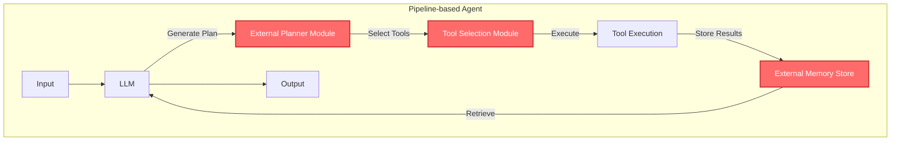
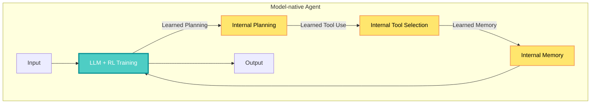

## 🤔 Curiosity: What If AI Agents Could Learn Intelligence Instead of Being Programmed?

What if instead of orchestrating planning, tool use, and memory through external logic and pipelines, these capabilities could be internalized within the model's parameters? What if agents could learn to reason, act, and remember through experience rather than following pre-scripted rules?

{: .light .w-75 .shadow .rounded-10 w='800' h='400' }

> **Curiosity:** We've built AI agents by connecting LLMs to external modules for planning, tool use, and memory. But what if the model itself could learn these capabilities end-to-end? How would that change the nature of agentic AI?
{: .prompt-tip}

The rapid evolution of agentic AI marks a new phase in artificial intelligence, where Large Language Models (LLMs) no longer merely respond but **act, reason, and adapt**. A recent comprehensive survey traces a fundamental paradigm shift: from **Pipeline-based** systems, where planning, tool use, and memory are orchestrated by external logic, to the emerging **Model-native** paradigm, where these capabilities are internalized within the model's parameters.

**The question:** How is this paradigm shift happening? What enables models to learn agentic capabilities rather than having them programmed? And what does this mean for the future of AI agents?

As someone who's built both pipeline-based and learning-based AI systems, this shift represents something profound: we're moving from **constructing systems that apply intelligence** to **developing models that grow intelligence through experience**.

---

## 📚 Retrieve: Understanding the Paradigm Shift

### Pipeline-based vs. Model-native: The Fundamental Difference

**Pipeline-based Paradigm:**

In traditional agentic AI systems, capabilities are **externally orchestrated**:



**Characteristics:**
- Planning logic is **scripted** (e.g., PDDL, MCTS, Tree of Thoughts)
- Tool use is **explicitly called** via function calling APIs
- Memory is **external** (vector databases, key-value stores)
- Components are **modular** and **interpretable**
- Requires **engineering** to connect components

**Model-native Paradigm:**

In model-native systems, capabilities are **learned end-to-end**:



**Characteristics:**
- Planning is **learned** through reinforcement learning
- Tool use is **internalized** within model parameters
- Memory is **encoded** in model weights and activations
- Capabilities emerge from **training**, not engineering
- More **unified** but less interpretable

### The Role of Reinforcement Learning

**RL as the Algorithmic Engine:**

The survey positions **Reinforcement Learning (RL)** as the key enabler of this paradigm shift. By reframing learning from **imitating static data** to **outcome-driven exploration**, RL underpins a unified solution of *LLM + RL + Task* across language, vision, and embodied domains.

**Why RL Matters:**

| Aspect | Supervised Learning | Reinforcement Learning |
|:-------|:-------------------|:----------------------|
| **Learning Signal** | Static examples | Outcome-driven feedback |
| **Exploration** | Limited to training data | Can explore new strategies |
| **Adaptation** | Fixed behavior | Learns from trial and error |
| **Capability** | Pattern matching | Strategic decision-making |

**The RL Framework for Agentic AI:**

```python
# Conceptual RL framework for agentic AI
class AgenticRL:
    """
    Curiosity: How does RL enable model-native capabilities?
    Retrieve: RL reframes learning from imitation to outcome-driven exploration
    Innovation: Unified LLM + RL + Task framework for agentic AI
    """
    
    def __init__(self, llm, task_env):
        self.llm = llm
        self.task_env = task_env
        self.reward_model = RewardModel()
    
    def train(self, episodes=1000):
        """
        Train agent through RL to learn planning, tool use, memory
        """
        for episode in range(episodes):
            # Agent generates actions (planning, tool use, memory access)
            trajectory = self.generate_trajectory()
            
            # Evaluate outcome
            reward = self.reward_model.evaluate(trajectory)
            
            # Update model based on outcome
            self.llm.update_with_reward(trajectory, reward)
    
    def generate_trajectory(self):
        """
        Agent generates sequence of actions
        - Planning: Internal reasoning steps
        - Tool use: Learned tool selection
        - Memory: Learned memory access
        """
        state = self.task_env.reset()
        trajectory = []
        
        while not self.task_env.done():
            # Model generates action (learned, not scripted)
            action = self.llm.act(state)
            trajectory.append(action)
            
            # Execute in environment
            state, reward, done = self.task_env.step(action)
        
        return trajectory
```

---

## 💡 Innovation: Evolution of Core Capabilities

### 1. Planning: From Scripted to Learned

**Pipeline-based Planning:**

Early approaches used **external planning modules**:

- **STRIPS (1971):** Classical planning with preconditions and effects
- **PDDL (1998):** Planning Domain Definition Language
- **LLM+P (2023):** LLMs generate PDDL, external planner solves
- **Tree of Thoughts (2023):** External tree search over LLM outputs
- **MCTS + LLM (2024):** Monte Carlo Tree Search orchestrates planning

**Example: Tree of Thoughts (Pipeline-based)**

```python
# Pipeline-based: External tree search
class TreeOfThoughts:
    def solve(self, problem):
        # LLM generates candidate thoughts
        thoughts = self.llm.generate_thoughts(problem)
        
        # External module evaluates and expands
        tree = self.build_tree(thoughts)
        
        # External search algorithm finds best path
        solution = self.search(tree)
        
        return solution
```

**Model-native Planning:**

Recent approaches **learn planning** through RL:

- **OpenAI o1 (2024):** Learned reasoning through process supervision
- **DeepSeek R1 (2025):** RL-based reasoning capability
- **ReST-MCTS* (2024):** Self-training via process reward
- **QwQ-32B (2025):** Reinforcement learning for reasoning

**Example: o1-style Model-native Planning**

```python
# Model-native: Learned planning
class ModelNativePlanner:
    def __init__(self, model):
        # Model has learned planning internally
        self.model = model  # Trained with RL on planning tasks
    
    def solve(self, problem):
        # Model internally reasons/plans
        # No external planner needed
        solution = self.model.reason(problem)
        return solution
```

**Key Papers in Model-native Planning:**

| Model | Key Innovation | RL Approach |
|:------|:---------------|:------------|
| **OpenAI o1** | Process supervision for reasoning | Process reward model |
| **DeepSeek R1** | Large-scale RL for reasoning | Process + outcome rewards |
| **QwQ-32B** | Open-source reasoning model | Reinforcement learning |
| **L1** | Controlling reasoning length | RL with length control |
| **DeepScaleR** | Scaling RL to 1.5B model | Efficient RL training |

### 2. Tool Use: From Function Calling to Learned Integration

**Pipeline-based Tool Use:**

Traditional approaches use **explicit function calling**:

- **ReAct (2022):** LLM generates "Action: tool_name(args)"
- **AutoGen (2023):** Multi-agent conversation with tool calls
- **SWE-agent (2024):** Agent-computer interfaces for software engineering
- **Tool calling APIs:** OpenAI Functions, Anthropic Tools

**Example: Pipeline-based Tool Use**

```python
# Pipeline-based: Explicit tool calling
class PipelineToolAgent:
    def act(self, task):
        # LLM generates tool call as text
        response = self.llm.generate(f"Task: {task}")
        
        # External parser extracts tool call
        tool_call = self.parse_tool_call(response)
        # e.g., "Action: search(query='python tutorial')"
        
        # External executor runs tool
        result = self.tool_executor.execute(tool_call)
        
        # LLM processes result
        return self.llm.generate(f"Result: {result}")
```

**Model-native Tool Use:**

Recent approaches **learn tool use** through RL:

- **ReTool (2025):** Reinforcement learning for strategic tool use
- **ToolRL (2025):** RL for tool-use in reasoning models
- **ToRL (2025):** Tool-integrated reinforcement learning
- **R1-Searcher (2025):** RL for search capability

**Example: Model-native Tool Use**

```python
# Model-native: Learned tool use
class ModelNativeToolAgent:
    def __init__(self, model):
        # Model learned when/how to use tools
        self.model = model  # Trained with RL on tool-using tasks
    
    def act(self, task):
        # Model internally decides tool use
        # No explicit function calling needed
        result = self.model.act_with_tools(task)
        return result
```

**Key Papers in Model-native Tool Use:**

| Model | Key Innovation | Application |
|:------|:---------------|:------------|
| **ReTool** | Strategic tool use via RL | General tool use |
| **R1-Searcher** | Search capability via RL | Information retrieval |
| **DeepResearcher** | Deep research via RL | Long-horizon research |
| **Tool-N1** | General tool-use training | Multi-tool scenarios |
| **Agent Lightning** | Universal agent training | Any agent task |

### 3. Memory: From External Stores to Internal Representations

**Pipeline-based Memory:**

Traditional approaches use **external memory systems**:

- **Vector Databases:** Pinecone, Weaviate, Chroma
- **Key-Value Stores:** Redis, Memcached
- **RAG Systems:** Retrieval-augmented generation
- **MemGPT (2023):** External memory management system

**Example: Pipeline-based Memory**

```python
# Pipeline-based: External memory
class PipelineMemoryAgent:
    def __init__(self):
        self.llm = LLM()
        self.memory_db = VectorDB()  # External
    
    def remember(self, information):
        # Store in external database
        self.memory_db.store(information)
    
    def recall(self, query):
        # Retrieve from external database
        relevant = self.memory_db.search(query)
        
        # LLM uses retrieved context
        return self.llm.generate(context=relevant)
```

**Model-native Memory:**

Recent approaches **learn memory** within the model:

- **Long Context Models:** Qwen2.5-1M, UltraLLaDA (128K context)
- **FlashAttention:** Efficient attention for long sequences
- **A-Mem (2025):** Agentic memory for LLM agents
- **Memory-R1 (2025):** RL for memory management

**Example: Model-native Memory**

```python
# Model-native: Learned memory
class ModelNativeMemoryAgent:
    def __init__(self, model):
        # Model has learned memory internally
        self.model = model  # Trained with long context + RL
    
    def remember(self, information):
        # Memory encoded in model activations
        self.model.update_memory(information)
    
    def recall(self, query):
        # Model internally retrieves from learned memory
        return self.model.recall_and_generate(query)
```

**Key Papers in Model-native Memory:**

| Model | Key Innovation | Context Length |
|:------|:---------------|:---------------|
| **Qwen2.5-1M** | 1M token context | 1,000,000 tokens |
| **UltraLLaDA** | 128K context | 128,000 tokens |
| **FlashAttention** | Efficient attention | Unlimited (theoretically) |
| **A-Mem** | Agentic memory | Learned memory access |
| **Memory-R1** | RL for memory | Adaptive memory use |

---

## 🎯 Applications: Deep Research and GUI Agents

### Deep Research Agent

**The Challenge:**

Deep research requires **long-horizon reasoning** across multiple steps:
1. Formulate research questions
2. Search for information
3. Synthesize findings
4. Generate comprehensive reports

**Pipeline-based Approach:**

- **Query rewriting:** External modules rewrite queries
- **RAG systems:** External retrieval augments generation
- **Multi-step pipelines:** Orchestrate search → synthesis → writing

**Model-native Approach:**

- **DeepResearcher (2025):** RL-trained for deep research
- **WebThinker (2025):** Deep research capability via RL
- **R1-Searcher (2025):** Learned search capability

**Key Innovation:**

Models learn to **strategically search** and **synthesize information** through RL, rather than following scripted research workflows.

### GUI Agent

**The Challenge:**

GUI agents need **embodied interaction** with visual interfaces:
1. Understand screen content
2. Plan actions
3. Execute interactions
4. Adapt to feedback

**Pipeline-based Approach:**

- **Vision-language models** + **action executors**
- **External planning** for action sequences
- **Template-based** interaction patterns

**Model-native Approach:**

- **VTool-R1 (2025):** RL for multimodal tool use
- **DeepEyes (2025):** "Thinking with images" via RL
- **WebSynthesis (2025):** World-model-guided MCTS

**Key Innovation:**

Models learn to **reason about visual interfaces** and **plan interactions** through RL, enabling more adaptive GUI agents.

---

## 🔮 Future Directions: Emerging Model-native Capabilities

### Multi-agent Collaboration

**Current State (Pipeline-based):**

- **AutoGen (2023):** Orchestrates multiple agents via conversation
- **CrewAI:** Framework for multi-agent systems
- **External coordination** logic

**Emerging (Model-native):**

- **G-MEM (2024):** Hierarchical memory for multi-agent systems
- **Intrinsic Memory Agents (2025):** Structured contextual memory
- **RCR-Router (2025):** Role-aware context routing

**Vision:**

Models learn to **collaborate** and **coordinate** with other agents through RL, rather than following scripted protocols.

### Reflection

**Current State (Pipeline-based):**

- **Reflexion (2023):** External reflection module
- **CRITIC (2023):** Self-correction with tool-interactive critiquing
- **Scripted** reflection loops

**Emerging (Model-native):**

- **Self-RAG (2023):** Learned retrieval, generation, critique
- **RAGEN (2025):** Self-evolution via multi-turn RL
- **Memory-R1 (2025):** RL for memory and reflection

**Vision:**

Models learn to **reflect on their own outputs** and **self-improve** through RL, enabling continuous learning.

---

## 📊 Key Takeaways

| Insight | Implication | Evidence |
|:--------|:------------|:---------|
| **RL enables paradigm shift** | Outcome-driven learning > imitation learning | o1, R1, QwQ models |
| **Capabilities can be internalized** | Less external orchestration needed | Model-native planning, tool use, memory |
| **Unified framework emerges** | LLM + RL + Task works across domains | Language, vision, embodied |
| **Performance improves** | Learned > scripted for complex tasks | Deep research, GUI agents |
| **Interpretability decreases** | Trade-off for learned capabilities | Less modular, more black-box |

### Why This Matters

As someone who's built both pipeline-based and learning-based systems, here's what excites me:

1. **Less Engineering, More Learning:** Instead of orchestrating components, we train models to learn capabilities
2. **Better Performance:** Learned capabilities often outperform scripted ones for complex tasks
3. **Unified Framework:** LLM + RL + Task works across language, vision, and embodied domains
4. **Continuous Improvement:** Models can improve through experience, not just retraining
5. **Emergent Capabilities:** New behaviors emerge from training that weren't explicitly programmed

**The Trade-offs:**

- **Interpretability:** Less modular, harder to debug
- **Control:** Less explicit control over agent behavior
- **Training Cost:** RL training is expensive
- **Data Requirements:** Need task environments for RL

---

## 🤔 New Questions This Raises

1. **How do we balance learned vs. scripted?** When should capabilities be learned vs. explicitly programmed?

2. **What's the role of external tools?** As models learn tool use, do we still need external tool APIs?

3. **How do we ensure safety?** Learned behaviors are harder to verify and control—how do we ensure agents behave safely?

4. **What about interpretability?** How do we understand and debug model-native agents?

5. **Scaling RL training:** How do we make RL training more efficient and scalable?

6. **Hybrid approaches:** Can we combine pipeline-based and model-native approaches for best of both worlds?

**Next Steps:** Explore specific model-native implementations, understand RL training methodologies, and experiment with building model-native agents.

---

## References

**Survey Paper:**
- [Beyond Pipelines: A Survey of the Paradigm Shift toward Model-Native Agentic AI (Sang et al., 2025)](https://arxiv.org/pdf/2510.16720v2)
- [GitHub Repository: model-native-agentic-ai](https://github.com/ADaM-BJTU/model-native-agentic-ai)

**Model-native Planning:**
- [OpenAI o1: Learning to reason with LLMs](https://openai.com/index/learning-to-reason-with-llms/)
- [DeepSeek-R1: Incentivizing Reasoning Capability in LLMs via Reinforcement Learning](https://arxiv.org/abs/2501.12948)
- [QwQ-32B: Embracing the Power of Reinforcement Learning](https://qwenlm.github.io/blog/qwq-32b/)
- [ReST-MCTS*: LLM Self-Training via Process Reward Guided Tree Search](https://arxiv.org/abs/2406.03816)

**Model-native Tool Use:**
- [ReTool: Reinforcement Learning for Strategic Tool Use in LLMs](https://arxiv.org/abs/2504.11536)
- [R1-Searcher: Incentivizing the search capability in llms via reinforcement learning](https://arxiv.org/abs/2503.05592)
- [DeepResearcher: Scaling Deep Research via Reinforcement Learning](https://arxiv.org/abs/2504.03160)
- [Tool-N1: Training General Tool-Use in Large Reasoning Models](https://arxiv.org/abs/2505.00024)

**Model-native Memory:**
- [Qwen2.5-1M Collection](https://huggingface.co/collections/Qwen/qwen25-1m-679325716327ec07860530ba)
- [UltraLLaDA: Scaling the Context Length to 128K](https://arxiv.org/abs/2510.10481)
- [A-Mem: Agentic Memory for LLM Agents](https://arxiv.org/abs/2502.12110)
- [Memory-R1: Enhancing Large Language Model Agents to Manage and Utilize Memories via Reinforcement Learning](https://arxiv.org/abs/2508.19828)

**Reinforcement Learning for LLMs:**
- [Reinforcement Learning from Human Feedback (RLHF)](https://arxiv.org/abs/1706.03741)
- [Process Supervision vs. Outcome Supervision](https://openai.com/research/improving-mathematical-reasoning-with-process-supervision)
- [PPO for Language Models](https://openai.com/research/learning-from-human-preferences)

**Pipeline-based Approaches (For Comparison):**
- [ReAct: Synergizing Reasoning and Acting in Language Models](https://arxiv.org/abs/2210.03629)
- [AutoGen: Enabling Next-Gen LLM Applications via Multi-Agent Conversation](https://arxiv.org/abs/2308.08155)
- [Tree of Thoughts: Deliberate Problem Solving with Large Language Models](https://arxiv.org/abs/2305.10601)
- [MemGPT: Towards LLMs as Operating Systems](https://arxiv.org/abs/2310.08560)

**Applications:**
- [DeepResearcher: Scaling Deep Research via Reinforcement Learning](https://arxiv.org/abs/2504.03160)
- [WebThinker: Empowering large reasoning models with deep research capability](https://arxiv.org/abs/2504.21776)
- [VTool-R1: VLMs Learn to Think with Images via Reinforcement Learning](https://arxiv.org/abs/2505.19255)
- [DeepEyes: Incentivizing "Thinking with Images" via Reinforcement Learning](https://arxiv.org/abs/2505.14362)

**Future Directions:**
- [G-MEM: Tracing Hierarchical Memory for Multi-Agent Systems](https://www.researchgate.net/publication/392531451)
- [Intrinsic Memory Agents: Heterogeneous Multi-Agent LLM Systems](https://arxiv.org/abs/2508.08997)
- [Self-RAG: Learning to Retrieve, Generate, and Critique through Self-Reflection](https://arxiv.org/abs/2310.11511)
- [RAGEN: Understanding Self-Evolution in LLM Agents via Multi-Turn Reinforcement Learning](https://arxiv.org/abs/2504.20073)

**Implementation Resources:**
- [DeepSeek-R1 GitHub](https://github.com/deepseek-ai/DeepSeek-R1)
- [OpenR1: Open reproduction of DeepSeek-R1](https://github.com/huggingface/open-r1)
- [ReTool GitHub](https://github.com/ReTool-RL/ReTool)
- [R1-Searcher GitHub](https://github.com/RUCAIBox/R1-Searcher)

**Related Surveys:**
- [A Survey of Large Language Models (Zhao et al., 2023)](https://arxiv.org/abs/2303.18223)
- [LLM Agents: A Survey (Wang et al., 2024)](https://arxiv.org/abs/2409.07802)
- [Reinforcement Learning for Large Language Models: A Survey (Yuan et al., 2024)](https://arxiv.org/abs/2408.11546)
