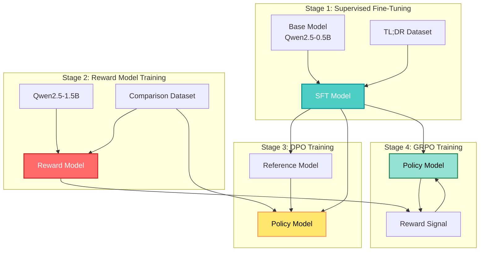

## 🤔 Curiosity: Can We Train RLHF on a Single GPU Node?

What if you could reproduce the entire RLHF pipeline—from supervised fine-tuning to reward modeling to policy optimization—on a single DGX Spark? What if you could train models that learn to summarize from human feedback without needing an 8-H100 cluster?

{: .light .w-75 .shadow .rounded-10 w='1200' h='800' }

> **Curiosity:** RLHF typically requires massive compute resources. But what if we could scale it down to a single node while maintaining the core learning principles? How would that change accessibility to RLHF?
{: .prompt-tip}

Reinforcement Learning from Human Feedback (RLHF) has become the standard approach for aligning language models with human preferences. However, most implementations require significant computational resources—often 8+ H100 GPUs. This repository demonstrates how to reproduce the complete RLHF pipeline on a **single DGX Spark**, making RLHF more accessible.

**The question:** How do we implement the full RLHF pipeline—SFT, reward modeling, DPO, and GRPO—on limited hardware? What are the key implementation details that make this possible?

As someone who's trained RLHF systems, I know the challenges of scaling down while maintaining training quality. This implementation provides valuable insights into making RLHF more accessible.

---

## 📚 Retrieve: Understanding the RLHF Pipeline

### The Complete Pipeline

RLHF consists of four main stages:



**Key Insight:** Each stage builds on the previous one, creating a pipeline that progressively aligns the model with human preferences.

### Implementation Details

This implementation is based on:
- [Learning to summarize from human feedback (OpenAI, 2020)](https://arxiv.org/abs/2009.01325)
- [The N+ Implementation Details of RLHF with PPO (2024)](https://arxiv.org/abs/2403.17031)
- [verl](https://github.com/volcengine/verl) framework

**Hardware Requirements:**
- Single DGX Spark (or equivalent single-node GPU setup)
- Docker for containerization
- Hugging Face token for model access

---

## 💡 Innovation: Stage-by-Stage Implementation

### Stage 1: Supervised Fine-Tuning (SFT)

**Goal:** Train a base model to generate summaries in the desired format.

**Base Model:** [Qwen/Qwen2.5-0.5B](https://huggingface.co/Qwen/Qwen2.5-0.5B)

**Dataset:** [summarize_from_feedback_tldr_3_filtered](https://huggingface.co/datasets/vwxyzjn/summarize_from_feedback_tldr_3_filtered)

**Key Preprocessing:**
- Add prepending whitespace and trailing `<|endoftext|>` token to reference summaries
- Maximum response length: **63 tokens**

**Training Configuration:**

| Parameter | Value |
|:----------|:------|
| `num_train_epochs` | 1 (116,722 episodes) |
| `batch_size` | 16 |
| `gradient_accumulation_steps` | 8 |
| **Effective batch size** | **128** |
| `learning_rate` | 3e-06 |
| `min_learning_rate` | 3e-07 |
| `warmup_steps` | 10 |
| `lr_decay_steps` | 800 |
| `grad_clip` | 1 |
| `use_eight_bit_optimizer` | true |

{: .light .w-75 .shadow .rounded-10 w='1200' h='800' }

**Results:**

The SFT model produces much more coherent summaries than the base model:

| Input | Base Model | SFT Model |
|:------|:-----------|:----------|
| Reddit post about relationship | "Is it okay to ask if everything is okay or am I being pushy?" | "Guy I'm dating hasn't been texting me in a month and I asked if everything was okay and he said yes. Am I being pushy or too clingy asking if everything is okay?" |

**Implementation Steps:**

```bash
# 1. Build Docker container
sudo docker build --build-arg HF_TOKEN=$HF_TOKEN -t summary_from_human_feedback .

# 2. Run container
sudo sh launch_docker.sh

# 3. Process SFT dataset
python3 -m dgx_spark_summary_from_human_feedback.process_sft_dataset

# 4. Train SFT model
python sft.py
```

### Stage 2: Reward Model Training

**Goal:** Train a model to predict which summary is better (chosen vs. rejected).

**Dataset:** [openai/summarize_from_feedback](https://huggingface.co/datasets/openai/summarize_from_feedback)

**Key Finding:** Using the SFT model to initialize the reward model didn't work well (likely due to 0.5B model size). Better results with:
- **Qwen2.5-0.5B**: Baseline performance
- **Qwen2.5-1.5B**: Better training and validation performance ✅

{: .light .w-75 .shadow .rounded-10 w='1200' h='800' }

**Training Configuration (Qwen2.5-1.5B):**

| Parameter | Value |
|:----------|:------|
| `batch_size` | 8 |
| `gradient_accumulation_steps` | 16 |
| `learning_rate` | 0.00005 |
| `warmup_ratio` | 0.03 |
| `num_train_epochs` | 1 |
| `grad_clip` | 1 |
| `use_eight_bit_optimizer` | true |

**Reward Normalization:**

Following best practices, compute average reward on SFT dataset and normalize reward model output:

```python
# Normalize reward by subtracting mean reward on SFT dataset
normalized_reward = reward_model_output - mean_sft_reward
```

**Upload to Hugging Face:**

```bash
python3 -m dgx_spark_summary_from_human_feedback.load_local_reward_model_and_push_to_hf \
    --model_path /path/to/checkpoint \
    --push_to_hf \
    --hf_repo_id seangogo/Qwen2.5-1.5B_reward_model_v2
```

### Stage 3: DPO Training

**Goal:** Align the model with human preferences without a reward model.

**Key Innovation:** DPO (Direct Preference Optimization) eliminates the need for a separate reward model by directly optimizing on preference pairs.

**DPO Loss Function:**

$$\mathcal{L}_{\text{DPO}}(\pi_\theta) = -\mathbb{E}_{(x, y_c, y_r) \sim \mathcal{D}_{\text{PREF}}} \left[ \log \sigma \left( \beta \log \frac{\pi_\theta(y_c | x)}{\pi^{\text{SFT}}(y_c | x)} - \beta \log \frac{\pi_\theta(y_r | x)}{\pi^{\text{SFT}}(y_r | x)} \right) \right]$$

Where:
- $\pi_\theta$: Current policy model
- $\pi^{\text{SFT}}$: SFT reference model
- $(x, y_c, y_r)$: Prompt, chosen response, rejected response
- $\beta$: Hyperparameter controlling confidence in comparison data

**Training Configuration:**

| Parameter | Value |
|:----------|:------|
| `batch_size` | 8 |
| `gradient_accumulation_steps` | 16 |
| `learning_rate` | 0.00005 |
| `beta` | 0.1 |
| `label_smoothing` | 0.1 |
| `num_train_epochs` | 1 |

{: .light .w-75 .shadow .rounded-10 w='1200' h='800' }

**Results:**

DPO produces more detailed summaries compared to SFT:

| Model | Summary Quality |
|:------|:----------------|
| **Base** | Repetitive, low quality |
| **SFT** | Coherent but basic |
| **DPO** | More detailed, better captures context |

**Training Command:**

```bash
python3 dpo.py \
    --output_dir dpo_output \
    --sft_model_path <local_or_hf_path_to_sft_model>
```

### Stage 4: GRPO Training

**Goal:** Optimize the policy using reinforcement learning with the reward model.

**GRPO (Group Relative Policy Optimization)** is a variant of PPO optimized for language model training.

**Key Implementation Details:**

**1. Generation Configuration:**

```python
generation_config = GenerationConfig(
    max_new_tokens=63,  # response_length
    temperature=0.7 + 1e-7,
    top_k=0,
    top_p=1.0,
    do_sample=True,
    eos_token_id=tokenizer.eos_token_id,  # Must be explicit!
    pad_token_id=tokenizer.pad_token_id,
)
```

**Critical Notes:**
- **EOS token must be explicitly set** - default is `None`, causing generation to continue until `max_new_tokens`
- **No `min_new_tokens`** - setting it equal to `max_new_tokens` prevents EOS generation
- **Left padding** for prompts to ensure consistent prompt lengths

**2. Optimization Process:**

Multiple epochs of mini-batch gradient updates:
1. Split rollout data into mini-batches
2. Further split mini-batches into micro-batches for gradient accumulation
3. Update policy weights after processing all micro-batches

**Total weight update steps:**

$$\frac{\text{num\_epochs} \times \text{total\_samples} \times \text{num\_responses\_per\_prompt}}{\text{batch\_size} \times \text{mini\_batch\_size}}$$

**3. Loss Functions:**

**Vanilla PPO Loss:**
- Bounded when advantage is positive
- **Unbounded when advantage is negative** (problem!)

{: .light .w-75 .shadow .rounded-10 w='1200' h='800' }

**Dual Clip Loss:**
- Clips loss when advantage is negative and ratio > `c`
- Stabilizes training by bounding negative advantage cases

{: .light .w-75 .shadow .rounded-10 w='1200' h='800' }

**Training Configuration:**

| Category | Hyperparameter | Value |
|:---------|:---------------|:------|
| **Training** | `num_train_epochs` | 1 |
| | `learning_rate` | 5e-5 |
| | `warmup_ratio` | 0.03 |
| | `grad_clip` | 1.0 |
| **Batch Sizes** | `batch_size` | 16 |
| | `mini_batch_size` | 64 |
| | `micro_batch_size` | 8 |
| | `num_responses_per_group` | 8 |
| **GRPO** | `update_per_rollout` | 4 |
| | `clip_ratio` | 0.2 |
| | `kl_coeff` | 0.05 |
| | `kl_penalty_mode` | "k3" |
| | `normalize_adv_by_std_of_group` | true |
| | `no_eos_penalty` | -1.0 |
| **Generation** | `response_length` | 63 |
| | `temperature` | 0.7 |

{: .light .w-75 .shadow .rounded-10 w='1200' h='800' }

**Results Comparison:**

| Model | Summary |
|:------|:--------|
| **Base** | "Is it okay to ask if everything is okay or am I being pushy?" |
| **SFT** | "Guy I'm dating hasn't been texting me in a month..." |
| **DPO** | "I have been dating this guy for 1 month and he hasn't responded..." |
| **GRPO** | "Dating guy is acting different and never responds to anything I ask. Is it okay to ask if everything is okay or am I being pushy?" |

**Training Command:**

```bash
sh run_grpo.sh
```

---

## 🎯 Key Implementation Insights

### 1. Model Size Matters for Reward Models

**Finding:** SFT model (0.5B) didn't work well as reward model initialization. Qwen2.5-1.5B performed significantly better.

**Implication:** Reward modeling may require larger models than policy models for effective learning.

### 2. Generation Configuration is Critical

**Key Issues:**
- EOS token must be explicitly set
- `min_new_tokens` can prevent EOS generation
- Proper padding ensures consistent batch processing

**Solution:** Careful configuration of generation parameters is essential for RLHF training.

### 3. Dual Clip Loss Stabilizes Training

**Problem:** Vanilla PPO loss is unbounded for negative advantages.

**Solution:** Dual clip loss bounds the loss magnitude, preventing training instability.

### 4. Reward Normalization Improves Performance

**Practice:** Normalize reward model output by subtracting mean reward on SFT dataset.

**Benefit:** Better reward signal stability during policy optimization.

### 5. Efficient Batch Processing

**Strategy:** Use gradient accumulation with micro-batches to fit large models in limited GPU memory.

**Formula:** Effective batch size = `batch_size × gradient_accumulation_steps × micro_batch_size`

---

## 📊 Performance Comparison

| Stage | Model | Key Metric | Improvement |
|:------|:------|:-----------|:------------|
| **Base** | Qwen2.5-0.5B | Baseline | - |
| **SFT** | Fine-tuned 0.5B | Coherent summaries | ✅ Significant |
| **Reward** | Qwen2.5-1.5B | Preference prediction | ✅ Better than 0.5B |
| **DPO** | DPO-aligned 0.5B | More detailed summaries | ✅ Over SFT |
| **GRPO** | GRPO-optimized 0.5B | Best quality | ✅ Over DPO |

**Key Takeaways:**

1. **SFT provides foundation** - Essential baseline for all subsequent stages
2. **Larger reward models help** - 1.5B > 0.5B for reward modeling
3. **DPO is efficient** - No reward model needed, faster training
4. **GRPO achieves best quality** - RL optimization produces highest quality summaries

---

## 🔧 Technical Deep Dive

### Docker Setup

**Build Container:**

```bash
sudo docker build \
    --build-arg HF_TOKEN=$HF_TOKEN \
    --build-arg CUDA_VERSION=13.0 \
    -t summary_from_human_feedback .
```

**Run Container:**

```bash
sudo sh launch_docker.sh
```

### Dataset Processing

**SFT Dataset:**
- Source: `vwxyzjn/summarize_from_feedback_tldr_3_filtered`
- Processing: Add whitespace and EOS tokens
- Max length: 63 tokens

**Comparison Dataset:**
- Source: `openai/summarize_from_feedback`
- Format: (prompt, chosen, rejected) triplets
- Max length: 133 tokens

### Memory Optimization

**Strategies:**
- 8-bit optimizer for SFT and reward model
- Gradient accumulation for large effective batch sizes
- Micro-batching for GRPO training
- Efficient attention mechanisms

---

## 🎯 Key Takeaways

| Insight | Implication | Action |
|:--------|:------------|:-------|
| **Single-node RLHF is feasible** | RLHF accessible on limited hardware | Use efficient implementations |
| **Model size matters for rewards** | Larger models better for reward modeling | Use 1.5B+ for reward models |
| **Generation config is critical** | EOS handling affects training | Explicitly set EOS tokens |
| **Dual clip stabilizes PPO** | Better than vanilla PPO loss | Use dual clip for GRPO |
| **Reward normalization helps** | More stable reward signals | Normalize by SFT mean |

### Why This Matters

As someone who's trained RLHF systems, here's what stands out:

1. **Accessibility:** Single-node implementation makes RLHF more accessible
2. **Complete Pipeline:** All stages from SFT to GRPO are covered
3. **Practical Details:** Real implementation details that matter in practice
4. **Reproducibility:** Docker setup ensures reproducible environment
5. **Open Source:** All code and models available on Hugging Face

**What I'd Try First:**
- Run the Docker setup on a single GPU
- Experiment with different model sizes for reward modeling
- Compare DPO vs. GRPO performance
- Test reward normalization impact

---

## 🤔 New Questions This Raises

1. **Scaling:** How does performance scale with more GPUs? What's the optimal GPU count?

2. **Model Size:** What's the minimum model size for effective reward modeling?

3. **DPO vs. GRPO:** When is DPO sufficient vs. when do you need GRPO?

4. **Reward Normalization:** How does normalization affect different reward model architectures?

5. **Generation Config:** What other generation parameters significantly affect RLHF training?

6. **Memory Efficiency:** Can we further optimize memory usage for larger models?

**Next Steps:** Experiment with the implementation, try different hyperparameters, and explore scaling to multiple GPUs.

---

## References

**Repository:**
- [dgx_spark_summary_from_human_feedback - GitHub](https://github.com/liyuan24/dgx_spark_summary_from_human_feedback)

**Research Papers:**
- [Learning to summarize from human feedback (OpenAI, 2020)](https://arxiv.org/abs/2009.01325)
- [The N+ Implementation Details of RLHF with PPO: A Case Study on TL;DR Summarization (2024)](https://arxiv.org/abs/2403.17031)
- [Direct Preference Optimization: Your Language Model is Secretly a Reward Model (Rafailov et al., 2023)](https://arxiv.org/abs/2305.18290)
- [Proximal Policy Optimization Algorithms (Schulman et al., 2017)](https://arxiv.org/pdf/1707.06347)
- [Dual Clip PPO: Preventing Policy Collapse in PPO (Wang et al., 2019)](https://arxiv.org/pdf/1912.09729)

**Related Implementations:**
- [verl - Volcengine RLHF Framework](https://github.com/volcengine/verl)
- [summarize_from_feedback_details - GitHub](https://github.com/vwxyzjn/summarize_from_feedback_details)

**Models:**
- [Qwen/Qwen2.5-0.5B - Hugging Face](https://huggingface.co/Qwen/Qwen2.5-0.5B)
- [Qwen/Qwen2.5-1.5B - Hugging Face](https://huggingface.co/Qwen/Qwen2.5-1.5B)
- [SFT Model - Hugging Face](https://huggingface.co/seangogo/processed_tldr_sft_dataset_20251029_045736)
- [Reward Model - Hugging Face](https://huggingface.co/seangogo/Qwen2.5-1.5B_reward_model_v2)
- [DPO Model - Hugging Face](https://huggingface.co/seangogo/dpo_summary_from_human_feedback)
- [GRPO Model - Hugging Face](https://huggingface.co/seangogo/summary_from_human_feedback_grpo_100)

**Datasets:**
- [summarize_from_feedback_tldr_3_filtered - Hugging Face](https://huggingface.co/datasets/vwxyzjn/summarize_from_feedback_tldr_3_filtered)
- [openai/summarize_from_feedback - Hugging Face](https://huggingface.co/datasets/openai/summarize_from_feedback)
- [processed_tldr_sft_dataset - Hugging Face](https://huggingface.co/datasets/seangogo/processed_tldr_sft_dataset_20251029_045736)

**RLHF Resources:**
- [RLHF: Reinforcement Learning from Human Feedback - Hugging Face](https://huggingface.co/docs/trl/main/en/conceptual_guides/rlhf)
- [PPO for Language Models - Hugging Face TRL](https://huggingface.co/docs/trl/main/en/ppo_trainer)
- [DPO Trainer - Hugging Face TRL](https://huggingface.co/docs/trl/main/en/dpo_trainer)

**Training Optimization:**
- [8-bit Optimizers - bitsandbytes](https://github.com/TimDettmers/bitsandbytes)
- [Gradient Accumulation in PyTorch](https://pytorch.org/docs/stable/notes/amp_examples.html#gradient-accumulation)
- [Flash Attention for Efficient Training](https://github.com/Dao-AILab/flash-attention)
