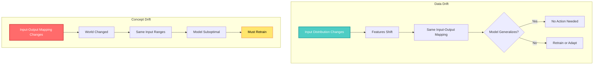
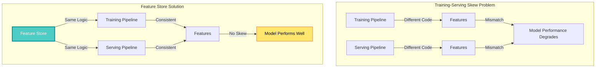
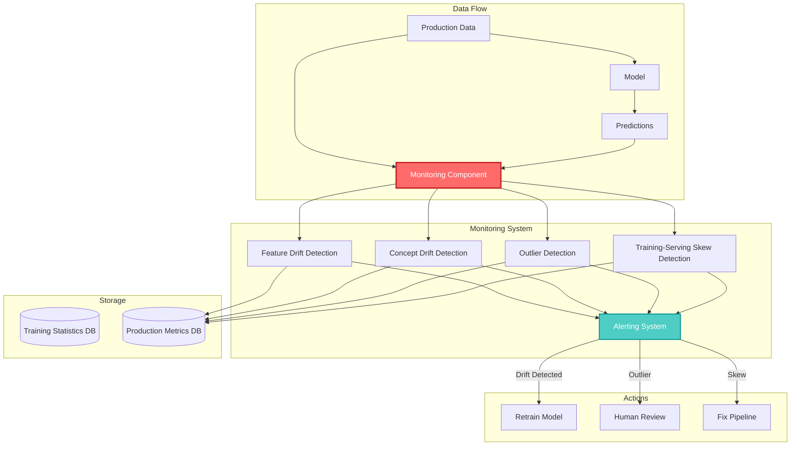

## 🤔 Curiosity: Why Do Models Fail Silently in Production?

What if your ML model's API returns 200 OK status codes with low latency, but the predictions become progressively less accurate over weeks or months? What if this silent degradation goes unnoticed until business metrics start declining?

> **Curiosity:** Traditional software bugs are loud and obvious—servers crash, pages return 404 errors. But ML model failures are often silent. The API works, but predictions degrade. How do we detect these silent failures before they impact users?
{: .prompt-tip}

Deploying a machine learning model into production is often celebrated as a major milestone. However, this deployment marks not the end of the journey, but the beginning of a complex phase often referred to as the **"day two" problem**: monitoring and observability.

Once a model is live, it begins interacting with real-world data and users—environments that are dynamic, evolving, and frequently unpredictable. In this setting, the model's performance can no longer be taken for granted. Maintaining its accuracy, reliability, and business value requires continuous attention.

**The question:** Why do well-trained models degrade in production? And how can we build monitoring systems that detect these issues early, before they impact end users or business outcomes?

As someone who's shipped ML models to production, I've learned that deployment is just the beginning. The real challenge is maintaining model performance in a constantly changing world.

---

## 📚 Retrieve: Understanding Model Degradation

### The Silent Failure Problem

**Traditional Software vs. ML Systems:**

| Aspect | Traditional Software | ML Systems |
|:-------|:-------------------|:-----------|
| **Failure Mode** | Loud and obvious (crashes, errors) | Silent degradation (predictions become less accurate) |
| **Detection** | Immediate (error logs, alerts) | Delayed (requires monitoring metrics) |
| **Impact** | System unavailable | System available but unreliable |
| **Root Cause** | Code bugs, infrastructure issues | Data shifts, concept changes, pipeline bugs |

**The Challenge:**

Unlike static test environments, the real-world ecosystem is fluid and interconnected. Numerous factors can cause a well-trained model to degrade over time:

- **Data distributions shift** due to seasonal trends, new customer behaviors, or market conditions
- **Upstream data pipelines fail**, introducing missing or corrupted features
- **External systems change**, altering how data is generated and consumed
- **User behavior evolves**, creating new patterns the model hasn't seen

These issues can silently erode model performance, going unnoticed for weeks or months.

### Categories of Failures

Failures in production ML systems can be broadly categorized into two groups:

#### 1. Software System Failures

These are issues that can affect any complex software system, not just ML:

- **Dependency failures:** Upstream services or third-party packages break or change APIs
- **Deployment errors:** Wrong model binary deployed, missing permissions, configuration issues
- **Hardware failures:** CPUs overheat, GPUs fail, network infrastructure goes down
- **Distributed system bugs:** Errors in workflow schedulers, data pipeline joins, infrastructure components

**Key Insight:** Addressing these requires strong traditional software engineering and DevOps skills. MLOps is, to a large extent, an engineering discipline.

#### 2. ML-Specific Failures

These are subtle failures unique to systems that learn from data:

- **Data drift:** Input feature distributions shift over time
- **Concept drift:** The relationship between inputs and outputs changes
- **Training-serving skew:** Differences between training and production data processing
- **Outliers:** Individual data points very different from training data

These failures don't typically cause crashes but result in degradation of predictive performance. The system continues operating from a technical standpoint, even as outputs become less reliable.

---

## 💡 Innovation: Understanding Model Degradation Types

### Data Drift vs. Concept Drift

**Data Drift (Covariate Shift):**

Data drift refers to changes in the **input data distribution**—the features' distributions shift, but the relationship between features and target remains the same.

**Example:**
- A model trained on transaction data from last year
- This year, a new demographic of users joins the platform
- Feature distributions shift (e.g., age distribution changes due to marketing)
- The model's performance may degrade if it hasn't seen these new patterns

**Key Characteristics:**
- Features' statistical properties change (mean, std, min/max, distributions)
- The mapping from features to target remains the same
- Sometimes models can generalize fine to new distributions
- Significant drift can break model assumptions

**Detection:**
Monitor feature statistics:
- Mean, standard deviation, minimum/maximum
- Distribution shapes (histograms, KDE plots)
- Correlations between features
- Compare production stats to training stats

```python
# Conceptual data drift detection
import numpy as np
from scipy import stats

def detect_data_drift(training_features, production_features, threshold=0.05):
    """
    Detect data drift using statistical tests
    
    Args:
        training_features: Training data statistics
        production_features: Production data statistics
        threshold: Significance threshold
        
    Returns:
        drift_detected: Boolean indicating if drift detected
        drift_score: Measure of drift magnitude
    """
    drift_results = {}
    
    for feature_name in training_features.columns:
        train_data = training_features[feature_name]
        prod_data = production_features[feature_name]
        
        # Kolmogorov-Smirnov test
        ks_statistic, p_value = stats.ks_2samp(train_data, prod_data)
        
        # Population Stability Index (PSI)
        psi = calculate_psi(train_data, prod_data)
        
        drift_results[feature_name] = {
            'ks_statistic': ks_statistic,
            'p_value': p_value,
            'psi': psi,
            'drift_detected': p_value < threshold or psi > 0.2
        }
    
    return drift_results

def calculate_psi(expected, actual, buckets=10):
    """
    Calculate Population Stability Index
    
    PSI < 0.1: No significant change
    PSI 0.1-0.25: Moderate change
    PSI > 0.25: Significant change
    """
    # Bin the data
    breakpoints = np.linspace(
        min(min(expected), min(actual)),
        max(max(expected), max(actual)),
        buckets + 1
    )
    
    expected_percents = np.histogram(expected, breakpoints)[0] / len(expected)
    actual_percents = np.histogram(actual, breakpoints)[0] / len(actual)
    
    # Avoid division by zero
    expected_percents = np.where(expected_percents == 0, 0.0001, expected_percents)
    actual_percents = np.where(actual_percents == 0, 0.0001, actual_percents)
    
    # Calculate PSI
    psi = np.sum((actual_percents - expected_percents) * 
                 np.log(actual_percents / expected_percents))
    
    return psi
```

**Concept Drift:**

Concept drift refers to changes in the **relationship between inputs and outputs**—the underlying concept the model is trying to predict has changed.

**Example 1: Customer Churn**
- **Before pandemic:** Users logging in <2x/week + no premium engagement → likely to churn
- **After pandemic:** Usage patterns shifted; even highly active users cancel due to budget cuts
- **Result:** The relationship between features and churn changed

**Example 2: Fraud Detection**
- **Before:** Small purchases from foreign IPs within minutes → fraud
- **After:** Fraudsters adapt—larger domestic transactions, local proxies, spread over hours
- **Result:** Input features still in familiar ranges, but the fraud concept changed

**Key Characteristics:**
- Input distributions may remain the same
- The mapping from inputs to outputs changes
- Almost always requires retraining on recent data
- More serious than data drift (model is suboptimal)



**Detection:**
- Monitor prediction accuracy over time (if labels available)
- Track prediction distributions
- Compare model confidence scores
- Use statistical tests on prediction outputs

### Training-Serving Skew

**The Problem:**

Training-serving skew occurs when feature data used during **training differs** from feature data used during **online inference**. This is often a self-inflicted wound caused by process or implementation errors.

**Common Causes:**

1. **Separate Codebases:**
   - Training: Data science-friendly (Spark/Pandas), batch processing
   - Serving: Low-latency language (C++), real-time processing
   - Subtle implementation differences introduce skew

2. **Data Pipeline Bugs:**
   - Production pipeline generates features incorrectly
   - Data source changes not reflected in serving code
   - Missing data handling differs between train/serve

3. **Feature Engineering Inconsistencies:**
   - Normalization applied in training but not in production
   - Different default values for missing features
   - Time-based features calculated differently

4. **Data Source Changes:**
   - Upstream systems change data format
   - New data sources added without updating training
   - Schema evolution not handled consistently

**Example:**

```python
# Training code (Python/Pandas)
def normalize_feature(df):
    mean = df['feature'].mean()
    std = df['feature'].std()
    return (df['feature'] - mean) / std

# Serving code (C++) - BUG: Uses different normalization
def normalize_feature(value):
    // Hardcoded values from old training data
    mean = 10.5  // Outdated!
    std = 2.3    // Outdated!
    return (value - mean) / std
```

**Solution: Feature Stores**

Feature stores provide a centralized repository for feature definitions and logic, ensuring the same transformations are applied in both training and serving environments.



**Monitoring for Training-Serving Skew:**

- Compare feature statistics (mean, std) between training and production
- Monitor feature value ranges (min/max)
- Track feature distributions
- Alert when production features deviate significantly from training baseline

### Outliers

**Definition:**

An outlier is an individual data point very different from the training data. These can indicate:
- Data quality issues
- New patterns emerging
- Early signs of drift

**Example:**

A fraud detection model trained on transactions up to $1 million suddenly receives a $15 million transaction. The model's prediction on this outlier will likely be unreliable.

**Detection:**

```python
def detect_outliers(feature_values, training_stats, threshold=3):
    """
    Detect outliers using z-score method
    
    Args:
        feature_values: Current feature values
        training_stats: Training data statistics (mean, std)
        threshold: Z-score threshold (default: 3 standard deviations)
        
    Returns:
        outlier_indices: Indices of outlier values
    """
    z_scores = np.abs(
        (feature_values - training_stats['mean']) / training_stats['std']
    )
    
    outlier_indices = np.where(z_scores > threshold)[0]
    
    return outlier_indices

# Alternative: IQR method
def detect_outliers_iqr(feature_values, training_data):
    """
    Detect outliers using Interquartile Range method
    """
    Q1 = np.percentile(training_data, 25)
    Q3 = np.percentile(training_data, 75)
    IQR = Q3 - Q1
    
    lower_bound = Q1 - 1.5 * IQR
    upper_bound = Q3 + 1.5 * IQR
    
    outliers = (feature_values < lower_bound) | (feature_values > upper_bound)
    
    return np.where(outliers)[0]
```

**Handling Outliers:**

1. **Route for special handling:** Send outliers to human review or separate model
2. **Flag for investigation:** Log outliers for analysis
3. **Adaptive thresholds:** Update outlier detection as data evolves

---

## 🔍 Techniques to Detect Drift

### Statistical Methods

**1. Kolmogorov-Smirnov (KS) Test**

Compares two distributions to detect if they're significantly different.

```python
from scipy import stats

def ks_test_drift(train_data, prod_data, alpha=0.05):
    """
    KS test for distribution drift
    
    Returns:
        drift_detected: True if distributions differ significantly
        statistic: KS statistic
        p_value: P-value
    """
    statistic, p_value = stats.ks_2samp(train_data, prod_data)
    drift_detected = p_value < alpha
    
    return drift_detected, statistic, p_value
```

**2. Population Stability Index (PSI)**

Measures how much a population has shifted over time.

```python
def calculate_psi(expected, actual, buckets=10):
    """
    Population Stability Index
    
    PSI < 0.1: No significant population change
    PSI 0.1-0.25: Moderate population change
    PSI > 0.25: Significant population change
    """
    # Implementation from earlier
    breakpoints = np.linspace(
        min(min(expected), min(actual)),
        max(max(expected), max(actual)),
        buckets + 1
    )
    
    expected_percents = np.histogram(expected, breakpoints)[0] / len(expected)
    actual_percents = np.histogram(actual, breakpoints)[0] / len(actual)
    
    # Avoid division by zero
    expected_percents = np.where(expected_percents == 0, 0.0001, expected_percents)
    actual_percents = np.where(actual_percents == 0, 0.0001, actual_percents)
    
    psi = np.sum((actual_percents - expected_percents) * 
                 np.log(actual_percents / expected_percents))
    
    return psi
```

**3. Kullback-Leibler (KL) Divergence**

Measures how one probability distribution diverges from another.

```python
from scipy.stats import entropy

def kl_divergence(p, q):
    """
    Calculate KL divergence between two distributions
    
    Args:
        p: Reference distribution (training)
        q: Comparison distribution (production)
        
    Returns:
        kl_div: KL divergence value
    """
    # Normalize to probabilities
    p = p / np.sum(p)
    q = q / np.sum(q)
    
    # Avoid log(0)
    p = np.where(p == 0, 1e-10, p)
    q = np.where(q == 0, 1e-10, q)
    
    kl_div = entropy(p, q)
    
    return kl_div
```

### Adaptive Methods

**ADWIN (Adaptive Windowing)**

An adaptive algorithm that automatically detects change points in data streams.

```python
# Conceptual ADWIN implementation
class ADWIN:
    """
    Adaptive Windowing for drift detection in data streams
    """
    
    def __init__(self, delta=0.002):
        self.delta = delta  # Confidence level
        self.window = []
        self.drift_detected = False
    
    def add_element(self, value):
        """
        Add new element and check for drift
        """
        self.window.append(value)
        
        if len(self.window) < 2:
            return False
        
        # Try to find cut point
        for cut in range(1, len(self.window)):
            left_window = self.window[:cut]
            right_window = self.window[cut:]
            
            if self._detect_change(left_window, right_window):
                # Drift detected - drop old window
                self.window = right_window
                self.drift_detected = True
                return True
        
        self.drift_detected = False
        return False
    
    def _detect_change(self, left, right):
        """
        Detect if there's a significant change between windows
        """
        if len(left) < 2 or len(right) < 2:
            return False
        
        mean_left = np.mean(left)
        mean_right = np.mean(right)
        var_left = np.var(left)
        var_right = np.var(right)
        
        # Simplified change detection
        threshold = np.sqrt(
            (2 / len(left) + 2 / len(right)) * 
            np.log(2 / self.delta)
        )
        
        return abs(mean_left - mean_right) > threshold
```

### Monitoring Architecture



---

## 🎯 Key Takeaways

| Insight | Implication | Next Steps |
|:--------|:------------|:-----------|
| **ML failures are silent** | Need proactive monitoring, not just error tracking | Implement comprehensive monitoring from day one |
| **Data drift vs. concept drift** | Different problems require different solutions | Use appropriate detection methods for each type |
| **Training-serving skew is preventable** | Use feature stores and consistent pipelines | Adopt feature stores early in ML lifecycle |
| **Outliers can signal drift** | Monitor outliers as early warning system | Set up outlier detection with adaptive thresholds |
| **Statistical methods work** | KS test, PSI, KL divergence are proven techniques | Start with statistical methods, add ML-based as needed |

### Why This Matters for Production

As someone who's shipped ML models, here's what I've learned:

1. **Silent Failures Are Expensive:** Models can degrade for weeks before anyone notices, eroding business value and user trust.

2. **Monitoring Is Not Optional:** Unlike traditional software, ML systems require continuous monitoring of model performance, not just system health.

3. **Early Detection Saves Money:** Detecting drift early allows proactive retraining before performance degrades significantly.

4. **Feature Stores Prevent Skew:** Centralized feature logic prevents the most common source of production issues.

5. **Multiple Detection Methods:** No single method catches everything—use a combination of statistical and adaptive methods.

**What I'd Implement First:**
- Feature statistics monitoring (mean, std, distributions)
- PSI calculation for key features
- Outlier detection with z-scores
- Training-serving skew detection
- Automated alerts when thresholds are exceeded

---

## 🤔 New Questions This Raises

1. **How often should we check for drift?** Real-time vs. batch monitoring tradeoffs?

2. **What thresholds trigger alerts?** How do we balance false positives vs. missed detections?

3. **How do we handle concept drift?** When to retrain vs. when to adapt the model?

4. **Can we predict drift?** Can we use ML to predict when drift will occur?

5. **Multi-model monitoring:** How do we scale monitoring across hundreds of models?

6. **Label availability:** How do we detect concept drift when labels are delayed or unavailable?

**Next Steps:** In the next part, we'll explore observability tools, monitoring dashboards, and how to build a complete monitoring system for production ML models.

---

## References

**Original Article:**
- [The Full MLOps Blueprint: Monitoring and Observability—Part A - Daily Dose of Data Science](https://www.dailydoseofds.com/mlops-crash-course-part-16/)

**Related MLOps Course Parts:**
- [Part 15: Model Deployment—Part E (AWS EKS)](https://www.dailydoseofds.com/mlops-crash-course-part-15/)
- [Part 14: Model Deployment—Part D](https://www.dailydoseofds.com/mlops-crash-course-part-14/)
- [Part 6: Data and Pipeline Engineering](https://www.dailydoseofds.com/mlops-crash-course-part-6/)

**Research Papers:**
- [Monitoring and Explainability of Models in Production (Paleyes et al., 2022)](https://arxiv.org/abs/2203.07520)
- [A Survey on Concept Drift Adaptation (Gama et al., 2014)](https://dl.acm.org/doi/10.1145/2523813)
- [Learning under Concept Drift: A Review (Webb et al., 2016)](https://arxiv.org/abs/2004.05785)

**Drift Detection:**
- [ADWIN: An Adaptive Windowing Algorithm (Bifet & Gavalda, 2007)](https://www.cs.waikato.ac.nz/~abifet/MOA/ADWIN.pdf)
- [Population Stability Index (PSI) - Explained](https://www.lexjansen.com/wuss/2017/47_Final_Paper_PDF.pdf)
- [Kolmogorov-Smirnov Test for Drift Detection](https://en.wikipedia.org/wiki/Kolmogorov%E2%80%93Smirnov_test)

**Feature Stores:**
- [Feature Stores for ML - Feast Documentation](https://docs.feast.dev/)
- [Tecton: The Feature Store for Production ML](https://www.tecton.ai/)
- [Hopsworks Feature Store](https://www.hopsworks.ai/feature-store)

**Monitoring Tools:**
- [Evidently AI: Open-source ML Monitoring](https://www.evidentlyai.com/)
- [Arize AI: ML Observability Platform](https://arize.com/)
- [Fiddler AI: ML Monitoring and Explainability](https://www.fiddler.ai/)
- [WhyLabs: AI Observability Platform](https://whylabs.ai/)

**Production ML Best Practices:**
- [Hidden Technical Debt in Machine Learning Systems (Sculley et al., 2015)](https://papers.nips.cc/paper/2015/hash/86df7dcfd896fcaf2674f757a2463eba-Abstract.html)
- [MLOps: Continuous delivery and automation pipelines in ML (Treveil et al., 2020)](https://www.oreilly.com/library/view/mlops/9781492082280/)
- [The ML Test Score: A Rubric for ML Production Readiness (Breck et al., 2017)](https://research.google/pubs/pub46555/)

**Statistical Methods:**
- [Scipy Statistical Functions](https://docs.scipy.org/doc/scipy/reference/stats.html)
- [Kullback-Leibler Divergence Explained](https://en.wikipedia.org/wiki/Kullback%E2%80%93Leibler_divergence)
- [Population Stability Index (PSI) Calculation](https://www.listendata.com/2015/05/population-stability-index.html)

**Implementation Resources:**
- [Evidently AI GitHub](https://github.com/evidentlyai/evidently)
- [Great Expectations: Data Quality Monitoring](https://greatexpectations.io/)
- [TensorFlow Data Validation](https://www.tensorflow.org/tfx/data_validation/get_started)

**Industry Case Studies:**
- [Netflix: ML Monitoring at Scale](https://netflixtechblog.com/)
- [Uber: Michelangelo ML Platform](https://eng.uber.com/michelangelo-machine-learning-platform/)
- [Airbnb: Zipline Feature Store](https://medium.com/airbnb-engineering/scaling-knowledge-access-and-production-with-a-feature-store-799644ad22da)
