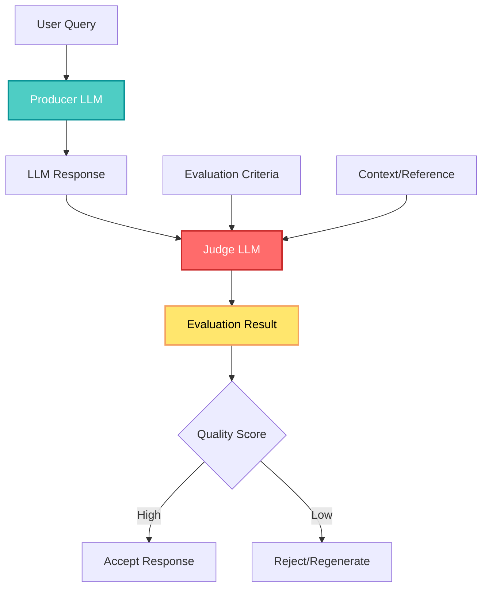
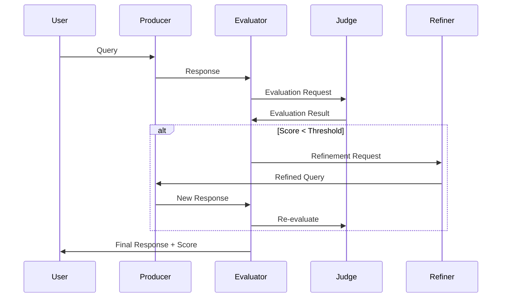

## 🤔 Curiosity: How Do We Automatically Evaluate LLM Response Quality?

As LLM applications move into production, a critical question emerges: **How do we automatically assess whether an LLM's response is actually good?** Traditional evaluation methods require human reviewers, which doesn't scale. What if we could use LLMs themselves to judge the quality of other LLMs' outputs?

> **Curiosity:** Can we use LLMs to evaluate LLM responses? And how can Spring AI's recursive advisors help us build robust, production-ready evaluation systems?
> {: .prompt-tip}

**The reality:** LLM-as-a-Judge is an emerging pattern where one LLM evaluates the output of another LLM. This approach scales evaluation, reduces human effort, and enables continuous quality monitoring. Spring AI provides powerful abstractions—particularly recursive advisors—that make building these evaluation systems practical and maintainable.

As someone who's built production AI systems, I've seen the evaluation bottleneck firsthand: manual review doesn't scale, and simple metrics miss nuanced quality issues. LLM-as-a-Judge offers a promising path forward, but it requires careful architecture to be reliable.

**The question:** How do we design LLM-as-a-Judge systems that are both accurate and production-ready?

{: .light .shadow .rounded-10 w='1212' h='668' }

---

## 📚 Retrieve: Understanding LLM-as-a-Judge and Spring AI Recursive Advisors

### The LLM-as-a-Judge Pattern

The LLM-as-a-Judge pattern uses a judge LLM to evaluate responses from a producer LLM. The judge assesses quality based on criteria like:

- **Relevance:** Does the response address the query?
- **Accuracy:** Is the information correct?
- **Completeness:** Are all aspects covered?
- **Clarity:** Is the response well-structured?
- **Safety:** Does it avoid harmful content?



### Spring AI Recursive Advisors

Spring AI introduces **Recursive Advisors**—a powerful pattern for building complex, multi-step LLM workflows. Recursive advisors allow advisors to call other advisors, creating hierarchical evaluation and refinement processes.

**Key Concepts:**

| Concept               | Description                                                          | Use Case                       |
| :-------------------- | :------------------------------------------------------------------- | :----------------------------- |
| **Advisor**           | A component that processes and potentially modifies LLM interactions | Response filtering, validation |
| **Recursive Advisor** | An advisor that can invoke other advisors                            | Multi-stage evaluation         |
| **Response Advisor**  | Processes responses after generation                                 | Quality assessment             |
| **Prompt Advisor**    | Processes prompts before generation                                  | Query enhancement              |

### Building Blocks: Spring AI Evaluation Components

#### 1. Response Evaluator

```java
import org.springframework.ai.chat.model.ChatResponse;
import org.springframework.ai.evaluation.EvaluationRequest;
import org.springframework.ai.evaluation.EvaluationResponse;

public interface ResponseEvaluator {
    EvaluationResponse evaluate(EvaluationRequest request);
}
```

**Example Implementation:**

```java
@Service
public class RelevanceEvaluator implements ResponseEvaluator {

    private final ChatModel judgeModel;

    public RelevanceEvaluator(ChatModel judgeModel) {
        this.judgeModel = judgeModel;
    }

    @Override
    public EvaluationResponse evaluate(EvaluationRequest request) {
        String prompt = buildEvaluationPrompt(
            request.getUserMessage(),
            request.getResponse()
        );

        ChatResponse judgeResponse = judgeModel.call(
            new Prompt(prompt)
        );

        return parseEvaluation(judgeResponse.getResult().getOutput());
    }

    private String buildEvaluationPrompt(String query, String response) {
        return String.format("""
            Evaluate the relevance of the following response to the query.

            Query: %s

            Response: %s

            Rate relevance on a scale of 1-5 and provide reasoning.
            """, query, response);
    }
}
```

#### 2. Recursive Advisor Pattern

Recursive advisors enable multi-stage evaluation:

```java
@Component
public class MultiStageEvaluationAdvisor implements ResponseAdvisor {

    private final RelevanceEvaluator relevanceEvaluator;
    private final AccuracyEvaluator accuracyEvaluator;
    private final SafetyEvaluator safetyEvaluator;

    @Override
    public ChatResponse advise(ChatResponse response,
                               PromptRequestContext context) {

        // Stage 1: Relevance check
        EvaluationResponse relevance = relevanceEvaluator.evaluate(
            createEvaluationRequest(context, response)
        );

        if (relevance.getScore() < 3.0) {
            return createRejectionResponse("Response not relevant");
        }

        // Stage 2: Accuracy check (only if relevant)
        EvaluationResponse accuracy = accuracyEvaluator.evaluate(
            createEvaluationRequest(context, response)
        );

        // Stage 3: Safety check
        EvaluationResponse safety = safetyEvaluator.evaluate(
            createEvaluationRequest(context, response)
        );

        // Combine evaluations
        return applyEvaluations(response, relevance, accuracy, safety);
    }
}
```

### Evaluation Criteria and Metrics

**Common Evaluation Dimensions:**

| Dimension        | Description                      | Evaluation Method                       |
| :--------------- | :------------------------------- | :-------------------------------------- |
| **Relevance**    | Response addresses the query     | Semantic similarity, keyword matching   |
| **Accuracy**     | Information is factually correct | Fact-checking, reference comparison     |
| **Completeness** | All aspects are covered          | Coverage analysis, checklist            |
| **Clarity**      | Response is well-structured      | Readability metrics, structure analysis |
| **Safety**       | No harmful content               | Content filtering, toxicity detection   |

**Scoring Approaches:**

```java
public enum EvaluationScore {
    EXCELLENT(5, "Response exceeds expectations"),
    GOOD(4, "Response meets expectations"),
    ACCEPTABLE(3, "Response is adequate"),
    POOR(2, "Response has significant issues"),
    UNACCEPTABLE(1, "Response should be rejected");

    private final int value;
    private final String description;
}
```

---

## 💡 Innovation: Building Production LLM-as-a-Judge Systems

### Complete Implementation: Multi-Criteria Evaluation

Here's a complete Spring AI implementation combining recursive advisors with multi-criteria evaluation:

```java
@Configuration
@EnableConfigurationProperties(EvaluationProperties.class)
public class LlmJudgeConfiguration {

    @Bean
    public ChatModel judgeModel(
        @Qualifier("openAiChatModel") ChatModel chatModel) {
        return chatModel; // Use GPT-4 or Claude as judge
    }

    @Bean
    public ResponseEvaluator relevanceEvaluator(ChatModel judgeModel) {
        return new RelevanceEvaluator(judgeModel);
    }

    @Bean
    public ResponseEvaluator accuracyEvaluator(ChatModel judgeModel) {
        return new AccuracyEvaluator(judgeModel);
    }

    @Bean
    public ResponseEvaluator safetyEvaluator(ChatModel judgeModel) {
        return new SafetyEvaluator(judgeModel);
    }

    @Bean
    public ResponseAdvisor evaluationAdvisor(
        ResponseEvaluator relevanceEvaluator,
        ResponseEvaluator accuracyEvaluator,
        ResponseEvaluator safetyEvaluator) {
        return new MultiStageEvaluationAdvisor(
            relevanceEvaluator,
            accuracyEvaluator,
            safetyEvaluator
        );
    }
}
```

### Advanced Pattern: Recursive Refinement

Recursive advisors can also trigger response refinement:

```java
@Component
public class RefinementAdvisor implements ResponseAdvisor {

    private final ChatModel producerModel;
    private final ResponseEvaluator evaluator;

    @Override
    public ChatResponse advise(ChatResponse response,
                               PromptRequestContext context) {

        EvaluationResponse evaluation = evaluator.evaluate(
            createEvaluationRequest(context, response)
        );

        if (evaluation.getScore() < 3.0 &&
            context.getRetryCount() < MAX_RETRIES) {

            // Recursively refine the response
            String refinementPrompt = buildRefinementPrompt(
                context.getUserMessage(),
                response.getResult().getOutput(),
                evaluation.getFeedback()
            );

            ChatResponse refined = producerModel.call(
                new Prompt(refinementPrompt)
            );

            // Recursively evaluate the refined response
            return advise(refined, context.incrementRetry());
        }

        return response;
    }
}
```

### Evaluation Workflow Architecture



### Performance Optimization

**Caching Evaluation Results:**

```java
@Service
public class CachedEvaluator implements ResponseEvaluator {

    private final ResponseEvaluator delegate;
    private final Cache<String, EvaluationResponse> cache;

    @Override
    public EvaluationResponse evaluate(EvaluationRequest request) {
        String cacheKey = generateCacheKey(request);

        return cache.get(cacheKey, () ->
            delegate.evaluate(request)
        );
    }

    private String generateCacheKey(EvaluationRequest request) {
        return DigestUtils.md5Hex(
            request.getUserMessage() +
            request.getResponse()
        );
    }
}
```

**Parallel Evaluation:**

```java
@Service
public class ParallelEvaluationAdvisor implements ResponseAdvisor {

    private final List<ResponseEvaluator> evaluators;
    private final ExecutorService executor;

    @Override
    public ChatResponse advise(ChatResponse response,
                               PromptRequestContext context) {

        List<CompletableFuture<EvaluationResponse>> futures =
            evaluators.stream()
                .map(evaluator ->
                    CompletableFuture.supplyAsync(() ->
                        evaluator.evaluate(createRequest(context, response)),
                        executor
                    )
                )
                .toList();

        List<EvaluationResponse> results = futures.stream()
            .map(CompletableFuture::join)
            .toList();

        return combineEvaluations(response, results);
    }
}
```

### Evaluation Metrics and Monitoring

**Key Metrics to Track:**

| Metric                 | Description                            | Target |
| :--------------------- | :------------------------------------- | :----- |
| **Average Score**      | Mean evaluation score across responses | > 4.0  |
| **Rejection Rate**     | % of responses rejected                | < 5%   |
| **Refinement Rate**    | % requiring refinement                 | < 10%  |
| **Evaluation Latency** | Time to evaluate response              | < 2s   |
| **Judge Agreement**    | Correlation with human judges          | > 0.8  |

**Monitoring Implementation:**

```java
@Component
public class MetricsCollectingAdvisor implements ResponseAdvisor {

    private final MeterRegistry meterRegistry;
    private final ResponseAdvisor delegate;

    @Override
    public ChatResponse advise(ChatResponse response,
                               PromptRequestContext context) {
        Timer.Sample sample = Timer.start(meterRegistry);

        try {
            ChatResponse result = delegate.advise(response, context);

            // Record metrics
            meterRegistry.counter("evaluation.count").increment();
            meterRegistry.gauge("evaluation.score",
                extractScore(result));

            return result;
        } finally {
            sample.stop(meterRegistry.timer("evaluation.duration"));
        }
    }
}
```

---

## 🎯 Key Takeaways

| Insight                                         | Implication                               | Action Item                         |
| :---------------------------------------------- | :---------------------------------------- | :---------------------------------- |
| **LLM-as-a-Judge scales evaluation**            | Automated quality assessment at scale     | Implement multi-criteria evaluation |
| **Recursive advisors enable complex workflows** | Multi-stage evaluation and refinement     | Use Spring AI's advisor pattern     |
| **Caching improves performance**                | Reduce redundant evaluations              | Cache evaluation results            |
| **Parallel evaluation speeds up**               | Evaluate multiple criteria simultaneously | Use async evaluation                |
| **Monitoring is critical**                      | Track evaluation quality and performance  | Implement metrics collection        |

### Why This Matters

LLM-as-a-Judge with Spring AI's recursive advisors provides:

1. **Scalability:** Evaluate thousands of responses automatically
2. **Consistency:** Standardized evaluation criteria
3. **Flexibility:** Multi-stage, recursive evaluation workflows
4. **Production-Ready:** Built on Spring's proven patterns
5. **Observability:** Metrics and monitoring out of the box

**The Challenge:** Designing evaluation criteria that align with human judgment while maintaining performance. But with Spring AI's abstractions, building robust evaluation systems becomes practical.

---

## 🤔 New Questions This Raises

1. **How do we ensure judge LLM consistency?** What techniques reduce evaluation variance?

2. **What's the optimal evaluation granularity?** When should we evaluate at response vs. sentence level?

3. **How do we handle judge LLM biases?** What calibration techniques work best?

4. **Can we use multiple judge LLMs?** How do we combine evaluations from different models?

5. **What's the cost-performance tradeoff?** When is LLM-as-a-Judge worth the additional API calls?

**Next experiment:** Build a multi-judge system where GPT-4, Claude, and Gemini all evaluate responses, then compare agreement rates and identify optimal consensus strategies.

---

## References

**Original Article:**

- [LLM Response Evaluation with Spring AI: Building LLM-as-a-Judge Using Recursive Advisors - Spring Blog](https://spring.io/blog/2025/11/10/spring-ai-llm-as-judge-blog-post)

**Spring AI Documentation:**

- [Spring AI Documentation](https://docs.spring.io/spring-ai/reference/)

**Research Papers:**

- [Judging LLM-as-a-Judge with MT-Bench and Chatbot Arena (Zheng et al., 2023)](https://arxiv.org/abs/2306.05685)
- [Evaluating Large Language Models Trained on Code (Chen et al., 2021)](https://arxiv.org/abs/2107.03374)

**LLM Evaluation Frameworks:**

- [LangChain Evaluation](https://python.langchain.com/docs/guides/evaluation/)
- [LlamaIndex Evaluation](https://docs.llamaindex.ai/en/stable/module_guides/evaluating/)
- [RAGAS: Evaluation Framework for RAG](https://docs.ragas.io/)

**Tools & Libraries:**

- [Spring AI GitHub](https://github.com/spring-projects/spring-ai)
- [Spring Boot](https://spring.io/projects/spring-boot)
- [Micrometer Metrics](https://micrometer.io/)

**Related Topics:**

- [Human Feedback in LLM Training](https://openai.com/research/learning-from-human-preferences)
- [Automated Evaluation Metrics](https://huggingface.co/spaces/evaluate-metric)

**Production Case Studies:**

- [Building Production LLM Applications (Anthropic)](https://www.anthropic.com/index/building-effective-agents)
- [LLM Evaluation in Production (OpenAI)](https://platform.openai.com/docs/guides/production-best-practices)
