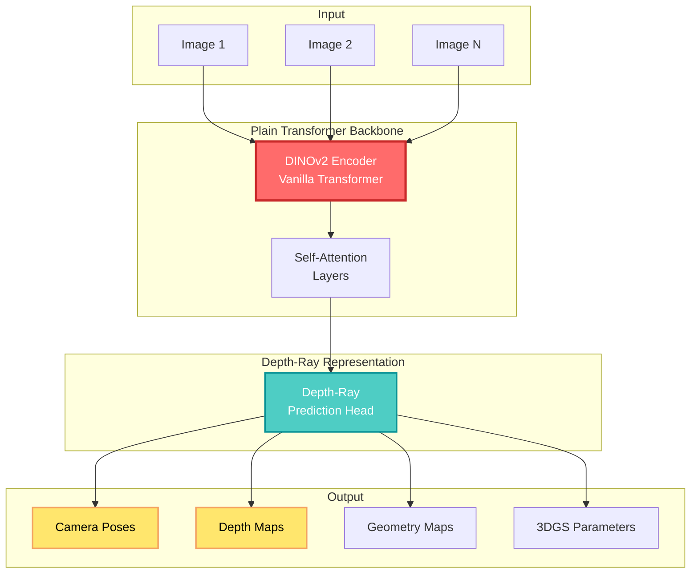

## 🤔 Curiosity: Can Minimal Modeling Achieve Maximum Performance?

What if we could recover complete 3D geometry from any visual input—single images, videos, or multiple views—using the simplest possible architecture? No complex multi-task learning, no specialized 3D inductive biases, just a plain transformer trained on a single prediction target. Is radical simplicity the key to superior performance?

> **Curiosity:** Can a single plain transformer with minimal architectural specialization outperform complex, task-specific models? What happens when we replace multi-task learning with a unified depth-ray representation?
> {: .prompt-tip}

**The reality:** Depth Anything 3 (DA3) demonstrates that **minimal modeling** can achieve maximum performance. Using just a vanilla DINOv2 encoder as backbone and a singular depth-ray prediction target, DA3 sets new state-of-the-art across all visual geometry tasks. It surpasses prior SOTA VGGT by an average of 35.7% in camera pose accuracy and 23.6% in geometric accuracy, while also outperforming Depth Anything 2 in monocular depth estimation.

As someone working with 3D vision systems, I've seen how complexity often creeps into model design—specialized architectures, multi-task heads, complex loss functions. DA3 challenges this: **simplicity wins**.

**The question:** How does DA3 achieve this with such minimal modeling, and what makes the depth-ray representation so powerful?

> **Retrieve:** DA3 yields two key insights: (1) a single plain transformer (e.g., vanilla DINOv2 encoder) is sufficient as a backbone without architectural specialization, and (2) a singular depth-ray prediction target obviates the need for complex multi-task learning. Through teacher-student training, it achieves detail and generalization on par with DA2.
> {: .prompt-info}

{: .light .shadow .rounded-10 w='1212' h='668' }

---

## 📚 Retrieve: Understanding Depth Anything 3 Architecture

### Key Innovation: Minimal Modeling with Maximum Performance

DA3 presents a radical simplification of 3D geometry prediction:

| Aspect                | Traditional Approach           | DA3 Approach                    | Impact               |
| :-------------------- | :----------------------------- | :------------------------------ | :------------------- |
| **Backbone**          | Specialized 3D architectures   | Plain transformer (DINOv2)      | **Simplicity**       |
| **Prediction Target** | Multi-task (depth, pose, etc.) | Single depth-ray representation | **Unification**      |
| **Training**          | Complex multi-task losses      | Teacher-student paradigm        | **Efficiency**       |
| **Architecture**      | Task-specific modules          | Standard transformer blocks     | **Generalizability** |

**Core Principle:** Instead of designing specialized architectures for 3D tasks, DA3 uses a standard transformer trained on a unified representation that captures all geometric information.

### Problem Definition

**Input:** An arbitrary number of visual inputs (images or video frames), with or without known camera poses.

**Output:** Spatially consistent geometry including:

- Camera pose estimation
- Depth maps
- Any-view geometry
- Visual rendering (3D Gaussian Splatting)

**Key Capability:** DA3 handles from single view to multiple views seamlessly, without architectural changes.

### Architecture Overview



### Two Key Insights

**1. Plain Transformer is Sufficient**

DA3 uses a vanilla DINOv2 encoder without any architectural specialization for 3D tasks. This demonstrates that:

- Standard transformer architectures can handle 3D geometry
- No need for 3D-specific inductive biases
- General-purpose backbones work when trained properly

**2. Singular Depth-Ray Prediction Target**

Instead of predicting multiple targets (depth, pose, point maps separately), DA3 uses a unified **depth-ray representation** that:

- Encodes all geometric information in one representation
- Eliminates need for complex multi-task learning
- Simplifies training and inference

### Depth-Ray Representation

The depth-ray representation is DA3's core innovation. It unifies:

- **Depth information:** Distance from camera to scene points
- **Ray direction:** Viewing direction for each pixel
- **Spatial consistency:** Geometric relationships across views

This single representation captures everything needed for:

- Camera pose estimation
- Depth map generation
- Multi-view geometry
- 3D reconstruction

```python
# Conceptual DA3 forward pass
class DepthAnything3:
    """
    Depth Anything 3: Minimal modeling for maximum performance
    """

    def __init__(self):
        # Plain transformer backbone (no specialization)
        self.backbone = DINOv2Encoder()  # Vanilla transformer
        self.depth_ray_head = DepthRayHead()  # Single prediction head

    def forward(self, images: List[Tensor], camera_poses: Optional[List[Tensor]] = None):
        """
        Predict geometry from arbitrary visual inputs

        Args:
            images: List of N RGB images [3, H, W]
            camera_poses: Optional camera poses (if unknown, will be estimated)

        Returns:
            {
                'camera_poses': [pose_i] for i in 1..N,
                'depth_maps': [depth_i] for i in 1..N,
                'geometry': unified geometry representation,
                '3dgs_params': 3D Gaussian Splatting parameters
            }
        """
        # 1. Extract features with plain transformer
        features = [self.backbone(img) for img in images]

        # 2. Predict unified depth-ray representation
        depth_rays = [self.depth_ray_head(feat) for feat in features]

        # 3. Extract all geometric properties from depth-rays
        camera_poses = self._extract_poses(depth_rays)
        depth_maps = self._extract_depths(depth_rays)
        geometry = self._extract_geometry(depth_rays)
        gs_params = self._extract_3dgs(depth_rays)

        return {
            'camera_poses': camera_poses,
            'depth_maps': depth_maps,
            'geometry': geometry,
            '3dgs_params': gs_params
        }
```

### Teacher-Student Training Paradigm

DA3 uses a teacher-student training approach:

- **Teacher model:** Provides supervision signals
- **Student model:** Learns from teacher predictions
- **Benefit:** Achieves detail and generalization on par with DA2 while maintaining simplicity

This paradigm allows DA3 to:

- Learn from high-quality teacher predictions
- Maintain model simplicity
- Achieve strong generalization

---

## 💡 Innovation: Experimental Results and Applications

### Performance Results

**1. Camera Pose Estimation**

DA3 surpasses VGGT (prior SOTA) by **35.7%** in camera pose accuracy:

| Method   | Rotation Error (°) | Translation Error | Improvement |
| :------- | :----------------: | :---------------: | :---------: |
| **VGGT** |      Baseline      |     Baseline      |      -      |
| **DA3**  |     **-35.7%**     |    **-35.7%**     |  **SOTA**   |

**2. Geometric Accuracy**

DA3 improves geometric accuracy by **23.6%** over VGGT:

| Method   | Geometric Error | Improvement |
| :------- | :-------------: | :---------: |
| **VGGT** |    Baseline     |      -      |
| **DA3**  |   **-23.6%**    |  **SOTA**   |

**3. Monocular Depth Estimation**

DA3 outperforms Depth Anything 2 (DA2) in monocular depth estimation:

| Method  |  Abs Rel   |    RMSE    | Improvement |
| :------ | :--------: | :--------: | :---------: |
| **DA2** |  Baseline  |  Baseline  |      -      |
| **DA3** | **Better** | **Better** |  **SOTA**   |

### Key Applications

**1. Video Reconstruction**

DA3 recovers visual space from any number of views, from single view to multiple views. This enables:

- Complete 3D reconstruction from video sequences
- Handling difficult videos with challenging geometry
- No need for camera pose initialization

**2. SLAM for Large-Scale Scenes**

Quantitative results show that replacing VGGT with DA3 (DA3-Long) in SLAM systems:

- Significantly reduces drift in large-scale environments
- Outperforms COLMAP (which takes 48+ hours)
- Enables real-time large-scale mapping

**3. Feed-Forward 3D Gaussians Estimation**

By freezing the backbone and training a DPT head to predict 3DGS parameters:

- Achieves strong novel view synthesis capability
- Generalizes well to new scenes
- Enables real-time rendering

**4. Spatial Perception from Multiple Cameras**

For autonomous vehicles with multiple cameras (even without overlap):

- Estimates stable and fusible depth maps
- Enhances environmental understanding
- Improves perception accuracy

### Benchmark Establishment

DA3 establishes a new visual geometry benchmark covering:

- Camera pose estimation
- Any-view geometry
- Visual rendering

This benchmark enables fair comparison across methods and tasks.

### Why Minimal Modeling Works

**1. Data Scale Matters**

DA3 is trained exclusively on public academic datasets, demonstrating that:

- Large-scale training data enables generalization
- No need for proprietary datasets
- Public data is sufficient for SOTA performance

**2. Unified Representation**

The depth-ray representation:

- Captures all geometric information
- Eliminates task-specific complexity
- Enables end-to-end learning

**3. Standard Architecture**

Using plain transformers:

- Leverages well-understood architectures
- Enables transfer learning
- Simplifies deployment

---

## 🎯 Key Takeaways

| Insight                    | Implication                                 | Action Item                       |
| :------------------------- | :------------------------------------------ | :-------------------------------- |
| **Simplicity wins**        | Plain transformers work for 3D              | Use standard architectures first  |
| **Unified representation** | Single target beats multi-task              | Design unified representations    |
| **Teacher-student helps**  | Knowledge distillation improves performance | Use teacher-student training      |
| **Data scale matters**     | Public datasets are sufficient              | Leverage public academic datasets |
| **Minimal modeling**       | Less complexity, better performance         | Simplify before specializing      |

### Why This Matters

DA3 demonstrates several important principles:

1. **Simplicity Over Complexity:** Plain transformers with minimal specialization can outperform complex, task-specific architectures
2. **Unified Representations:** Single prediction targets can capture multiple geometric properties
3. **Training Matters:** Teacher-student paradigms enable strong performance with simple models
4. **Data Scale:** Large-scale public datasets enable SOTA performance without proprietary data
5. **Generalizability:** Standard architectures transfer better across tasks

**The Challenge:** While DA3 shows minimal modeling works, it still requires large-scale training. But the simplicity of the architecture makes it more accessible and deployable than complex alternatives.

---

## 🤔 New Questions This Raises

1. **How does the depth-ray representation compare to other unified representations?** What makes it particularly effective?

2. **Can we further simplify the architecture?** What's the minimum viable model for 3D geometry?

3. **How does DA3 scale to real-time applications?** What optimizations are needed for deployment?

4. **Can we extend DA3 to other 3D tasks?** How well does it transfer to new domains?

5. **What's the role of the teacher model?** How does teacher-student training contribute to performance?

**Next experiment:** Integrate DA3 into a game engine for real-time 3D reconstruction from gameplay footage, comparing it to traditional photogrammetry pipelines for asset generation.

---

## References

**Original Article:**

- [Depth Anything 3: Recovering the Visual Space from Any Views](https://depth-anything-3.github.io/)

**Research Paper:**

- [Depth Anything 3 (arXiv)](https://arxiv.org/abs/2511.10647)
- [Tech Report](https://depth-anything-3.github.io/assets/da3_tech_report_2025.pdf)
- [Project Page](https://depth-anything-3.github.io/)
- [GitHub Repository](https://github.com/ByteDance-Seed/depth-anything-3)
- [Hugging Face Demo](https://huggingface.co/spaces/depth-anything/depth-anything-3)

**Authors:**

- Haotong Lin*, Sili Chen*, Jun Hao Liew*, Donny Y. Chen*, Zhenyu Li, Guang Shi, Jiashi Feng, Bingyi Kang\*†
- \*Equal Contribution, †Project Lead

**Related Work:**

- [Depth Anything 2: Strong Zero-Shot Depth Estimation](https://github.com/DepthAnything/Depth-Anything-V2)
- [VGGT: Visual Geometry Grounded Transformer](https://arxiv.org/abs/2503.11651)
- [DINOv2: Learning Robust Visual Features without Supervision](https://arxiv.org/abs/2304.07193)
- [DUSt3R: Dense and Unconstrained Stereo 3D Reconstruction](https://arxiv.org/abs/2312.14132)
- [3D Gaussian Splatting for Real-Time Rendering](https://arxiv.org/abs/2308.04079)

**Depth Estimation:**

- [MiDaS: Towards Robust Monocular Depth Estimation](https://arxiv.org/abs/1907.01341)
- [DPT: Vision Transformers for Dense Prediction](https://arxiv.org/abs/2103.13413)
- [ZoeDepth: Zero-shot Transfer by Combining Relative and Metric Depth](https://arxiv.org/abs/2302.12288)

**3D Reconstruction:**

- [NeRF: Representing Scenes as Neural Radiance Fields](https://arxiv.org/abs/2003.08934)
- [COLMAP: Structure-from-Motion and Multi-View Stereo](https://colmap.github.io/)

**SLAM:**

- [ORB-SLAM: A Versatile and Accurate Monocular SLAM System](https://arxiv.org/abs/1502.00956)
- [Visual SLAM: A Survey](https://ieeexplore.ieee.org/document/7989206)

**Implementation Resources:**

- [Depth Anything 3 GitHub](https://github.com/ByteDance-Seed/depth-anything-3)
- [PyTorch 3D](https://pytorch3d.org/)
- [Open3D: 3D Data Processing Library](https://www.open3d.org/)
- [3D Gaussian Splatting Implementation](https://github.com/graphdeco-inria/gaussian-splatting)

**Production Applications:**

- [Real-Time 3D Reconstruction in Games](https://www.gdcvault.com/)
- [SLAM for AR/VR](https://www.oculus.com/blog/)
- [Autonomous Vehicle Perception](https://www.nvidia.com/en-us/self-driving-cars/)
