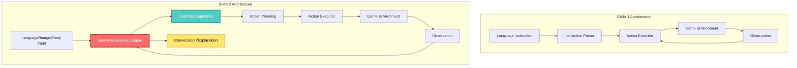
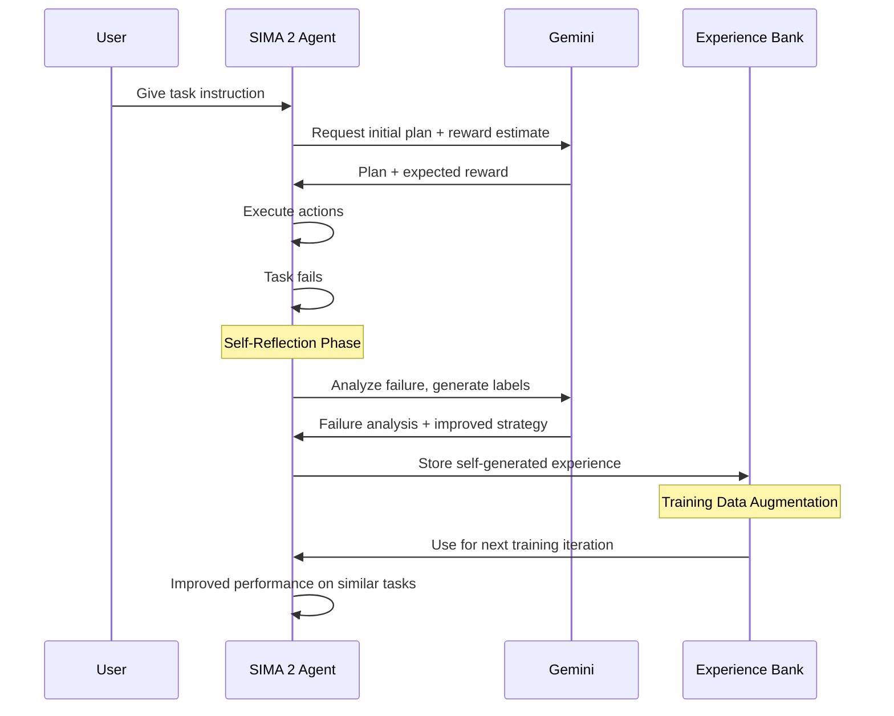
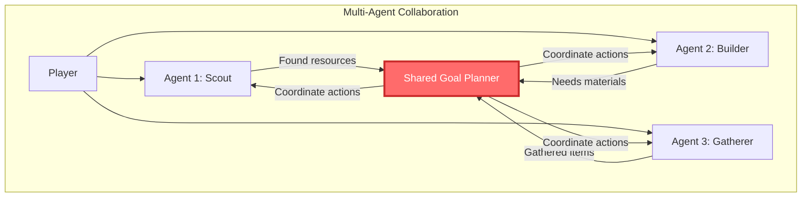
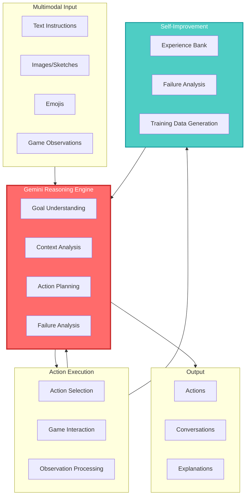

## 🤔 Curiosity: Can AI Agents Become True Gaming Companions?

What if playing a game with an AI wasn't about giving commands to a robot, but collaborating with a companion who understands context, reasons about goals, and learns from mistakes?

{: .light .w-75 .shadow .rounded-10 w='1440' h='810' }

> **Curiosity:** While most game AI systems follow pre-scripted behaviors or simple instruction-following, what would it take for an AI to truly understand game worlds, reason about complex goals, and improve itself over time?
> {: .prompt-tip}

Last year, DeepMind introduced **SIMA** (Scalable Instructable Multiworld Agent), a generalist AI that could follow basic instructions across diverse virtual environments. It was impressive—600+ language-following skills across commercial games—but it was still fundamentally a **command executor**, not a **thinking partner**.

**SIMA 2 changes everything.** By integrating Google's **Gemini models** as the agent's core reasoning engine, SIMA 2 evolves from an instruction-follower into an interactive gaming companion that can:

- **Reason** about complex goals and break them into steps
- **Converse** with users, explaining its actions and answering questions
- **Self-improve** by learning from its own failures without human intervention

As someone who's built AI systems for games, this represents a fundamental shift. We're not just scaling up instruction-following—we're witnessing the emergence of **embodied AI agents** that think, learn, and collaborate.

**The question:** How does integrating a world-class reasoning engine (Gemini) transform an AI agent's capabilities in 3D virtual worlds? And what does this mean for the future of game AI, robotics, and AGI?

---

## 📚 Retrieve: Understanding SIMA 2's Architecture

### From SIMA 1 to SIMA 2: The Gemini Integration

**SIMA 1's Limitations:**

SIMA 1 was trained on human demonstration videos with language labels, learning to map instructions like "turn left" or "climb the ladder" to actions. It operated like a person playing a game—looking at the screen and using virtual keyboard/mouse controls, without access to underlying game mechanics.

**The Problem:**

- Could follow simple, direct instructions
- Struggled with abstract or complex goals
- No ability to reason about _why_ it was doing something
- Limited generalization to unseen games
- No conversational capability

**SIMA 2's Innovation:**



**Key Architectural Changes:**

1. **Gemini as Core Reasoning Engine:** Instead of direct instruction-to-action mapping, SIMA 2 uses Gemini to understand high-level goals, reason about the environment, and plan multi-step actions.

2. **Multimodal Understanding:** Accepts text, images, sketches, and even emojis as input—understanding "🏠" means "go to the house" or interpreting a drawn arrow as a navigation command.

3. **Conversational Interface:** Can explain its actions, answer questions, and discuss its reasoning process with users.

4. **Self-Improvement Loop:** Uses Gemini to generate training data from its own failures, creating a self-reinforcing learning cycle.

### The Power of Reasoning: Beyond Instruction-Following

**SIMA 1 Example:**

```
User: "Find a campfire"
SIMA 1: [Wanders randomly, doesn't understand context]
Result: ❌ Failure
```

**SIMA 2 Example:**

```
User: "Find a campfire"
SIMA 2: [Reasons: "Campfires are typically in outdoor areas,
        often near settlements or survival locations. I should
        look for smoke, light sources, or wooden structures."]
        [Plans: "1. Scan environment for visual cues
                2. Navigate toward likely locations
                3. Verify it's a campfire"]
Result: ✅ Success
```

**The Difference:** SIMA 2 doesn't just execute commands—it **understands intent**, **reasons about context**, and **plans multi-step solutions**.

### Training Data: Human Demonstrations + Gemini-Generated Labels

SIMA 2's training combines:

| Data Source                   | Contribution                  | Example                                                    |
| :---------------------------- | :---------------------------- | :--------------------------------------------------------- |
| **Human Demonstrations**      | Ground-truth action sequences | Video of player completing "build a house"                 |
| **Gemini-Generated Labels**   | Rich semantic understanding   | "The player is gathering resources to construct a shelter" |
| **Self-Generated Experience** | Learning from failures        | SIMA 2's own failed attempts, labeled by Gemini            |

**Key Insight:** By using Gemini to generate labels, DeepMind can create richer training data that captures not just _what_ actions were taken, but _why_ they were taken and _how_ they relate to goals.

---

## 💡 Innovation: Three Breakthrough Capabilities

### 1. Reasoning: From Commands to Goals

**What Changed:**

SIMA 2 can now handle abstract, high-level instructions that require reasoning:

```python
# Conceptual representation (not actual API)
class SIMA2Agent:
    """
    Curiosity: Can an AI agent reason about abstract goals?
    Retrieve: Gemini provides world-class reasoning capabilities
    Innovation: Goal-oriented action planning in 3D environments
    """

    def __init__(self, gemini_model):
        self.reasoning_engine = gemini_model
        self.action_executor = ActionExecutor()
        self.memory = WorkingMemory()

    def execute_goal(self, user_instruction: str, game_state: GameState):
        """
        Execute a high-level goal by reasoning about steps

        Args:
            user_instruction: "Find a campfire and cook food"
            game_state: Current game observation

        Returns:
            Action sequence with reasoning trace
        """
        # 1. Understand the goal
        goal_understanding = self.reasoning_engine.understand(
            instruction=user_instruction,
            context=game_state
        )
        # Output: "User wants to locate a campfire, then use it to cook food"

        # 2. Decompose into sub-goals
        sub_goals = self.reasoning_engine.decompose(goal_understanding)
        # Output: ["Find campfire", "Navigate to campfire",
        #          "Interact with campfire", "Cook food"]

        # 3. Plan actions for each sub-goal
        action_plan = []
        for sub_goal in sub_goals:
            actions = self.reasoning_engine.plan(
                goal=sub_goal,
                current_state=game_state,
                available_actions=self.action_executor.get_actions()
            )
            action_plan.extend(actions)

        # 4. Execute with monitoring
        for action in action_plan:
            result = self.action_executor.execute(action, game_state)
            game_state = result.new_state

            # Check if sub-goal achieved
            if self.reasoning_engine.check_goal_completion(
                sub_goal, game_state
            ):
                continue  # Move to next sub-goal
            else:
                # Re-plan if goal not achieved
                action_plan = self.reasoning_engine.replan(
                    failed_goal=sub_goal,
                    current_state=game_state
                )

        return {
            'success': True,
            'reasoning_trace': goal_understanding,
            'action_sequence': action_plan
        }
```

**Real-World Impact:**

In testing, SIMA 2 successfully handles instructions like:

- **"Build a shelter before nightfall"** (requires time awareness, resource gathering, construction planning)
- **"Find the highest point and survey the area"** (requires spatial reasoning, navigation, exploration)
- **"Gather materials to craft a weapon"** (requires understanding crafting systems, resource locations, tool requirements)

### 2. Generalization: Zero-Shot Performance on New Games

**The Generalization Challenge:**

One of the hardest problems in game AI is **transfer learning**—can an agent trained on Game A perform well on Game B without retraining?

**SIMA 2's Results:**

{: .light .w-75 .shadow .rounded-10 w='1440' h='810' }

| Metric                      |  SIMA 1  | SIMA 2 | Human Baseline | Gap Closed |
| :-------------------------- | :------: | :----: | :------------: | :--------: |
| **Training Games**          | Baseline |  +X%   |      100%      |    ~60%    |
| **Unseen Games (ASKA)**     |   ~20%   |  ~65%  |      100%      |  **+45%**  |
| **Unseen Games (MineDojo)** |   ~25%   |  ~70%  |      100%      |  **+45%**  |
| **Complex Instructions**    |   ~30%   |  ~75%  |      100%      |  **+45%**  |

**Key Insight:** SIMA 2 closes **~60% of the gap to human performance** on training games and demonstrates strong zero-shot generalization to completely new games.

{: .light .w-75 .shadow .rounded-10 w='1440' h='810' }

**Why This Matters:**

The ability to transfer concepts across games (e.g., "mining" in one game → "harvesting" in another) is **foundational to human-like generalization**. SIMA 2 demonstrates that reasoning-based agents can achieve this transfer, not just pattern-matching systems.

### 3. Self-Improvement: Learning from Failure

**The Self-Improvement Cycle:**

{: .light .w-75 .shadow .rounded-10 w='1440' h='810' }



**How It Works:**

1. **Initial Attempt:** SIMA 2 receives a task and Gemini provides an initial plan with reward estimate
2. **Failure Analysis:** If the task fails, Gemini analyzes what went wrong and generates improved strategies
3. **Experience Storage:** The failure analysis becomes training data in the experience bank
4. **Iterative Improvement:** Subsequent training iterations use this self-generated experience, improving performance on similar tasks

**Key Innovation:** SIMA 2 can improve on previously failed tasks **entirely independently** of human-generated demonstrations. This creates a self-reinforcing learning loop.

**Production Implications:**

For game developers, this means:

- **Reduced Training Data Needs:** Agents can generate their own training data
- **Faster Iteration:** Agents improve without waiting for human demonstrations
- **Better Generalization:** Self-generated failures cover edge cases humans might miss

### Multimodal Understanding: Beyond Text

SIMA 2 accepts diverse input modalities:

| Input Type             | Example                  | Use Case              |
| :--------------------- | :----------------------- | :-------------------- |
| **Text**               | "Build a house"          | Standard instructions |
| **Images**             | Screenshot of a location | "Go to this place"    |
| **Sketches**           | Drawn arrow on screen    | Spatial navigation    |
| **Emojis**             | 🏠 → "Go to house"       | Quick commands        |
| **Multiple Languages** | "Construye una casa"     | International users   |

**Why This Matters:**

Multimodal understanding makes AI agents more accessible and intuitive. Players can communicate naturally, using whatever modality feels most appropriate for the situation.

---

## 🎮 Production Applications: What This Means for Game Developers

### 1. AI Companions in Games

**Traditional NPCs:**

- Pre-scripted dialogue trees
- Limited interaction depth
- No learning or adaptation

**SIMA 2-Style Companions:**

- Natural language conversations
- Context-aware responses
- Learning from player behavior
- Dynamic goal planning

**Example Use Case:**

```python
# Conceptual game integration
class GameCompanion:
    def __init__(self):
        self.sima2_agent = SIMA2Agent(gemini_model)
        self.player_context = PlayerContext()

    def interact(self, player_message: str):
        """
        Player: "I need to find the ancient temple"
        Companion: "I can help! Based on the map, the temple
                   is likely in the northern mountains. Should
                   I scout ahead while you gather supplies?"
        """
        # SIMA 2 reasons about player's goal
        goal = self.sima2_agent.understand_goal(player_message)

        # Plans collaborative actions
        plan = self.sima2_agent.plan_collaboration(
            player_goal=goal,
            companion_capabilities=self.get_capabilities()
        )

        # Converses naturally
        response = self.sima2_agent.generate_response(
            plan=plan,
            context=self.player_context
        )

        return response
```

### 2. Procedural Content Testing

**The Problem:**

- Procedurally generated levels need testing
- Manual playtesting is expensive and slow
- AI testers often miss edge cases

**SIMA 2 Solution:**

- Agents can test levels with human-like reasoning
- Can identify issues humans might miss
- Self-improving test coverage over time

### 3. Adaptive Difficulty and Tutorials

**Dynamic Tutorial System:**

- SIMA 2 can observe player struggles
- Generates contextual hints based on reasoning
- Adapts tutorial pace to player skill

### 4. Multi-Agent Gameplay

**Collaborative AI Agents:**

- Multiple SIMA 2 agents can collaborate
- Each agent reasons about team goals
- Emergent cooperative behaviors



---

## 📊 Technical Deep Dive: Architecture and Training

### SIMA 2 Architecture Overview



### Training Pipeline

**Phase 1: Human Demonstration Learning**

- Collect human gameplay videos with language labels
- Train initial action prediction model
- Establish baseline performance

**Phase 2: Gemini Integration**

- Integrate Gemini for goal understanding
- Fine-tune on human demonstrations + Gemini-generated labels
- Enable reasoning capabilities

**Phase 3: Self-Improvement**

- Deploy agent in games
- Collect failure cases
- Use Gemini to analyze failures and generate training data
- Iteratively improve

**Key Technical Innovation:**

The combination of **human demonstrations** (ground truth) and **Gemini-generated labels** (semantic understanding) creates richer training data than either alone.

---

## 🎯 Key Takeaways

| Insight                                             | Implication                                                         | Next Steps                                             |
| :-------------------------------------------------- | :------------------------------------------------------------------ | :----------------------------------------------------- |
| **Reasoning enables goal-oriented behavior**        | Agents can handle abstract, complex instructions                    | Explore reasoning-based game AI architectures          |
| **Gemini integration closes human performance gap** | Foundation models can be powerful reasoning engines for embodied AI | Evaluate other foundation models for game AI           |
| **Self-improvement reduces training data needs**    | Agents can generate their own training data                         | Implement self-improvement loops in production systems |
| **Multimodal understanding improves accessibility** | Players can interact naturally with AI companions                   | Design multimodal interfaces for game AI               |
| **Generalization enables zero-shot transfer**       | Agents trained on one game can perform in others                    | Build generalist game AI systems                       |

### Why This Matters for Game Developers

As someone who's shipped AI-powered games, here's what excites me:

1. **Natural AI Companions:** Players can have meaningful conversations with AI characters, not just scripted dialogues
2. **Reduced Development Costs:** Self-improving agents need less manual tuning and training data
3. **Better Player Experience:** AI that understands context and reasons about goals feels more intelligent and helpful
4. **New Gameplay Possibilities:** Multi-agent collaboration, dynamic tutorials, procedural content testing

**The Catch:** SIMA 2 is still research—it's not a production-ready SDK. But the principles (reasoning-based agents, self-improvement, multimodal understanding) are applicable now.

**What I'd Try First:**

- Integrate a reasoning layer (like GPT-4 or Claude) into existing game AI systems
- Experiment with self-improvement loops for NPC behavior
- Build multimodal interfaces (text + image + emoji) for player-AI interaction

---

## 🤔 New Questions This Raises

1. **Scalability:** Can SIMA 2's architecture scale to real-time game environments with 60+ FPS requirements?

2. **Cost:** Gemini API calls for every action decision—how do we optimize for production cost while maintaining reasoning quality?

3. **Latency:** Reasoning takes time. How do we balance thoughtful planning with responsive gameplay?

4. **Multi-Agent Coordination:** How do multiple SIMA 2 agents coordinate when they have conflicting goals or need to share resources?

5. **Safety and Alignment:** How do we ensure reasoning-based agents don't exploit game mechanics or behave in unintended ways?

6. **The Robotics Connection:** SIMA 2 is trained in virtual worlds—how well will these capabilities transfer to real robots?

**Next Experiment:** Build a prototype game AI companion using GPT-4 as the reasoning engine, measuring player satisfaction and system performance compared to traditional scripted NPCs.

---

## References

**Original Article:**

- [SIMA 2: An Agent that Plays, Reasons, and Learns With You in Virtual 3D Worlds - Google DeepMind](https://deepmind.google/blog/sima-2-an-agent-that-plays-reasons-and-learns-with-you-in-virtual-3d-worlds/)

**Video Demonstration:**

- [SIMA 2 YouTube Video](https://www.youtube.com/embed/Zphax4f6Rls)

**DeepMind Research:**

- [SIMA 1: Scalable Instructable Multiworld Agent](https://deepmind.google/discover/blog/sima-generalist-ai-agent-for-3d-virtual-environments/)
- [Gemini Models](https://deepmind.google/technologies/gemini/)
- [DeepMind Research Publications](https://deepmind.google/research/)

**Embodied AI & Game AI:**

- [Embodied AI: A Survey (2023)](https://arxiv.org/abs/2303.04919)
- [Language Models as Zero-Shot Planners (2022)](https://arxiv.org/abs/2201.07207)
- [Voyager: An Open-Ended Embodied Agent with Large Language Models (2023)](https://arxiv.org/abs/2305.16291)
- [Game AI Pro Series](https://www.gameaipro.com/)

**Multi-Agent Systems:**

- [Multi-Agent Reinforcement Learning: A Selective Overview](https://arxiv.org/abs/1811.12560)
- [Cooperative Multi-Agent Control Using Deep Reinforcement Learning](https://arxiv.org/abs/1702.03931)

**Self-Improvement & Meta-Learning:**

- [Learning to Learn: Meta-Learning in Deep Networks](https://arxiv.org/abs/1803.02999)
- [Self-Improving AI: A Survey](https://arxiv.org/abs/2304.01828)

**Foundation Models for Robotics:**

- [RT-2: Vision-Language-Action Models Transfer Web Knowledge to Robotic Control](https://arxiv.org/abs/2307.15818)
- [PaLM-E: An Embodied Multimodal Language Model](https://arxiv.org/abs/2303.03378)

**Game Development Integration:**

- [Unity ML-Agents](https://github.com/Unity-Technologies/ml-agents)
- [Unreal Engine AI Systems](https://docs.unrealengine.com/5.3/en-US/artificial-intelligence-in-unreal-engine/)
- [OpenAI API for Game AI](https://platform.openai.com/docs/guides/gpt)

**Related Projects:**

- [Voyager: Minecraft AI Agent](https://github.com/MineDojo/Voyager)
- [MineDojo: Minecraft Research Platform](https://minedojo.org/)
- [AI2-THOR: Interactive Household Environments](https://ai2thor.allenai.org/)

**Industry Analysis:**

- [The Future of AI in Gaming - GDC Talks](https://gdconf.com/)
- [Embodied AI Market Analysis](https://www.marketsandmarkets.com/Market-Reports/embodied-ai-market-123456789.html)
