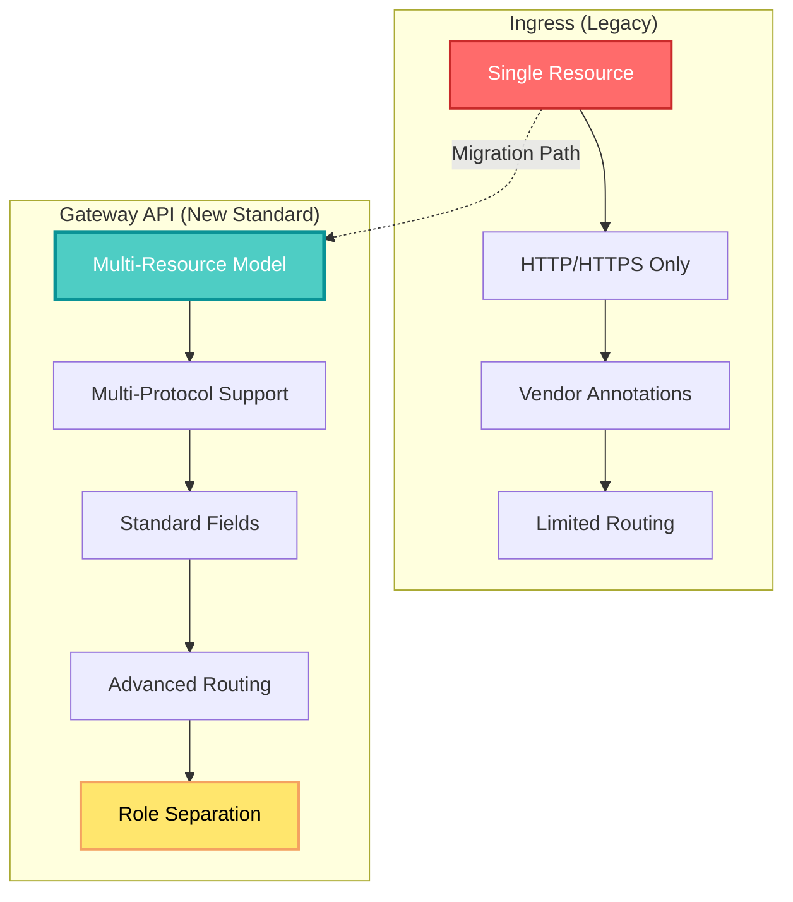
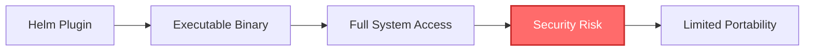
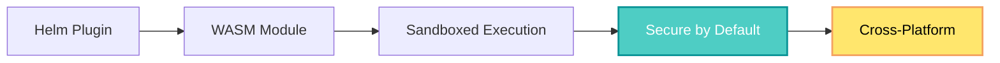
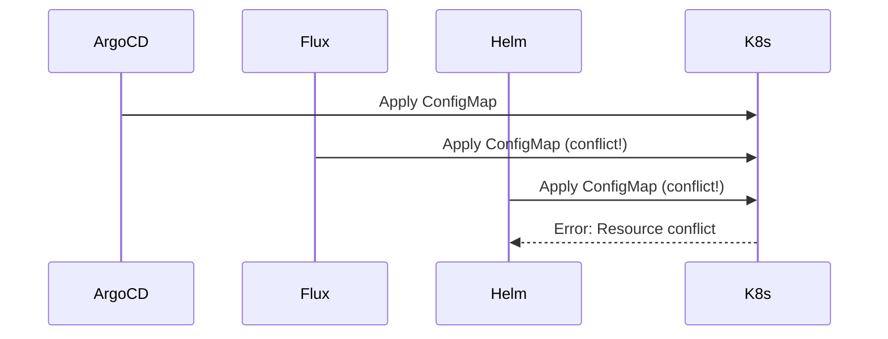
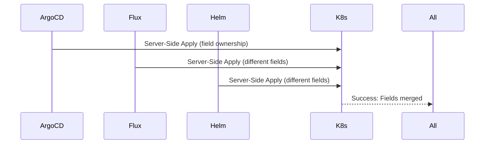
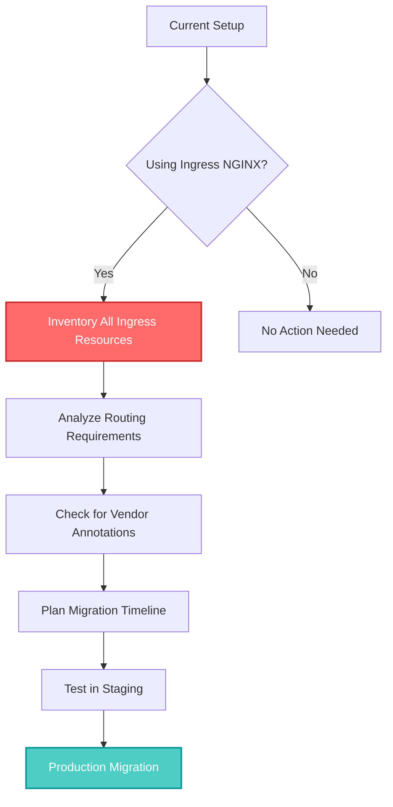

## 🤔 Curiosity: What Happens When a De Facto Standard Gets Retired?

In November 2025, the Kubernetes ecosystem received two seismic announcements that will fundamentally change how infrastructure engineers work with the platform:

1. **Ingress NGINX is being retired** - the de facto standard for Kubernetes traffic routing
2. **Helm 4.0 is officially released** - with revolutionary changes to package management

> **Curiosity:** When a tool used by millions becomes "best-effort maintenance" and then gets retired, what does that mean for production systems? And can a package manager upgrade actually be revolutionary?
{: .prompt-tip}

As someone who's managed Kubernetes clusters in production, I've seen firsthand how Ingress NGINX became the default choice for most teams. It was simple, reliable, and "just worked." But the retirement announcement forces us to ask: **What comes next?** And more importantly, **why now?**

---

## 📚 Retrieve: Understanding the Changes

### Part 1: Ingress NGINX Retirement

**The Announcement:**

On November 11, 2025, Kubernetes SIG Network and the Security Response Committee announced the upcoming retirement of Ingress NGINX. Here's what we know:

- **Best-effort maintenance** continues until **March 2026**
- After March 2026, there will be **no official Kubernetes support**
- The decision prioritizes **safety and security** of the ecosystem
- CSP (Cloud Service Provider) solutions may be less affected

**Why This Matters:**

Ingress NGINX has been the go-to solution for Kubernetes ingress for years. It's installed in countless production clusters, handling traffic routing for millions of applications. The retirement doesn't mean it stops working—but it means:

- No new features
- Limited security patches
- No official Kubernetes community support
- Migration planning becomes critical

### Part 2: Gateway API - The Successor

**Gateway API** isn't just a replacement—it's a complete reimagining of how traffic routing works in Kubernetes.



**Key Features of Gateway API:**

| Feature | Ingress | Gateway API | Impact |
|:--------|:--------|:------------|:-------|
| **Advanced Routing** | Vendor annotations required | Standard fields | ✅ No vendor lock-in |
| **Protocol Support** | HTTP/HTTPS only | TCP, UDP, gRPC, HTTP/HTTPS | ✅ Multi-protocol native |
| **Role Separation** | Single resource | GatewayClass, Gateway, Route | ✅ Clear ownership |
| **Traffic Splitting** | Complex annotations | Standard weighted routing | ✅ Simplified config |
| **Header/Query Matching** | Vendor-specific | Standard fields | ✅ Portability |

**The Three-Resource Model:**

1. **GatewayClass** - Defines the type of Gateway (infrastructure-level)
2. **Gateway** - Defines network endpoints (infrastructure-level)
3. **Route** - Defines routing rules (application-level)

This separation enables:
- **Infrastructure teams** to manage GatewayClass and Gateway
- **Application teams** to manage Routes
- **Clear boundaries** between infrastructure and application concerns

### Part 3: Helm 4.0 - Revolutionary Package Management

**Helm 4.0** represents the largest update in Helm's history, with **290 PRs** from the release candidate to the final version.

**Three Core Innovations:**

#### 1. WebAssembly (WASM) Plugin System

**The Problem with Traditional Plugins:**



**WASM Solution:**



**Benefits:**
- **Security:** Sandboxed execution prevents malicious plugins from accessing the host system
- **Portability:** WASM modules run the same on Linux, macOS, Windows
- **Performance:** Near-native execution speed
- **Isolation:** Plugin failures don't crash Helm

#### 2. Server-Side Apply (SSA) Support

**The Conflict Problem:**

When multiple tools manage the same Kubernetes resources, conflicts arise:



**Server-Side Apply Solution:**



**How SSA Works:**

- Each tool declares **field ownership**
- Kubernetes **merges** non-conflicting fields
- **Conflicts** are detected and reported at the field level
- **Predictable** resource management

**Example:**

```yaml
# ArgoCD manages: metadata.labels, spec.replicas
# Helm manages: spec.template.spec.containers[0].image
# Flux manages: spec.template.spec.containers[0].env

# Result: All three can coexist without conflicts
```

#### 3. Content-Based Chart Caching

**Old Approach (Time-Based):**

```python
# Pseudocode for old caching
def should_download_chart(chart_url, cache_dir):
    cached_file = os.path.join(cache_dir, chart_name)
    if os.path.exists(cached_file):
        # Check modification time
        if os.path.getmtime(cached_file) > (now() - cache_ttl):
            return False  # Use cache
    return True  # Download
```

**Problem:** Charts with same content but different timestamps get re-downloaded.

**New Approach (Content-Based):**

```python
# Pseudocode for new caching
def should_download_chart(chart_url, cache_dir):
    # Download chart metadata first
    remote_hash = get_chart_sha256(chart_url)
    
    cached_file = find_cached_chart_by_hash(remote_hash, cache_dir)
    if cached_file:
        return False  # Use cache (content matches)
    return True  # Download (content changed)
```

**Benefits:**
- **Efficiency:** Only download when content actually changes
- **Reliability:** Hash-based verification ensures integrity
- **Bandwidth:** Reduced unnecessary downloads
- **Speed:** Faster operations when charts haven't changed

---

## 💡 Innovation: Production Implications

### Migration Strategy: Ingress NGINX → Gateway API

**Assessment Phase:**



**Migration Checklist:**

| Task | Priority | Timeline | Notes |
|:-----|:--------:|:--------:|:------|
| **Audit all Ingress resources** | High | Week 1 | Document all routing rules |
| **Identify vendor annotations** | High | Week 1 | Map to Gateway API equivalents |
| **Test Gateway API implementation** | High | Week 2-3 | Choose implementation (Istio, Kong, etc.) |
| **Create migration scripts** | Medium | Week 3-4 | Automate resource conversion |
| **Staging environment migration** | High | Week 4-5 | Validate functionality |
| **Production migration** | Critical | Week 6+ | Phased rollout recommended |

**Example Migration:**

**Before (Ingress NGINX):**

```yaml
apiVersion: networking.k8s.io/v1
kind: Ingress
metadata:
  name: my-app
  annotations:
    nginx.ingress.kubernetes.io/rewrite-target: /
    nginx.ingress.kubernetes.io/ssl-redirect: "true"
spec:
  ingressClassName: nginx
  rules:
  - host: myapp.example.com
    http:
      paths:
      - path: /api
        pathType: Prefix
        backend:
          service:
            name: api-service
            port:
              number: 80
```

**After (Gateway API):**

```yaml
apiVersion: gateway.networking.k8s.io/v1
kind: Gateway
metadata:
  name: my-gateway
spec:
  gatewayClassName: istio
  listeners:
  - name: https
    protocol: HTTPS
    port: 443
    hostname: myapp.example.com
---
apiVersion: gateway.networking.k8s.io/v1
kind: HTTPRoute
metadata:
  name: my-app-route
spec:
  parentRefs:
  - name: my-gateway
  hostnames:
  - myapp.example.com
  rules:
  - matches:
    - path:
        type: PathPrefix
        value: /api
    backendRefs:
    - name: api-service
      port: 80
```

**Key Differences:**
- **No annotations needed** - functionality is in standard fields
- **Role separation** - Gateway (infra) vs HTTPRoute (app)
- **Type safety** - Stronger validation and error messages

### Helm 4.0 Adoption Strategy

**Immediate Benefits:**

1. **WASM Plugins** - Start migrating custom plugins to WASM
2. **SSA Support** - Resolve conflicts with ArgoCD/Flux
3. **Better Caching** - Faster CI/CD pipelines

**Upgrade Path:**

```bash
# Download Helm 4.0
wget https://get.helm.sh/helm-v4.0.0-linux-amd64.tar.gz
tar -zxvf helm-v4.0.0-linux-amd64.tar.gz
sudo mv linux-amd64/helm /usr/local/bin/helm

# Verify installation
helm version

# Test with existing charts
helm upgrade --install my-app ./my-chart --dry-run
```

**Plugin Migration Example:**

**Old Plugin (Bash Script):**

```bash
#!/bin/bash
# helm-plugin-template.sh
# Security risk: Full system access

echo "Processing template..."
# Can access any file, run any command
```

**New Plugin (WASM):**

```rust
// helm-plugin-template.wasm
// Secure: Sandboxed execution

use wasm_bindgen::prelude::*;

#[wasm_bindgen]
pub fn process_template(input: &str) -> String {
    // Only has access to provided input
    // Cannot access filesystem or network
    format!("Processed: {}", input)
}
```

**SSA Integration Example:**

```yaml
# helm-values.yaml
# With SSA, Helm only manages these fields
metadata:
  labels:
    app.kubernetes.io/managed-by: Helm
spec:
  template:
    spec:
      containers:
      - name: app
        image: myapp:v1.0.0
        # ArgoCD can manage: env, resources
        # Flux can manage: annotations
```

---

## 🎯 Key Takeaways

| Insight | Implication | Action Item |
|:--------|:------------|:------------|
| **Ingress NGINX retirement is real** | Migration planning is urgent | Audit and document all Ingress resources |
| **Gateway API is the future** | Standardization reduces vendor lock-in | Evaluate Gateway API implementations |
| **WASM plugins are more secure** | Reduced attack surface | Migrate custom plugins to WASM |
| **SSA solves multi-tool conflicts** | Better GitOps workflows | Enable SSA in Helm operations |
| **Content-based caching is faster** | Improved CI/CD performance | Upgrade to Helm 4.0 |

### Why This Matters for Infrastructure Engineers

As someone managing production Kubernetes clusters, here's what excites me:

1. **Standardization:** Gateway API eliminates the annotation hell of Ingress NGINX
2. **Security:** WASM plugins reduce the risk of malicious code execution
3. **Reliability:** SSA prevents conflicts between Helm, ArgoCD, and Flux
4. **Performance:** Content-based caching speeds up deployments

**The Challenge:** Migration requires careful planning and testing. But the benefits—standardization, security, and reliability—are worth the effort.

---

## 🤔 New Questions This Raises

1. **Which Gateway API implementation should we choose?** Istio, Kong, Envoy Gateway, or others?

2. **How do we handle the transition period?** Can we run Ingress NGINX and Gateway API side-by-side?

3. **What about existing Helm plugins?** How do we migrate complex plugins to WASM?

4. **SSA conflicts:** What happens when two tools need to manage the same field?

5. **Timeline pressure:** With Ingress NGINX maintenance ending in March 2026, how do we prioritize migration?

**Next experiment:** Set up a test cluster with Gateway API (Istio implementation) and migrate a sample application from Ingress NGINX, measuring the complexity and time required.

---

## References

**Original Article:**
- [인프라 엔지니어 주목! 쿠버네티스 생태계를 뒤흔들 두 가지 주요 업데이트 - Digital Bourgeois](https://digitalbourgeois.tistory.com/m/2307)

**Ingress NGINX Retirement:**
- [Ingress NGINX Retirement: What You Need to Know - Kubernetes Blog](https://kubernetes.io/blog/2025/11/11/ingress-nginx-retirement/)
- [Kubernetes SIG Network](https://github.com/kubernetes-sigs/gateway-api)
- [Ingress NGINX GitHub Repository](https://github.com/kubernetes/ingress-nginx)

**Gateway API:**
- [Gateway API Official Documentation](https://gateway-api.sigs.k8s.io/)
- [Gateway API Specification](https://gateway-api.sigs.k8s.io/references/spec/)
- [Gateway API Implementations](https://gateway-api.sigs.k8s.io/implementations/)
- [Migrating from Ingress to Gateway API](https://gateway-api.sigs.k8s.io/guides/migrating-from-ingress/)

**Gateway API Implementations:**
- [Istio Gateway API](https://istio.io/latest/docs/tasks/traffic-management/ingress/gateway-api/)
- [Kong Gateway API](https://docs.konghq.com/kubernetes-ingress-controller/latest/concepts/gateway-api/)
- [Envoy Gateway](https://gateway.envoyproxy.io/)
- [Traefik Gateway API](https://doc.traefik.io/traefik/routing/providers/kubernetes-gateway/)

**Helm 4.0:**
- [Helm 4.0 Full Changelog](https://helm.sh/docs/changelog)
- [Helm Official Documentation](https://helm.sh/docs/)
- [Helm GitHub Repository](https://github.com/helm/helm)
- [Helm 4.0 Release Notes](https://github.com/helm/helm/releases/tag/v4.0.0)

**WebAssembly (WASM) in Helm:**
- [WebAssembly (WASM) Overview](https://webassembly.org/)
- [WASM for Plugins - Helm RFC](https://github.com/helm/community/blob/main/rfcs/xxx-wasm-plugins.md)
- [WASM Security Model](https://webassembly.org/docs/security/)

**Server-Side Apply (SSA):**
- [Kubernetes Server-Side Apply](https://kubernetes.io/docs/reference/using-api/server-side-apply/)
- [Understanding Server-Side Apply](https://kubernetes.io/docs/reference/using-api/server-side-apply/#understanding-server-side-apply)
- [SSA Field Management](https://kubernetes.io/docs/reference/using-api/server-side-apply/#field-management)

**Migration Guides:**
- [Ingress to Gateway API Migration Guide](https://gateway-api.sigs.k8s.io/guides/migrating-from-ingress/)
- [Helm 3 to Helm 4 Migration](https://helm.sh/docs/upgrading/)
- [Best Practices for Kubernetes Ingress](https://kubernetes.io/docs/concepts/services-networking/ingress/)

**Related Tools:**
- [ArgoCD - GitOps Continuous Delivery](https://argo-cd.readthedocs.io/)
- [Flux - GitOps Toolkit](https://fluxcd.io/)
- [Kustomize - Kubernetes Native Configuration Management](https://kustomize.io/)

**Community Resources:**
- [Kubernetes Slack - #gateway-api](https://kubernetes.slack.com/archives/C01A9LQFN2X)
- [Helm Slack - #helm-dev](https://kubernetes.slack.com/archives/C51E88VDG)
- [Kubernetes SIG Network Meetings](https://github.com/kubernetes/community/tree/master/sig-network)

**Production Case Studies:**
- [Gateway API Adoption Stories](https://gateway-api.sigs.k8s.io/implementations/#adoption-stories)
- [Helm in Production - CNCF Case Studies](https://www.cncf.io/case-studies/)

**Security & Best Practices:**
- [Kubernetes Security Best Practices](https://kubernetes.io/docs/concepts/security/)
- [Helm Security Best Practices](https://helm.sh/docs/chart_best_practices/security/)
- [Gateway API Security](https://gateway-api.sigs.k8s.io/concepts/security/)
