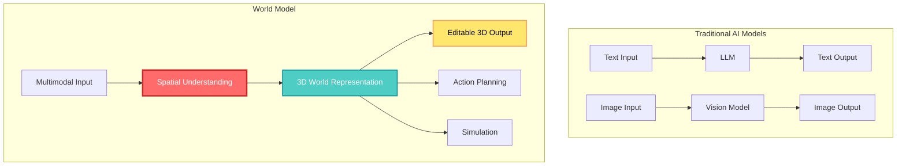
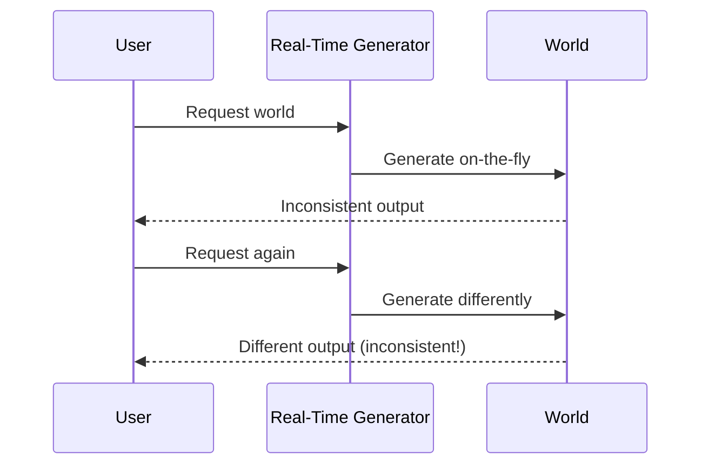
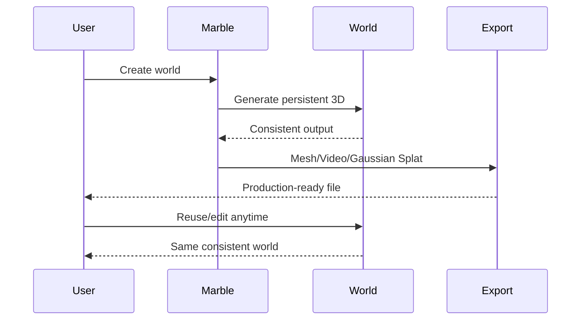
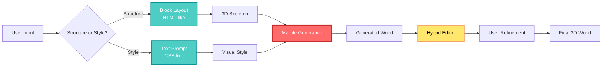
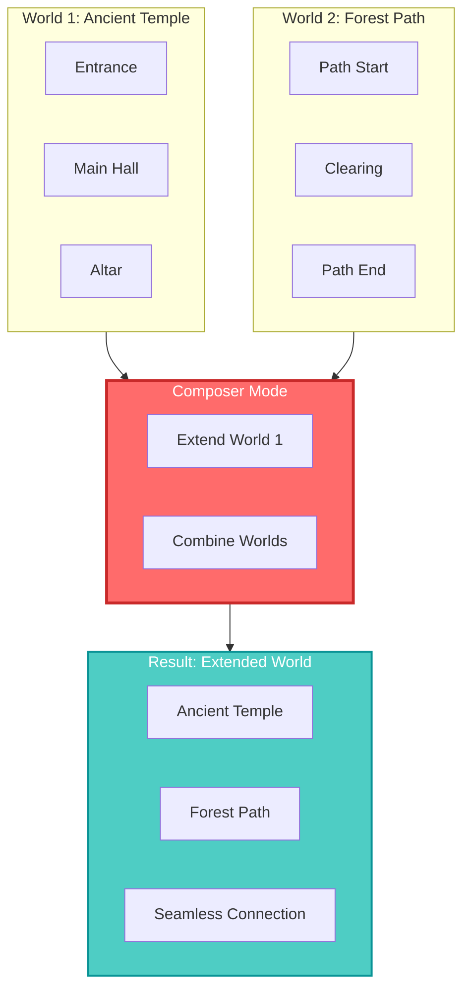
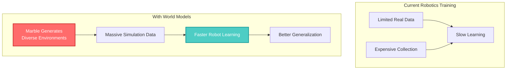
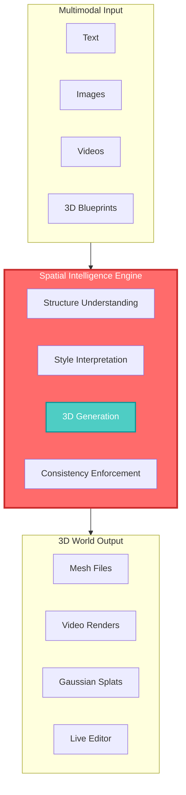

## 🤔 Curiosity: Can AI Build Persistent 3D Worlds We Can Actually Use?

On November 6, 2025, **WorldLabs**—founded by Fei-Fei Li, the Stanford professor often called the "Godmother of AI"—announced the launch of **Marble**, the world's first commercial **World Model**. This isn't just another AI tool. It's a fundamental shift in how machines understand and interact with 3D space.

> **Curiosity:** While Google and Meta are still researching World Models, how did a startup beat them to commercialization? And what does "spatial intelligence" actually mean for the future of AI?
{: .prompt-tip}

As someone who's built AI systems for games and interactive experiences, I've always been frustrated by the gap between **what AI can generate** (beautiful 2D images, coherent text) and **what we actually need** (consistent, editable, persistent 3D environments). Most AI-generated 3D content is either too inconsistent for production use or requires so much manual cleanup that it defeats the purpose.

**The question:** Can a World Model finally bridge this gap? Can AI not just generate 3D content, but understand spatial relationships, maintain consistency, and create worlds we can actually build upon?

---

## 📚 Retrieve: Understanding World Models and Spatial Intelligence

### What is a World Model?

A **World Model** is fundamentally about **Spatial Intelligence**—the ability for AI to observe, understand, and construct the physical world. Unlike traditional AI that processes text or images, World Models create **digital representations of the world** that enable:

- **Internal understanding** of 3D environments
- **Future prediction** of how environments might change
- **Action planning** based on spatial reasoning
- **Simulation** of physical interactions



### The Challenge: Consistency vs. Real-Time Generation

**Previous World Model Research:**

Most research focused on **real-time world generation** during AI exploration:
- AI generates worlds on-the-fly as it explores
- Fast and flexible
- **Problem:** Generated worlds lack consistency and persistence

**Marble's Innovation:**

Marble creates **persistent, downloadable 3D environments**:
- Worlds are generated once and remain consistent
- Can be exported in standard formats (Mesh, Video, Gaussian Splat)
- Ready for production use in game engines, VFX pipelines, VR

### Spatial Intelligence: The Foundation

**Spatial Intelligence** enables AI to:

| Capability | Traditional AI | Spatial Intelligence |
|:-----------|:--------------|:---------------------|
| **Understanding** | Text/images in isolation | 3D spatial relationships |
| **Reasoning** | Pattern matching | Spatial planning and navigation |
| **Generation** | 2D outputs | Consistent 3D worlds |
| **Interaction** | Limited | Physical world simulation |

Fei-Fei Li's vision: *"If language models taught machines to read and write, World Models will teach machines to see, understand, and build space."*

---

## 💡 Innovation: Marble's Revolutionary Features

### 1. Persistent, Downloadable 3D Environments

**The Problem with Real-Time Generation:**



**Marble's Solution:**



**Key Advantage:** Worlds can be exported to:
- **Mesh formats** (OBJ, FBX, GLTF) for game engines
- **Video formats** for preview/rendering
- **Gaussian Splat** for high-quality visualization
- **Direct integration** with Unity, Unreal Engine

### 2. World's First AI Editing + Hybrid 3D Editor

Marble introduces a revolutionary workflow that combines AI generation with manual control:



**The HTML/CSS Analogy:**

Justin Johnson, WorldLabs co-founder, explains: *"It's like building a webpage—you create the structure with HTML (blocks), then style it with CSS (text prompts)."*

**Workflow:**
1. **Structure Layout (HTML-like):** Place walls, boxes, planes as building blocks
2. **Style Specification (CSS-like):** Use text prompts like "ancient ruins style" or "futuristic city"
3. **AI Generation:** Marble creates the 3D environment
4. **Hybrid Editing:** Fine-tune AI output with manual controls

**Why This Matters:** Users maintain **creative control** while leveraging AI's generation power.

### 3. Composer Mode: Extend and Combine Worlds

**Composer Mode** enables:
- **Extension:** Grow existing worlds by adding new sections
- **Combination:** Merge multiple worlds into larger environments
- **Scalability:** Build massive, complex 3D spaces incrementally



### Multimodal Input Support

Marble accepts diverse input types:

| Input Type | Use Case | Example |
|:-----------|:---------|:--------|
| **Text** | Conceptual generation | "A cyberpunk city at night" |
| **Images** | Style transfer | Photo of a real location |
| **Videos** | Motion capture | Walkthrough video |
| **3D Blueprints** | Precise layouts | Architectural CAD files |
| **360 Panoramas** | Immersive environments | VR capture |

---

## 🎮 Production Applications: Real-World Impact

### 1. Game Development

**Traditional Pipeline:**
- Artists create 3D assets manually
- Time-consuming and expensive
- Limited iteration speed

**With Marble:**
- Generate background environments and inactive spaces
- Export to Unity/Unreal Engine
- Add interactive elements manually
- **Result:** Faster asset creation, more iteration cycles

```python
# Conceptual workflow (not actual API)
import marble

# Generate game environment
world = marble.create(
    structure="medieval castle layout",
    style="dark fantasy, gothic architecture",
    format="gltf"
)

# Export to Unity
world.export("castle_environment.gltf")

# In Unity: Add gameplay elements
# - NPCs, quests, interactive objects
# - Physics, lighting, audio
```

**Key Insight:** Marble doesn't replace game development pipelines—it **accelerates asset generation** for non-interactive spaces.

### 2. Film VFX

**The Camera Control Problem:**

Traditional AI video generation struggles with:
- Unstable camera movements
- Inconsistent scene geometry
- Frame-to-frame flickering

**Marble's Solution:**
- Generate consistent 3D environments
- Control camera movements precisely
- Render stable, professional-quality sequences

### 3. Virtual Reality

**VR Content Creation Challenges:**
- High-quality 3D environments are expensive
- Limited content library
- Long development cycles

**Marble's Advantage:**
- Generate VR-ready environments instantly
- Compatible with Apple Vision Pro, Meta Quest 3
- Enable rapid prototyping and iteration

### 4. Robotics (Future Potential)

**The Data Problem:**
- Robots need massive training datasets
- Real-world data collection is expensive and slow
- Simulation environments are limited

**Marble's Potential:**
- Generate diverse simulation environments
- Create training scenarios at scale
- Accelerate robot learning through synthetic data



---

## 📊 Pricing and Commercial Model

Marble launched with **4 pricing tiers**:

| Tier | Features | Target Users |
|:-----|:---------|:-------------|
| **Free** | Basic generation, limited exports | Experimentation, learning |
| **Standard** | More generations, standard exports | Individual creators |
| **Pro** | High-volume, priority processing | Professional studios |
| **Max** | Enterprise features, custom support | Large organizations |

**Strategic Insight:** The free tier enables experimentation, while paid tiers target production use cases.

---

## 🔬 Technical Deep Dive: How Marble Works

### Architecture Overview



### Key Technical Innovations

**1. Persistent World Representation**

Unlike real-time generators, Marble maintains:
- **Consistent geometry** across generations
- **Stable textures** and materials
- **Preserved spatial relationships**

**2. Hybrid Editing System**

Combines:
- **AI generation** for initial creation
- **Manual editing** for precision control
- **Seamless workflow** between modes

**3. Multi-Format Export**

Supports industry standards:
- **Mesh formats** (OBJ, FBX, GLTF) for 3D software
- **Video formats** for preview and rendering
- **Gaussian Splatting** for high-quality visualization

---

## 🎯 Key Takeaways

| Insight | Implication | Next Steps |
|:--------|:------------|:-----------|
| **Spatial Intelligence is the next AI frontier** | Beyond text/images, AI needs 3D understanding | Explore spatial reasoning applications |
| **Persistence enables production use** | Consistent outputs are essential for real projects | Evaluate consistency in AI tools |
| **Hybrid AI+Manual workflows win** | Full automation isn't always better | Design for human-AI collaboration |
| **World Models enable new applications** | Gaming, VFX, VR, robotics all benefit | Identify spatial intelligence use cases |

### Why This Matters for Game Developers

As someone who's shipped AI-powered games, here's what excites me:

1. **Faster Prototyping:** Generate game environments in minutes, not weeks
2. **More Iteration:** Test multiple art styles and layouts quickly
3. **Cost Reduction:** Lower asset creation costs for background elements
4. **Creative Freedom:** Experiment with environments that would be too expensive to build manually

**The Catch:** Marble generates **environments**, not **gameplay**. You still need:
- Game design and mechanics
- Interactive elements
- Balancing and tuning
- Player experience design

But that's fine—**Marble accelerates the foundation, letting you focus on what makes games fun.**

---

## 🤔 New Questions This Raises

1. **How do World Models scale?** Can Marble generate entire cities, or is it limited to smaller environments?

2. **What about physics simulation?** Can generated worlds include realistic physics, or are they purely visual?

3. **Multiplayer implications:** How do World Models handle shared, persistent worlds for multiplayer games?

4. **The Google/Meta response:** With tech giants working on World Models, how will the competitive landscape evolve?

5. **Real-time vs. Pre-generated:** When is real-time generation better than persistent worlds?

**Next experiment:** Build a game prototype using Marble-generated environments, measuring development time and quality compared to traditional asset creation.

---

## References

**Original Article:**
- [AI가 3D 세계를 구축한다? 'AI 대모' 페이페이 리의 월드랩스, 세계 최초 상용 '월드 모델' 마블 출시 - Digital Bourgeois](https://digitalbourgeois.tistory.com/m/2305)

**WorldLabs & Marble:**
- [WorldLabs Official Website](https://www.worldlabs.ai/)
- [Marble - Create with Marble](https://marble.worldlabs.ai/)
- [WorldLabs About](https://www.worldlabs.ai/about)
- [Marble Labs](https://www.worldlabs.ai/labs)

**Fei-Fei Li:**
- [Fei-Fei Li - Stanford University](https://profiles.stanford.edu/fei-fei-li)
- [Fei-Fei Li - Human-Centered AI Institute](https://hai.stanford.edu/people/fei-fei-li)
- [Fei-Fei Li - ImageNet and the Dawn of Modern AI](https://www.technologyreview.com/2021/07/20/1030043/ai-imagenet-data-set-machine-learning-history/)

**World Models Research:**
- [World Models - Ha & Schmidhuber (2018)](https://arxiv.org/abs/1803.10122)
- [Dreamer: Learning Behaviors by Latent Imagination](https://arxiv.org/abs/1912.01603)
- [Learning Latent Dynamics for Planning from Pixels](https://arxiv.org/abs/1811.04551)
- [World Models for Robotics](https://arxiv.org/abs/2302.14150)

**Spatial Intelligence:**
- [Spatial Intelligence in AI - Survey Paper](https://arxiv.org/abs/2304.12520)
- [3D Scene Understanding](https://arxiv.org/abs/2301.07465)
- [Neural Radiance Fields (NeRF)](https://arxiv.org/abs/2003.08934)
- [3D Gaussian Splatting](https://repo-sam.inria.fr/fungraph/3d-gaussian-splatting/)

**3D Generation AI:**
- [DreamFusion: Text-to-3D using 2D Diffusion](https://arxiv.org/abs/2209.14988)
- [Point-E: A System for Generating 3D Point Clouds from Complex Prompts](https://arxiv.org/abs/2212.08751)
- [Shap-E: Generating Conditional 3D Implicit Functions](https://arxiv.org/abs/2305.02463)
- [TripoSR: Fast 3D Object Reconstruction from a Single Image](https://arxiv.org/abs/2403.02151)

**Competing Technologies:**
- [Google's World Model Research](https://deepmind.google/discover/blog/generative-ai-for-3d/)
- [Meta's 3D Generation Research](https://ai.meta.com/research/publications/)
- [OpenAI's 3D Generation](https://openai.com/research/)

**Game Development Integration:**
- [Unity 3D Asset Pipeline](https://docs.unity3d.com/Manual/ImportingAssets.html)
- [Unreal Engine Asset Import](https://docs.unrealengine.com/5.3/en-US/importing-content-into-unreal-engine/)
- [GLTF Format Specification](https://www.khronos.org/gltf/)
- [Gaussian Splatting in Game Engines](https://github.com/mkkellogg/GaussianSplattingUnity)

**VFX & Film Production:**
- [AI in VFX - Industry Trends](https://www.vfxvoice.com/ai-in-visual-effects/)
- [Virtual Production Techniques](https://www.unrealengine.com/en-US/virtual-production)
- [Camera Control in AI Video](https://arxiv.org/abs/2304.08503)

**VR & AR:**
- [Apple Vision Pro Development](https://developer.apple.com/visionos/)
- [Meta Quest Development](https://developer.oculus.com/)
- [VR Content Creation Tools](https://www.unrealengine.com/en-US/vr)

**Robotics & Simulation:**
- [Sim-to-Real Transfer in Robotics](https://arxiv.org/abs/1703.06907)
- [Synthetic Data for Robot Learning](https://arxiv.org/abs/2303.04123)
- [Gazebo Simulator](https://gazebosim.org/)
- [NVIDIA Isaac Sim](https://developer.nvidia.com/isaac-sim)

**Related Companies & Projects:**
- [Luma AI - 3D Generation](https://lumalabs.ai/)
- [CSM AI - 3D Asset Generation](https://www.csm.ai/)
- [Rodin - 3D Generation](https://arxiv.org/abs/2302.04944)
- [Magic3D - High-Resolution Text-to-3D](https://arxiv.org/abs/2211.10440)

**Industry Analysis:**
- [The Future of 3D Content Creation](https://www.gartner.com/en/articles/the-future-of-3d-content-creation)
- [AI in Game Development - GDC Talks](https://gdconf.com/)
- [Spatial Computing Market Analysis](https://www.mckinsey.com/industries/technology-media-and-telecommunications/our-insights/the-spatial-computing-market)
