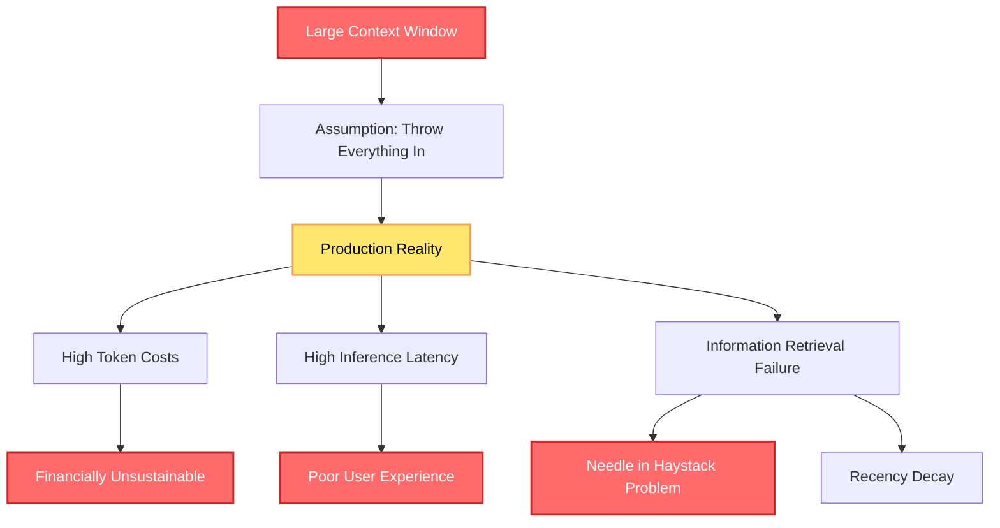
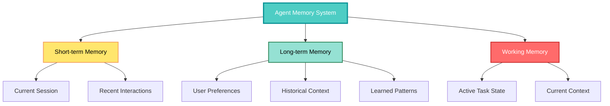
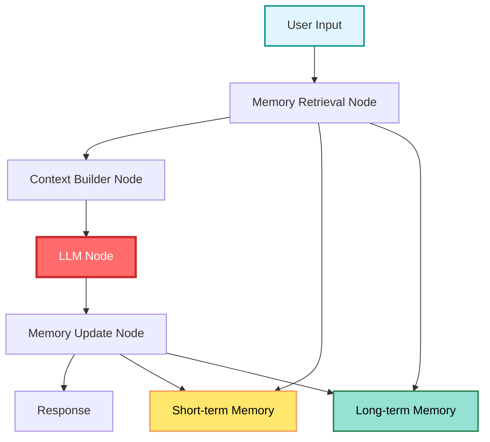

## 🤔 Curiosity: Why Do AI Agents Need Memory Management?

When you chat with ChatGPT or Claude, it seems like they remember everything you've said. But do they really? What happens when an agent needs to maintain context across multiple sessions, remember user preferences, or learn from past interactions? Is simply increasing the context window enough, or do we need something more sophisticated?

> **Curiosity:** How do AI agents actually "remember" information? What's the difference between memory, knowledge, and tools? And why is memory optimization crucial for production agent systems?
> {: .prompt-tip}

**The reality:** Every request to a large language model is **stateless**. The model only knows what's in the prompt you send at that moment. To simulate memory, the system must manage context explicitly: choosing what to keep, what to discard, and what to retrieve before each new model call.

As someone building production AI systems, I've seen this pattern repeatedly: agents that work perfectly in demos fail in production because they can't manage memory effectively. The problem isn't the LLM—it's the memory system design.

**The question:** How do we design memory systems that enable agents to remember what matters, forget what doesn't, and retrieve information efficiently?

> **Retrieve:** Memory is not a property of the model itself—it's a system design problem. Unlike knowledge (static, global information) or tools (on-demand information access), memory is dynamic and contextual, consisting of data stored during operations like conversation history, user preferences, and task state.
> {: .prompt-info}

{: .light .shadow .rounded-10 w='1212' h='668' }

---

## 📚 Retrieve: Understanding Memory, Knowledge, and Tools

### The Three Pillars of Agent Information

Before diving into memory optimization, it's crucial to understand three related but distinct concepts:

| Concept       | Nature              | Scope                       | Example                                            |
| :------------ | :------------------ | :-------------------------- | :------------------------------------------------- |
| **Knowledge** | Static, global      | Background information      | Documentation, knowledge base, training data       |
| **Tools**     | On-demand           | Fetch/calculate when needed | Web browser, database query, calculator            |
| **Memory**    | Dynamic, contextual | Stored during operations    | Conversation history, user preferences, task state |

**Key Distinctions:**

1. **Knowledge** refers to information that is static or global:

   - Knowledge bases, documentation, facts learned during training
   - Doesn't change based on user interactions
   - Background information accessible at any time

2. **Tools** fill a different role:

   - Let agents fetch, calculate, or derive information on demand
   - Web browser, database query, calculator
   - Help access information but don't remember by default

3. **Memory** is different from both:
   - Dynamic and contextual
   - Data stored during operations: conversation history, user preferences, previous outputs, task state
   - Tells the agent what has been happening over time, not just what is true about the world

### Why Memory Matters

**Without Memory:**

- Every interaction is a blank slate
- Users must repeat themselves constantly
- Agents lose context between steps of multi-turn tasks
- Personalization becomes impossible
- Agents can't learn from past experiences

**With Memory:**

- Context-aware agents that remember facts like:
  - "You like to eat Pizza without capsicum"
  - "This ticket is about login errors in the mobile app"
  - "We've already generated a draft for this topic"
  - "The user rejected the last suggestion. Don't propose it again"

**Key Benefits:**

1. **Context Retention:** Agents can carry on coherent dialogues, referring back to earlier parts without repeating details
2. **Personalization:** Store user-specific information and tailor responses accordingly
3. **Continuous Learning:** Remember outcomes and facts from previous runs to improve decision-making

---

## 💡 Innovation: The Context Problem in Production

### The False Promise of Large Context Windows

Many developers assume that ever-increasing context windows (100K, 200K, or even 1 million tokens) will eliminate the need for memory management. They think: "With a large enough window, just throw everything into the prompt and let the model handle it."

**This assumption breaks down in production:**



### Three Critical Production Problems

**1. Token Costs**

Every token sent to the LLM costs money. Sending a massive, unmanaged 200,000-token conversation history on every single turn is financially unsustainable.

**Example:**

- Average conversation: 200K tokens
- Cost per 1K tokens: $0.01 (example)
- Cost per turn: $2.00
- 1000 users, 10 turns each: $20,000

**Solution:** Strategic memory management reduces token costs by 80-90%.

**2. Inference Latency**

Injecting enormous contexts into every prompt leads to high inference latency. If users wait 10-15 seconds for a response, your system is failing in production.

**Impact:**

- Large contexts → Slow inference → Poor UX
- Users expect < 2 second responses
- Memory optimization enables fast, relevant context retrieval

**3. Information Retrieval Failure**

Simply including everything doesn't mean the agent will use it. This is the most subtle and arguably most important failure mode.

**Research Findings:**

1. **"Needle in a Haystack" Problem:**

   - Information buried deep in massive context is often ignored
   - Context window is wide, but focus is narrow
   - Models struggle to find relevant information in large contexts

2. **Recency Decay:**
   - LLMs often suffer from recency bias
   - Crucial, recently added instructions can be forgotten if surrounded by verbose history
   - Models might ignore new rules buried in long-standing system instructions

**Google DeepMind's Gemini 2.5 Discovery:**

The Gemini 2.5 technical report revealed that instead of using training to develop new strategies, agents became fixated on repeating past actions from extensive context history. This teaches us that:

> **Memory is not a passive storage mechanism—it's an active process of strategic placement.**

We must carefully engineer context to ensure agents use the right information at the right time.

### The Need for Memory Optimization

**Key Insight:** It's not just about what the LLM remembers, but **how you present it** to the LLM. This is crucial for building effective production agents.

**Requirements:**

- Agents must actively manage memory
- Most relevant facts must be prioritized
- System must be more nuanced than a simple history dump
- Selective memory: remember what matters, forget what doesn't

**Challenge:** Maintaining consistent memory over prolonged interactions or tasks, just as humans selectively remember important details and let trivial ones fade.

---

## 🎯 Memory Optimization Strategies

### Strategic Memory Management

**Core Principles:**

1. **Relevance Over Volume:** Store only what's relevant, not everything
2. **Active Retrieval:** Retrieve information strategically, not passively
3. **Contextual Placement:** Present information where it's most effective
4. **Selective Forgetting:** Discard irrelevant information to prevent bloat

### Memory Types in Agent Systems



**1. Short-term Memory:**

- Current session context
- Recent interactions
- Temporary task state
- Typically: Last N turns or time-based window

**2. Long-term Memory:**

- User preferences
- Historical context
- Learned patterns
- Persistent across sessions

**3. Working Memory:**

- Active task state
- Current context being processed
- Information needed for immediate decision

### Implementation Approaches

**Traditional Approach: Simple History Dump**

```python
# ❌ Bad: Dumping everything
class SimpleMemoryAgent:
    def __init__(self):
        self.conversation_history = []

    def chat(self, user_input):
        # Add everything to history
        self.conversation_history.append({
            'role': 'user',
            'content': user_input
        })

        # Send entire history to LLM
        response = self.llm.generate(
            messages=self.conversation_history  # Everything!
        )

        self.conversation_history.append({
            'role': 'assistant',
            'content': response
        })

        return response
```

**Problems:**

- Grows unbounded
- Includes irrelevant information
- High token costs
- Slow inference

**Optimized Approach: Strategic Memory Management**

```python
# ✅ Good: Strategic memory management
class OptimizedMemoryAgent:
    def __init__(self):
        self.short_term_memory = []  # Recent context
        self.long_term_memory = VectorDB()  # Persistent storage
        self.max_short_term = 10  # Last 10 turns

    def chat(self, user_input):
        # 1. Retrieve relevant long-term memory
        relevant_context = self.long_term_memory.search(
            query=user_input,
            top_k=5
        )

        # 2. Maintain bounded short-term memory
        if len(self.short_term_memory) >= self.max_short_term:
            # Move old context to long-term
            self._archive_old_context()

        # 3. Build optimized context
        context = self._build_context(
            short_term=self.short_term_memory,
            long_term=relevant_context,
            current_input=user_input
        )

        # 4. Generate response
        response = self.llm.generate(messages=context)

        # 5. Update memory
        self._update_memory(user_input, response)

        return response

    def _build_context(self, short_term, long_term, current_input):
        """Build optimized context with only relevant information"""
        messages = []

        # Add system prompt
        messages.append({
            'role': 'system',
            'content': self.system_prompt
        })

        # Add relevant long-term context
        for item in long_term:
            messages.append({
                'role': 'system',
                'content': f"Context: {item['content']}"
            })

        # Add recent short-term context
        messages.extend(short_term[-5:])  # Last 5 turns

        # Add current input
        messages.append({
            'role': 'user',
            'content': current_input
        })

        return messages
```

**Benefits:**

- Bounded memory growth
- Only relevant information included
- Reduced token costs
- Faster inference
- Better information retrieval

---

## 🛠️ LangGraph for Memory Management

### Why LangGraph?

**LangGraph** is designed for stateful, multi-actor applications leveraging LLMs. Unlike traditional linear workflows, LangGraph introduces:

- **Graph-based execution model:** Workflows as graphs of nodes and edges
- **Persistent state management:** Built-in state handling
- **Multi-agent coordination:** Better suited for advanced applications

**Key Advantages for Memory:**

1. **Stateful Execution:** Natural fit for memory management
2. **Graph Structure:** Enables complex memory retrieval patterns
3. **Persistent State:** Built-in mechanisms for state persistence
4. **Modular Design:** Easy to add memory components

### LangGraph Memory Architecture



**Node Responsibilities:**

1. **Memory Retrieval Node:** Retrieves relevant information from memory stores
2. **Context Builder Node:** Constructs optimized context for LLM
3. **LLM Node:** Generates response using optimized context
4. **Memory Update Node:** Updates memory with new information

---

## 🎯 Key Takeaways

| Insight                                | Implication                   | Action Item                           |
| :------------------------------------- | :---------------------------- | :------------------------------------ |
| **Memory ≠ Knowledge ≠ Tools**         | Understand the distinction    | Design separate systems for each      |
| **Large context ≠ Better performance** | Context management is crucial | Implement strategic memory management |
| **Token costs matter**                 | Unmanaged memory is expensive | Optimize context size                 |
| **Information retrieval fails**        | Strategic placement matters   | Design retrieval systems carefully    |
| **Memory is active, not passive**      | Requires active management    | Build memory management systems       |

### Why This Matters

Memory optimization is crucial for production agent systems:

1. **Cost Efficiency:** Reduces token costs by 80-90%
2. **Performance:** Enables fast inference (< 2 seconds)
3. **Reliability:** Improves information retrieval accuracy
4. **Scalability:** Supports long-running, multi-session interactions
5. **User Experience:** Enables personalization and context awareness

**The Challenge:** Building memory systems that balance relevance, efficiency, and accuracy. But with proper design, agents can remember what matters and forget what doesn't.

---

## 🤔 New Questions This Raises

1. **How do we determine what information is relevant?** What metrics should we use for memory retrieval?

2. **What's the optimal balance between short-term and long-term memory?** How do we decide what to archive?

3. **How do we handle memory conflicts?** What happens when new information contradicts old memories?

4. **Can we learn memory management strategies?** Can agents learn which information to keep vs. discard?

5. **How do we evaluate memory systems?** What metrics matter for production memory optimization?

**Next steps:** In Part B, we'll dive into practical implementations using LangGraph, covering specific memory patterns, retrieval strategies, and optimization techniques.

---

## References

**Original Article:**

- [A Practical Deep Dive Into Memory Optimization for Agentic Systems (Part A)](https://www.dailydoseofds.com/ai-agents-crash-course-part-15-with-implementation/)

**AI Agents Crash Course:**

- [Daily Dose of Data Science - AI Agents Crash Course](https://www.dailydoseofds.com/)

**Memory and Context Management:**

- [MemGPT: External Memory Management for LLMs](https://arxiv.org/abs/2310.08560)
- [Needle in a Haystack: Information Retrieval in Long Contexts]()
- [Gemini 2.5 Technical Report](https://deepmind.google/technologies/gemini/)

**LangGraph:**

- [LangGraph Documentation](https://langchain-ai.github.io/langgraph/)
- [LangGraph: Stateful Multi-Actor Applications](https://github.com/langchain-ai/langgraph)

**Context Engineering:**

- [Context Engineering: A New Discipline]()
- [Many-Shot In-Context Learning](https://arxiv.org/abs/2404.11018)

**Vector Databases for Memory:**

- [Pinecone: Vector Database](https://www.pinecone.io/)
- [Weaviate: Vector Database](https://weaviate.io/)
- [Chroma: Embeddings Database](https://www.trychroma.com/)

**Memory Optimization Techniques:**

- [Efficient LLM Inference with I/O-Aware Partial KV Cache Recomputation](https://www.themoonlight.io/ko/review/efficient-llm-inference-with-io-aware-partial-kv-cache-recomputation)
- [Efficient LLM Inference with Activation Checkpointing and Hybrid Caching](https://arxiv.org/abs/2501.01792)
