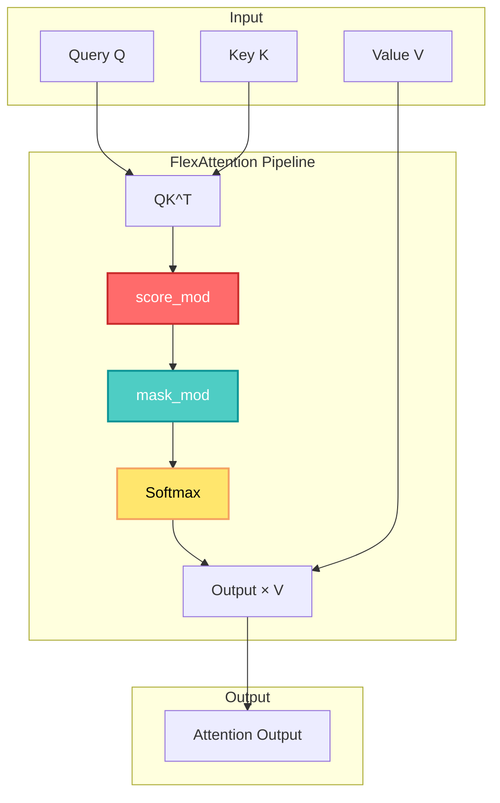

## 🤔 Curiosity: Can We Unify All Attention Variants Under One Framework?

What if we could implement causal attention, sliding window attention, ALiBi, and dozens of other attention variants using a single, elegant API? What if this unified framework could achieve 95% of FlashAttention 3's performance while being flexible enough to support novel attention patterns?

{: .light .w-75 .shadow .rounded-10 w='800' h='600' }

> **Curiosity:** Attention mechanisms have evolved into many variants—causal, sliding window, ALiBi, and more. Can we unify them all under one framework without sacrificing performance?
{: .prompt-tip}

Many variants of attention have become popular in recent years, each addressing specific needs: **causal attention** for autoregressive language modeling, **sliding window attention** for long-context efficiency, **ALiBi** for better extrapolation, and many others. The PyTorch team at Meta recognized that most of these variants can be unified under one elegant framework called **FlexAttention**.

**The question:** How does FlexAttention work, and how can developers use it to implement custom attention variants efficiently?

As someone who's worked with attention mechanisms in production, I've seen how different variants require different implementations. FlexAttention offers a unified approach that's both flexible and performant.

---

## 📚 Retrieve: Understanding FlexAttention

### The FlexAttention Framework

**Core Concept:**

FlexAttention adds two options for customization:
1. **`score_mod`**: A callable that modifies pre-softmax attention scores
2. **`mask_mod`**: A callable that masks out pre-softmax attention scores

The unified formula is:

$$\text{FlexAttention}(Q, K, V) = \text{Softmax}\left(\text{mask\_mod}\left(\text{score\_mod}\left(QK^T\right)\right)\right) V$$

**Key Insight:** `mask_mod` is a special case of `score_mod` where scores are set to `-inf`. They're kept separate for efficiency reasons, especially when dealing with block sparsity.

**Performance:**

The original FlexAttention implementation in Triton achieved ~90% of FlashAttention 2 performance on Ampere GPUs, but performance on Hopper was significantly worse compared to FlashAttention 3.

**The CuTe DSL Implementation:**

The implementation in FlashAttention 3 CuTe DSL, done in collaboration with Driss Guessous (Meta) and Tri Dao (Princeton; Together AI), achieves **95% of FlashAttention 3's performance** in the forward pass. This is a roughly **50% speedup** over the Triton version in most cases.



---

## 💡 Innovation: Implementing FlexAttention

### Score Modification

**The `score_mod` Callable:**

The `score_mod` callable modifies pre-softmax attention scores based on position and optional auxiliary tensors. The generic signature is:

```python
def generic_score_mod(
    score: float,
    batch_idx: int,
    head_idx: int,
    q_idx: int,
    kv_idx: int,
    aux_tensors: Optional[list[tensor]],
) -> float:
    # Modify score based on position and aux tensors
    return modified_score
```

**Example 1: T5 Relative Positional Bias**

```python
def rel_bias_score_mod(score, batch_idx, head_idx, q_idx, kv_idx, aux_tensors):
    bias_tensor = aux_tensors[0]
    rel_pos = math.abs(q_idx - kv_idx)
    return score + bias_tensor[batch_idx, head_idx, rel_pos]
```

**Example 2: ALiBi (Attention with Linear Biases)**

```python
def alibi_score_mod(score, batch_idx, head_idx, q_idx, kv_idx, aux_tensors):
    slope = math.exp2(-(head_idx + 1))
    dist = math.abs(q_idx - kv_idx)
    return score - slope * dist
```

**CuTe DSL Implementation:**

In the CuTe DSL implementation, `score_mod` must be defined using the **TensorSSA** abstraction. For example, T5 bias:

```python
@cute.jit
def rel_bias_score_mod_cute(
    tSrS_ssa: cute.TensorSSA,
    batch_idx: cute.TensorSSA,
    head_idx: cute.TensorSSA,
    q_idx: cute.TensorSSA,
    kv_idx: cute.TensorSSA,
    aux_tensors: Optional[list]
) -> cute.TensorSSA:
    bias_tensor = aux_tensors[0]
    rel_pos = cute.TensorSSA(
        mlir_math.absi(q_idx - kv_idx), 
        q_idx.shape, 
        q_idx.dtype
    )
    bias = bias_tensor[batch_idx[0], head_idx[0], rel_pos[0]].to(cutlass.Float32)
    return tSrS_ssa + bias
```

**Vectorization:**

Application of `score_mod` is expensive as it requires looping over all entries in the scores matrix. TensorSSA allows for easy vectorized and broadcasted instructions. In the attention mainloop, we compute modified scores in groups of `vec_size`, a tunable hyperparameter.

**Note:** Without further assumptions, vectorization of `score_mod` application is not feasible when using `aux_tensors`.

**Using Score Modification:**

**Direct CuTe DSL interface:**

```python
from flash_attn.cute.interface import _flash_attn_fwd

out, _ = _flash_attn_fwd(
    q, k, v,  # torch.Tensor
    score_mod=rel_bias_score_mod_cute,
    aux_tensors=aux_tensors,  # Optional[list[torch.Tensor]]
)
```

**PyTorch integrated interface:**

```python
from torch.nn.attention.flex_attention import flex_attention

compiled_fn = torch.compile(flex_attention)
out = compiled_fn(
    q, k, v,
    score_mod=rel_bias_score_mod,
    kernel_options={"force_flash": True},  # Use CuTe DSL backend
)
```

### Mask Modification

**The `mask_mod` Callable:**

Defining `mask_mod` callables is similar to `score_mod`, but simpler. The mask application logic is contained in the FlashAttention forward kernel, so `mask_mod` need only return a Boolean indicating whether a score should be masked (set to `-inf`):

```python
def generic_mask_mod(
    batch_idx: cute.TensorSSA,
    head_idx: cute.TensorSSA,
    q_idx: cute.TensorSSA,
    kv_idx: cute.TensorSSA,
    aux_tensors: Optional[list],
) -> cute.TensorSSA:  # dtype == cutlass.Boolean
    # Return True if score should be masked (set to -inf)
    return should_mask
```

**Note:** Unlike `score_mod`, we don't pass in the score itself—we only need positional information to determine whether an attention element should be masked.

**Example 1: Causal Mask with Offset**

To create a causal mask with proper offset (`seqlen_k - seqlen_q`, or others as needed):

```python
import flash_attn.cute.utils as utils

def create_causal_mask_with_offset(offset: int):
    @cute.jit
    def _causal_mask_mod(batch_idx, head_idx, q_idx, kv_idx, aux_tensors):
        offset_ssa = utils.scalar_to_ssa(val=offset, dtype=cutlass.Int32)
        return kv_idx <= q_idx + offset_ssa 
    
    return _causal_mask_mod
```

**Note:** This mask will require recompilation every time `seqlen_k - seqlen_q` changes. To avoid this, one could pass in `offset` as an additional `aux_tensor`.

**Example 2: Document Masking**

When sequences from multiple documents have been concatenated, tokens should only attend within their document:

```python
@cute.jit
def document_mask_mod(batch_idx, head_idx, q_idx, kv_idx, aux_tensors):
    doc_ids = aux_tensors[0]
    doc_id_q = doc_ids[batch_idx[0], head_idx[0], q_idx[0]]
    doc_id_kv = doc_ids[batch_idx[0], head_idx[0], kv_idx[0]]
    q_doc = utils.scalar_to_ssa(doc_id_q, cutlass.Int32)
    kv_doc = utils.scalar_to_ssa(doc_id_kv, cutlass.Int32)
    return q_doc == kv_doc
```

Here, `doc_ids` is an `Int32` tensor of shape `(B, H, seqlen)` representing which document a token belongs to, with the assumption that documents are contiguous.

**Usage:**

```python
out, _ = _flash_attn_fwd(
    q, k, v,
    mask_mod=document_mask_mod,
    aux_tensors=[doc_ids],
)
```

{: .light .w-75 .shadow .rounded-10 w='800' h='600' }

### Block Sparsity

**The Optimization Challenge:**

When large portions of the scores matrix are masked, we want to intelligently **avoid** these regions where possible, skipping unnecessary data movement and computation. FlexAttention implements **block sparsity** with mask mods.

**Example: Causal Masking**

Consider a problem with:
- Batch size: 1
- One head
- `seqlen_q = 768`
- `seqlen_kv = 896`
- Work tile size: 128×128

There are 42 total blocks to handle:

1. **6 blocks** along the main diagonal are split in half by the causal mask; these need `mask_mod` application
2. **21 blocks** below the diagonal have no masking; these do not need `mask_mod` application (though they do need `score_mod`), so we skip applying `mask_mod` on these blocks
3. **15 blocks** are to be skipped entirely; it would be wasteful even to load them

**Block Sparsity Tensors:**

Each work tile in the FlashAttention kernel corresponds to one `(batch, head, q_block)` coordinate. To compute only the tiles needed, we need to know:

- **`mask_block_idx`**: `[B, H, num_q_blocks, num_kv_blocks]` - blocks requiring `mask_mod`
- **`full_block_idx`**: `[B, H, num_q_blocks, num_kv_blocks]` - fully-computed blocks

And count tensors:
- **`mask_block_cnt`**: `[B, H, num_q_blocks]` - number of partially-masked `kv_blocks`
- **`full_block_cnt`**: `[B, H, num_q_blocks]` - number of fully-computed `kv_blocks`

Where:
- `num_q_blocks = ceil_div(seqlen_q, tile_m)`
- `num_kv_blocks = ceil_div(seqlen_kv, tile_n)`

**BlockSparseTensors Class:**

```python
class BlockSparseTensors(NamedTuple):
    mask_block_cnt: cute.Tensor
    mask_block_idx: cute.Tensor
    full_block_cnt: Optional[cute.Tensor]
    full_block_idx: Optional[cute.Tensor]
```

**Note:** `full_block_cnt` and `full_block_idx` can be optional; `mask_mod` will be applied to all blocks in that case.

**Example: Causal Masking Block Sparsity**

For causal masking with the parameters above:

```python
mask_block_cnt = [[[1, 1, 1, 1, 1, 1]]]
mask_block_idx = [[[[1, 0, 0, 0, 0, 0, 0],
                    [2, 0, 0, 0, 0, 0, 0],
                    [3, 0, 0, 0, 0, 0, 0],
                    [4, 0, 0, 0, 0, 0, 0],
                    [5, 0, 0, 0, 0, 0, 0],
                    [6, 0, 0, 0, 0, 0, 0]]]]
full_block_cnt = [[[1, 2, 3, 4, 5, 6]]]
full_block_idx = [[[[0, 0, 0, 0, 0, 0, 0],
                    [0, 1, 0, 0, 0, 0, 0],
                    [0, 1, 2, 0, 0, 0, 0],
                    [0, 1, 2, 3, 0, 0, 0],
                    [0, 1, 2, 3, 4, 0, 0],
                    [0, 1, 2, 3, 4, 5, 0]]]]
```

**Computing Block Sparsity:**

Computing `BlockSparseTensors` for a given `mask_mod`, sequence length, and tile size can be computationally expensive, but it's generally amortized across all layers of a model.

**PyTorch Integration:**

PyTorch has a similar, more robust class `BlockMask` that can be converted into `BlockSparseTensors`:

```python
from torch.nn.attention.flex_attention import create_block_mask

block_mask_torch = create_block_mask(
    mask_mod_fn,  # PyTorch mask function
    B, H, seqlen_q, seqlen_kv,
    device="cuda",
    BLOCK_SIZE=(tile_m, tile_n),
)

# Convert to CuTe DSL format
_, _, mask_cnt, mask_idx, full_cnt, full_idx, *_ = block_mask_torch.as_tuple()
block_sparse_tensors = BlockSparseTensorsTorch(
    mask_block_cnt=mask_cnt,
    mask_block_idx=mask_idx,
    full_block_cnt=full_cnt,
    full_block_idx=full_idx,
)
```

**⚠️ Warning:** The tile size used to compute block sparsity must be the same as the tile size used in the kernel.

### Complete API Call

**Full FlexAttention Call:**

```python
from flash_attn.cute.interface import _flash_attn_fwd

out, _ = _flash_attn_fwd(
    q, k, v,  # torch.Tensor, shape (B, H, seqlen_q, d)
    score_mod=score_mod_fn,  # Optional
    mask_mod=mask_mod_fn,  # Optional
    aux_tensors=aux_tensors,  # Optional[list[torch.Tensor]]
    block_sparse_tensors=block_sparse_tensors,  # Optional[BlockSparseTensors]
    # ... other optional arguments
)
```

**PyTorch Interface:**

```python
from torch.nn.attention.flex_attention import flex_attention

compiled_fn = torch.compile(flex_attention)
out = compiled_fn(
    q, k, v,
    score_mod=score_mod_fn,
    mask_mod=mask_mod_fn,
    kernel_options={"force_flash": True},
)
```

---

## 🎯 Key Takeaways

| Feature | Description | Use Case |
|:--------|:------------|:---------|
| **score_mod** | Modifies pre-softmax attention scores | T5 bias, ALiBi, relative position encoding |
| **mask_mod** | Masks out attention scores (sets to -inf) | Causal masking, document masking, sliding window |
| **Block Sparsity** | Skips unnecessary computation for masked regions | Performance optimization for sparse attention |
| **TensorSSA** | Required abstraction for CuTe DSL | Vectorized and broadcasted operations |
| **Performance** | 95% of FlashAttention 3, 50% faster than Triton | Production-ready attention variants |

### Why FlexAttention Matters

As someone who's implemented attention variants, here's what excites me:

1. **Unified API:** One framework for many attention variants
2. **High Performance:** 95% of FlashAttention 3 performance
3. **Flexibility:** Easy to implement custom attention patterns
4. **Block Sparsity:** Intelligent optimization for sparse attention
5. **Production Ready:** Integrated into PyTorch and FlashAttention

**What I'd Implement First:**
- **Causal attention** with proper offset handling
- **ALiBi** for better long-context extrapolation
- **Document masking** for multi-document scenarios
- **Custom score modifications** for domain-specific attention patterns

---

## 🤔 New Questions This Raises

1. **Performance Trade-offs:** When does the flexibility of FlexAttention outweigh the performance cost compared to specialized implementations?

2. **Block Sparsity Optimization:** How do we automatically determine optimal block sparsity patterns for novel attention variants?

3. **Vectorization Limits:** How can we improve vectorization when using `aux_tensors` in `score_mod`?

4. **Backward Pass:** How does FlexAttention perform in the backward pass, and what are the optimization opportunities?

5. **Novel Combinations:** What new attention patterns can we create by combining different `score_mod` and `mask_mod` functions?

6. **Hardware Optimization:** How does FlexAttention perform on different GPU architectures (Ampere, Hopper, Blackwell)?

**Next Steps:** Experiment with custom attention variants, benchmark performance on different hardware, and explore novel combinations of score and mask modifications.

---

## References

**Original Article:**
- [A User's Guide to FlexAttention in FlashAttention CuTe DSL - Colfax Research](https://research.colfax-intl.com/a-users-guide-to-flexattention-in-flash-attention-cute-dsl/)

**Research Papers:**
- [FlexAttention: Learning to Attend Efficiently (Guessous et al., 2024)](https://arxiv.org/abs/2407.08608)
- [Attention Is All You Need (Vaswani et al., 2017)](https://arxiv.org/abs/1706.03762)
- [Train Short, Test Long: Attention with Linear Biases (Press et al., 2021)](https://arxiv.org/abs/2108.12409)

**FlashAttention:**
- [FlashAttention: Fast and Memory-Efficient Exact Attention with IO-Awareness (Dao et al., 2022)](https://arxiv.org/abs/2205.14135)
- [FlashAttention-2: Faster Attention with Better Parallelism and Work Partitioning (Dao, 2023)](https://arxiv.org/abs/2307.08691)
- [FlashAttention-3: Fast and Accurate Attention with Asynchrony and Low-precision (Dao et al., 2024)](https://arxiv.org/abs/2407.08608)
- [FlashAttention GitHub Repository](https://github.com/Dao-AILab/flash-attention)

**CuTe DSL:**
- [CuTe: C++ Template Library for CUDA Kernels](https://github.com/NVIDIA/cutlass/tree/main/media/docs/cute)
- [CUTLASS TensorSSA Notebook](https://github.com/NVIDIA/cutlass/tree/main/examples/50_tensorssa)

**PyTorch Integration:**
- [PyTorch FlexAttention Documentation](https://pytorch.org/docs/stable/nn.html#torch.nn.attention.flex_attention)
- [PyTorch Source Code - FlexAttention](https://github.com/pytorch/pytorch/tree/main/torch/nn/attention)

**Related Attention Mechanisms:**
- [Sliding Window Attention](https://arxiv.org/abs/2004.05150)
- [Longformer: The Long-Document Transformer (Beltagy et al., 2020)](https://arxiv.org/abs/2004.05150)
- [T5: Exploring the Limits of Transfer Learning (Raffel et al., 2020)](https://arxiv.org/abs/1910.10683)

**Performance Optimization:**
- [Efficient Attention: Attention with Linear Complexities (Shen et al., 2021)](https://arxiv.org/abs/1812.01243)
- [Sparse Attention: Generating Long Sequences with Sparse Transformers (Child et al., 2019)](https://arxiv.org/abs/1904.10509)
