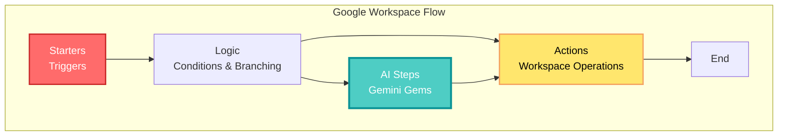
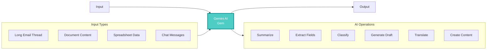
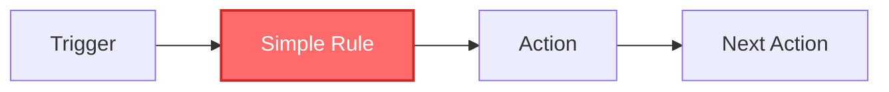
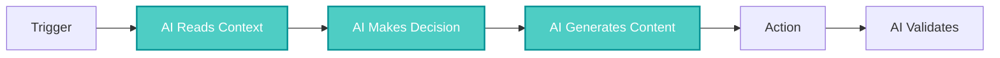
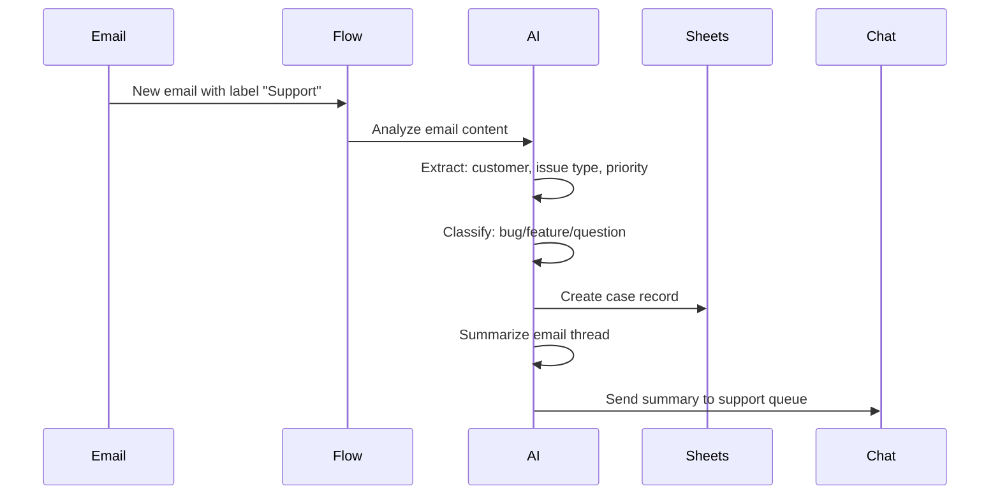
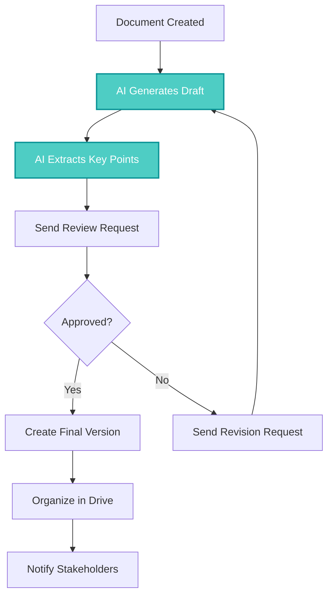
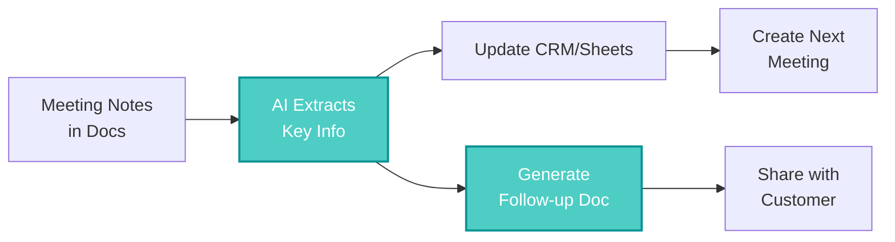
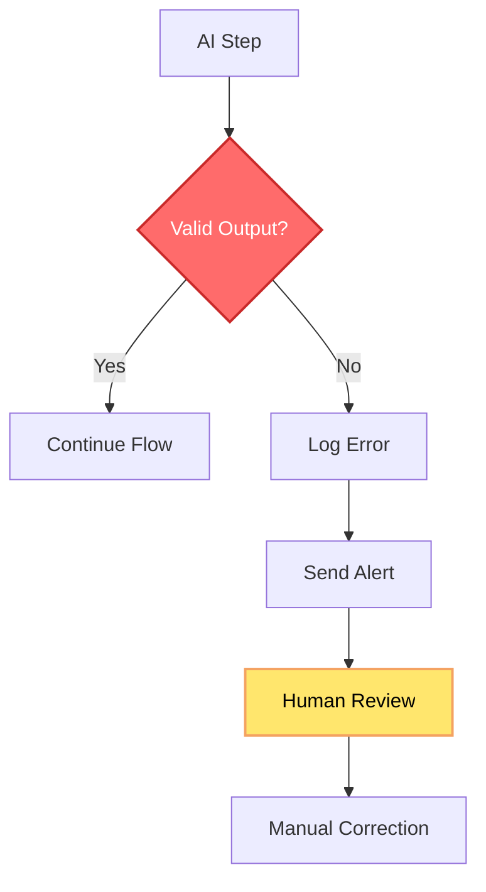
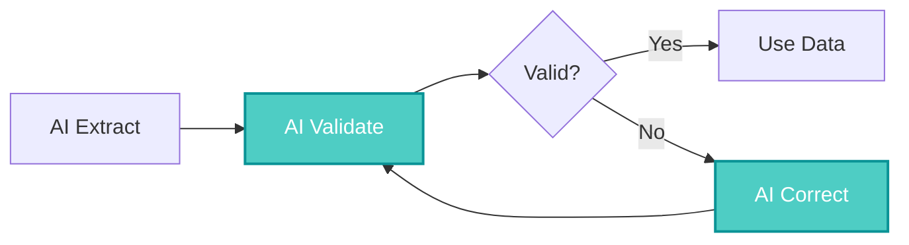
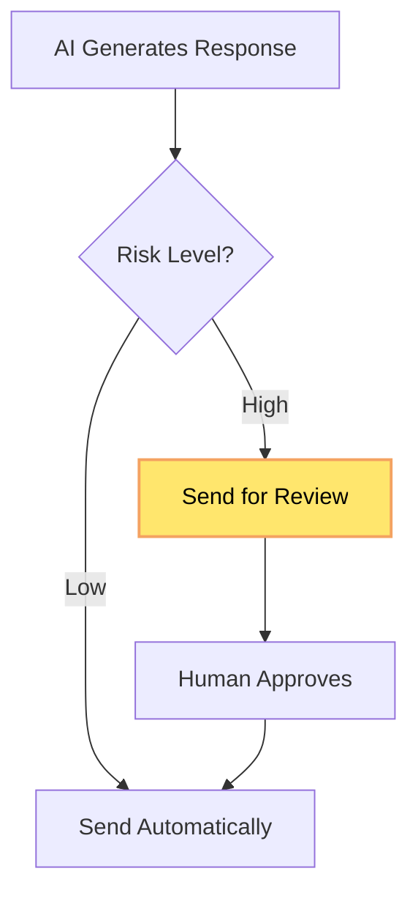

## 🤔 Curiosity: What If AI Could Automate Workflows Inside Your Existing Tools?

Most automation tools require you to learn new platforms, manage complex integrations, and deal with permission nightmares. But what if automation could happen **inside** the tools you already use every day—Gmail, Google Docs, Sheets, Drive, Calendar, and Chat?

> **Curiosity:** Can AI truly understand context and make intelligent decisions within automated workflows? And what happens when automation moves from "if-this-then-that" to "AI reads, understands, and decides"?
> {: .prompt-tip}

**Google Workspace Flows** answers these questions by bringing **agentic AI** directly into Workspace applications. Instead of simple trigger-action chains, Flows uses Gemini AI to read documents, summarize emails, extract information, make classifications, and generate content—all within the native Workspace environment.

As someone who's built automation systems for production environments, I've seen the gap between what automation promises and what it delivers. Most tools are great at moving data, but terrible at understanding context. Flows bridges that gap.

**The question:** Can this new approach to automation actually transform how we work, or is it just another tool to learn?

---

## 📚 Retrieve: Understanding Google Workspace Flows

### What is Google Workspace Flows?

**Google Workspace Flows** is a no-code automation platform that integrates AI directly into Google Workspace applications. Unlike traditional automation that follows rigid rules, Flows uses **agentic AI** (powered by Gemini) to understand context, make decisions, and generate content as part of the automation process.

**Key Differentiators:**

1. **Native Integration:** Works entirely within Gmail, Docs, Sheets, Drive, Calendar, and Chat
2. **AI-Powered:** Uses Gemini AI to read, understand, and generate content
3. **No External Tools:** No need for third-party automation platforms
4. **Context-Aware:** AI understands the full context of documents, emails, and conversations

{: .light .w-75 .shadow .rounded-10 w='800' h='600' }

### The Four Building Blocks of Flows

Flows are constructed from four core components:



#### 1. Starters (Triggers)

**Starters** define when a flow begins. They capture the initial event and provide context to the automation.

**Common Starters:**

- Gmail label applied
- New row added to Sheets
- File uploaded to Drive folder
- Reaction emoji added to Chat message
- Calendar event created
- Form submission received

**Example:**

```
Starter: When email receives label "Customer Support"
→ Provides: Email content, sender, subject, attachments
```

#### 2. Logic (Conditional Branching)

**Logic** enables conditional flows based on:

- Date/time conditions
- File properties
- User roles
- **AI-classified labels** (this is where it gets interesting)

**Traditional Logic:**

```
IF email contains "urgent" THEN route to priority queue
```

**AI-Enhanced Logic:**

```
AI classifies email sentiment → IF sentiment is "negative" AND priority is "high"
THEN route to escalation queue
```

#### 3. Actions (Workspace Operations)

**Actions** perform actual operations within Workspace:

| Action Type  | Examples                              |
| :----------- | :------------------------------------ |
| **Email**    | Send email, add label, archive        |
| **Sheets**   | Update cells, add rows, create charts |
| **Docs**     | Create document, update content       |
| **Drive**    | Move files, rename, organize          |
| **Chat**     | Send message, create space            |
| **Calendar** | Create event, update meeting          |

**Key Point:** All actions are auditable and follow Workspace security policies.

#### 4. AI Steps (Gems)

**AI Steps** are where Gemini AI performs intelligent operations:



**AI Step Capabilities:**

| Capability    | Use Case                               | Example                                                          |
| :------------ | :------------------------------------- | :--------------------------------------------------------------- |
| **Summarize** | Long email threads, documents          | "Summarize this 50-email support thread in 3 bullet points"      |
| **Extract**   | Structured data from unstructured text | Extract customer name, issue type, priority from email           |
| **Classify**  | Categorize content                     | Classify email as "bug report", "feature request", or "question" |
| **Generate**  | Create content                         | Generate email draft based on template and context               |
| **Translate** | Language conversion                    | Translate customer inquiry to English                            |
| **Create**    | Generate documents                     | Create meeting notes from calendar event and attendees           |

**Controlling AI Output:**

AI Steps can be controlled with:

- **Purpose:** What the AI should accomplish
- **Tone:** Professional, casual, technical
- **Length:** Word count or paragraph limits
- **Format:** JSON, structured text, bullet points
- **Examples:** Positive and negative examples for guidance

### How Flows Differ from Traditional Automation

**Traditional Automation (Zapier, Make, Apps Script):**



**Problems:**

- ❌ No understanding of content
- ❌ Rigid rules break easily
- ❌ Requires external tools
- ❌ Limited to structured data

**Google Workspace Flows:**



**Advantages:**

- ✅ Understands unstructured content
- ✅ Adapts to variations
- ✅ Native to Workspace
- ✅ Works with emails, documents, conversations

---

## 💡 Innovation: Real-World Applications and Production Strategies

### High-Impact Use Cases

#### 1. Email Classification and Case Management

**The Problem:**
Support teams receive hundreds of emails daily. Manually categorizing, prioritizing, and routing them is time-consuming and error-prone.

**The Flow Solution:**



**Implementation Steps:**

1. **Starter:** Gmail label "Customer Support" applied
2. **AI Step 1:** Extract customer name, email, issue description
3. **AI Step 2:** Classify issue type (bug, feature request, question)
4. **AI Step 3:** Determine priority (high, medium, low)
5. **Action:** Create row in Sheets with extracted data
6. **AI Step 4:** Summarize email thread (if part of conversation)
7. **Action:** Send summary to Chat space

**Benefits:**

- ⏱️ **Time saved:** 5-10 minutes per email → 30 seconds
- 📊 **Accuracy:** Consistent classification vs. human variation
- 🔄 **Scalability:** Handles volume spikes automatically

#### 2. Approval and Review Workflows

**The Problem:**
Document review processes involve multiple steps: draft creation, review requests, approval tracking, and final distribution. This creates bottlenecks and delays.

**The Flow Solution:**



**Example: Expense Report Approval:**

1. **Starter:** Expense report uploaded to Drive folder
2. **AI Step:** Extract amounts, categories, dates, receipts
3. **Action:** Create summary document
4. **Action:** Send approval request via Chat/Email
5. **Logic:** Wait for approval response
6. **Action:** If approved, move to "Approved" folder and notify finance
7. **Action:** If rejected, send revision request with AI-generated feedback

#### 3. Sales Handoff Automation

**The Problem:**
After sales meetings, critical information needs to be extracted, recorded in CRM, and shared with the customer success team. This manual process is slow and information gets lost.

**The Flow Solution:**



**Key AI Operations:**

- Extract: Company name, decision makers, budget, timeline, pain points
- Generate: Follow-up email, proposal outline, next steps document
- Classify: Deal stage, priority level
- Create: Calendar event for next meeting

#### 4. Employee Onboarding

**The Problem:**
Onboarding new employees requires creating folders, documents, checklists, and sending multiple communications. This is repetitive but requires personalization.

**The Flow Solution:**

1. **Starter:** New employee added to "Onboarding" Sheet
2. **Action:** Create Drive folder structure
3. **AI Step:** Generate personalized welcome message based on role
4. **Action:** Create onboarding checklist document
5. **AI Step:** Generate role-specific training materials
6. **Action:** Send welcome email with links
7. **Action:** Create calendar events for orientation sessions

**Benefits:**

- 🎯 **Consistency:** Every employee gets the same quality onboarding
- ⚡ **Speed:** 45 minutes → 5 minutes of setup time
- 📝 **Personalization:** AI adapts content to role and department

#### 5. Financial and Back-Office Automation

**The Problem:**
Invoices arrive via email, need to be processed, recorded, and organized. Manual data entry is error-prone and time-consuming.

**The Flow Solution:**

1. **Starter:** Email with invoice attachment received
2. **AI Step:** Extract invoice number, amount, date, vendor, line items
3. **Action:** Record in Sheets
4. **AI Step:** Validate against expected format
5. **Logic:** If amount exceeds threshold, flag for review
6. **Action:** Rename file with standardized format: `Invoice_Vendor_Date_Amount.pdf`
7. **Action:** Move to organized Drive folder structure
8. **Action:** Notify accounting team if anomalies detected

### Comparison with Other Automation Tools

| Tool                | Best For                          | Limitations                 | When to Use Flows Instead                |
| :------------------ | :-------------------------------- | :-------------------------- | :--------------------------------------- |
| **Zapier/Make**     | Cross-platform SaaS integrations  | Limited AI, external tool   | Workspace-native processes with AI needs |
| **Apps Script**     | Custom code, fine-grained control | Requires development skills | Non-developers need quick automation     |
| **AppSheet**        | Data-driven mobile apps           | Not for workflow automation | Process automation within Workspace      |
| **Cloud Workflows** | Backend API orchestration         | Not user-facing             | End-user workflow automation             |

**Key Insight:** Flows isn't meant to replace these tools—it's designed for Workspace-centric processes that benefit from AI understanding.

### Building Your First Flow: Step-by-Step Guide

#### Step 1: Define Clear Outcomes

**Bad:** "Automate email processing"

**Good:** "When an email with label 'Support' arrives, extract customer name and issue type, classify priority, create a case in Sheets, and send a summary to the support Chat space."

#### Step 2: Map Data Sources and Participants

**Data Sources:**

- Gmail labels
- Sheets ranges
- Drive folders
- Chat spaces
- Calendar events

**Participants:**

- Who needs to be notified?
- Who approves?
- Who reviews?

#### Step 3: Design AI Steps Carefully

**AI Step Design Principles:**

```yaml
AI Step: Extract Customer Information
Purpose: Extract structured data from email
Input: Email body and subject
Output Format: JSON
Fields:
  - customer_name: string
  - email: string
  - issue_type: one of ["bug", "feature", "question"]
  - priority: one of ["high", "medium", "low"]
  - description: string (max 200 words)
Examples:
  Positive: "Customer John Doe (john@example.com) reports a bug with high priority: login fails"
  Negative: "Something is broken" (too vague)
Validation:
  - customer_name: required, non-empty
  - email: required, valid email format
  - issue_type: must be one of allowed values
```

**Common Mistakes:**

- ❌ Vague instructions: "Extract important information"
- ❌ No examples: AI doesn't know what "good" looks like
- ❌ No validation: Bad data propagates through the flow
- ❌ Too complex: One AI step trying to do everything

**Best Practices:**

- ✅ Specific instructions with examples
- ✅ Clear output format (JSON preferred)
- ✅ Validation rules
- ✅ Break complex tasks into multiple AI steps

#### Step 4: Add Error Handling



**Error Handling Strategies:**

1. **Validation Layer:** Check AI output before using it
2. **Fallback Actions:** If AI fails, route to human review
3. **Retry Logic:** For transient failures, retry with adjusted prompt
4. **Monitoring:** Track error rates and common failure patterns

#### Step 5: Test with Small Pilot

**Pilot Testing Checklist:**

- [ ] Test with 5-10 real examples
- [ ] Verify AI output quality
- [ ] Check permission issues
- [ ] Validate timezone handling
- [ ] Test edge cases (empty fields, special characters)
- [ ] Measure execution time

#### Step 6: Production Deployment

**Pre-Production:**

- [ ] Document flow purpose and steps
- [ ] Set up monitoring and alerts
- [ ] Define rollback procedure
- [ ] Train users on expected behavior

**Production:**

- [ ] Start with limited scope
- [ ] Monitor for first week
- [ ] Collect feedback
- [ ] Iterate based on results

### AI Step Design: Advanced Techniques

#### 1. Multi-Step AI Validation



**Example:**

1. **AI Step 1:** Extract invoice data
2. **AI Step 2:** Validate extracted data against known patterns
3. **Logic:** If validation fails, trigger correction
4. **AI Step 3:** Attempt to correct errors
5. **Logic:** If still invalid, route to human review

#### 2. Template Standardization

**Problem:** Inconsistent document formats cause AI extraction to fail.

**Solution:** Maintain standardized templates in Drive:

```
Templates/
  ├── Invoice_Template.pdf
  ├── Expense_Report_Template.xlsx
  └── Meeting_Notes_Template.docx
```

**Flow Enhancement:**

1. AI identifies document type
2. Compare against template structure
3. Extract using template as guide
4. Flag deviations for review

#### 3. Human-in-the-Loop for Critical Decisions

**When to Include Human Review:**

| Decision Type        | Risk Level | Automation Level        |
| :------------------- | :--------- | :---------------------- |
| Email classification | Low        | Full automation         |
| Invoice processing   | Medium     | AI + validation         |
| Customer response    | High       | AI draft + human review |
| Policy decisions     | Critical   | Human only              |

**Implementation:**



### Governance and Operations

**Security Considerations:**

Flows inherit Workspace security:

- ✅ OAuth 2.0 authentication
- ✅ Workspace admin controls
- ✅ Audit logs
- ✅ Data residency compliance

**Additional Governance:**

1. **Ownership:** Assign flow owners responsible for maintenance
2. **Permissions:** Use least-privilege access
3. **Change Management:** Version control and approval process
4. **Training:** Educate users on flow capabilities and limitations
5. **Risk Classification:** Categorize flows by business impact

**Monitoring Metrics:**

| Metric             | Purpose     | Target                     |
| :----------------- | :---------- | :------------------------- |
| **Execution Time** | Performance | < 30 seconds per flow      |
| **Success Rate**   | Reliability | > 95%                      |
| **AI Accuracy**    | Quality     | > 90% (domain-dependent)   |
| **Error Rate**     | Stability   | < 5%                       |
| **Time Saved**     | ROI         | Measure vs. manual process |

### ROI Analysis

**Calculating Value:**

```
Time Saved per Instance = Manual Time - Automated Time
Instances per Month = Volume
Monthly Time Saved = Time Saved × Instances
Annual Value = Monthly Time Saved × 12 × Hourly Rate

Example:
- Manual email processing: 5 minutes
- Automated processing: 30 seconds
- Time saved: 4.5 minutes = 0.075 hours
- Volume: 200 emails/month
- Monthly savings: 0.075 × 200 = 15 hours
- Hourly rate: $50
- Annual value: 15 × 12 × $50 = $9,000
```

**Additional Benefits:**

- **Consistency:** Reduced human error
- **Scalability:** Handle volume spikes
- **Quality:** Standardized output
- **Employee Satisfaction:** Eliminate repetitive tasks

---

## 🎯 Key Takeaways

| Insight                                     | Implication                        | Action Item                                        |
| :------------------------------------------ | :--------------------------------- | :------------------------------------------------- |
| **Flows brings AI into Workspace natively** | No external tools needed           | Evaluate Workspace-native processes for automation |
| **AI Steps require careful design**         | Quality depends on prompts         | Invest time in AI step design with examples        |
| **Human review for high-risk decisions**    | Balance automation with control    | Identify critical decision points                  |
| **Start small, scale gradually**            | Reduces risk and builds confidence | Begin with low-risk, high-volume processes         |
| **Measure and iterate**                     | Continuous improvement             | Track metrics and refine flows                     |

### Why This Matters

Google Workspace Flows represents a fundamental shift in automation:

1. **From Rules to Intelligence:** AI understands context instead of following rigid rules
2. **From External to Native:** Automation happens where work already occurs
3. **From Developers to Everyone:** No-code with AI makes automation accessible
4. **From Simple to Smart:** Automation can handle complex, judgment-based tasks

**The Challenge:** Designing effective AI steps requires understanding both the business process and AI capabilities. But the payoff—intelligent automation that actually understands your work—is transformative.

---

## 🤔 New Questions This Raises

1. **How do we ensure AI accuracy in critical business processes?** What validation strategies work best?

2. **What's the right balance between automation and human oversight?** When should AI decisions be reviewed?

3. **How do we handle AI hallucinations or errors?** What monitoring and correction mechanisms are needed?

4. **Can Flows integrate with external systems?** How do we bridge Workspace-native automation with enterprise systems?

5. **What's the learning curve for non-technical users?** How do we make AI step design accessible?

**Next experiment:** Build a production flow for email classification, measure AI accuracy over 100 emails, and compare against manual classification to quantify the value.

---

## References

**Original Article:**

- [Google Workspace Flows 완벽 가이드: Gmail·Docs·Sheets 안에서 작동하는 진짜 AI 자동화의 시작 - Digital Bourgeois](https://digitalbourgeois.tistory.com/m/2309)

**Google Workspace Flows:**

- [Google Workspace Flows Official Documentation](https://support.google.com/a/answer/14089641)
- [Google Workspace Flows: The Practical Guide - Engini.io](https://engini.io/blog/google-workspace-flows/)
- [Getting Started with Google Workspace Flows](https://workspace.google.com/learn/products/flows/)

**Gemini AI:**

- [Google Gemini AI Overview](https://deepmind.google/technologies/gemini/)
- [Gemini API Documentation](https://ai.google.dev/docs)
- [Gemini in Google Workspace](https://workspace.google.com/learn/products/gemini/)

**Agentic AI:**

- [What is Agentic AI? - Google Cloud](https://cloud.google.com/learn/what-is-agentic-ai)
- [Agentic AI Patterns](https://ai.google.dev/docs/agentic_patterns)
- [Building Agentic AI Systems](https://ai.google.dev/docs/agents)

**Automation Best Practices:**

- [Workflow Automation Best Practices](https://workspace.google.com/learn/articles/automation-best-practices/)
- [AI Prompt Engineering Guide](https://ai.google.dev/docs/prompt_intro)
- [Error Handling in Automation](https://workspace.google.com/learn/articles/error-handling/)

**Comparison Tools:**

- [Zapier vs Google Workspace Flows](https://zapier.com/blog/google-workspace-flows/)
- [Apps Script vs Flows](https://developers.google.com/apps-script/guides/flows)
- [Make (Integromat) vs Flows](https://www.make.com/en/help/google-workspace-flows)

**Use Case Examples:**

- [Email Automation with Flows](https://workspace.google.com/learn/articles/email-automation/)
- [Document Processing Automation](https://workspace.google.com/learn/articles/document-automation/)
- [Sales Process Automation](https://workspace.google.com/learn/articles/sales-automation/)

**Security & Governance:**

- [Google Workspace Security](https://workspace.google.com/security/)
- [Flows Security Best Practices](https://support.google.com/a/answer/14089641#security)
- [Data Residency and Compliance](https://workspace.google.com/security/data-residency/)

**Community & Support:**

- [Google Workspace Community](https://support.google.com/a/community)
- [Flows User Forum](https://support.google.com/a/community/topics/flows)
- [Workspace Updates Blog](https://workspaceupdates.googleblog.com/)

**Training Resources:**

- [Google Workspace Learning Center](https://workspace.google.com/learn/)
- [Flows Tutorial Videos](https://workspace.google.com/learn/products/flows/tutorials/)
- [AI Prompt Engineering Course](https://ai.google.dev/education)

**Related Technologies:**

- [Google Apps Script](https://developers.google.com/apps-script)
- [Google Cloud Workflows](https://cloud.google.com/workflows)
- [AppSheet](https://www.appsheet.com/)
- [Google Workspace API](https://developers.google.com/workspace)
