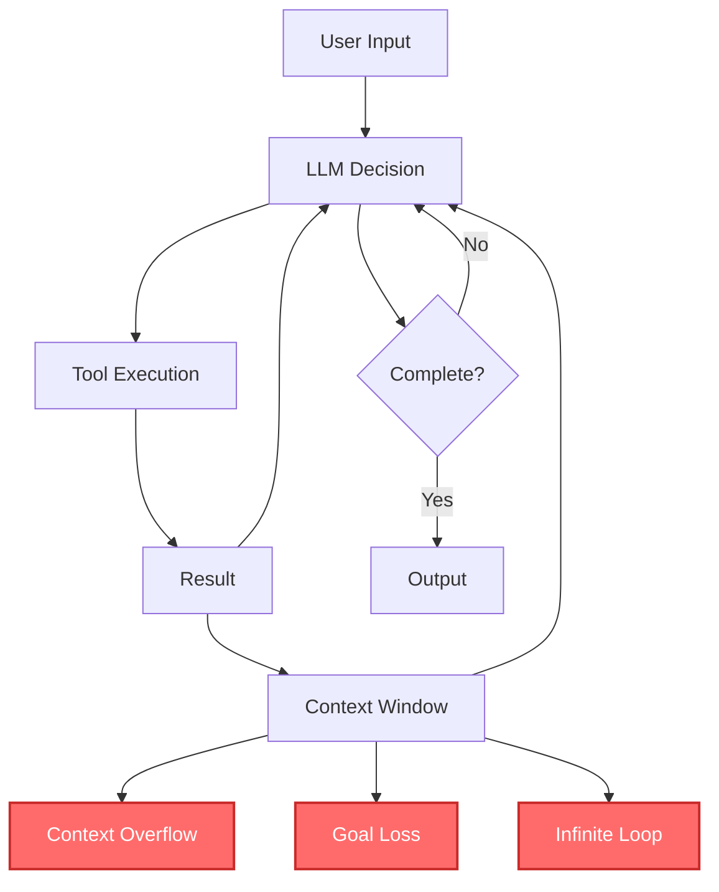
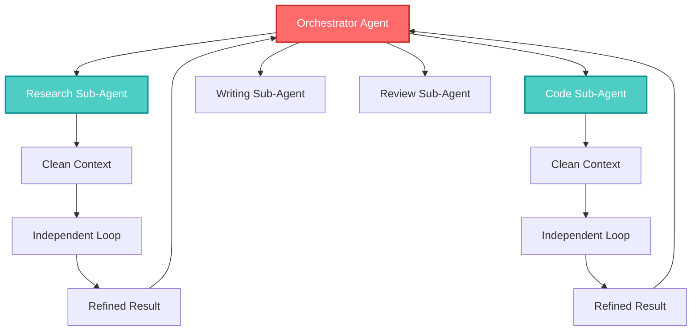
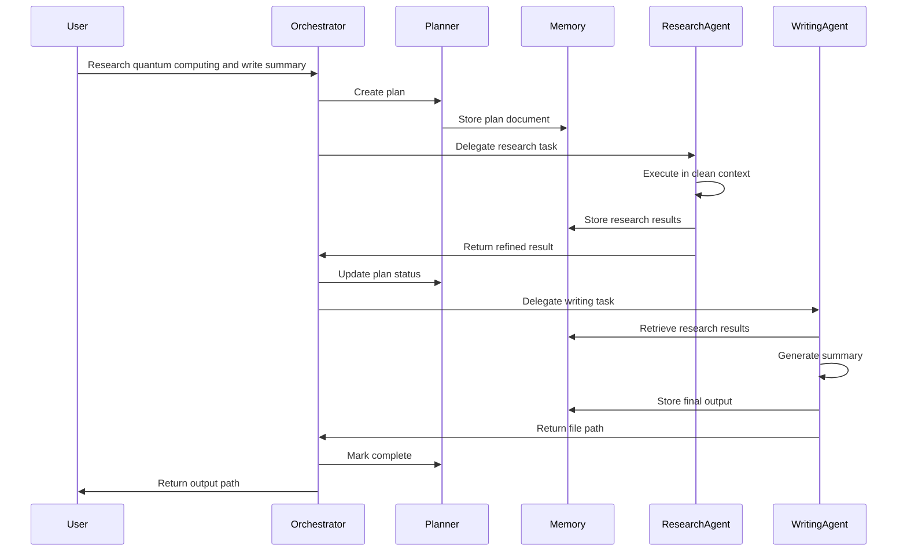

## 🤔 Curiosity: Why Do AI Agents Fail at Complex, Long-Running Tasks?

AI agents have rapidly evolved over the past year. But most agents still rely on a simple loop structure: "user input → LLM response → tool execution → repeat." This shallow architecture works fine for short tasks, but when trying to handle complex work that spans multiple days, fundamental limitations emerge: context overflow, goal loss, and infinite loops.

> **Curiosity:** Why do current AI agents struggle with complex, multi-day tasks? What architectural changes are needed to move beyond shallow loops to truly capable agents?
> {: .prompt-tip}

**The reality:** Most AI agents today use a while-loop-based structure that depends entirely on the LLM's context window. This works for 5-15 step tasks but breaks down when facing hundreds of steps. The solution isn't more tools or larger context windows—it's a fundamental architectural shift to Agents 2.0, also known as Deep Agents.

As someone who's built production AI systems, I've seen this pattern repeatedly: agents that work perfectly for simple tasks fail catastrophically when complexity increases. The problem isn't the LLM—it's the architecture.

**The question:** How do we design agent architectures that can handle complex, long-running tasks without losing context, forgetting goals, or getting stuck in loops?

> **Note:** The featured image shows the evolution from Agents 1.0 (shallow loops) to Agents 2.0 (deep agents architecture). If the image doesn't load, please download it from the [original article](https://digitalbourgeois.tistory.com/m/2311)
> {: .prompt-info}

{: .light .shadow .rounded-10 w='1212' h='668' }

---

## 📚 Retrieve: Understanding Agents 1.0 Limitations and Agents 2.0 Architecture

### Agents 1.0: The Limitations of Shallow Loop-Based Agents

Most existing AI agents operate on a simple while-loop structure with the following flow:

1. Receive user input
2. LLM decides on tool calls
3. Execute tools and receive results
4. Pass results back to LLM
5. Repeat until completion

This structure is simple and fast, but it has a critical flaw: **it depends entirely on the LLM's context window**. When handling complex tasks, three major problems emerge:



#### 1. Context Overflow

As dozens of tool execution results accumulate, the context window fills up, and the most important initial instructions get pushed out. The agent loses sight of what it was originally trying to accomplish.

#### 2. Goal Loss

Unnecessary data accumulates during intermediate steps, causing the LLM to forget what the original objective was. The agent drifts away from its intended goal.

#### 3. Recovery Failure

When things go wrong, there's no mechanism for the agent to stop or revert. The structure lacks self-correction capabilities, leading to infinite loops.

**Result:** Agents 1.0 are suitable for short-term tasks (5-15 steps) but unsuitable for long-term tasks requiring hundreds of steps.

---

### Agents 2.0: The Deep Agents Architecture

To overcome these limitations, a new paradigm has emerged: **Agents 2.0, also known as Deep Agents**. Deep Agents are not simply about repeating tool usage—they're architected around **planning, memory, structured collaboration, and hierarchical execution**.

Instead of a reactive loop, Deep Agents:

- Create their own plans to achieve goals
- Store state persistently
- Call specialized sub-agents with specific capabilities

This structure enables Deep Agents to handle complex multi-step tasks reliably.

---

### The Four Pillars of Deep Agents Architecture

Deep Agent architecture is built on four core pillars:

#### 1. Explicit Planning

Shallow Agents create plans only within their "chain of thought," so plans get trapped in context and easily lost. Deep Agents, however, **use external tools to create explicit planning documents and continuously update them**.

For example, they create To-Do documents and track each step's status:

- `pending`
- `in_progress`
- `completed`

If a step fails, the plan is modified and a new path is set. This approach ensures agents **maintain high-level workflow without losing sight of goals**.

```python
class ExplicitPlanner:
    """Manages explicit planning documents"""
    def __init__(self, plan_file: str = "plan.md"):
        self.plan_file = plan_file
        self.plan = {}

    async def create_plan(self, goal: str, steps: List[str]):
        """Create initial plan document"""
        plan_content = f"""# Task Plan: {goal}

## Goal
{goal}

## Steps
"""
        for i, step in enumerate(steps, 1):
            plan_content += f"{i}. [ ] {step}\n"

        await self._write_plan(plan_content)
        return plan_content

    async def update_step_status(self, step_num: int, status: str):
        """Update step status (pending/in_progress/completed)"""
        plan = await self._read_plan()
        # Update step status in plan
        # Mark as [x] for completed, [ ] for pending, [~] for in_progress
        updated_plan = self._update_plan_status(plan, step_num, status)
        await self._write_plan(updated_plan)

    async def revise_plan(self, reason: str, new_steps: List[str]):
        """Revise plan when encountering failures"""
        plan = await self._read_plan()
        revision_note = f"\n## Revision: {reason}\n"
        # Add new steps to plan
        await self._write_plan(plan + revision_note)
```

#### 2. Hierarchical Delegation

Shallow Agents try to have a single LLM perform all tasks, reducing efficiency and stability. Deep Agents use an **Orchestrator and Sub-Agent structure**:

- **Orchestrator:** Manages tasks and calls specialized sub-agents as needed
- **Sub-Agent:** Specialized agents for specific roles (research, code writing, document organization, etc.)

Each Sub-Agent operates in its own clean, independent context, runs its own loop, and returns only the final refined result to the Orchestrator. This approach improves task quality and reduces interference between tasks.



```python
class OrchestratorAgent:
    """Orchestrates tasks by delegating to sub-agents"""
    def __init__(self):
        self.sub_agents = {
            'research': ResearchSubAgent(),
            'code': CodeSubAgent(),
            'writing': WritingSubAgent(),
            'review': ReviewSubAgent()
        }

    async def execute_task(self, task: Task):
        """Execute task by delegating to appropriate sub-agents"""
        plan = await self.create_plan(task.goal, task.steps)

        results = []
        for step in task.steps:
            # Determine which sub-agent should handle this step
            sub_agent = self._select_sub_agent(step)

            # Delegate to sub-agent with clean context
            result = await sub_agent.execute(step, context=task.context)
            results.append(result)

            # Update plan
            await self.update_step_status(step.id, 'completed')

        return self._combine_results(results)

    def _select_sub_agent(self, step: Step):
        """Select appropriate sub-agent based on step requirements"""
        if 'research' in step.tags:
            return self.sub_agents['research']
        elif 'code' in step.tags:
            return self.sub_agents['code']
        elif 'write' in step.tags:
            return self.sub_agents['writing']
        else:
            return self.sub_agents['review']

class SubAgent:
    """Base class for specialized sub-agents"""
    def __init__(self, agent_type: str):
        self.agent_type = agent_type
        self.context = None  # Clean, independent context

    async def execute(self, step: Step, context: dict):
        """Execute step in clean context"""
        self.context = self._create_clean_context(context, step)

        # Run independent loop
        result = await self._run_loop(step)

        # Return only refined result
        return self._refine_result(result)

    def _create_clean_context(self, base_context: dict, step: Step):
        """Create clean context for this sub-agent"""
        # Only include relevant information for this step
        return {
            'goal': step.goal,
            'requirements': step.requirements,
            'relevant_data': self._extract_relevant(base_context, step)
        }
```

#### 3. Persistent Memory

Agents 1.0 put all information in context, causing contamination and saturation as work progresses. Agents 2.0 use **external persistent memory like file systems and databases** to store task state and materials:

- Code → files
- Research results → text files
- Original data → folders

By storing this way and loading only file paths when needed, agents don't need to remember everything—just **where things are stored**. This dramatically improves scalability and stability.

```python
class PersistentMemory:
    """Manages persistent storage for agent state"""
    def __init__(self, base_dir: str = "./agent_workspace"):
        self.base_dir = base_dir
        self.memory_index = {}  # Maps keys to file paths

    async def store(self, key: str, data: Any, data_type: str):
        """Store data persistently"""
        file_path = self._get_file_path(key, data_type)

        if data_type == 'code':
            await self._write_file(file_path, data)
        elif data_type == 'research':
            await self._write_markdown(file_path, data)
        elif data_type == 'data':
            await self._write_json(file_path, data)

        # Update index - only store path, not content
        self.memory_index[key] = {
            'path': file_path,
            'type': data_type,
            'timestamp': time.time()
        }

    async def retrieve(self, key: str, load_content: bool = False):
        """Retrieve data - by default only returns path"""
        if key not in self.memory_index:
            return None

        entry = self.memory_index[key]

        if load_content:
            # Load actual content only when needed
            return await self._load_file(entry['path'], entry['type'])
        else:
            # Return just the path - saves context
            return entry['path']

    def _get_file_path(self, key: str, data_type: str) -> str:
        """Generate file path based on key and type"""
        if data_type == 'code':
            return f"{self.base_dir}/code/{key}.py"
        elif data_type == 'research':
            return f"{self.base_dir}/research/{key}.md"
        elif data_type == 'data':
            return f"{self.base_dir}/data/{key}.json"
        else:
            return f"{self.base_dir}/misc/{key}.txt"
```

#### 4. Extreme Context Engineering

Even smart models can't perform well with poor configuration. Deep Agents operate on **very sophisticated guidelines and protocols**:

- When to stop execution and re-examine plans
- When to create sub-agents
- Tool usage rules
- File and directory standard structures
- How to collaborate with humans

These detailed rules help agents maintain consistency even in complex workflows.

```python
class ContextEngine:
    """Manages extreme context engineering"""
    def __init__(self):
        self.protocols = {
            'stop_conditions': [
                'max_iterations_reached',
                'error_threshold_exceeded',
                'goal_achieved',
                'human_intervention_required'
            ],
            'sub_agent_creation': {
                'trigger': 'task_complexity > threshold',
                'conditions': ['specialized_skill_required', 'parallel_execution_possible']
            },
            'tool_usage_rules': {
                'max_tools_per_step': 3,
                'required_validation': True,
                'error_handling': 'retry_with_backoff'
            },
            'file_structure': {
                'code': './workspace/code/',
                'research': './workspace/research/',
                'output': './workspace/output/',
                'logs': './workspace/logs/'
            }
        }

    def should_stop(self, state: dict) -> bool:
        """Determine if execution should stop"""
        for condition in self.protocols['stop_conditions']:
            if self._check_condition(condition, state):
                return True
        return False

    def should_create_sub_agent(self, task: Task) -> bool:
        """Determine if sub-agent should be created"""
        rules = self.protocols['sub_agent_creation']
        return (
            task.complexity > rules['trigger'] and
            any(self._check_condition(c, task) for c in rules['conditions'])
        )

    def get_context_prompt(self, task: Task) -> str:
        """Generate context-aware prompt based on protocols"""
        return f"""You are a Deep Agent operating under strict protocols.

## Current Task
{task.description}

## Protocols
- Stop conditions: {self.protocols['stop_conditions']}
- Tool usage: Max {self.protocols['tool_usage_rules']['max_tools_per_step']} tools per step
- File structure: {self.protocols['file_structure']}

## Instructions
Follow the protocols strictly. If you encounter issues, stop and re-examine the plan.
"""
```

---

## 💡 Innovation: Deep Agents in Action

### Example: Deep Agent Workflow

Let's see how a Deep Agent handles a complex task: "Research quantum computing and write a summary file."

The Deep Agent execution flow:

1. **Understands the overall task structure and creates a planning document**
2. **Delegates research work to a Sub-Agent**
3. **Research agent performs all work (search, error correction, organization) in its own loop**
4. **Returns only the final research result to the Orchestrator**
5. **Orchestrator executes the next step: save results to file**
6. **Writing Sub-Agent generates summary in file format**

This structured approach enables stable completion of complex tasks requiring dozens of steps.

### Complete Deep Agent Implementation

Here's a complete implementation combining all four pillars:

```python
import asyncio
from typing import List, Dict, Any, Optional
from dataclasses import dataclass
from pathlib import Path

@dataclass
class Task:
    goal: str
    steps: List[str]
    context: Dict[str, Any]

class DeepAgent:
    """Complete Deep Agent implementation"""
    def __init__(self, workspace_dir: str = "./workspace"):
        self.workspace = Path(workspace_dir)
        self.workspace.mkdir(exist_ok=True)

        # Initialize four pillars
        self.planner = ExplicitPlanner(str(self.workspace / "plan.md"))
        self.memory = PersistentMemory(str(self.workspace))
        self.context_engine = ContextEngine()
        self.orchestrator = OrchestratorAgent()

    async def execute(self, task: Task) -> str:
        """Execute task using Deep Agent architecture"""

        # 1. Create explicit plan
        plan = await self.planner.create_plan(task.goal, task.steps)
        await self.memory.store('plan', plan, 'research')

        # 2. Execute with context engineering
        context_prompt = self.context_engine.get_context_prompt(task)

        results = []
        for i, step in enumerate(task.steps, 1):
            # Check stop conditions
            if self.context_engine.should_stop({'step': i, 'task': task}):
                await self.planner.revise_plan("Stop condition met", task.steps[i:])
                break

            # Update plan status
            await self.planner.update_step_status(i, 'in_progress')

            # Determine if sub-agent needed
            if self.context_engine.should_create_sub_agent(step):
                # Delegate to sub-agent
                result = await self.orchestrator.delegate_to_sub_agent(step, task.context)
            else:
                # Execute directly
                result = await self._execute_step(step, context_prompt)

            # Store result in persistent memory
            await self.memory.store(f'step_{i}_result', result, 'data')

            # Update plan
            await self.planner.update_step_status(i, 'completed')
            results.append(result)

        # 3. Combine results
        final_result = self._combine_results(results)

        # 4. Store final output
        output_path = await self.memory.store('final_output', final_result, 'research')

        return output_path

    async def _execute_step(self, step: str, context: str) -> Any:
        """Execute a single step"""
        # Implementation would call LLM with context
        # This is simplified
        pass

    def _combine_results(self, results: List[Any]) -> str:
        """Combine step results"""
        return "\n\n".join(str(r) for r in results)

# Usage
async def main():
    agent = DeepAgent()

    task = Task(
        goal="Research quantum computing and write summary",
        steps=[
            "Research quantum computing basics",
            "Find recent developments",
            "Organize findings",
            "Write summary document"
        ],
        context={'topic': 'quantum computing'}
    )

    result_path = await agent.execute(task)
    print(f"Task completed. Results saved to: {result_path}")

# asyncio.run(main())
```

### Comparison: Agents 1.0 vs Agents 2.0

| Aspect               | Agents 1.0 (Shallow) | Agents 2.0 (Deep)              | Impact                  |
| :------------------- | :------------------- | :----------------------------- | :---------------------- |
| **Architecture**     | Simple while-loop    | Four-pillar architecture       | **Structured approach** |
| **Planning**         | Implicit in context  | Explicit planning documents    | **Goal persistence**    |
| **Memory**           | Context window only  | Persistent external storage    | **Scalability**         |
| **Execution**        | Single agent         | Hierarchical delegation        | **Specialization**      |
| **Context**          | Basic prompts        | Extreme context engineering    | **Consistency**         |
| **Task Complexity**  | 5-15 steps           | Hundreds of steps              | **Long-term tasks**     |
| **Recovery**         | No mechanism         | Plan revision, stop conditions | **Reliability**         |
| **Context Overflow** | Frequent             | Rare (external storage)        | **Stability**           |

### Deep Agent Execution Flow Diagram



---

## 🎯 Key Takeaways

| Insight                                      | Implication                               | Action Item                                |
| :------------------------------------------- | :---------------------------------------- | :----------------------------------------- |
| **Architecture matters more than tools**     | Better architecture beats more tools      | Focus on design, not just tool integration |
| **Explicit planning prevents goal loss**     | Plans in context get lost                 | Use external planning documents            |
| **Persistent memory enables scale**          | Context windows are limited               | Store state externally, reference paths    |
| **Hierarchical delegation improves quality** | Specialized agents outperform generalists | Create focused sub-agents                  |
| **Context engineering ensures consistency**  | Smart models need smart configuration     | Define protocols and guidelines            |

### Why Agents 2.0 Matters

Agents 2.0 represents a fundamental shift in how we think about AI agents:

1. **Beyond Shallow Loops:** Moves from reactive loops to structured systems
2. **Long-Term Capability:** Can handle tasks spanning hours to days
3. **Goal Persistence:** Maintains objectives through explicit planning
4. **Scalability:** External memory enables handling of complex, large-scale tasks
5. **Reliability:** Built-in recovery mechanisms prevent infinite loops

**The Future:** The core of AI agent technology is shifting from connecting more tools to **designing better architectures**. Agents 2.0 is the starting point, and it's likely to become the standard for AI systems that handle high-difficulty tasks requiring hours to days to complete.

> **Retrieve:** Shallow Agents are sufficient for simple queries or short-term tasks. However, they have clear structural limitations when solving long-term, complex problems. Deep Agents are a new architecture designed to overcome these limitations.
> {: .prompt-info}

> **Innovation:** The key elements—clear planning, specialized Sub-Agent collaboration, stable memory structure based on external storage, and sophisticated context design—enable agents to evolve from simple reactive tools into **structured systems** that can actually solve complex problems.
> {: .prompt-warning}

---

## 🤔 New Questions This Raises

1. **How do we optimize the balance between planning detail and execution speed?** Too much planning slows down, too little loses goals.

2. **What's the optimal granularity for sub-agent specialization?** When should we create new sub-agents vs. using existing ones?

3. **How do we design context engineering protocols that adapt to different task types?** One-size-fits-all may not work.

4. **Can persistent memory systems learn which information to keep vs. discard?** How do we prevent memory bloat?

5. **What's the performance overhead of the four-pillar architecture?** Is the added structure worth the complexity for simple tasks?

**Next experiment:** Build a Deep Agent system for a multi-day software development task, comparing it to a traditional shallow agent to measure improvements in goal persistence, context management, and task completion rate.

---

## References

**Original Articles:**

- [Agents 2.0 시대의 도래: 얕은 루프를 넘어서는 딥 에이전트 아키텍처 - Digital Bourgeois](https://digitalbourgeois.tistory.com/m/2311)
- [Agents 2.0: From Shallow Loops to Deep Agents - Phil Schmid](https://www.philschmid.de/agents-2.0-deep-agents)

**Frameworks & Tools:**

- [LangGraph - Multi-Agent Workflows](https://langchain-ai.github.io/langgraph/)
- [AutoGen - Multi-Agent Conversations](https://github.com/microsoft/autogen)
- [CrewAI - Collaborative AI Agents](https://github.com/joaomdmoura/crewAI)

**Documentation & Tutorials:**

- [Building Multi-Agent Systems with LangGraph](https://python.langchain.com/docs/use_cases/multi_agent/)
- [AutoGen Documentation](https://microsoft.github.io/autogen/)

**Related Topics:**

- [Distributed AI Systems](https://en.wikipedia.org/wiki/Distributed_artificial_intelligence)
- [Swarm Intelligence](https://en.wikipedia.org/wiki/Swarm_intelligence)


**Production Case Studies:**

- [Multi-Agent Systems for Game AI](https://www.gameaipro.com/)
koverflow.com/questions/tagged/multi-agent-systems)
