## 🤔 Curiosity: Can a Specialized Parser Outperform Google's Managed RAG?

On November 6, 2025, Google announced the **Gemini File Search Tool**—a fully managed RAG (Retrieval-Augmented Generation) system that sent ripples through the RAG ecosystem. The pricing was particularly attention-grabbing: **$0.15 per 1M tokens for initial indexing**, with embedding storage and search completely free. Plus, it supports PDF, DOCX, XLSX, HWP, and even ZIP files up to 1TB.

> **Curiosity:** When a tech giant like Google enters the RAG market with aggressive pricing, does that mean game over for specialized solutions? Or can domain-specific optimizations still provide meaningful advantages?
{: .prompt-tip}

As someone who's built AI-powered systems for 8 years in production, I've learned that **theoretical specs and actual performance often diverge significantly**. So when we at Sionic AI heard about Google's announcement, we decided to put it to the test against our own **STORM Parse**—an intelligent document parser optimized specifically for RAG pipelines.

The question wasn't just about performance metrics. It was about understanding: **What makes document parsing the critical bottleneck in RAG systems, and how does a VLM-based approach change the game?**

---

## 📚 Retrieve: Understanding the RAG Parsing Challenge

### Why Document Parsing is the Foundation of RAG

When discussing Agentic RAG system performance, we often focus on search algorithms, embedding models, re-ranking strategies, and prompt engineering. But here's the thing: **all of these depend on one critical foundation—document parsing quality.**


**The parsing quality impact manifests in five critical dimensions:**

| Dimension | Impact | Example Failure Mode |
|:----------|:-------|:---------------------|
| **Information Preservation** | Lost data = wrong answers | Financial statement cell values misread → hallucination |
| **Structure Preservation** | Lost context = broken semantics | Table headers separated from data → meaningless chunks |
| **Semantic Preservation** | Lost visual meaning = incomplete understanding | Red "danger" indicators not captured → safety info lost |
| **Chunking Friendliness** | Poor chunks = retrieval failures | Table split at chunk boundary → header/data disconnected |
| **Retrieval Efficiency** | Non-natural language = poor embeddings | Markdown tables vs. natural sentences → lower similarity scores |

### The Human-Centric Document Problem

Documents are designed for humans, not AI. Humans excel at visual information processing:
- We understand graphs faster than reading text
- Green checkmarks are more intuitive than "safe" text
- We naturally recognize merged cells, color coding, and layout hierarchies

But this human-centric design creates challenges for AI:

```mermaid
flowchart LR
    subgraph Human["👤 Human Processing"]
        H1[Visual Scanning]
        H2[Pattern Recognition]
        H3[Contextual Understanding]
        H4[Implicit Rules]
    end
    
    subgraph AI["🤖 AI Processing"]
        A1[Text Extraction]
        A2[Structure Parsing]
        A3[Semantic Analysis]
        A4[Explicit Rules]
    end
    
    subgraph Document["📄 Document"]
        D1[Tables]
        D2[Charts]
        D3[Layouts]
        D4[Visual Cues]
    end
    
    Document --> Human
    Document --> AI
    
    Human -->|Natural| H1
    AI -->|Challenging| A1
    
    style Human fill:#4ecdc420,stroke:#0a9396,stroke-width:2px
    style AI fill:#ff6b6b20,stroke:#c92a2a,stroke-width:2px
    style Document fill:#ffe66d40,stroke:#f4a261,stroke-width:2px
```



**Example: Financial Statements**

A human can instantly:
- Recognize table structure and column meanings
- Understand merged cells represent categories
- Distinguish summary rows (bold) from data rows
- Know negative numbers use parentheses or red color

But simple text extraction loses:
- Cell-to-row/column relationships
- Header-to-data connections
- Merged cell context
- Visual hierarchy distinctions

### STORM Parse: VLM-Based Two-Stage Conversion

STORM Parse addresses these challenges through a **two-stage conversion process** that combines traditional parsing stability with VLM understanding:


**Stage 1: Fast & Stable Markdown Conversion**
- Uses proven libraries (PyMuPDF, python-docx) optimized through production experience
- Extracts basic structure: headings, paragraphs, lists, tables, images
- Creates reference structure for VLM

**Stage 2: VLM-Based Semantic Enhancement**
- VLM receives both markdown text and original document image
- Validates and enhances: missing text, table structures, chart descriptions, reading order
- Reduces hallucination by using markdown as anchor
- Improves consistency through structured reference

### Why Natural Language Output Matters for RAG

STORM Parse's key differentiator: **natural language output** instead of structured formats (Markdown, HTML, JSON).

**Embedding Model Characteristics:**

Current embedding models (OpenAI text-embedding-3, Cohere embed-v3, Voyage AI) are trained primarily on natural language corpora:
- Wikipedia articles
- News articles
- Books
- Web pages

They perform best on natural sentences, not structured formats.

**Chunking Boundary Problem:**

```python
# Example: Table in Markdown format
# Chunk 1: "| Subject | Year | Semester |"
# Chunk 2: "| Statistics | 4 | 1 |"
# Problem: Chunk 2 lacks context - what do "4" and "1" mean?

# STORM Parse natural language output:
# Chunk 1: "Statistics Advanced is a 4th year, 1st semester course. 
#          Statistics Introduction is a 2nd year, 1st semester course."
# Chunk 2: "Machine Learning is a 3rd year, 2nd semester course..."
# Solution: Each chunk is self-contained with full context
```

**LLM Understanding:**

Natural language context is easier for LLMs to process than structured data, reducing interpretation errors and hallucinations.

---

## 💡 Innovation: Benchmark Results & Technical Analysis

### Test Methodology

We conducted a comprehensive benchmark comparing:
- **STORM Parse** (VLM-based intelligent parser)
- **Google Gemini File Search API** (fully managed RAG)

**Test Dataset:**
- 270 diverse questions across multiple document types
- Financial statements, technical documentation, contracts, research reports
- Various formats: PDF, DOCX, XLSX, HWP

**Evaluation Metrics:**
- Answer accuracy (ground truth comparison)
- Context relevance (retrieved information quality)
- Citation accuracy (source attribution correctness)
- Response coherence (logical consistency)

### Benchmark Results

| Metric | Google Gemini File Search | STORM Parse | Improvement |
|:-------|:-------------------------:|:-----------:|:-----------:|
| **Overall Accuracy** | 68.5% | **82.3%** | **+20.1%** |
| **Financial Documents** | 64.2% | **85.7%** | **+33.5%** |
| **Technical Docs** | 71.3% | **81.2%** | **+13.9%** |
| **Multi-format Docs** | 70.1% | **79.8%** | **+13.8%** |
| **Citation Accuracy** | 72.4% | **88.9%** | **+22.8%** |
| **Context Relevance** | 0.74 | **0.87** | **+17.6%** |

**Key Insight:** STORM Parse shows the largest advantage (+33.5%) on financial documents—exactly the domain where structure preservation and semantic understanding matter most.

### Why STORM Parse Outperforms


**1. Superior Structure Understanding**

STORM Parse's VLM-based approach understands:
- Table hierarchies and merged cells
- Chart visual patterns and trends
- Layout reading order (multi-column documents)
- Visual semantic cues (colors, emphasis)

**2. Natural Language Optimization**

Unlike structured formats, STORM Parse's natural language output:
- Generates better embeddings (trained on natural language)
- Creates self-contained chunks (no context loss at boundaries)
- Improves LLM comprehension (easier to process)

**3. Domain-Specific Enhancements**

STORM Parse includes optimizations for:
- **HWP format** (widely used in Korean enterprises)
- **Financial documents** (complex tables, charts)
- **Technical documentation** (diagrams, code blocks)

### Real-World Example: Financial Statement Parsing

**Input:** A complex financial statement with merged cells, color-coded rows, and embedded charts.

**Google File Search Output:**
```
| Revenue | Q1 | Q2 | Q3 | Q4 |
| 1000 | 1200 | 1100 | 1300 |
| Operating Expenses | 800 | 850 | 900 |
```

**Problem:** 
- Merged "Revenue" cell context lost
- Color coding (red for losses) not captured
- Chart data missing
- Header/data relationships unclear

**STORM Parse Output:**
```
The company's revenue shows strong growth throughout the year. 
In Q1, revenue was $1,000,000, which increased to $1,200,000 in Q2. 
Q3 saw a slight decrease to $1,100,000, but Q4 rebounded to $1,300,000, 
representing a 30% year-over-year growth.

Operating expenses also increased over the quarters. Q1 expenses were 
$800,000, rising to $850,000 in Q2, and $900,000 in Q3. The expense 
growth rate is lower than revenue growth, indicating improving margins.

[Chart description: A line chart shows revenue (blue line) trending 
upward with a slight dip in Q3, while expenses (red line) show steady 
growth. The gap between the two lines widens in Q4, indicating 
improved profitability.]
```

**Advantages:**
- Complete context preservation
- Visual information captured
- Natural language = better embeddings
- Self-contained chunks

### Cost & Performance Trade-offs

| Factor | Google File Search | STORM Parse |
|:-------|:------------------:|:-----------:|
| **Initial Setup** | Minimal (managed service) | Requires integration |
| **Indexing Cost** | $0.15/1M tokens | Custom pricing |
| **Search Cost** | Free | Included in service |
| **Parsing Quality** | Good (general purpose) | Excellent (RAG-optimized) |
| **Customization** | Limited | High (domain-specific) |
| **HWP Support** | Basic | Advanced |
| **Latency** | Low (managed) | Low (optimized) |

**When to Choose Each:**

✅ **Google File Search is better for:**
- Quick prototyping
- General-purpose documents
- Minimal customization needs
- Cost-sensitive projects (free search)

✅ **STORM Parse is better for:**
- Production RAG systems requiring high accuracy
- Financial/technical documents
- Korean enterprise environments (HWP)
- Domain-specific optimizations needed

---

## 🎯 Key Takeaways

| Insight | Implication | Next Steps |
|:--------|:------------|:-----------|
| **Document parsing quality is the RAG bottleneck** | Invest in parsing before optimizing search/LLM | Evaluate parsing quality in your RAG pipeline |
| **VLM-based parsing provides 20%+ accuracy gains** | Specialized solutions can outperform general-purpose | Consider VLM approaches for complex documents |
| **Natural language output improves embeddings** | Structure → natural language conversion matters | Test embedding quality with different formats |
| **Domain-specific optimizations deliver value** | One-size-fits-all has limits | Identify your document types and optimize |

### Production Recommendations

1. **Evaluate parsing quality first** - Before optimizing search algorithms or LLM prompts, ensure your parser preserves information, structure, and semantics.

2. **Test with your actual documents** - Benchmark results vary by document type. Financial documents showed the largest gap (+33.5%).

3. **Consider hybrid approaches** - Use managed services for simple documents, specialized parsers for complex ones.

4. **Monitor chunk quality** - Poor parsing creates poor chunks, which degrades retrieval regardless of search algorithm.

---

## 🤔 New Questions This Raises

1. **Can we combine both approaches?** What if we use STORM Parse for parsing and Google File Search for the managed RAG infrastructure?

2. **How do parsing improvements scale?** Does a 20% accuracy gain translate to 20% better business outcomes, or are there diminishing returns?

3. **What about real-time parsing?** How do latency requirements affect the choice between managed services and specialized parsers?

4. **Multi-modal RAG evolution:** As VLM technology advances, will parsing become even more critical, or will LLMs become better at handling raw documents?

**Next experiment:** Build a hybrid system that uses STORM Parse for document parsing but leverages Google's managed infrastructure for embedding storage and search, measuring the combined performance.

---

## References

**Original Blog Post:**
- [STORM Parse vs Google Gemini File Search - Sionic AI Blog](https://blog.sionic.ai/stormparse-vs-googleapi)

**STORM Parse Resources:**
- [STORM Parse Playground](https://www.sionicstorm.ai/ko/storm-apis/playground)
- [Sionic AI - Enterprise AI-Native Solutions](https://www.sionicstorm.ai/)

**Video Content:**
- [STORM Parse Technical Deep Dive - AI Agent YouTube Channel](https://www.youtube.com/watch?v=-7jZoe__kBE) (Korean)

**Google Gemini File Search:**
- [Google Gemini File Search Tool Announcement](https://ai.google.dev/gemini-api/docs/file-search)
- [Gemini API Documentation](https://ai.google.dev/docs)

**RAG & Document Parsing:**
- [Retrieval-Augmented Generation for Knowledge-Intensive NLP Tasks](https://arxiv.org/abs/2005.11401)
- [RAG: From Prototype to Production](https://huyenchip.com/2023/04/11/llm-engineering.html)
- [Document Understanding with Vision-Language Models](https://arxiv.org/abs/2304.11057)

**Vision-Language Models:**
- [GPT-4V(ision) System Card](https://openai.com/research/gpt-4v-system-card)
- [Claude 3 Opus - Vision Capabilities](https://www.anthropic.com/claude)
- [Gemini 2.5 Pro - Multimodal Understanding](https://deepmind.google/technologies/gemini/)

**Embedding Models:**
- [OpenAI text-embedding-3](https://platform.openai.com/docs/guides/embeddings)
- [Cohere embed-v3](https://cohere.com/blog/embed-v3)
- [Voyage AI Embeddings](https://www.voyageai.com/)

**Production Best Practices:**
- [Building Production RAG Systems](https://www.pinecone.io/learn/retrieval-augmented-generation/)
- [Evaluating RAG Systems](https://www.llamaindex.ai/blog/evaluating-rag-systems-2024)
- [Document Processing for RAG](https://www.langchain.com/docs/use_cases/document_qa)

**Related Tools & Frameworks:**
- [LangChain Document Loaders](https://python.langchain.com/docs/modules/data_connection/document_loaders/)
- [LlamaIndex Document Processing](https://docs.llamaindex.ai/en/stable/module_guides/loading/)
- [Unstructured.io - Document Parsing](https://unstructured.io/)
