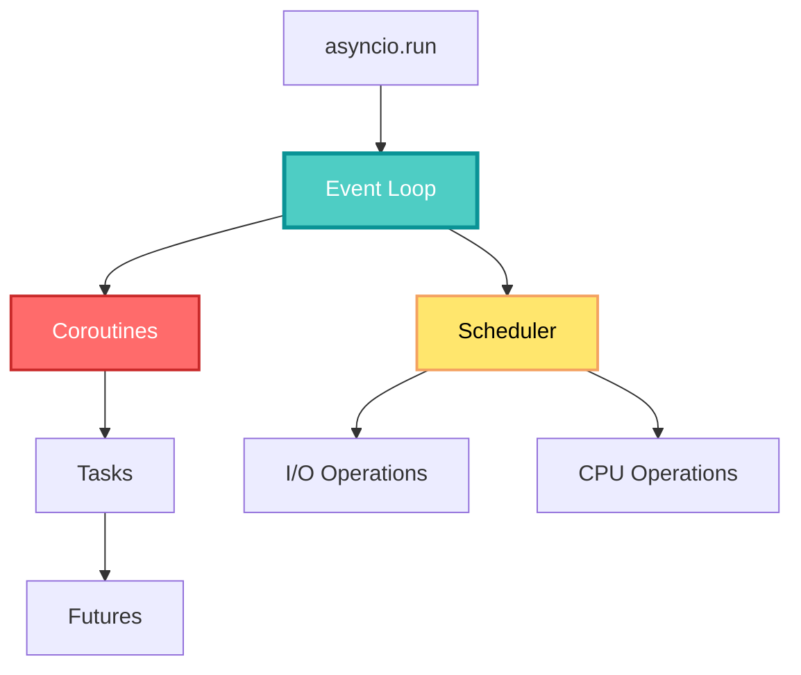
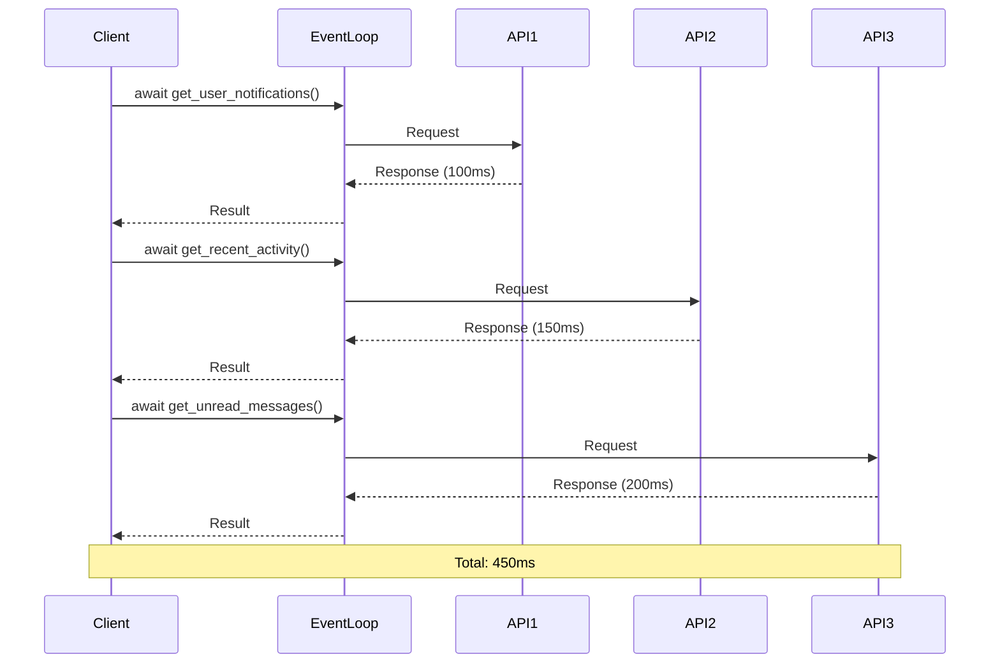
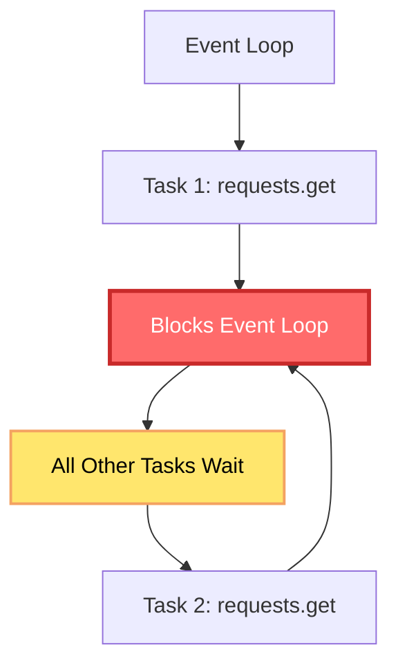
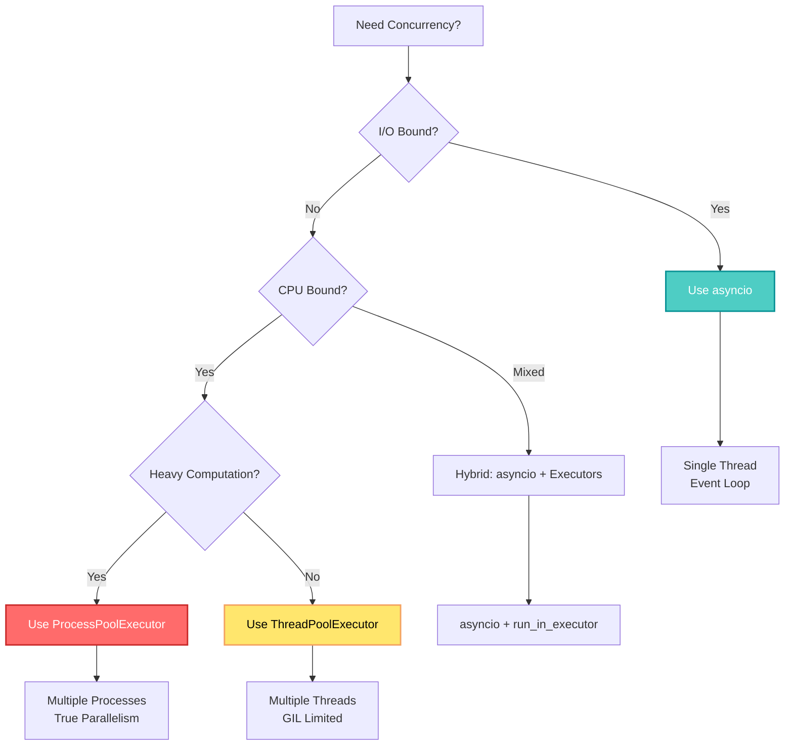

## 🤔 Curiosity: Why Is My Async Code Slower Than Synchronous Code?

You've refactored your Python code to use `async/await`, expecting significant performance improvements. But instead of getting faster, your application is actually slower. What went wrong?

> **Curiosity:** If async code is supposed to be faster, why does it sometimes perform worse than synchronous code? And what are the hidden pitfalls that make async code slower?
> {: .prompt-tip}

**The reality:** Async code doesn't automatically make everything faster. In fact, misusing asyncio can introduce overhead, blocking operations, and performance bottlenecks that make your code slower than the synchronous version.

As someone who's debugged production async applications, I've seen this pattern repeatedly: developers assume `async/await` is a magic performance button, but without understanding the underlying mechanics, they create code that's slower, harder to debug, and more resource-intensive.

**The question:** What are the specific mistakes that make async code slower, and how do we fix them?

---

## 📚 Retrieve: Understanding Async Performance Fundamentals

### Core Concepts: Event Loop, Coroutines, and Futures

Before diving into performance issues, let's understand the building blocks of asyncio:



#### 1. Event Loop

The **Event Loop** is the core orchestrator of all asynchronous operations in an asyncio application. When you call `asyncio.run()`, a single-threaded event loop starts and schedules all coroutines and tasks.

**Key Characteristics:**

- Single-threaded execution
- Cooperative multitasking (tasks yield control voluntarily)
- I/O-bound operations are non-blocking
- CPU-bound operations block the entire loop

#### 2. Coroutines

Functions defined with `async def` are **coroutines**. When a coroutine encounters `await`, it pauses execution and returns control to the event loop, allowing other tasks to run.

**Example:**

```python
async def fetch_data():
    # This pauses and yields control
    response = await http_client.get('https://api.example.com/data')
    return response.json()
```

#### 3. Futures

**Futures** are low-level objects that represent the eventual result of an asynchronous operation. When a coroutine completes, its result is stored in a Future.

### The Five Major Performance Pitfalls

#### 1. Sequential Awaits Causing Bottlenecks

**The Problem:**

When you await multiple coroutines sequentially, each operation waits for the previous one to complete, eliminating any performance benefit from async.

```python
# ❌ BAD: Sequential execution
async def get_user_dashboard():
    notifications = await get_user_notifications()  # Wait 100ms
    activity = await get_recent_activity()          # Wait 150ms
    messages = await get_unread_messages()          # Wait 200ms
    return {
        'notifications': notifications,
        'activity': activity,
        'messages': messages
    }
# Total time: 450ms (sequential)
```

**Why It's Slow:**



**The Solution: Parallel Execution**

```python
# ✅ GOOD: Parallel execution
async def get_user_dashboard():
    notifications, activity, messages = await asyncio.gather(
        get_user_notifications(),    # All three start
        get_recent_activity(),        # simultaneously
        get_unread_messages()         # and run in parallel
    )
    return {
        'notifications': notifications,
        'activity': activity,
        'messages': messages
    }
# Total time: 200ms (longest operation)
```

**Performance Improvement:**

| Approach          | Execution Time |  Improvement   |
| :---------------- | :------------: | :------------: |
| Sequential        |     450ms      |    Baseline    |
| Parallel (gather) |     200ms      | **55% faster** |

#### 2. Using Synchronous (Blocking) Libraries

**The Problem:**

Using blocking libraries inside async code stops the entire event loop, making all other tasks wait.

**Common Blocking Libraries:**

| Library             | Blocking Operation | Async Alternative  |
| :------------------ | :----------------- | :----------------- |
| `requests`          | HTTP requests      | `aiohttp`, `httpx` |
| `pathlib`, file I/O | File operations    | `aiofiles`         |
| `time.sleep()`      | Sleep              | `asyncio.sleep()`  |
| `sqlite3`           | Database queries   | `aiosqlite`        |
| `urllib`            | URL operations     | `aiohttp`          |

**Example:**

```python
# ❌ BAD: Blocking library in async code
async def fetch_multiple_urls(urls):
    results = []
    for url in urls:
        # This blocks the entire event loop!
        response = requests.get(url)  # Synchronous, blocking
        results.append(response.json())
    return results

# Even with gather, this runs sequentially because requests blocks
await asyncio.gather(*[fetch_url(url) for url in urls])
```

**Why It's Slow:**



**The Solution: Use Async Libraries**

```python
# ✅ GOOD: Async library
import aiohttp

async def fetch_multiple_urls(urls):
    async with aiohttp.ClientSession() as session:
        tasks = [fetch_url(session, url) for url in urls]
        results = await asyncio.gather(*tasks)
    return results

async def fetch_url(session, url):
    async with session.get(url) as response:
        return await response.json()
```

#### 3. CPU-Bound Tasks Blocking the Event Loop

**The Problem:**

Asyncio is designed for I/O-bound operations. CPU-intensive tasks block the single-threaded event loop, preventing other tasks from running.

**Example:**

```python
# ❌ BAD: CPU-bound work blocks event loop
async def process_data(data_list):
    results = []
    for data in data_list:
        # This blocks the event loop!
        result = heavy_computation(data)  # CPU-bound, blocking
        results.append(result)
    return results

def heavy_computation(data):
    # CPU-intensive work
    return sum(x**2 for x in range(1000000))
```

**Why It's Slow:**


**The Solution: Use Executors**

```python
# ✅ GOOD: CPU work in executor
import asyncio
from concurrent.futures import ThreadPoolExecutor

async def process_data(data_list):
    loop = asyncio.get_running_loop()

    # Run CPU-bound work in thread pool
    tasks = [
        loop.run_in_executor(None, heavy_computation, data)
        for data in data_list
    ]

    results = await asyncio.gather(*tasks)
    return results

def heavy_computation(data):
    # CPU-intensive work (runs in separate thread)
    return sum(x**2 for x in range(1000000))
```

**Performance Comparison:**

| Approach            |  Execution Model   |    Event Loop Blocked?     |
| :------------------ | :----------------: | :------------------------: |
| Direct call         |   Single thread    | ✅ Yes (blocks everything) |
| ThreadPoolExecutor  |  Multiple threads  | ❌ No (I/O tasks continue) |
| ProcessPoolExecutor | Multiple processes | ❌ No (for CPU-heavy work) |

#### 4. Awaiting Non-Critical Tasks

**The Problem:**

Awaiting low-priority tasks (like logging) delays the main response.

**Example:**

```python
# ❌ BAD: Logging delays response
async def handle_user_request(user_id):
    profile = await get_user_profile(user_id)

    # This delays the response!
    await send_logs_to_external_service(profile)  # 50ms delay

    return profile  # User waits extra 50ms
```

**The Solution: Background Tasks**

```python
# ✅ GOOD: Fire and forget for non-critical work
async def handle_user_request(user_id):
    profile = await get_user_profile(user_id)

    # Don't await - run in background
    asyncio.create_task(send_logs_to_external_service(profile))

    return profile  # Immediate response
```

**When to Use Background Tasks:**

| Task Type           | Priority |       Should Await?        |
| :------------------ | :------: | :------------------------: |
| User response data  |   High   |           ✅ Yes           |
| Logging             |   Low    |  ❌ No (use create_task)   |
| Analytics           |   Low    |  ❌ No (use create_task)   |
| Cache updates       |  Medium  | ⚠️ Depends on requirements |
| Email notifications |   Low    |  ❌ No (use create_task)   |

#### 5. Excessive Task Creation

**The Problem:**

Creating too many small tasks causes context switching overhead.

**Example:**

```python
# ❌ BAD: Too many small tasks
async def fetch_all_items(item_ids):
    tasks = [fetch_item(item_id) for item_id in item_ids]  # 10,000 tasks!
    results = await asyncio.gather(*tasks)
    return results
```

**Why It's Slow:**

- Context switching overhead
- Memory usage for task objects
- Scheduler overhead

**The Solution: Batching and Semaphores**

```python
# ✅ GOOD: Limit concurrency with Semaphore
async def fetch_all_items(item_ids, max_concurrent=10):
    semaphore = asyncio.Semaphore(max_concurrent)

    async def fetch_with_limit(item_id):
        async with semaphore:
            return await fetch_item(item_id)

    tasks = [fetch_with_limit(item_id) for item_id in item_ids]
    results = await asyncio.gather(*tasks)
    return results
```

**Alternative: Batching**

```python
# ✅ GOOD: Process in batches
async def fetch_all_items(item_ids, batch_size=100):
    results = []
    for i in range(0, len(item_ids), batch_size):
        batch = item_ids[i:i + batch_size]
        batch_results = await asyncio.gather(*[fetch_item(id) for id in batch])
        results.extend(batch_results)
    return results
```

### Parallel Execution Tools Comparison

| Tool                                 | Use Case                   | Pros                    | Cons                                   |
| :----------------------------------- | :------------------------- | :---------------------- | :------------------------------------- |
| **asyncio.gather**                   | Multiple independent tasks | Simple, intuitive       | Fails fast (one exception cancels all) |
| **asyncio.create_task**              | Background tasks           | Individual control      | Manual management required             |
| **asyncio.TaskGroup** (Python 3.11+) | Structured concurrency     | Safe, automatic cleanup | Python 3.11+ only                      |

**asyncio.gather Example:**

```python
# All tasks run in parallel
results = await asyncio.gather(
    task1(),
    task2(),
    task3()
)
# If any task raises, all are cancelled
```

**asyncio.create_task Example:**

```python
# Create tasks individually
task1 = asyncio.create_task(coro1())
task2 = asyncio.create_task(coro2())

# Can cancel individually
task1.cancel()

# Must await manually
result1 = await task1
result2 = await task2
```

**asyncio.TaskGroup Example (Python 3.11+):**

```python
# Structured concurrency - automatic cleanup
async with asyncio.TaskGroup() as tg:
    task1 = tg.create_task(coro1())
    task2 = tg.create_task(coro2())
    task3 = tg.create_task(coro3())

# All tasks automatically awaited when exiting block
# If any task fails, all others are cancelled
```

---

## 💡 Innovation: Debugging and Performance Analysis

### Debugging Tools

#### asyncio Debug Mode

Enable debug mode to identify common issues:

```python
# Enable debug mode
asyncio.run(main(), debug=True)
```

**What Debug Mode Detects:**

- Tasks that were created but never awaited
- Coroutines that were never scheduled
- Slow callbacks (> 100ms)
- Event loop blocking operations

**Example Output:**

```
Task was destroyed but it is pending!
task: <Task pending name='Task-2' coro=<slow_operation()>>
```

#### Performance Profiling

**Using cProfile with asyncio:**

```python
import cProfile
import pstats
import asyncio

async def main():
    # Your async code here
    pass

# Profile async code
profiler = cProfile.Profile()
profiler.enable()
asyncio.run(main())
profiler.disable()

stats = pstats.Stats(profiler)
stats.sort_stats('cumulative')
stats.print_stats(20)  # Top 20 functions
```

**Using asyncio's Built-in Timing:**

```python
import asyncio
import time

async def measure_time(coro):
    start = time.time()
    result = await coro
    elapsed = time.time() - start
    print(f"Execution time: {elapsed:.2f}s")
    return result

# Usage
result = await measure_time(my_async_function())
```

### Choosing the Right Concurrency Model

**Decision Tree:**



**Comparison Table:**

| Model         | Best For          | Threads       | Processes | GIL Impact                  |
| :------------ | :---------------- | :------------ | :-------- | :-------------------------- |
| **asyncio**   | I/O-bound tasks   | 1             | 1         | N/A (single thread)         |
| **Threads**   | I/O with some CPU | Multiple      | 1         | Limited by GIL              |
| **Processes** | CPU-bound tasks   | 1 per process | Multiple  | No GIL (separate processes) |

**When to Use Each:**

**Use asyncio when:**

- ✅ Network I/O (HTTP, WebSockets, databases)
- ✅ File I/O (with aiofiles)
- ✅ Many concurrent connections
- ✅ Single-threaded execution is acceptable

**Use Threads when:**

- ✅ I/O-bound with some CPU work
- ✅ Need to call blocking libraries
- ✅ GUI applications (keep UI responsive)

**Use Processes when:**

- ✅ CPU-intensive computations
- ✅ Need true parallelism
- ✅ Can tolerate process overhead

### Real-World Performance Optimization Example

**Before (Slow):**

```python
# ❌ Multiple performance issues
async def generate_user_report(user_id):
    # Sequential awaits
    profile = await get_user_profile(user_id)  # 100ms
    orders = await get_user_orders(user_id)    # 150ms
    reviews = await get_user_reviews(user_id)  # 120ms

    # Blocking library
    data = requests.get(f'https://api.example.com/analytics/{user_id}').json()

    # CPU-bound work blocking event loop
    processed_data = heavy_data_processing(data)  # 200ms

    # Unnecessary await
    await log_report_generation(user_id)  # 50ms

    return {
        'profile': profile,
        'orders': orders,
        'reviews': reviews,
        'analytics': processed_data
    }
# Total: ~620ms + blocking time
```

**After (Optimized):**

```python
# ✅ Optimized version
import aiohttp
from concurrent.futures import ThreadPoolExecutor

async def generate_user_report(user_id):
    loop = asyncio.get_running_loop()

    # Parallel data fetching
    profile, orders, reviews = await asyncio.gather(
        get_user_profile(user_id),
        get_user_orders(user_id),
        get_user_reviews(user_id)
    )

    # Async HTTP client
    async with aiohttp.ClientSession() as session:
        async with session.get(f'https://api.example.com/analytics/{user_id}') as resp:
            data = await resp.json()

    # CPU work in executor (non-blocking)
    processed_data = await loop.run_in_executor(
        None, heavy_data_processing, data
    )

    # Background logging (don't await)
    asyncio.create_task(log_report_generation(user_id))

    return {
        'profile': profile,
        'orders': orders,
        'reviews': reviews,
        'analytics': processed_data
    }
# Total: ~200ms (longest parallel operation) + executor time (non-blocking)
```

**Performance Improvement:**

| Metric             |      Before       |      After       |      Improvement       |
| :----------------- | :---------------: | :--------------: | :--------------------: |
| **Sequential I/O** |       370ms       | 150ms (parallel) |     **59% faster**     |
| **Blocking HTTP**  | Blocks event loop |   Non-blocking   |    **No blocking**     |
| **CPU Processing** |   Blocks 200ms    |   Non-blocking   |  **Event loop free**   |
| **Logging Delay**  |       50ms        | 0ms (background) | **Immediate response** |

### Video Tutorial



---

## 🎯 Key Takeaways

| Insight                                | Implication                               | Action Item                    |
| :------------------------------------- | :---------------------------------------- | :----------------------------- |
| **Async doesn't mean automatic speed** | Understanding is crucial                  | Learn event loop mechanics     |
| **Sequential awaits kill performance** | Always parallelize independent operations | Use `gather` or `TaskGroup`    |
| **Blocking libraries break async**     | Use async alternatives                    | Replace `requests` → `aiohttp` |
| **CPU work blocks the event loop**     | Use executors for CPU tasks               | `run_in_executor()`            |
| **Don't await non-critical tasks**     | Fire and forget for logging/analytics     | Use `create_task()`            |

### Why This Matters

Understanding async performance pitfalls is critical because:

1. **False Expectations:** Developers assume async = fast, leading to disappointment
2. **Production Issues:** Slow async code causes real user-facing problems
3. **Resource Waste:** Inefficient async code uses more resources than sync code
4. **Debugging Difficulty:** Async bugs are harder to diagnose without proper tools

**The Challenge:** Async code requires understanding the event loop, I/O vs CPU operations, and when to use different concurrency models. But with the right knowledge, async code can deliver significant performance improvements.

---

## 🤔 New Questions This Raises

1. **How do we measure async performance in production?** What metrics matter most?

2. **When should we use asyncio vs threads vs processes?** What's the decision framework?

3. **How do we debug async performance issues?** What tools and techniques work best?

4. **What's the overhead of asyncio itself?** When does the overhead outweigh benefits?

5. **How do we handle async in mixed codebases?** What's the migration strategy?

**Next experiment:** Build a benchmark comparing sequential vs parallel async operations, measure the performance difference, and identify the break-even point where async overhead is justified.

---

## References

**Original Article:**

- [Async 코드가 오히려 느려지는 이유와 해결 전략 정리 - Digital Bourgeois](https://digitalbourgeois.tistory.com/m/2310)

**Video Tutorial:**

- [Async Performance Optimization - YouTube](https://www.youtube.com/watch?v=wGDOwNW6lVk)

**Python asyncio:**

- [Python asyncio Documentation](https://docs.python.org/3/library/asyncio.html)
- [asyncio Tutorial](https://docs.python.org/3/library/asyncio-task.html)
- [PEP 3156 - Asynchronous IO Support](https://peps.python.org/pep-3156/)

**Async Libraries:**

- [aiohttp - Async HTTP Client](https://docs.aiohttp.org/)
- [aiofiles - Async File I/O](https://github.com/Tinche/aiofiles)
- [aiosqlite - Async SQLite](https://aiosqlite.omnilib.dev/)
- [httpx - Async HTTP Client](https://www.python-httpx.org/)

**Performance Optimization:**

- [Python Performance Tips](https://wiki.python.org/moin/PythonSpeed/PerformanceTips)
- [asyncio Performance Best Practices](https://docs.python.org/3/library/asyncio-dev.html)
- [Profiling Async Code](https://docs.python.org/3/library/profile.html)

**Concurrency Models:**

- [Python Threading](https://docs.python.org/3/library/threading.html)
- [Python Multiprocessing](https://docs.python.org/3/library/multiprocessing.html)
- [Concurrent.futures](https://docs.python.org/3/library/concurrent.futures.html)

**Debugging Tools:**

- [asyncio Debug Mode](https://docs.python.org/3/library/asyncio-dev.html#debug-mode)
- [Python Profiling](https://docs.python.org/3/library/profile.html)
- [Async Debugging Techniques](https://docs.python.org/3/library/asyncio-dev.html)

**Best Practices:**

- [Async/Await Best Practices](https://docs.python.org/3/library/asyncio-task.html#task-object)
- [Common asyncio Mistakes](https://docs.python.org/3/library/asyncio-dev.html#common-mistakes)
- [Structured Concurrency (TaskGroup)](https://docs.python.org/3/library/asyncio-task.html#task-groups)

**Related Topics:**

- [Event Loop Explained](https://docs.python.org/3/library/asyncio-eventloop.html)
- [Coroutines and Tasks](https://docs.python.org/3/library/asyncio-task.html)
- [Futures and Promises](https://docs.python.org/3/library/asyncio-future.html)

**Community Resources:**

- [Python asyncio Discussions](https://discuss.python.org/c/users/asyncio/)
- [Stack Overflow - asyncio](https://stackoverflow.com/questions/tagged/python-asyncio)
- [Real Python - Async Tutorials](https://realpython.com/async-io-python/)
