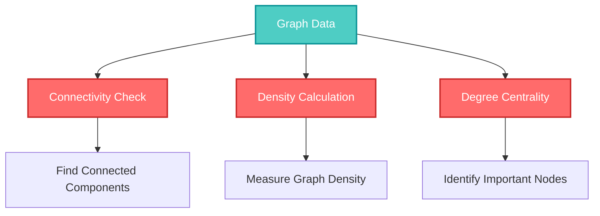
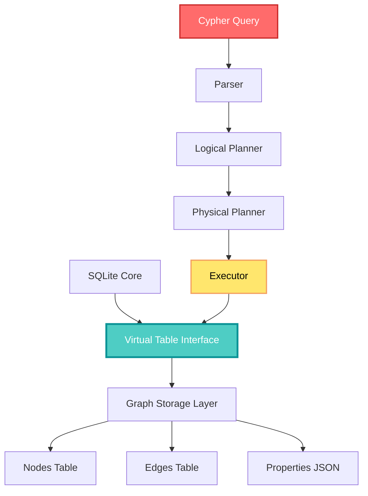
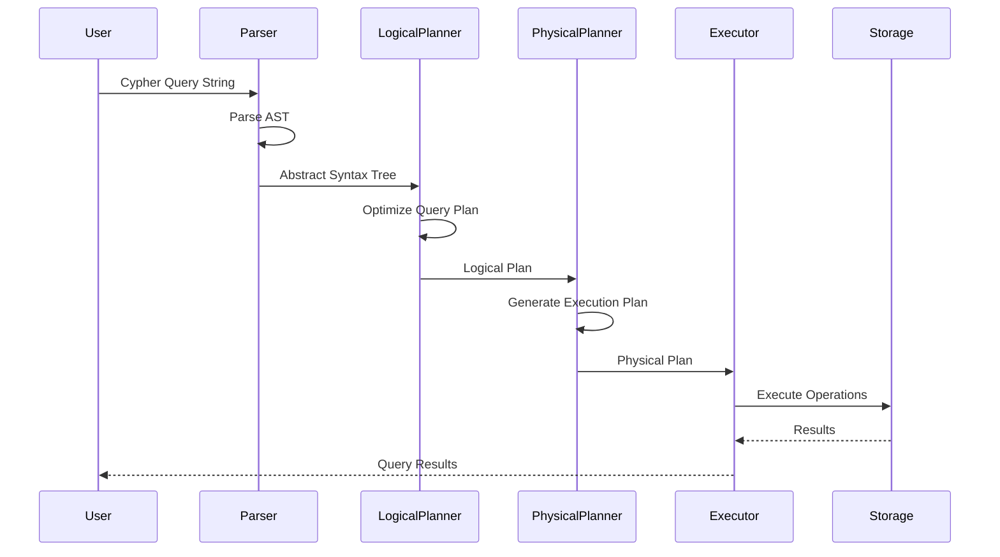

## 🤔 Curiosity: What If SQLite Could Query Graphs Like Neo4j?

SQLite is the most widely deployed database engine in the world—powering everything from mobile apps to browsers to embedded systems. But what if this lightweight, reliable database could also handle complex graph queries using Cypher, the same query language used by Neo4j?

> **Curiosity:** Can we combine SQLite's simplicity and reliability with the expressive power of graph databases? And what happens when you add Cypher query support to the world's most ubiquitous database?
{: .prompt-tip}

**SQLite-Graph** answers these questions by extending SQLite with full graph database capabilities. It's not just adding graph storage—it's bringing the entire Cypher query language, graph algorithms, and graph analysis tools into the SQLite ecosystem.

As someone who's worked with both SQLite (for embedded systems) and Neo4j (for complex relationship analysis), I've always wondered: **Why can't we have both?** SQLite-Graph makes that possible.

**The question:** Can this extension truly deliver graph database functionality without sacrificing SQLite's core strengths—lightweight deployment, zero configuration, and rock-solid reliability?

---

## 📚 Retrieve: Understanding SQLite-Graph

### What is SQLite-Graph?

**SQLite-Graph** is an extension that adds graph database functionality to SQLite. The most remarkable feature is its support for **Cypher**, the declarative graph query language developed by Neo4j. This means you can write the same graph queries you'd use in Neo4j, but execute them within SQLite.

**Key Value Proposition:**

1. **SQLite's Reliability + Graph Capabilities:** Keep SQLite's proven stability while adding graph processing
2. **Cypher Query Language:** Use the industry-standard graph query language
3. **Zero External Dependencies:** No need for separate graph database servers
4. **Lightweight Deployment:** Perfect for mobile, edge computing, and embedded systems

{: .light .w-75 .shadow .rounded-10 w='800' h='600' }

### Core Features

#### 1. Cypher Query Language Support

**Cypher** is a declarative graph query language that makes complex graph patterns intuitive to express. SQLite-Graph supports core Cypher operations:

| Cypher Operation | Description | Status |
|:-----------------|:------------|:-------|
| **CREATE** | Create nodes and relationships | ✅ Supported |
| **MATCH** | Find patterns in the graph | ✅ Supported |
| **WHERE** | Filter query results | ✅ Supported |
| **RETURN** | Return query results | ✅ Supported |
| **MERGE** | Create or match patterns | 🚧 In Progress |
| **DELETE** | Remove nodes/relationships | 🚧 In Progress |

**Example Cypher Query:**

```cypher
// Find all friends of friends
MATCH (person:Person)-[:FRIENDS]->(friend:Person)-[:FRIENDS]->(friendOfFriend:Person)
WHERE person.name = 'Alice'
RETURN friendOfFriend.name, friendOfFriend.age
```

**Why This Matters:**

Traditional SQL struggles with multi-hop relationship queries. Cypher makes these queries natural and readable.

**SQL Equivalent (Complex):**

```sql
-- Same query in SQL (much more verbose)
SELECT fof.name, fof.age
FROM Person person
JOIN Friends f1 ON person.id = f1.person_id
JOIN Person friend ON f1.friend_id = friend.id
JOIN Friends f2 ON friend.id = f2.person_id
JOIN Person fof ON f2.friend_id = fof.id
WHERE person.name = 'Alice';
```

#### 2. SQL Function-Based Graph Operations

For users more comfortable with SQL, SQLite-Graph provides SQL functions for graph manipulation:

```sql
-- Add a node
SELECT graph_node_add('Person', '{"name": "Alice", "age": 30}');

-- Add an edge
SELECT graph_edge_add('Person', 'FRIENDS', 'Person', 
  '{"person_id": 1, "friend_id": 2, "since": "2020-01-01"}');

-- Count nodes
SELECT graph_count_nodes('Person');

-- Get graph statistics
SELECT graph_density();
```

**Benefits:**
- ✅ Familiar SQL syntax
- ✅ Easy integration with existing SQL code
- ✅ No need to learn Cypher immediately

#### 3. Built-in Graph Algorithms

SQLite-Graph includes essential graph algorithms out of the box:



**Available Algorithms:**

| Algorithm | Purpose | Use Case |
|:----------|:---------|:---------|
| **Connectivity Check** | Find connected components | Network analysis, social graphs |
| **Density Calculation** | Measure graph density | Graph structure analysis |
| **Degree Centrality** | Identify important nodes | Influence analysis, hub detection |

**Example Usage:**

```sql
-- Check if two nodes are connected
SELECT graph_is_connected(node1_id, node2_id);

-- Calculate graph density
SELECT graph_density();

-- Find nodes with highest degree
SELECT graph_degree_centrality('Person', 10); -- Top 10
```

#### 4. High Compatibility and Stability

**Python Bindings:**

SQLite-Graph provides Python bindings for Python 3.6+, making it easy to integrate into data analysis workflows:

```python
import sqlite3
import sqlite_graph

# Connect to database
conn = sqlite3.connect('graph.db')
conn.enable_load_extension(True)
conn.load_extension('sqlite_graph')

# Execute Cypher query
cursor = conn.execute("""
    MATCH (p:Person)-[:FRIENDS]->(f:Person)
    WHERE p.age > 25
    RETURN p.name, f.name
""")

for row in cursor:
    print(f"{row[0]} is friends with {row[1]}")
```

**Multi-thread Safety:**

SQLite-Graph maintains SQLite's multi-thread safety, allowing concurrent access in parallel processing environments.

---

## 💡 Innovation: Architecture and Production Applications

### Technical Architecture

SQLite-Graph uses a clever architecture that integrates graph functionality without disrupting SQLite's core operations.

#### 1. Virtual Table Interface

**How It Works:**



**Key Design Decisions:**

1. **Virtual Tables:** Nodes and edges are managed as virtual tables within SQLite
2. **Native Integration:** No separate storage system—everything uses SQLite's storage
3. **Transparent Access:** Graph data can be queried via both Cypher and SQL

**Benefits:**
- ✅ No data duplication
- ✅ Leverages SQLite's proven storage engine
- ✅ Seamless integration with existing SQLite databases

#### 2. JSON-Based Property Storage

**Property Storage Strategy:**

```json
{
  "node_id": 1,
  "labels": ["Person"],
  "properties": {
    "name": "Alice",
    "age": 30,
    "email": "alice@example.com",
    "metadata": {
      "created_at": "2024-01-01",
      "verified": true
    }
  }
}
```

**Why JSON?**

- **Flexible Schema:** No need to predefine all properties
- **Nested Data:** Support for complex, nested structures
- **Efficient Storage:** SQLite's JSON1 extension provides fast JSON operations
- **Type Flexibility:** Properties can be strings, numbers, booleans, arrays, objects

#### 3. Cypher Execution Engine

**Query Processing Pipeline:**



**Execution Model: Volcano Iterator**

SQLite-Graph uses the **Volcano model** for query execution:

- Each operator implements an iterator interface
- Data flows through operators in a pipeline
- Lazy evaluation: data is processed on-demand
- Memory efficient: only active data is held in memory

**Example Execution:**

```cypher
MATCH (a:Person)-[:FRIENDS]->(b:Person)-[:FRIENDS]->(c:Person)
WHERE a.age > 25
RETURN a.name, c.name
```

**Execution Steps:**
1. **Scan:** Find all Person nodes
2. **Filter:** Keep only nodes where age > 25
3. **Expand:** Follow FRIENDS relationships
4. **Expand Again:** Follow second-level FRIENDS
5. **Project:** Return name properties

### Production Use Cases

#### 1. Mobile Applications

**The Challenge:**
Mobile apps often need to store and query relationship data (social networks, recommendation systems, knowledge graphs), but can't run heavy database servers.

**SQLite-Graph Solution:**

```python
# Mobile app: Social network features
import sqlite3
import sqlite_graph

conn = sqlite3.connect('app.db')
conn.load_extension('sqlite_graph')

# Find mutual friends
result = conn.execute("""
    MATCH (user:User {id: $user_id})-[:FRIENDS]->(friend:User)
          -[:FRIENDS]->(mutual:User)
    WHERE EXISTS((user)-[:FRIENDS]->(mutual))
    RETURN mutual.name, mutual.photo_url
    LIMIT 10
""", {'user_id': current_user_id})
```

**Benefits:**
- ✅ No server required
- ✅ Works offline
- ✅ Fast local queries
- ✅ Minimal app size increase

#### 2. Edge Computing

**The Challenge:**
Edge devices need to process graph data locally without constant cloud connectivity.

**SQLite-Graph Solution:**

```python
# Edge device: IoT relationship analysis
# Analyze device relationships and dependencies

MATCH (device:Device)-[:CONNECTED_TO]->(peer:Device)
WHERE device.status = 'active'
WITH device, collect(peer) as peers
WHERE size(peers) > 5
RETURN device.id, device.location, size(peers) as connection_count
```

**Use Cases:**
- Network topology analysis
- Dependency mapping
- Failure propagation analysis
- Resource optimization

#### 3. Recommendation Systems

**The Challenge:**
Build recommendation engines without deploying Neo4j or other heavy graph databases.

**SQLite-Graph Solution:**

```cypher
// Collaborative filtering: Find similar users
MATCH (user:User {id: $user_id})-[:RATED]->(item:Item)<-[:RATED]-(similar:User)
WHERE user.id <> similar.id
WITH similar, count(item) as common_items
WHERE common_items > 3
MATCH (similar)-[:RATED]->(recommendation:Item)
WHERE NOT EXISTS((user)-[:RATED]->(recommendation))
RETURN recommendation.title, recommendation.rating
ORDER BY recommendation.rating DESC
LIMIT 10
```

**Benefits:**
- ✅ Lightweight deployment
- ✅ Fast recommendation generation
- ✅ No external service dependencies
- ✅ Privacy: data stays local

#### 4. Knowledge Graphs

**The Challenge:**
Build knowledge graphs for documentation, FAQs, or internal wikis without enterprise graph database infrastructure.

**SQLite-Graph Solution:**

```cypher
// Knowledge graph: Find related concepts
MATCH (concept:Concept {name: 'Machine Learning'})-[:RELATED_TO*1..3]->(related:Concept)
RETURN related.name, related.category
ORDER BY related.relevance DESC
LIMIT 20
```

**Use Cases:**
- Documentation linking
- FAQ systems
- Internal knowledge bases
- Content recommendation

### Comparison with Other Solutions

| Solution | Pros | Cons | When to Use SQLite-Graph |
|:---------|:-----|:-----|:-------------------------|
| **Neo4j** | Full-featured, mature | Heavy, requires server, complex setup | Need lightweight, embedded solution |
| **ArangoDB** | Multi-model database | Server-based, resource intensive | Mobile/edge deployment |
| **SQL with JOINs** | Familiar, widely supported | Complex for deep relationships | Need graph query expressiveness |
| **In-memory graphs** | Fast | Data loss on restart, memory limits | Need persistence and reliability |

**Key Insight:** SQLite-Graph fills the gap between full graph databases and SQL-only solutions. It's perfect when you need graph capabilities but can't deploy a separate database server.

### Performance Considerations

**Strengths:**
- ✅ Fast for small to medium graphs (< 1M nodes)
- ✅ Efficient for local queries
- ✅ Low memory footprint
- ✅ Leverages SQLite's proven optimization

**Limitations:**
- ⚠️ Not optimized for very large graphs (> 10M nodes)
- ⚠️ Single-file database (concurrent writes limited)
- ⚠️ No distributed capabilities
- ⚠️ Cypher support is still expanding

**Performance Tips:**

1. **Index Properties:** Create indexes on frequently queried properties
2. **Limit Result Sets:** Use LIMIT clauses in Cypher queries
3. **Batch Operations:** Group multiple operations in transactions
4. **Query Optimization:** Use EXPLAIN to analyze query plans

**Example Optimization:**

```cypher
// Before: Full graph scan
MATCH (p:Person)
WHERE p.email = 'alice@example.com'
RETURN p

// After: Use index hint (if available)
MATCH (p:Person {email: 'alice@example.com'})
RETURN p
```

### Integration Examples

#### Python Integration

```python
import sqlite3
import sqlite_graph
from typing import List, Dict

class GraphDatabase:
    def __init__(self, db_path: str):
        self.conn = sqlite3.connect(db_path)
        self.conn.enable_load_extension(True)
        self.conn.load_extension('sqlite_graph')
        self.conn.row_factory = sqlite3.Row
    
    def execute_cypher(self, query: str, params: Dict = None) -> List[Dict]:
        """Execute a Cypher query and return results as dictionaries"""
        cursor = self.conn.execute(query, params or {})
        columns = [desc[0] for desc in cursor.description]
        return [dict(zip(columns, row)) for row in cursor.fetchall()]
    
    def add_node(self, label: str, properties: Dict) -> int:
        """Add a node and return its ID"""
        props_json = json.dumps(properties)
        cursor = self.conn.execute(
            "SELECT graph_node_add(?, ?)",
            (label, props_json)
        )
        return cursor.fetchone()[0]
    
    def add_edge(self, from_label: str, from_id: int, 
                 relationship: str, to_label: str, to_id: int,
                 properties: Dict = None) -> int:
        """Add an edge between two nodes"""
        props_json = json.dumps(properties or {})
        cursor = self.conn.execute(
            "SELECT graph_edge_add(?, ?, ?, ?, ?)",
            (from_label, relationship, to_label, from_id, to_id, props_json)
        )
        return cursor.fetchone()[0]

# Usage
db = GraphDatabase('social_network.db')

# Add users
alice_id = db.add_node('Person', {'name': 'Alice', 'age': 30})
bob_id = db.add_node('Person', {'name': 'Bob', 'age': 25})

# Create friendship
db.add_edge('Person', alice_id, 'FRIENDS', 'Person', bob_id, 
            {'since': '2020-01-01'})

# Query
friends = db.execute_cypher("""
    MATCH (p:Person)-[:FRIENDS]->(f:Person)
    RETURN p.name, f.name
""")
```

#### JavaScript/Node.js Integration

```javascript
const sqlite3 = require('sqlite3').verbose();
const sqlite_graph = require('sqlite-graph');

class GraphDB {
    constructor(dbPath) {
        this.db = new sqlite3.Database(dbPath);
        this.db.loadExtension('sqlite_graph');
    }
    
    async query(cypher, params = {}) {
        return new Promise((resolve, reject) => {
            this.db.all(cypher, params, (err, rows) => {
                if (err) reject(err);
                else resolve(rows);
            });
        });
    }
}

// Usage
const graph = new GraphDB('graph.db');
const results = await graph.query(`
    MATCH (p:Person)-[:FRIENDS]->(f:Person)
    WHERE p.age > $minAge
    RETURN p.name, f.name
`, { minAge: 25 });
```

{: .light .w-75 .shadow .rounded-10 w='800' h='600' }

---

## 🎯 Key Takeaways

| Insight | Implication | Action Item |
|:--------|:------------|:------------|
| **SQLite-Graph combines best of both worlds** | Lightweight + graph capabilities | Evaluate for mobile/edge applications |
| **Cypher support is expanding** | More features coming | Monitor project updates |
| **Perfect for embedded systems** | No server required | Consider for IoT and mobile apps |
| **Performance scales to medium graphs** | < 1M nodes optimal | Plan for graph size |
| **Python bindings available** | Easy integration | Start with Python prototype |

### Why This Matters

SQLite-Graph represents a significant innovation in database technology:

1. **Democratizes Graph Databases:** Makes graph capabilities accessible without heavy infrastructure
2. **Bridges Two Worlds:** Combines SQLite's reliability with graph query expressiveness
3. **Enables New Use Cases:** Mobile apps, edge computing, embedded systems can now use graphs
4. **Reduces Complexity:** No need to learn and deploy separate graph database systems

**The Challenge:** Cypher support is still expanding, and performance may not match dedicated graph databases for very large graphs. But for many use cases, SQLite-Graph provides the perfect balance of simplicity and capability.

---

## 🤔 New Questions This Raises

1. **How does performance compare to Neo4j for different graph sizes?** What's the breaking point?

2. **Can SQLite-Graph handle real-time graph updates?** How does it perform with high write loads?

3. **What's the migration path from Neo4j to SQLite-Graph?** Can existing Cypher queries be ported?

4. **How do graph algorithms scale?** Are there limitations on graph size for algorithm execution?

5. **What's the roadmap for full Cypher support?** When will MERGE, DELETE, and other operations be available?

**Next experiment:** Build a recommendation system using SQLite-Graph, compare performance with a Neo4j implementation, and measure resource usage (memory, CPU, disk).

---

## References

**Original Article:**
- [SQLite가 그래프 데이터베이스로? Cypher 쿼리까지 지원하는 SQLite-Graph 상세 분석 - Digital Bourgeois](https://digitalbourgeois.tistory.com/m/2306)

**SQLite-Graph:**
- [SQLite-Graph GitHub Repository](https://github.com/agentflare-ai/sqlite-graph)
- [SQLite-Graph Documentation](https://github.com/agentflare-ai/sqlite-graph#readme)
- [SQLite-Graph Issues & Roadmap](https://github.com/agentflare-ai/sqlite-graph/issues)

**SQLite:**
- [SQLite Official Website](https://www.sqlite.org/)
- [SQLite Documentation](https://www.sqlite.org/docs.html)
- [SQLite Virtual Tables](https://www.sqlite.org/vtab.html)
- [SQLite JSON1 Extension](https://www.sqlite.org/json1.html)

**Cypher Query Language:**
- [Cypher Query Language Reference](https://neo4j.com/docs/cypher-manual/current/)
- [Cypher Style Guide](https://neo4j.com/developer/cypher/style-guide/)
- [Cypher Best Practices](https://neo4j.com/developer/cypher/guide-cypher-best-practices/)

**Graph Databases:**
- [Neo4j Official Website](https://neo4j.com/)
- [Neo4j Graph Database Guide](https://neo4j.com/developer/graph-database/)
- [Graph Database Use Cases](https://neo4j.com/use-cases/)

**Graph Algorithms:**
- [Graph Algorithms Overview](https://neo4j.com/docs/graph-algorithms/current/)
- [Network Analysis with Graphs](https://networkx.org/documentation/stable/)
- [Graph Theory Fundamentals](https://www.khanacademy.org/computing/computer-science/algorithms/graph-representation/a/describing-graphs)

**Python Integration:**
- [Python sqlite3 Documentation](https://docs.python.org/3/library/sqlite3.html)
- [SQLite Python Tutorial](https://www.sqlitetutorial.net/sqlite-python/)
- [Graph Analysis with Python](https://networkx.org/)

**Performance & Optimization:**
- [SQLite Performance Tuning](https://www.sqlite.org/performance.html)
- [Query Optimization Techniques](https://www.sqlite.org/queryplanner.html)
- [Database Indexing Strategies](https://www.sqlite.org/queryplanner.html#searching)

**Use Cases & Examples:**
- [Graph Database Use Cases](https://neo4j.com/use-cases/)
- [Social Network Analysis](https://neo4j.com/use-cases/social-networking/)
- [Recommendation Systems](https://neo4j.com/use-cases/real-time-recommendation-engine/)
- [Knowledge Graphs](https://neo4j.com/use-cases/knowledge-graph/)

**Related Projects:**
- [SQLite Extensions Directory](https://www.sqlite.org/src/doc/trunk/README.md)
- [Other SQLite Graph Extensions](https://github.com/topics/sqlite-graph)
- [Lightweight Graph Databases](https://github.com/topics/lightweight-graph-database)

**Community & Support:**
- [SQLite Forum](https://sqlite.org/forum/)
- [Neo4j Community](https://community.neo4j.com/)
- [Graph Database Discussions](https://github.com/topics/graph-database)

**Academic & Research:**
- [Graph Database Survey Papers](https://arxiv.org/search/?query=graph+database&searchtype=all)
- [SQLite Research Papers](https://www.sqlite.org/research.html)
- [Graph Query Language Research](https://arxiv.org/search/?query=cypher+query+language)
