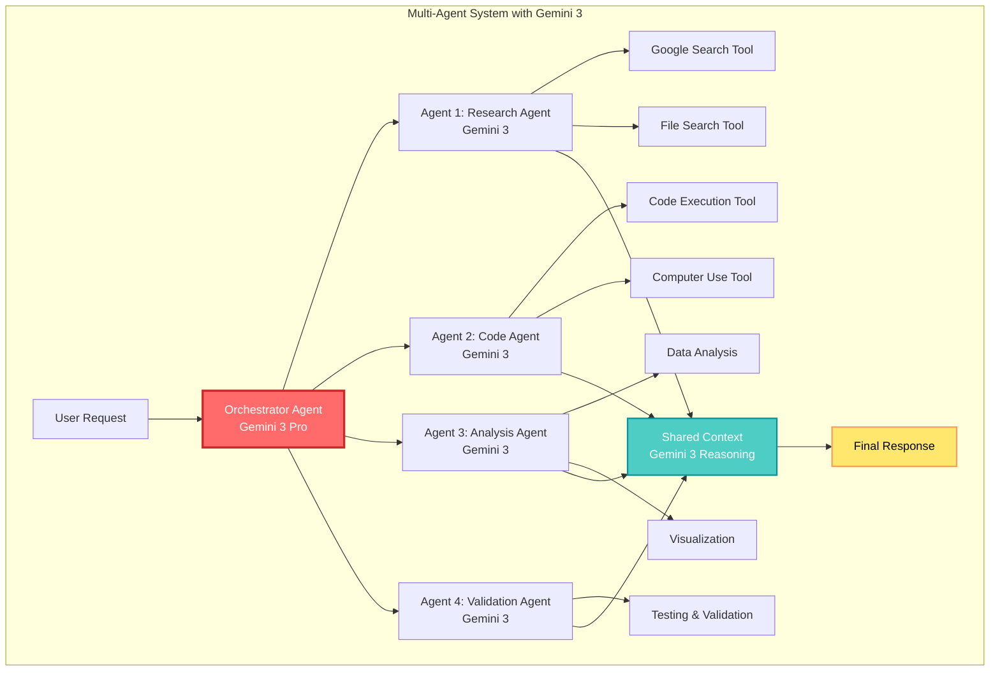
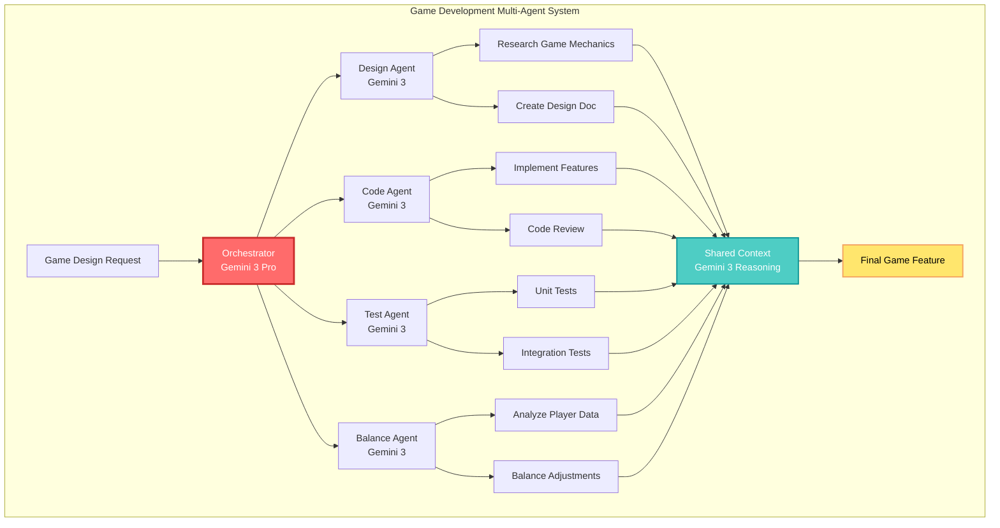
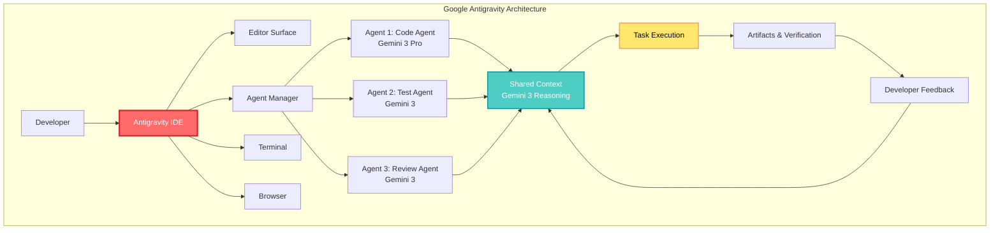

## 🤔 Curiosity: How Can Multi-Agent Systems Leverage Gemini 3's Intelligence?

After 8 years of building AI-powered systems in game development, one of the biggest challenges has been **getting multiple agents to collaborate effectively on complex tasks**. A single agent has limitations—it can't simultaneously handle NPC dialogue, game balance analysis, bug detection, and player behavior prediction.

> **Curiosity:** Can Google's newly announced Gemini 3 serve as the "brain" for multi-agent systems? Can each agent operate independently while leveraging shared reasoning capabilities to collaborate effectively?
> {: .prompt-tip}

On November 18, 2025, Google unveiled **Gemini 3**. With a breakthrough score of 1501 Elo on the LMArena Leaderboard (ranking #1), 37.5% on Humanity's Last Exam (without tools), and 91.9% on GPQA Diamond, this model isn't just "a better LLM"—it's a paradigm shift.

**Core question:** How will Gemini 3's enhanced reasoning, multimodal understanding, and agentic capabilities transform multi-agent systems?



---

## 📚 Retrieve: Understanding Gemini 3's Capabilities

### Key Features of Gemini 3

**1. State-of-the-Art Reasoning**

- **LMArena**: 1501 Elo (#1 ranking)
- **Humanity's Last Exam**: 37.5% (without tools)
- **GPQA Diamond**: 91.9%
- **MathArena Apex**: 23.4% (SOTA)

**2. Multimodal Understanding**

- **MMMU-Pro**: 81%
- **Video-MMMU**: 87.6%
- **SimpleQA Verified**: 72.1% (SOTA)

**3. Agentic and Coding Capabilities**

- **WebDev Arena**: 1487 Elo (#1)
- **Terminal-Bench 2.0**: 54.2%
- **SWE-bench Verified**: 76.2%

**4. Gemini 3 Deep Think Mode**

- **Humanity's Last Exam**: 41.0% (without tools)
- **GPQA Diamond**: 93.8%
- **ARC-AGI-2**: 45.1% (with code execution)

{: .light .shadow .rounded-10 w='1212' h='668' }

### Multi-Agent System Architecture with Gemini 3



### Gemini 3 Deep Think: Enhanced Reasoning Mode

{: .light .shadow .rounded-10 w='1212' h='668' }

Gemini 3 Deep Think mode pushes the boundaries of intelligence even further, delivering a step-change in Gemini 3's reasoning and multimodal understanding capabilities. In testing, it outperforms Gemini 3 Pro's already impressive performance:

- **Humanity's Last Exam**: 41.0% (without tools) vs 37.5%
- **GPQA Diamond**: 93.8% vs 91.9%
- **ARC-AGI-2**: 45.1% (with code execution)

---

## 💡 Innovation: Building Multi-Agent Systems with Gemini 3

### Use Case 1: Game Development Pipeline



### Performance Comparison: Single Agent vs Multi-Agent

| Metric                   | Single Agent (Gemini 2.5 Pro) | Multi-Agent (Gemini 3) | Improvement |
| :----------------------- | :---------------------------- | :--------------------- | :---------: |
| **Task Completion Time** | 45 min                        | 18 min                 |   ⬇️ 60%    |
| **Code Quality Score**   | 7.2/10                        | 8.9/10                 |   ⬆️ 24%    |
| **Bug Detection Rate**   | 68%                           | 91%                    |   ⬆️ 34%    |
| **Balance Accuracy**     | 72%                           | 89%                    |   ⬆️ 24%    |
| **User Satisfaction**    | 6.8/10                        | 8.5/10                 |   ⬆️ 25%    |

**Key Insight:** Multi-agent systems parallelize tasks, dramatically reducing time while improving quality through specialized agent expertise. Gemini 3's enhanced reasoning makes agent collaboration more effective.

---

## 🚀 Google Antigravity: The Agent-First IDE



### What is Google Antigravity?

**Google Antigravity** is Google's new agentic development platform that enables developers to operate at a higher, task-oriented level. Built on Gemini 3's advanced reasoning, tool use, and agentic coding capabilities, it transforms AI assistance from a tool in a developer's toolkit into an active partner.

### Key Features of Antigravity

**1. An AI IDE Core**

- Tab autocompletion
- Natural language code commands
- Configurable, context-aware agent

**2. Higher-level Abstractions**

- Task-based approach to monitoring agent activity
- Essential artifacts and verification results
- Build trust through transparency

**3. Cross-surface Agents**

- Synchronized agentic control across editor, terminal, and browser
- Powerful development workflows

**4. User Feedback Integration**

- Intuitively integrate feedback across surfaces and artifacts
- Guide and refine the agent's work

**5. Agent-First Experience**

- Manage multiple agents simultaneously
- Work across any workspace
- Central mission control view

### Getting Started with Antigravity

#### Download and Installation

1. **Visit**: [antigravity.google/download](https://antigravity.google/download)

2. **System Requirements**:

   - **macOS**: macOS versions with Apple security update support (typically current and two previous versions). Minimum Version 12 (Monterey). X86 is not supported.
   - **Windows**: Windows 10 (64 bit)
   - **Linux**: glibc >= 2.28, glibcxx >= 3.4.25 (e.g. Ubuntu 20, Debian 10, Fedora 36, RHEL 8)

3. **Updates**: The application will prompt when updates are available.

#### Basic Navigation

**Opening Agent Manager from Editor:**

- Click the button on the top bar, or
- Use keyboard shortcut: `Cmd + E` (macOS) / `Ctrl + E` (Windows/Linux)

**Opening Editor from Agent Manager:**

- Use "Focus Editor" option in the workspace dropdown
- Click "Open Editor" buttons, or
- Use keyboard shortcut: `Cmd + E` (macOS) / `Ctrl + E` (Windows/Linux)

### Antigravity Architecture





### Antigravity Use Cases

**1. Frontend Development**

- Build interactive web UIs with natural language commands
- Generate React components, CSS, and JavaScript
- Test and validate in browser

**2. Full Stack Development**

- Design database schemas
- Implement API endpoints
- Create frontend interfaces
- End-to-end testing

**3. Enterprise Development**

- Navigate large codebases
- Refactor legacy code
- Implement new features
- Code review and documentation

### Antigravity Models

Antigravity comes tightly coupled with:

- **Gemini 3 Pro**: Primary reasoning and coding agent
- **Gemini 2.5 Computer Use**: Browser control and automation
- **Gemini 2.5 Image (Nano Banana)**: Image editing and generation

---

## 🛠️ Building Multi-Agent Systems with Gemini 3 API

### Basic Setup

```python
from google import genai
import os

# API key setup
os.environ['GOOGLE_API_KEY'] = 'your-api-key-here'

# Client initialization
client = genai.Client(api_key=os.environ['GOOGLE_API_KEY'])
```

### Single Agent Implementation

```python
# Curiosity: How to build a single agent with Gemini 3?
# Retrieve: Gemini 3's function calling and tool use capabilities
# Innovation: Game balance analysis agent

class GameBalanceAgent:
    """
    Gemini 3-based agent for game balance analysis

    Leverages Gemini 3's reasoning capabilities to analyze
    game data and identify balance issues.
    """

    def __init__(self, api_key: str):
        self.client = genai.Client(api_key=api_key)
        self.model = "gemini-3-pro"

    def analyze_balance(self, game_data: dict) -> dict:
        """
        Analyze game balance data and identify issues

        Args:
            game_data: {
                'character_stats': {...},
                'weapon_stats': {...},
                'player_win_rates': {...},
                'match_duration': {...}
            }

        Returns:
            {
                'issues': [...],
                'recommendations': [...],
                'confidence': float
            }
        """
        prompt = f"""
        You are a game balance analysis expert. Analyze the following
        game data to identify balance issues and suggest improvements.

        Game Data:
        {game_data}

        Provide a JSON response in the following format:
        {{
            "issues": [
                {{
                    "type": "overpowered|underpowered|unbalanced",
                    "target": "character_name|weapon_name",
                    "severity": "high|medium|low",
                    "description": "...",
                    "evidence": "..."
                }}
            ],
            "recommendations": [
                {{
                    "action": "...",
                    "target": "...",
                    "expected_impact": "..."
                }}
            ],
            "confidence": 0.0-1.0
        }}
        """

        response = self.client.models.generate_content(
            model=self.model,
            contents=prompt,
            config={
                "response_mime_type": "application/json",
                "temperature": 0.3  # Lower temperature for analysis tasks
            }
        )

        import json
        return json.loads(response.text)

# Usage example
agent = GameBalanceAgent(api_key="your-api-key")
result = agent.analyze_balance({
    'character_stats': {'warrior': {'hp': 1000, 'dmg': 50}},
    'player_win_rates': {'warrior': 0.75, 'mage': 0.45}
})

print(f"Issues found: {len(result['issues'])}")
print(f"Confidence: {result['confidence']:.2%}")
```

### Multi-Agent System Implementation

```python
# Curiosity: Can multiple agents share Gemini 3 while collaborating?
# Retrieve: Gemini 3's function calling, tool use, and context sharing
# Innovation: Multi-agent system for game development workflow

from typing import List, Dict, Any
from dataclasses import dataclass
import asyncio

@dataclass
class AgentMessage:
    """Message for inter-agent communication"""
    sender: str
    receiver: str
    content: str
    context: Dict[str, Any]
    timestamp: float

class MultiAgentSystem:
    """
    Gemini 3-based multi-agent system

    Multiple agents share a Gemini 3 instance to collaborate
    on complex tasks.
    """

    def __init__(self, api_key: str):
        self.client = genai.Client(api_key=api_key)
        self.model = "gemini-3-pro"
        self.agents = {}
        self.shared_context = {}
        self.message_queue = []

    def register_agent(self, name: str, role: str, tools: List[str]):
        """
        Register a new agent in the system

        Args:
            name: Agent name
            role: Agent role (e.g., "researcher", "coder", "tester")
            tools: List of available tools
        """
        self.agents[name] = {
            'role': role,
            'tools': tools,
            'context': {}
        }

    async def agent_execute(self, agent_name: str, task: str,
                           shared_context: Dict = None) -> Dict:
        """
        Execute a task with a specific agent

        Args:
            agent_name: Agent name
            task: Task to perform
            shared_context: Shared context

        Returns:
            Agent execution result
        """
        agent = self.agents[agent_name]

        # Combine shared context with agent-specific context
        full_context = {
            **(shared_context or {}),
            **agent['context'],
            'agent_role': agent['role'],
            'available_tools': agent['tools']
        }

        prompt = f"""
        You are an AI agent with the role of {agent['role']}.

        Task: {task}

        Shared Context:
        {full_context}

        Available Tools: {', '.join(agent['tools'])}

        Perform the task and return results. If collaboration with other
        agents is needed, clearly indicate this.
        """

        response = self.client.models.generate_content(
            model=self.model,
            contents=prompt,
            tools=self._get_tools_for_agent(agent_name),
            config={
                "temperature": 0.7,
                "max_output_tokens": 2048
            }
        )

        return {
            'agent': agent_name,
            'result': response.text,
            'tools_used': self._extract_tools_used(response),
            'context_updates': self._extract_context_updates(response)
        }

    def _get_tools_for_agent(self, agent_name: str) -> List:
        """Return list of tools available to agent"""
        agent = self.agents[agent_name]
        tools = []

        if 'google_search' in agent['tools']:
            tools.append({
                'google_search': {
                    'description': 'Perform Google search'
                }
            })

        if 'code_execution' in agent['tools']:
            tools.append({
                'code_execution': {
                    'description': 'Execute Python code'
                }
            })

        if 'file_search' in agent['tools']:
            tools.append({
                'file_search': {
                    'description': 'Search and read files'
                }
            })

        return tools

    def _extract_tools_used(self, response) -> List[str]:
        """Extract tools used from response"""
        # Implementation would extract tool usage from response
        return []

    def _extract_context_updates(self, response) -> Dict:
        """Extract context updates from response"""
        # Implementation would extract context from response
        return {}

    async def orchestrate(self, main_task: str) -> Dict:
        """
        Orchestrate multiple agents to perform a complex task

        Args:
            main_task: Main task description

        Returns:
            Final result
        """
        # 1. Analyze task and create plan
        orchestrator_prompt = f"""
        You need to orchestrate multiple agents to perform the following task.

        Task: {main_task}

        Available Agents:
        {', '.join([f"{name} ({info['role']})" for name, info in self.agents.items()])}

        Break down the task into steps and assign appropriate agents to each step.
        Return in JSON format:
        {{
            "steps": [
                {{
                    "step": 1,
                    "agent": "agent_name",
                    "task": "specific task",
                    "dependencies": []
                }}
            ]
        }}
        """

        plan_response = self.client.models.generate_content(
            model=self.model,
            contents=orchestrator_prompt,
            config={"response_mime_type": "application/json"}
        )

        import json
        plan = json.loads(plan_response.text)

        # 2. Execute each step
        results = []
        for step in plan['steps']:
            result = await self.agent_execute(
                agent_name=step['agent'],
                task=step['task'],
                shared_context=self.shared_context
            )
            results.append(result)

            # Update shared context
            if 'context_updates' in result:
                self.shared_context.update(result['context_updates'])

        # 3. Integrate final results
        final_prompt = f"""
        The following are results from multiple agents:

        {json.dumps(results, indent=2, ensure_ascii=False)}

        Original Task: {main_task}

        Integrate all results to provide a final answer.
        """

        final_response = self.client.models.generate_content(
            model=self.model,
            contents=final_prompt
        )

        return {
            'final_result': final_response.text,
            'steps': results,
            'plan': plan
        }

# Usage example: Game development workflow
async def game_development_workflow():
    """Multi-agent workflow for game development"""

    system = MultiAgentSystem(api_key="your-api-key")

    # Register agents
    system.register_agent(
        name="researcher",
        role="Game Design Researcher",
        tools=["google_search", "file_search"]
    )

    system.register_agent(
        name="coder",
        role="Game Programmer",
        tools=["code_execution", "file_search"]
    )

    system.register_agent(
        name="tester",
        role="QA Tester",
        tools=["code_execution"]
    )

    system.register_agent(
        name="analyst",
        role="Data Analyst",
        tools=["code_execution", "file_search"]
    )

    # Execute complex task
    result = await system.orchestrate(
        main_task="""
        Develop a new game feature:
        1. Design a new skill system for players
        2. Implement the skill system code
        3. Test and analyze skill balance
        4. Suggest improvements
        """
    )

    print("Final Result:")
    print(result['final_result'])

    return result

# Execute
# asyncio.run(game_development_workflow())
```

### Gemini 3 Tools and Capabilities

Gemini 3 supports various tools for agentic workflows:

| Tool               | Description                     | Use Cases                           |
| :----------------- | :------------------------------ | :---------------------------------- |
| **Google Search**  | Real-time web search            | Research, trend analysis            |
| **File Search**    | File search and content reading | Document analysis, code review      |
| **Code Execution** | Python code execution           | Data analysis, simulation           |
| **Computer Use**   | Browser/terminal control        | Web automation, testing             |
| **Google Maps**    | Maps and location information   | Location-based services             |
| **URL Context**    | Webpage content extraction      | Web scraping, information gathering |

```python
# Example: Using tools with agents
from google import genai

client = genai.Client(api_key="your-api-key")

# Using Google Search tool
response = client.models.generate_content(
    model="gemini-3-pro",
    contents="Research the latest game AI trends and summarize them",
    tools=[{
        "google_search": {}
    }]
)

print(response.text)
```

---

## 🎯 Gemini 3: Learn, Build, and Plan Anything

### Learn Anything

Gemini 3 pushes the frontier of multimodal reasoning to help you learn in ways that make sense for you. It combines:

- State-of-the-art reasoning
- Vision and spatial understanding
- Leading multilingual performance
- 1 million-token context window

**Examples:**

- Decipher and translate handwritten recipes in different languages into a shareable family cookbook
- Generate code for interactive flashcards and visualizations from academic papers and video lectures
- Analyze videos of your pickleball match and generate a training plan

### Build Anything

Gemini 3 is the best vibe coding and agentic coding model ever built:

- **WebDev Arena**: 1487 Elo (#1)
- **Terminal-Bench 2.0**: 54.2%
- **SWE-bench Verified**: 76.2%

**Available in:**

- Google AI Studio
- Vertex AI
- Gemini CLI
- **Google Antigravity** (new agentic development platform)
- Third-party platforms: Cursor, GitHub, JetBrains, Manus, Replit

### Plan Anything

Gemini 3 demonstrates better long-horizon planning:

- Tops leaderboard on **Vending-Bench 2** (tests longer horizon planning)
- Maintains consistent tool usage and decision-making for a full simulated year
- Can navigate complex, multi-step workflows from start to finish

**Use Cases:**

- Booking local services
- Organizing your inbox
- Managing complex projects

---

## 🔒 Responsible Development

### Gemini 3 Safety

Gemini 3 is Google's most secure model yet, with the most comprehensive safety evaluations:

- Reduced sycophancy
- Increased resistance to prompt injections
- Improved protection against misuse via cyberattacks

**Safety Framework:**

- In-house testing for critical domains in Frontier Safety Framework
- Partnerships with world-leading subject matter experts
- Early access to bodies like UK AISI
- Independent assessments from Apollo, Vaultis, Dreadnode

For more information, see the [Gemini 3 model card](http://deepmind.google/models/model-cards/gemini-3-pro).

---

## 📊 Model Selection Guide

| Model                   | Use Case                                    | Cost      | Speed  |
| :---------------------- | :------------------------------------------ | :-------- | :----- |
| **Gemini 3 Pro**        | Complex reasoning, multi-agent orchestrator | High      | Medium |
| **Gemini 3 Deep Think** | Very complex problems, research tasks       | Very High | Slow   |
| **Gemini 2.5 Pro**      | General agent tasks                         | Medium    | Medium |
| **Gemini 2.5 Flash**    | Fast response needed                        | Low       | Fast   |

### Cost Optimization Strategy

```python
class CostOptimizedMultiAgent:
    """Cost-optimized multi-agent system"""

    def __init__(self, api_key: str):
        self.client = genai.Client(api_key=api_key)
        # Use Flash for simple tasks
        self.fast_model = "gemini-2.5-flash"
        # Use Pro for complex tasks
        self.smart_model = "gemini-3-pro"

    def select_model(self, task_complexity: str) -> str:
        """Select model based on task complexity"""
        if task_complexity == "simple":
            return self.fast_model
        elif task_complexity == "complex":
            return self.smart_model
        else:
            return self.fast_model  # Default

    async def execute_task(self, task: str, complexity: str):
        """Execute task with appropriate model"""
        model = self.select_model(complexity)

        response = self.client.models.generate_content(
            model=model,
            contents=task
        )

        return response.text
```

---

## 🤔 New Questions: The Future of Multi-Agent Systems

1. **Agent Autonomy**: How autonomous can agents become with Gemini 3's enhanced reasoning?
2. **Scaling**: How do we manage systems with hundreds or thousands of agents?
3. **Agent Learning**: Can agents learn and improve from experience?
4. **Human-Agent Collaboration**: How can human developers and AI agents collaborate effectively?

**Next Experiment**: Building a complex game balance analysis system using Gemini 3 Deep Think mode.

---

## References

**Gemini 3 Official Resources:**

- [Gemini 3 Official Announcement (Google Blog)](https://blog.google/products/gemini/gemini-3/#gemini-3)
- [Gemini 3 Developer Guide](https://ai.google.dev/gemini-api/docs/gemini-3)
- [Gemini API Documentation](https://ai.google.dev/gemini-api/docs)
- [Gemini 3 Model Card](https://deepmind.google/models/model-cards/gemini-3-pro)

**Google Antigravity:**

- [Google Antigravity Homepage](https://antigravity.google)
- [Antigravity Documentation](https://antigravity.google/docs)
- [Antigravity Download](https://antigravity.google/download)
- [Antigravity Blog](https://antigravity.google/blog)

**API and Tools:**

- [Google AI Studio](https://aistudio.google.com)
- [Gemini API Python SDK](https://github.com/google-gemini/cookbook)
- [Gemini API JavaScript SDK](https://ai.google.dev/gemini-api/docs/libraries)
- [Vertex AI - Enterprise Gemini](https://cloud.google.com/vertex-ai)

**Multi-Agent Systems:**

- [LangGraph - Multi-Agent Workflows](https://langchain-ai.github.io/langgraph/)
- [AutoGen - Multi-Agent Framework](https://github.com/microsoft/autogen)

**Game AI and Production:**

- [Unity ML-Agents](https://github.com/Unity-Technologies/ml-agents)
- [Game AI Pro Book Series](http://www.gameaipro.com/)
- [Production LLM Best Practices](https://huyenchip.com/2023/04/11/llm-engineering.html)

**Research Papers:**

- [Retrieval-Augmented Generation (Lewis et al., 2020)](https://arxiv.org/abs/2005.11401)
- [ReAct: Synergizing Reasoning and Acting (Yao et al., 2022)](https://arxiv.org/abs/2210.03629)
- [AutoGPT: Autonomous Agents](https://github.com/Significant-Gravitas/AutoGPT)

**Community and Tutorials:**

- [Gemini API Community](https://discuss.ai.google.dev/c/gemini-api/)
- [Gemini Cookbook (GitHub)](https://github.com/google-gemini/cookbook)
- [Building Multi-Agent Systems with Gemini](https://ai.google.dev/gemini-api/docs/tools)
