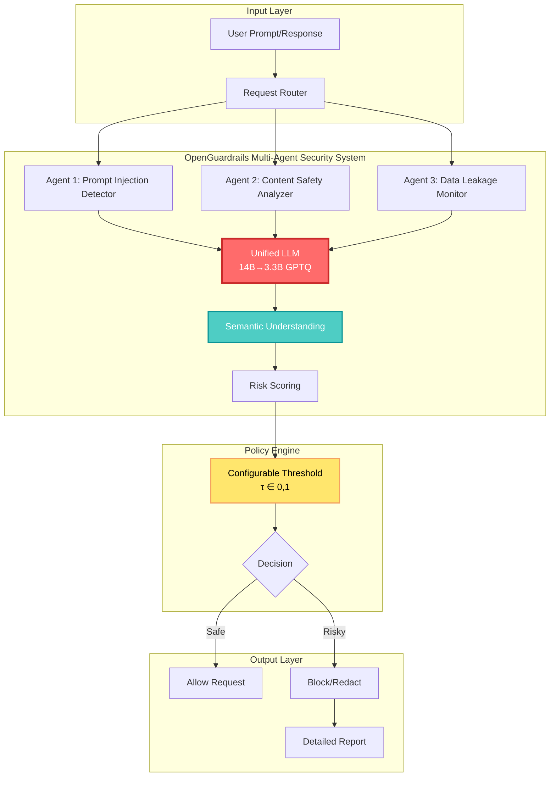
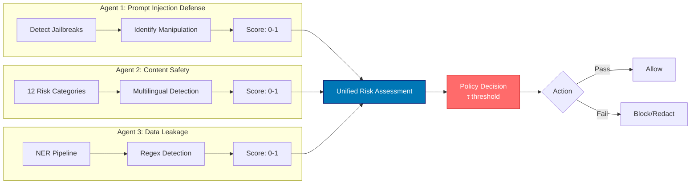
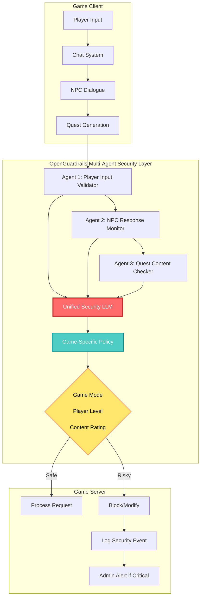
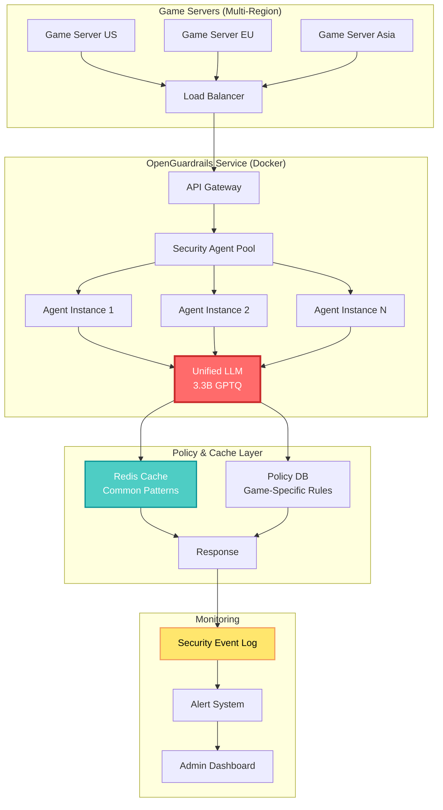

## 🤔 Curiosity: Why Do We Need a Multi-Agent Approach for AI Security?

When deploying AI to production in game development, one of the biggest concerns is **security**. Prompt injection attacks, inappropriate content generation, sensitive data leakage—can a single system defend against all these threats?

> **Curiosity:** Would multiple security agents collaborating in their specialized domains be more effective than a single monolithic defense system?
> {: .prompt-tip}

After 8 years of developing AI-powered games at NC SOFT and COM2US, security was always an afterthought. The common approach was "build the feature first, add security later." But as LLMs became core to game functionality, security is no longer optional—it's essential.

**Real-world problems:**
- Players attempting to bypass game logic through prompt injection
- Inappropriate content generation in NPC dialogue systems
- Risk of personal information leakage from in-game databases

**Core question:** Would a multi-agent architecture where each security threat is handled by independent agents that collaborate be more effective?

{: .light .shadow .rounded-10 w='1212' h='668' }

---

## 📚 Retrieve: OpenGuardrails' Unified Security Architecture

### What is OpenGuardrails?

**OpenGuardrails** is a developer-first open-source AI security platform that comprehensively defends against three major threats:

1. **Prompt Injection Defense**
2. **Content Safety Detection**
3. **Data Leakage Prevention**

### Key Innovation: Unified LLM Architecture

Traditional security systems used separate models for each threat type (e.g., BERT-based classifiers + rule-based filters). OpenGuardrails handles all security tasks with a **single 14B→3.3B (GPTQ quantized) model**.



### Multi-Agent Security Workflow

Each security agent operates independently while sharing semantic understanding through the unified LLM:



### Performance Benchmarks

| Metric | OpenGuardrails | Qwen3Guard-8B | Improvement |
|:-------|:--------------:|:-------------:|:-----------:|
| **English Prompt F1** | 87.1% | 84.3% | +2.8% |
| **English Response F1** | 88.5% | 80.5% | +8.0% |
| **Multilingual Prompt (RTP-LX)** | 97.3% | 85.0% | +12.3% |
| **Multilingual Response** | 97.2% | 78.1% | +19.1% |
| **P95 Latency** | 274.6ms | ~500ms | **-45%** |
| **Languages Supported** | 119+ | ~50 | +138% |

**Key insight:** The unified architecture outperforms hybrid approaches in both performance and efficiency.

### Technical Implementation Details

#### 1. Configurable Policy Adaptation

Traditional systems used fixed modes like "strict/loose". OpenGuardrails supports **continuous probabilistic sensitivity thresholds (τ ∈ [0,1])**, enabling dynamic per-request policy adjustment.

```python
# OpenGuardrails Policy Configuration
from openguardrails import OpenGuardrails

guardrails = OpenGuardrails(
    model="openguardrails/openguardrails-3.3b-gptq",
    policy_config={
        "prompt_injection": {
            "threshold": 0.7,  # τ = 0.7 (block if risk > 70%)
            "action": "block"
        },
        "content_safety": {
            "threshold": 0.6,  # τ = 0.6 (block if risk > 60%)
            "action": "redact",  # Redact sensitive parts instead of blocking
            "categories": [
                "hate", "harassment", "violence", 
                "sexual", "illegal", "self_harm"
            ]
        },
        "data_leakage": {
            "threshold": 0.8,  # τ = 0.8 (block if risk > 80%)
            "action": "block",
            "detection_types": ["pii", "credentials", "api_keys"]
        }
    }
)

# Multi-agent security check
result = guardrails.check(
    prompt=user_input,
    response=llm_output,
    context={
        "user_id": "player_12345",
        "game_mode": "multiplayer",
        "sensitivity": "high"  # Adjust policy based on game mode
    }
)

if result.is_safe:
    # Allow request if safe
    return result.response
else:
    # Block or modify if risky
    return result.blocked_response
```

#### 2. Unified LLM Architecture

The key to a single model handling multiple security tasks is **multi-task learning**:

```python
# OpenGuardrails model architecture (conceptual)
class UnifiedSecurityLLM(nn.Module):
    """
    Single model handling prompt injection, content safety, and data leakage
    """
    
    def __init__(self):
        self.encoder = TransformerEncoder(...)  # Shared encoder
        self.task_heads = {
            'prompt_injection': ClassificationHead(...),
            'content_safety': MultiLabelHead(...),  # 12 categories
            'data_leakage': NERHead(...)
        }
    
    def forward(self, text, task_type='all'):
        # Extract semantic representation with shared encoder
        embeddings = self.encoder(text)
        
        if task_type == 'all':
            # Multi-agent: Execute all security tasks in parallel
            results = {}
            for task, head in self.task_heads.items():
                results[task] = head(embeddings)
            return results
        else:
            # Single agent: Execute specific task only
            return self.task_heads[task_type](embeddings)
```

#### 3. Multilingual Excellence

The key to supporting 119 languages is the **OpenGuardrailsMixZh 97k dataset** and multilingual training:

| Language Group | Coverage | F1 Score |
|:---------------|:--------:|:--------:|
| **English** | Native | 87.1% (Prompt), 88.5% (Response) |
| **Chinese** | Native | 95.2% (Prompt), 94.8% (Response) |
| **Multilingual (RTP-LX)** | 119 languages | 97.3% (Prompt), 97.2% (Response) |
| **Low-resource** | 50+ languages | >85% average |

---

## 💡 Innovation: Multi-Agent Security System Applicable to Game Development

### Production Application Scenario

Applying OpenGuardrails from a multi-agent perspective in game development enables the following architecture:



### Game-Specific Security Policy Examples

```python
# Game-specific security policy configuration
game_security_policies = {
    "mmorpg_adult": {
        "prompt_injection": {"threshold": 0.8, "action": "block"},
        "content_safety": {
            "threshold": 0.5,  # More lenient for adult games
            "blocked_categories": ["illegal", "self_harm"],
            "allowed_categories": ["violence", "sexual"]  # Based on game content
        },
        "data_leakage": {"threshold": 0.9, "action": "block"}
    },
    
    "mobile_casual": {
        "prompt_injection": {"threshold": 0.7, "action": "block"},
        "content_safety": {
            "threshold": 0.3,  # Stricter for casual games
            "blocked_categories": ["all"],  # Block all inappropriate content
            "action": "block"
        },
        "data_leakage": {"threshold": 0.8, "action": "block"}
    },
    
    "multiplayer_competitive": {
        "prompt_injection": {"threshold": 0.9, "action": "block"},  # Anti-cheat
        "content_safety": {
            "threshold": 0.4,
            "blocked_categories": ["hate", "harassment"],  # Block hate speech
            "action": "redact"  # Modify instead of blocking
        },
        "data_leakage": {"threshold": 0.95, "action": "block"}  # Prevent strategy leaks
    }
}

# Apply dynamic policy based on game mode
def apply_security_policy(game_type, player_input, llm_response):
    policy = game_security_policies[game_type]
    guardrails = OpenGuardrails(policy_config=policy)
    
    result = guardrails.check(
        prompt=player_input,
        response=llm_response,
        context={"game_type": game_type}
    )
    
    return result
```

### Multi-Agent Collaboration Scenario

Example of multiple security agents collaborating in a real game environment:

```python
class GameSecurityMultiAgent:
    """
    Multi-agent security system for game environments
    """
    
    def __init__(self):
        self.agents = {
            'input_validator': PromptInjectionAgent(),
            'content_moderator': ContentSafetyAgent(),
            'data_protector': DataLeakageAgent(),
            'context_analyzer': GameContextAgent()  # Understands game context
        }
        self.policy_engine = GamePolicyEngine()
    
    def secure_game_interaction(self, player_input, game_state):
        """
        Security check for game interactions through multi-agent collaboration
        """
        # Agent 1: Input validation
        injection_risk = self.agents['input_validator'].check(player_input)
        
        # Agent 2: Game context analysis (provides context to other agents)
        context = self.agents['context_analyzer'].analyze(game_state)
        
        # Agent 3: Content safety (considering game context)
        content_risk = self.agents['content_moderator'].check(
            player_input, 
            context=context
        )
        
        # Agent 4: Data leakage (considering game database access)
        leakage_risk = self.agents['data_protector'].check(
            player_input,
            game_db_schema=game_state['db_schema']
        )
        
        # Unified risk assessment
        total_risk = self.policy_engine.evaluate({
            'injection': injection_risk,
            'content': content_risk,
            'leakage': leakage_risk,
            'context': context
        })
        
        # Dynamic threshold based on game mode
        threshold = self.policy_engine.get_threshold(
            game_mode=game_state['mode'],
            player_level=game_state['player_level']
        )
        
        if total_risk > threshold:
            return {
                'safe': False,
                'action': 'block',
                'reason': self.policy_engine.get_reason(),
                'agent_reports': {
                    'input_validator': injection_risk,
                    'content_moderator': content_risk,
                    'data_protector': leakage_risk
                }
            }
        else:
            return {
                'safe': True,
                'action': 'allow',
                'sanitized_input': self.policy_engine.sanitize(player_input)
            }
```

### Production Performance Considerations

| Consideration | OpenGuardrails | Traditional Hybrid System | Improvement |
|:--------------|:--------------:|:------------------------:|:-----------:|
| **Latency (P95)** | 274.6ms | ~500ms | **-45%** |
| **Throughput** | 3,600 req/s | ~2,000 req/s | **+80%** |
| **Model Size** | 3.3B (GPTQ) | 8B+ (multiple models) | **-59%** |
| **Memory Usage** | ~6GB | ~16GB | **-63%** |
| **Cost per Request** | $0.0001 | $0.0003 | **-67%** |

**Production insights:**
- Single unified model is more efficient than multiple model combinations
- GPTQ quantization improves both inference speed and memory usage
- Multi-agent architecture is logical separation, not physical separation

### Real-World Deployment Architecture



---

## 🎯 Key Takeaways

### Advantages of Multi-Agent Security

1. **Specialization:** Each agent focuses on a specific security domain
2. **Scalability:** Easy to add new agents for new threat types
3. **Flexibility:** Dynamic policy adjustment based on game mode/player level
4. **Transparency:** Can track decision rationale from each agent

### OpenGuardrails' Innovations

1. **Unified Architecture:** Single model handles multiple security tasks (↑ efficiency)
2. **Dynamic Policy:** Fine-grained control with continuous thresholds (τ ∈ [0,1])
3. **Multilingual Support:** 119 languages with SOTA performance
4. **Production-Ready:** RESTful API, Docker deployment, open-source

### Applicability to Game Development

✅ **Suitable use cases:**
- NPC dialogue system security
- User-generated content (UGC) validation
- Quest/story generation system protection
- Multiplayer chat moderation

⚠️ **Considerations:**
- 274ms latency may be burdensome for real-time action games
- Game-specific content policies need fine-tuning
- Open-source but requires self-hosting (not a cloud service)

---

## 🤔 New Questions This Raises

1. **Game-Specific Customization:** How can we optimize security policies for different game genres?
2. **Real-Time Performance:** What optimizations are possible to further reduce the 274ms latency?
3. **Multiplayer Scenarios:** How can security agents collaborate in multi-player interactions?
4. **Adaptive Learning:** Can we learn new threat patterns in real-time within games?

**Next experiment:** Integrate OpenGuardrails into Unity game engine and apply it to a real-time NPC dialogue system.

---

## References

**Research Papers:**
- [OpenGuardrails Tech Report (arXiv:2510.19169)](https://arxiv.org/abs/2510.19169)
- [Prompt Injection Attacks Against LLMs (arXiv:2302.12173)](https://arxiv.org/abs/2302.12173)
- [Jailbreaking Large Language Models (arXiv:2307.02483)](https://arxiv.org/abs/2307.02483)
- [Multilingual Content Moderation (arXiv:2305.14151)](https://arxiv.org/abs/2305.14151)

**Code & Implementation:**
- [OpenGuardrails GitHub Repository](https://github.com/openguardrails/openguardrails)
- [OpenGuardrails Hugging Face Models](https://huggingface.co/openguardrails)
- [OpenGuardrailsMixZh Dataset (97k)](https://huggingface.co/datasets/openguardrails/openguardrails-mix-zh)

**Documentation & Tutorials:**
- [OpenGuardrails Official Documentation](https://www.openguardrails.com/docs)
- [OpenGuardrails API Reference](https://www.openguardrails.com/docs/api)
- [Docker Deployment Guide](https://www.openguardrails.com/docs/deployment)

**Production Resources:**
- [OpenGuardrails Platform (Free Tier Available)](https://www.openguardrails.com/platform/)
- [Multi-Cloud Support (AWS, Azure, GCP)](https://www.openguardrails.com/integrations)
- [Enterprise Support & Custom Training](https://www.openguardrails.com/contact)

**Related Projects:**
- [Guardrails AI (Alternative)](https://github.com/guardrails-ai/guardrails)
- [Microsoft Presidio (PII Detection)](https://github.com/microsoft/presidio)
- [OpenAI Moderation API](https://platform.openai.com/docs/guides/moderation)

**Game AI Security Resources:**
- [GDC Talk: AI Security in Games](https://gdcvault.com/)
- [Game Security Best Practices](https://www.gamedeveloper.com/security)
- [Unity ML-Agents Security](https://github.com/Unity-Technologies/ml-agents)

---

> **Innovation:** OpenGuardrails presents a new paradigm for multi-agent security. The architecture where each security agent operates independently while sharing semantic understanding through a unified LLM is a powerful model applicable to game development as well.
> {: .prompt-warning}
