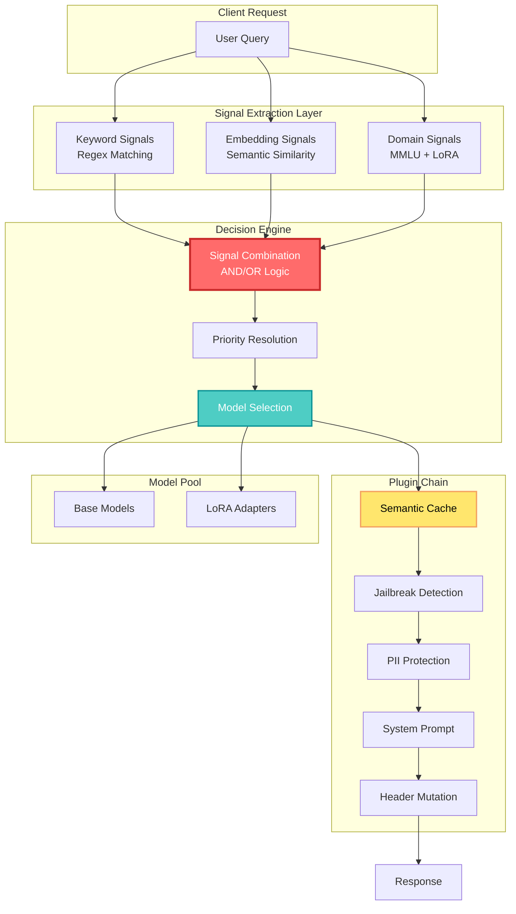

## 🤔 Curiosity: The Routing Problem

What if we could build an AI routing system that understands not just *what* domain a query belongs to, but also *how urgent* it is, *how sensitive* the data is, and *what kind* of reasoning it requires—all at once?

After 8 years building AI systems for games at NC SOFT and COM2US, I've seen firsthand how classification-based routing falls short in production. When a player reports "urgent security vulnerability in authentication code," a simple domain classifier routes it to "computer science" but misses critical signals: urgency, security sensitivity, code review intent, and compliance requirements.

**The question:** Can we move beyond single-dimensional classification to capture the rich, multi-dimensional signals embedded in natural language queries?

Today, vLLM introduces the **Signal-Decision Architecture**—a complete reimagining of semantic routing that scales from 14 fixed categories to unlimited intelligent routing decisions. This isn't just an incremental improvement; it's a fundamental shift in how we think about routing AI requests at scale.

---

## 📚 Retrieve: Understanding the Limitations

### The Problem: Why Classification-Based Routing Doesn't Scale

The previous vLLM Semantic Router architecture followed a simple pipeline:

```
User Prompt → MMLU Domain Classification → Model Selection
```

This approach has several fundamental limitations that prevent it from scaling to enterprise requirements.

#### Single-Dimensional Analysis

Classification-based routing only considers the **domain** or **subject matter** of the query. It cannot capture:

- **Urgency signals**: "urgent", "immediate", "critical"
- **Security sensitivity**: "vulnerability", "exploit", "breach"
- **Intent types**: code review, architecture design, troubleshooting
- **Complexity levels**: simple FAQ vs. complex reasoning tasks
- **Compliance requirements**: PII handling, regulatory constraints

> **Real Impact**: A medical query about "urgent patient data breach" gets routed to a medical model but lacks PII protection and security filtering—potentially violating HIPAA compliance.

#### Fixed Category Constraint

Limited to 14 predefined MMLU categories (math, physics, computer science, business, etc.), making it impossible to:

- Create custom categories for specific business domains
- Define fine-grained routing rules within a domain
- Scale beyond academic subject classification

> **Real Impact**: An enterprise with 50+ specialized use cases (legal contracts, financial compliance, medical diagnostics, code security audits) cannot express their routing requirements within 14 categories.

#### Inflexible Logic

Cannot combine multiple conditions or implement complex routing strategies:

- No support for AND/OR logic: "route to expert model only when query is both urgent AND security-related"
- No priority-based selection when multiple conditions match
- No conditional plugin application based on signal combinations

> **Real Impact**: Cannot implement layered routing strategies like "high-priority security issues get reasoning + jailbreak protection, while general questions get cached responses."

{: .light .shadow .rounded-10 w='1212' h='668' }

---

## 💡 Innovation: The Signal-Decision Architecture

The Signal-Decision Architecture fundamentally reimagines semantic routing by separating signal extraction from routing decisions and introducing a flexible decision engine with built-in plugin orchestration.

### Architecture Overview

The new architecture introduces three key innovations:

1. **Multi-Signal Extraction**: Captures multiple dimensions of user intent simultaneously
2. **Decision Engine**: Combines signals using flexible AND/OR logic with priority-based selection
3. **Plugin Chain**: Provides built-in intelligence for caching, security, and optimization

{: .light .shadow .rounded-10 w='1212' h='668' }

### Core Concepts

#### Signals: Multi-Dimensional Prompt Analysis

Instead of relying solely on domain classification, the Signal-Decision Architecture extracts three complementary types of signals from each user query. Each signal type leverages different AI/ML techniques and serves distinct purposes in the routing decision process.

{: .light .shadow .rounded-10 w='1029' h='1742' }

##### Keyword Signals: Interpretable Pattern Matching

Keyword signals use regex-based pattern matching to detect specific terms or phrases in user queries. This approach provides **human-interpretable routing logic**—you can easily understand why a query matched a particular rule by examining the keywords.

**Technical Approach:**
- Compiled regex patterns for efficient matching
- Support for AND/OR boolean operators
- Case-sensitive and case-insensitive modes
- No model inference required (zero ML overhead)

**Key Advantage - Interpretability**: Unlike black-box ML models, keyword signals provide complete transparency. When debugging routing decisions, you can trace exactly which keywords triggered which rules. This is critical for compliance auditing and troubleshooting production issues.

**Use Cases:**
- Detect urgency markers: "urgent", "immediate", "asap", "critical"
- Identify security keywords: "vulnerability", "exploit", "breach", "CVE"
- Flag compliance terms: "HIPAA", "GDPR", "PII", "confidential"
- Recognize intent patterns: "code review", "architecture design", "troubleshooting"

##### Embedding Signals: Scalable Semantic Understanding

Embedding signals use neural embedding models to compute semantic similarity between user queries and candidate phrases. This approach provides **scalable semantic matching** that understands intent beyond exact keyword matches.

**Technical Approach:**
- Pre-computed embeddings for candidate phrases (offline)
- Runtime query embedding using lightweight models (e.g., sentence-transformers)
- Cosine similarity computation with configurable thresholds
- Multiple aggregation strategies: max (any match), mean (average similarity), any (threshold-based)

**Key Advantage - Scalability**: Embedding-based matching scales to thousands of candidate phrases efficiently. Adding new routing patterns doesn't require retraining models—simply add new candidate phrases and compute their embeddings. This enables rapid iteration and customization for specific business domains.

**Use Cases:**
- Intent understanding: "I need help" → "technical support request"
- Paraphrase matching: "How do I fix this bug?" ≈ "debugging assistance"
- Cross-lingual routing: Semantic similarity works across languages with multilingual embeddings
- Fuzzy matching: Handles typos, abbreviations, and informal language

##### Domain Signals: Dataset-Driven Classification

Domain signals use MMLU-trained classification models to identify the academic or professional domain of user queries. This approach provides **dataset-driven domain expertise** with support for custom domain expansion.

**Technical Approach:**
- Fine-tuned classification models on MMLU dataset (14 base categories)
- Support for custom domain expansion via **LoRA adapters**
- Multi-label classification for queries spanning multiple domains
- Confidence scoring for domain predictions

**Key Advantage - Extensibility via LoRA**: While the base model covers 14 MMLU categories, enterprises can train lightweight LoRA adapters to add **private domain categories** without retraining the entire model. For example:

- Healthcare: Add "medical_imaging", "clinical_trials", "pharmaceutical_research"
- Finance: Add "risk_modeling", "algorithmic_trading", "regulatory_compliance"
- Legal: Add "contract_law", "intellectual_property", "litigation_support"

This enables organizations to extend domain classification to their specific verticals while maintaining the base model's general knowledge.

**Use Cases:**
- Route to domain-specific expert models (math queries → math-expert)
- Apply domain-appropriate policies (medical queries → PII protection)
- Select specialized knowledge bases (legal queries → legal document retrieval)
- Trigger domain-specific plugins (code queries → syntax validation)

{: .light .shadow .rounded-10 w='2944' h='3292' }

#### Signal Comparison

| Signal Type | Technique | Interpretability | Scalability | Extensibility |
|:------------|:----------|:-----------------|:------------|:--------------|
| **Keyword** | Regex matching | High (transparent rules) | Medium (manual patterns) | Manual addition |
| **Embedding** | Neural embeddings | Low (black-box similarity) | High (thousands of phrases) | Add phrases dynamically |
| **Domain** | MMLU + LoRA | Medium (domain labels) | Medium (14+ categories) | LoRA adapters for custom domains |

**Why Three Signal Types?**

The three signal types are **complementary**, not redundant:

- **Keyword signals** provide fast, interpretable matching for known patterns
- **Embedding signals** handle semantic variations and scale to large phrase sets
- **Domain signals** leverage academic datasets and enable domain-specific expertise

By combining all three, the Signal-Decision Architecture captures multiple dimensions of user intent simultaneously, enabling far more sophisticated routing logic than any single signal type could achieve.

#### Decisions: Flexible Routing Logic

Decisions are the core routing rules that combine multiple signals using AND/OR logic to determine model selection and plugin configuration.

**Decision Structure:**

Each decision consists of:

- **Signal Combination**: AND/OR logic combining multiple signal conditions
  - AND: All conditions must match (high precision)
  - OR: Any condition matches (high recall)
- **Priority**: Integer value for conflict resolution when multiple decisions match
  - Higher priority wins
  - Enables layered routing strategies
- **Model Reference**: Specifies which model (and optional LoRA adapter) to use
  - Supports base models with domain-specific LoRA adapters
  - Configures reasoning mode and effort level
- **Plugin Chain**: Ordered list of plugins to apply
  - Semantic caching for cost optimization
  - Jailbreak detection for security
  - PII protection for compliance
  - System prompt injection for behavior control
  - Header mutation for metadata propagation

{: .light .shadow .rounded-10 w='1215' h='1096' }

When multiple decisions match, the system selects the one with the highest priority. If no decisions match, the system falls back to the default model.

#### Plugins: Built-in Intelligence

The architecture includes five built-in plugins that can be configured per decision:

| Plugin | Purpose | Key Features |
|:-------|:--------|:-------------|
| **semantic-cache** | Cache similar queries | Configurable similarity threshold, cost optimization |
| **jailbreak** | Detect prompt injection attacks | Threshold-based detection, request blocking |
| **pii** | Protect sensitive information | Redact/hash/mask modes, GDPR/HIPAA compliance |
| **system_prompt** | Inject custom instructions | Replace or insert mode, role customization |
| **header_mutation** | Modify HTTP headers | Add/update/delete headers, metadata propagation |

Plugins execute in the configured order, with each plugin able to modify the request, block execution, or add metadata for downstream processing.

{: .light .shadow .rounded-10 w='1331' h='1970' }

### Scaling from 14 to Unlimited

The Signal-Decision Architecture removes the fundamental constraint of fixed categories. Here's how it scales:

**Traditional Approach (Limited):**
```
14 MMLU Categories → 14 Routing Rules → 14 Model Selections
```

**Constraints:**
- Cannot create custom categories
- Cannot combine multiple conditions
- Cannot apply different policies per rule
- Cannot scale beyond domain classification

**Signal-Decision Approach (Unlimited):**
```
3 Signal Types × N Conditions × AND/OR Logic → Unlimited Decisions
```

**Capabilities:**
- Create unlimited custom routing rules
- Combine multiple signals with flexible logic
- Apply unique plugin chains per decision
- Scale to enterprise complexity

**Scalability Example:**

Consider an enterprise IT support system:

**Traditional Routing**: Limited to 14 domain-based routes
- "computer_science" → code-model
- "engineering" → engineering-model
- (12 more fixed categories)

**Signal-Decision Routing**: Hundreds of specialized routes
- Urgent + Security + Computer Science → security-expert + reasoning + jailbreak
- Code Review + High Complexity → architecture-model + reasoning
- FAQ + General → cached-model + semantic-cache
- Medical + PII Detected → medical-expert + PII-protection + disclaimer
- Legal + Confidential → law-expert + PII-hash + audit-headers
- (Hundreds more custom combinations)

Each decision can have unique model selection, reasoning configuration, and plugin chains—enabling fine-grained control at scale.

{: .light .shadow .rounded-10 w='2466' h='2303' }

### Kubernetes-Native Design

The Signal-Decision Architecture is designed for cloud-native environments with two Custom Resource Definitions (CRDs):

#### Complete Example: Enterprise IT Support System

Let's walk through a complete example that demonstrates how IntelligentPool and IntelligentRoute work together to build an enterprise IT support routing system.

**IntelligentPool: Define Model Pool**

First, we define the available models and their LoRA adapters:

{: .light .shadow .rounded-10 w='2560' h='1364' }

This pool defines:
- A base model "qwen3" with 4 specialized LoRA adapters
- A fallback "qwen3" model for non-specialized queries
- Reasoning family configuration for each model

**IntelligentRoute: Define Routing Logic**

Next, we define the routing decisions with multi-signal extraction:

{: .light .shadow .rounded-10 w='2272' h='6500' }

This configuration demonstrates:

**Multi-Signal Extraction:**
- 3 keyword signals (urgency, security, code-review)
- 2 embedding signals (technical-support, architecture-design)
- 1 domain signal (computer-science)

**Layered Decision Logic:**
- Priority 100: Urgent + Security + CS → security-expert + high reasoning + jailbreak + PII protection
- Priority 80: Code Review + CS → code-reviewer + medium reasoning + cache + custom prompt
- Priority 60: Architecture Design + CS → architecture-expert + high reasoning + cache
- Priority 40: General Support → base model + aggressive cache

**Plugin Orchestration:**
- Security-critical queries get jailbreak detection and PII protection
- Code reviews get semantic caching and custom system prompts
- Architecture queries get longer cache TTL (2h vs 1h)
- General queries get aggressive caching (0.90 threshold, 4h TTL)

**Fallback Behavior:**
- If no decision matches, route to defaultModel ("general-assistant")
- If multiple decisions match, select highest priority

{: .light .shadow .rounded-10 w='962' h='2304' }

The Kubernetes-native design enables:
- Zero-downtime configuration updates
- GitOps workflows for change management
- Multi-cluster deployment strategies
- Namespace-based isolation and RBAC

### Real-World Applications

#### Enterprise IT Support

**Challenge**: Route support tickets based on urgency, technical domain, and security sensitivity.

**Solution**: Multi-layered decisions with priority-based selection
- Priority 100: Urgent + Security + CS → security-expert + reasoning + jailbreak
- Priority 80: Technical Support + Debugging → code-expert + semantic-cache
- Priority 60: General Questions → general-model + aggressive-cache

**Results**: Appropriate model selection, cost optimization through caching, security protection for sensitive issues.

#### Healthcare Platform

**Challenge**: HIPAA compliance requiring PII protection and medical disclaimers.

**Solution**: Domain-based routing with mandatory compliance plugins
- Health Domain → medical-expert + PII-redaction + disclaimer-prompt + audit-headers

**Results**: Automatic PII protection, consistent disclaimers, audit trail for compliance.

#### Financial Services

**Challenge**: Multi-layered security with PII protection, jailbreak detection, and cost optimization.

**Solution**: Comprehensive plugin chain for financial queries
- Economics Domain → finance-expert + jailbreak + PII-hash + disclaimer + cache + compliance-headers

**Results**: Enterprise-grade security, regulatory compliance, cost efficiency.

#### Educational Platform

**Challenge**: Personalized learning experiences based on subject and learning intent.

**Solution**: Intent-based routing with customized teaching styles
- Math + Learning Intent → math-expert + reasoning + patient-tutor-prompt + cache
- Science + Tutorial → science-expert + engaging-educator-prompt

**Results**: Personalized teaching approaches, appropriate reasoning for complex topics, cost optimization.

#### Code Assistant

**Challenge**: Different complexity levels require different model capabilities.

**Solution**: Complexity-aware routing with reasoning control
- Architecture Design → reasoning-model + high-effort + complexity-header
- Code Review → code-expert + medium-reasoning + cache
- Simple Questions → code-expert + cache-only

**Results**: Optimal model selection, cost-effective reasoning usage, fast responses for simple queries.

{: .light .shadow .rounded-10 w='2524' h='1552' }

### Production Architecture



### Key Takeaways

| Insight | Implication | Production Impact |
|:--------|:------------|:------------------|
| **Multi-dimensional signals** capture richer intent than single-domain classification | Enables sophisticated routing strategies | Better model selection, improved user experience |
| **AND/OR logic** with priority enables layered routing | Supports complex enterprise requirements | Handles edge cases, scales to 100+ routing rules |
| **Plugin orchestration** provides built-in intelligence | Reduces custom development | Faster time-to-market, consistent security/compliance |
| **LoRA adapters** extend domain classification | Custom domains without full retraining | Enterprise-specific routing, cost-effective customization |
| **Kubernetes-native** design enables cloud-scale deployment | GitOps, zero-downtime updates | Production-ready infrastructure, easy scaling |

### Future Roadmap

The Signal-Decision Architecture provides a foundation for future enhancements:

**Performance Optimization:**
- Radix Tree for keyword matching (10,000+ patterns)
- HNSW Index for embedding search (millions of phrases)
- Parallel LoRA for decode-only models (multi-tenant efficiency)

**Feature Enhancements:**
- Visual Configuration Console (web-based UI)
- Custom Plugin Framework (SDK + marketplace)
- Advanced Analytics (ML-driven recommendations)
- Model Evaluation via Multi-Turn Dialogue (LLM-as-a-Judge)
- Intent-Aware Internal/External Model Selection (privacy-aware routing)

{: .light .shadow .rounded-10 w='1678' h='2178' }

---

## 🤔 New Questions This Raises

1. **Can we fine-tune smaller models** on game-specific routing patterns to reduce latency and cost for real-time game AI systems?
2. **What about multi-agent coordination?** How can Signal-Decision Architecture route requests across multiple specialized agents in a game AI system?
3. **Player intent adaptation:** How can routing adapt to player behavior patterns over time, learning which models work best for different player types?
4. **Cost optimization for games:** How do we balance model selection (expensive reasoning models vs. fast cached responses) for different game scenarios (real-time combat vs. narrative exploration)?

**Next experiment:** Apply Signal-Decision Architecture to game AI routing—route player queries to specialized agents (combat AI, narrative AI, economy AI) based on multi-dimensional signals extracted from player actions and dialogue.

---

## References

**Research Papers:**
- [MMLU: Measuring Massive Multitask Language Understanding](https://arxiv.org/abs/2009.03300)
- [LoRA: Low-Rank Adaptation of Large Language Models](https://arxiv.org/abs/2106.09685)
- [Sentence-BERT: Sentence Embeddings using Siamese BERT-Networks](https://arxiv.org/abs/1908.10084)
- [HNSW: Efficient and robust approximate nearest neighbor search using Hierarchical Navigable Small World graphs](https://arxiv.org/abs/1603.09320)

**Code & Implementation:**
- [vLLM Semantic Router GitHub Repository](https://github.com/vllm-project/vllm)
- [vLLM Documentation](https://docs.vllm.ai/)
- [Sentence Transformers Library](https://github.com/UKPLab/sentence-transformers)
- [Hugging Face LoRA Adapters](https://huggingface.co/docs/peft/conceptual_guides/lora)

**Documentation & Tutorials:**
- [vLLM Semantic Router Blog Post](https://blog.vllm.ai/2025/11/19/signal-decision.html)
- [Kubernetes Custom Resource Definitions](https://kubernetes.io/docs/concepts/extend-kubernetes/api-extension/custom-resources/)
- [GitOps Workflows](https://www.gitops.tech/)

**Production Resources:**
- [vLLM Community](https://github.com/vllm-project/vllm/discussions)
- [Multi-Agent Systems in Production](https://github.com/langchain-ai/langchain)
- [Enterprise AI Gateway Patterns](https://www.anthropic.com/index/building-effective-agents)

**Related Projects:**
- [LangChain Routing](https://python.langchain.com/docs/use_cases/question_answering/)
- [CrewAI Multi-Agent Framework](https://github.com/joaomdmoura/crewAI)
- [AutoGen Multi-Agent Conversations](https://github.com/microsoft/autogen)
