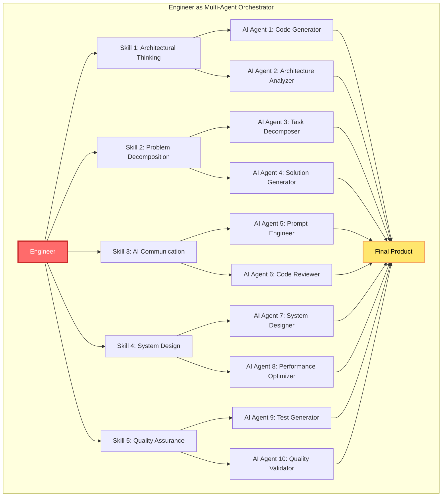
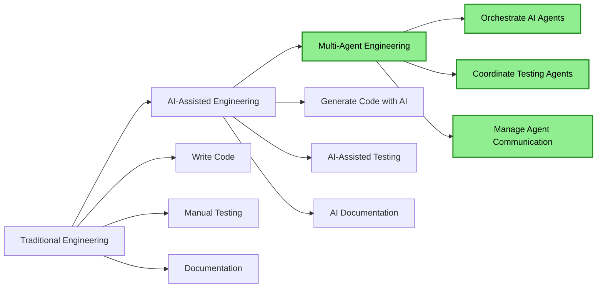
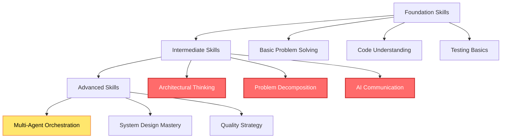

## 🤔 Curiosity: What Engineering Skills Matter Most in the AI-Driven Era?

After 8 years of building AI systems in game development, I've witnessed a fundamental shift in what it means to be an engineer. It's no longer about how many lines of code you can write—AI can do that. The question is: **What skills will make engineers indispensable in an AI-driven world?**

> **Curiosity:** In an era where AI can generate code, what engineering skills should we prioritize? How can a multi-agent perspective help us understand which capabilities will remain uniquely human and valuable?
> {: .prompt-tip}

The New Stack recently published an article highlighting 5 engineering skills to prioritize in the AI-driven era. From a multi-agent perspective, these skills represent the **orchestration and coordination capabilities** that separate human engineers from AI code generators.

**Core Question:** How do these 5 skills enable engineers to work effectively with AI agents, and what makes them essential in a multi-agent development environment?

---

## 📚 Retrieve: The 5 Essential Engineering Skills

{: .light .shadow .rounded-10 w='1212' h='668' }

### Skill Overview

The 5 engineering skills identified are:

1. **Architectural Thinking**
2. **Problem Decomposition**
3. **AI Communication**
4. **System Design**
5. **Quality Assurance & Testing**

### Multi-Agent Skill Framework



---

## 💡 Innovation: Deep Dive into Each Skill

### Skill 1: Architectural Thinking

**What It Means:**

Architectural thinking is the ability to design systems at a high level, considering:
- System boundaries and interfaces
- Scalability and performance
- Maintainability and extensibility
- Trade-offs and constraints

**Multi-Agent Application:**

```python
# Curiosity: How does architectural thinking apply to multi-agent systems?
# Retrieve: System design principles
# Innovation: Multi-agent architecture orchestrator

class ArchitecturalThinkingAgent:
    """
    Agent that applies architectural thinking to system design
    
    Coordinates with other agents to design robust architectures.
    """
    
    def __init__(self):
        self.design_principles = [
            "separation_of_concerns",
            "loose_coupling",
            "high_cohesion",
            "scalability",
            "maintainability"
        ]
    
    async def design_system_architecture(
        self,
        requirements: Dict[str, Any],
        constraints: Dict[str, Any]
    ) -> Dict[str, Any]:
        """
        Design system architecture considering multiple factors
        
        Args:
            requirements: System requirements
            constraints: Technical and business constraints
            
        Returns:
            System architecture design
        """
        # Coordinate with specialized agents
        agents = {
            'scalability_agent': ScalabilityAnalysisAgent(),
            'performance_agent': PerformanceAnalysisAgent(),
            'security_agent': SecurityAnalysisAgent(),
            'cost_agent': CostAnalysisAgent()
        }
        
        # Get analysis from each agent
        analyses = await asyncio.gather(*[
            agent.analyze(requirements, constraints)
            for agent in agents.values()
        ])
        
        # Synthesize architecture
        architecture = self._synthesize_architecture(
            requirements,
            constraints,
            dict(zip(agents.keys(), analyses))
        )
        
        return architecture
    
    def _synthesize_architecture(
        self,
        requirements: Dict,
        constraints: Dict,
        analyses: Dict
    ) -> Dict[str, Any]:
        """
        Synthesize architecture from multiple agent analyses
        
        This is where architectural thinking shines:
        - Balancing competing concerns
        - Making trade-off decisions
        - Creating coherent design
        """
        return {
            'components': self._design_components(requirements, analyses),
            'interfaces': self._design_interfaces(requirements, analyses),
            'data_flow': self._design_data_flow(requirements, analyses),
            'trade_offs': self._document_trade_offs(analyses),
            'rationale': self._explain_decisions(requirements, analyses)
        }
```

**Key Insight:** Architectural thinking enables engineers to orchestrate multiple AI agents, each specializing in different aspects (scalability, performance, security), and synthesize their outputs into a coherent system design.

### Skill 2: Problem Decomposition

**What It Means:**

Problem decomposition is breaking complex problems into smaller, manageable sub-problems that can be:
- Solved independently
- Tested in isolation
- Composed into a complete solution

**Multi-Agent Application:**

```python
class ProblemDecompositionAgent:
    """
    Agent that decomposes complex problems into sub-problems
    
    Coordinates with specialized agents to solve each sub-problem.
    """
    
    async def decompose_and_solve(
        self,
        problem: str,
        context: Dict[str, Any]
    ) -> Dict[str, Any]:
        """
        Decompose problem and coordinate solution
        
        Args:
            problem: Complex problem description
            context: Problem context
            
        Returns:
            Complete solution with sub-problem solutions
        """
        # Decompose problem
        sub_problems = await self._decompose_problem(problem, context)
        
        # Assign sub-problems to specialized agents
        agent_assignments = self._assign_to_agents(sub_problems)
        
        # Solve in parallel
        solutions = await asyncio.gather(*[
            agent.solve(sub_problem, context)
            for agent, sub_problem in agent_assignments
        ])
        
        # Compose solutions
        final_solution = self._compose_solutions(solutions, context)
        
        return {
            'sub_problems': sub_problems,
            'solutions': solutions,
            'final_solution': final_solution
        }
    
    async def _decompose_problem(
        self,
        problem: str,
        context: Dict[str, Any]
    ) -> List[Dict[str, Any]]:
        """
        Break down problem into manageable sub-problems
        
        This is the core skill: identifying boundaries,
        dependencies, and decomposition strategies.
        """
        # Use AI to help with decomposition
        decomposition_prompt = f"""
        Decompose the following problem into independent sub-problems:
        
        Problem: {problem}
        Context: {context}
        
        For each sub-problem, identify:
        1. Clear boundaries
        2. Dependencies on other sub-problems
        3. Solution approach
        4. Success criteria
        """
        
        # In practice, this would call an AI agent
        # For now, return structured decomposition
        return [
            {
                'id': 'sub_problem_1',
                'description': '...',
                'dependencies': [],
                'approach': '...',
                'criteria': '...'
            }
            # ... more sub-problems
        ]
```

**Key Insight:** Problem decomposition allows engineers to break complex tasks into pieces that can be solved by specialized AI agents in parallel, dramatically improving efficiency.

### Skill 3: AI Communication

**What It Means:**

AI communication is the ability to:
- Write effective prompts
- Understand AI capabilities and limitations
- Iterate on AI outputs
- Guide AI toward desired outcomes

**Multi-Agent Application:**

```python
class AICommunicationAgent:
    """
    Agent that specializes in communicating with AI systems
    
    Acts as a translator between human intent and AI capabilities.
    """
    
    def __init__(self):
        self.prompt_templates = {
            'code_generation': self._code_generation_template,
            'problem_solving': self._problem_solving_template,
            'code_review': self._code_review_template,
            'architecture_design': self._architecture_template
        }
    
    async def communicate_with_ai(
        self,
        intent: str,
        task_type: str,
        context: Dict[str, Any]
    ) -> Dict[str, Any]:
        """
        Communicate task to AI agent effectively
        
        Args:
            intent: What we want to achieve
            task_type: Type of task (code_generation, etc.)
            context: Relevant context
            
        Returns:
            AI response and refined output
        """
        # Craft effective prompt
        prompt = self._craft_prompt(intent, task_type, context)
        
        # Query AI agent
        initial_response = await self._query_ai_agent(prompt)
        
        # Refine based on response
        refined_response = await self._refine_response(
            initial_response,
            intent,
            context
        )
        
        return {
            'prompt': prompt,
            'initial_response': initial_response,
            'refined_response': refined_response,
            'iterations': self._count_iterations()
        }
    
    def _craft_prompt(
        self,
        intent: str,
        task_type: str,
        context: Dict[str, Any]
    ) -> str:
        """
        Craft effective prompt using templates and best practices
        
        Key principles:
        - Clear instructions
        - Sufficient context
        - Expected output format
        - Examples when helpful
        """
        template = self.prompt_templates.get(task_type)
        
        return template.format(
            intent=intent,
            context=context,
            examples=self._get_examples(task_type)
        )
    
    def _code_generation_template(self, intent, context, examples):
        return f"""
        You are an expert software engineer. Generate code for the following task.
        
        Task: {intent}
        
        Context:
        {self._format_context(context)}
        
        Requirements:
        1. Follow best practices
        2. Include error handling
        3. Add comments for complex logic
        4. Ensure type safety
        
        Examples:
        {examples}
        
        Generate the code:
        """
```

**Key Insight:** AI communication is the bridge between human intent and AI capabilities. Engineers who master this can effectively orchestrate multiple AI agents to achieve complex goals.

### Skill 4: System Design

**What It Means:**

System design involves:
- Designing scalable, reliable systems
- Considering performance and resource constraints
- Planning for failure and recovery
- Ensuring maintainability

**Multi-Agent Application:**

```python
class SystemDesignAgent:
    """
    Agent that designs production-ready systems
    
    Coordinates with multiple agents to design robust systems.
    """
    
    async def design_system(
        self,
        requirements: Dict[str, Any],
        scale: str = "medium"
    ) -> Dict[str, Any]:
        """
        Design a complete system
        
        Args:
            requirements: System requirements
            scale: Expected scale (small, medium, large)
            
        Returns:
            Complete system design
        """
        # Coordinate with specialized design agents
        design_agents = {
            'database': DatabaseDesignAgent(),
            'api': APIDesignAgent(),
            'caching': CachingDesignAgent(),
            'monitoring': MonitoringDesignAgent(),
            'security': SecurityDesignAgent()
        }
        
        # Get designs from each agent
        designs = await asyncio.gather(*[
            agent.design(requirements, scale)
            for agent in design_agents.values()
        ])
        
        # Integrate designs
        system_design = self._integrate_designs(
            requirements,
            dict(zip(design_agents.keys(), designs))
        )
        
        return system_design
    
    def _integrate_designs(
        self,
        requirements: Dict,
        designs: Dict[str, Any]
    ) -> Dict[str, Any]:
        """
        Integrate multiple design components into coherent system
        
        This requires:
        - Understanding component interactions
        - Resolving conflicts
        - Ensuring consistency
        - Optimizing overall system
        """
        return {
            'architecture': self._create_architecture(designs),
            'components': designs,
            'interactions': self._design_interactions(designs),
            'failure_modes': self._analyze_failure_modes(designs),
            'scalability_plan': self._create_scalability_plan(designs),
            'monitoring_strategy': self._create_monitoring_strategy(designs)
        }
```

**Key Insight:** System design requires coordinating multiple specialized agents (database, API, caching, etc.) and integrating their outputs into a coherent, production-ready system.

### Skill 5: Quality Assurance & Testing

**What It Means:**

Quality assurance involves:
- Designing comprehensive test strategies
- Automating testing where possible
- Ensuring code quality and reliability
- Validating system behavior

**Multi-Agent Application:**

```python
class QualityAssuranceAgent:
    """
    Agent that ensures quality through multi-agent testing
    
    Coordinates multiple testing agents for comprehensive coverage.
    """
    
    def __init__(self):
        self.test_agents = {
            'unit_tester': UnitTestingAgent(),
            'integration_tester': IntegrationTestingAgent(),
            'performance_tester': PerformanceTestingAgent(),
            'security_tester': SecurityTestingAgent(),
            'accessibility_tester': AccessibilityTestingAgent()
        }
    
    async def ensure_quality(
        self,
        codebase: Dict[str, Any],
        requirements: Dict[str, Any]
    ) -> Dict[str, Any]:
        """
        Comprehensive quality assurance
        
        Args:
            codebase: Code to test
            requirements: Quality requirements
            
        Returns:
            Quality assessment and test results
        """
        # Run all test agents in parallel
        test_results = await asyncio.gather(*[
            agent.test(codebase, requirements)
            for agent in self.test_agents.values()
        ])
        
        # Aggregate results
        quality_report = self._aggregate_results(
            dict(zip(self.test_agents.keys(), test_results))
        )
        
        # Generate recommendations
        recommendations = self._generate_recommendations(quality_report)
        
        return {
            'quality_score': quality_report['overall_score'],
            'test_results': test_results,
            'issues': quality_report['issues'],
            'recommendations': recommendations,
            'coverage': quality_report['coverage']
        }
    
    def _aggregate_results(
        self,
        results: Dict[str, Any]
    ) -> Dict[str, Any]:
        """
        Aggregate test results from multiple agents
        
        Requires:
        - Understanding test coverage
        - Prioritizing issues
        - Identifying patterns
        - Calculating overall quality
        """
        return {
            'overall_score': self._calculate_score(results),
            'issues': self._collect_issues(results),
            'coverage': self._calculate_coverage(results),
            'risk_assessment': self._assess_risks(results)
        }
```

**Key Insight:** Quality assurance in the AI era means orchestrating multiple specialized testing agents (unit, integration, performance, security) to ensure comprehensive coverage.

---

## 🎯 Skill Comparison: Traditional vs. AI-Driven Era

| Skill | Traditional Era | AI-Driven Era | Multi-Agent Application |
|:------|:---------------|:--------------|:------------------------|
| **Architectural Thinking** | Design systems | Orchestrate AI agents | Coordinate specialized agents |
| **Problem Decomposition** | Break into tasks | Decompose for AI agents | Assign to specialized agents |
| **AI Communication** | Write documentation | Craft effective prompts | Bridge human-AI communication |
| **System Design** | Design components | Integrate AI components | Coordinate design agents |
| **Quality Assurance** | Write tests | Validate AI outputs | Orchestrate testing agents |

### Skill Evolution



---

## 🛠️ Practical Implementation: Multi-Agent Engineering Workflow

### Complete Workflow Example

```python
class MultiAgentEngineeringWorkflow:
    """
    Complete engineering workflow using multi-agent approach
    
    Demonstrates how all 5 skills work together.
    """
    
    def __init__(self):
        # Initialize specialized agents
        self.architect = ArchitecturalThinkingAgent()
        self.decomposer = ProblemDecompositionAgent()
        self.communicator = AICommunicationAgent()
        self.designer = SystemDesignAgent()
        self.qa = QualityAssuranceAgent()
    
    async def build_feature(
        self,
        feature_request: str,
        requirements: Dict[str, Any]
    ) -> Dict[str, Any]:
        """
        Build a feature using multi-agent engineering workflow
        
        This demonstrates all 5 skills working together:
        1. Architectural thinking: Design overall architecture
        2. Problem decomposition: Break into sub-problems
        3. AI communication: Guide AI agents
        4. System design: Design components
        5. Quality assurance: Ensure quality
        """
        # Step 1: Architectural Thinking
        architecture = await self.architect.design_system_architecture(
            requirements=requirements,
            constraints={'budget': 'limited', 'time': 'aggressive'}
        )
        
        # Step 2: Problem Decomposition
        sub_problems = await self.decomposer.decompose_and_solve(
            problem=feature_request,
            context={'architecture': architecture}
        )
        
        # Step 3: AI Communication - Guide code generation
        code_components = []
        for sub_problem in sub_problems['sub_problems']:
            code = await self.communicator.communicate_with_ai(
                intent=sub_problem['description'],
                task_type='code_generation',
                context={'architecture': architecture}
            )
            code_components.append(code)
        
        # Step 4: System Design - Integrate components
        system = await self.designer.design_system(
            requirements=requirements,
            scale='medium'
        )
        
        # Step 5: Quality Assurance
        quality_report = await self.qa.ensure_quality(
            codebase={'components': code_components},
            requirements=requirements
        )
        
        return {
            'architecture': architecture,
            'sub_problems': sub_problems,
            'code_components': code_components,
            'system_design': system,
            'quality_report': quality_report,
            'ready_for_production': quality_report['quality_score'] >= 0.9
        }
```

---

## 📊 Skill Priority Matrix

### Importance vs. AI Automation Risk

| Skill | Importance | AI Automation Risk | Priority |
|:------|:----------|:-------------------|:---------|
| **Architectural Thinking** | ⭐⭐⭐⭐⭐ | Low | **Highest** |
| **Problem Decomposition** | ⭐⭐⭐⭐⭐ | Low | **Highest** |
| **AI Communication** | ⭐⭐⭐⭐⭐ | Medium | **High** |
| **System Design** | ⭐⭐⭐⭐ | Medium | **High** |
| **Quality Assurance** | ⭐⭐⭐⭐ | High | **Medium** |

**Key Insight:** Skills with low AI automation risk (architectural thinking, problem decomposition) are the highest priority because they represent uniquely human capabilities.

### Skill Development Roadmap



---

## 🤔 New Questions: Future of Engineering

1. **Skill Evolution**: How will these skills evolve as AI agents become more capable?
2. **New Skills**: What new skills will emerge as multi-agent systems become standard?
3. **Education**: How should engineering education adapt to prioritize these skills?
4. **Team Structure**: How will engineering teams be structured in a multi-agent world?

**Next Experiment**: Building a complete multi-agent engineering system that demonstrates all 5 skills working together.

---

## References

**Engineering Skills:**

- [Software Architecture Patterns](https://www.oreilly.com/library/view/software-architecture-patterns/9781491971437/)
- [Problem Decomposition Techniques](https://www.coursera.org/learn/problem-solving)
- [Effective AI Communication](https://www.promptingguide.ai/)

**Multi-Agent Systems:**

- [LangGraph - Multi-Agent Workflows](https://langchain-ai.github.io/langgraph/)
- [AutoGen - Multi-Agent Framework](https://github.com/microsoft/autogen)
- [CrewAI - Multi-Agent Framework](https://github.com/joaomdmoura/crewAI)

**Career Development:**

- [Engineering Career Paths](https://www.levels.fyi/)
- [System Design Interview](https://www.educative.io/courses/grokking-the-system-design-interview)

**Game Development:**

- [Game Engineering Best Practices](https://www.gameaipro.com/)
- [Unity Architecture Patterns](https://unity.com/learn)
- [Game System Design](https://www.gdcvault.com/)

**Production Best Practices:**

- [Software Quality Assurance](https://www.istqb.org/)

**Tools and Frameworks:**

- [LangChain Documentation](https://python.langchain.com/docs/introduction/)
- [AutoGen](https://github.com/microsoft/autogen)
- [CrewAI](https://github.com/joaomdmoura/crewAI)

**Community and Learning:**

- [Engineering Skills Development](https://www.pluralsight.com/)
