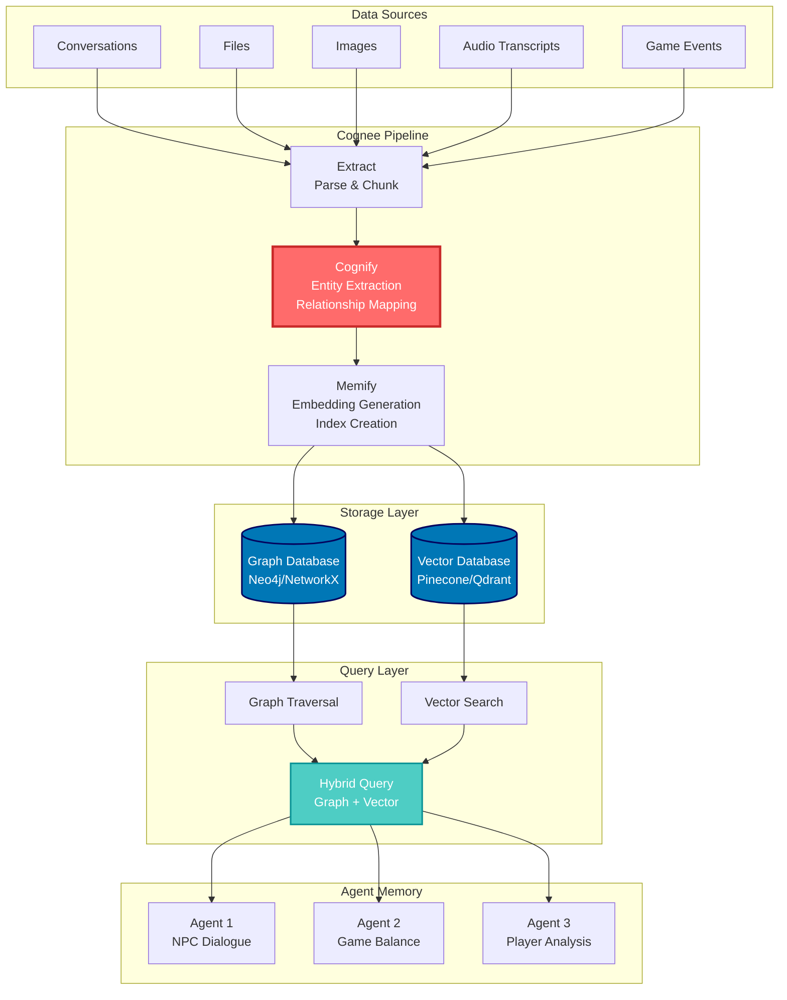
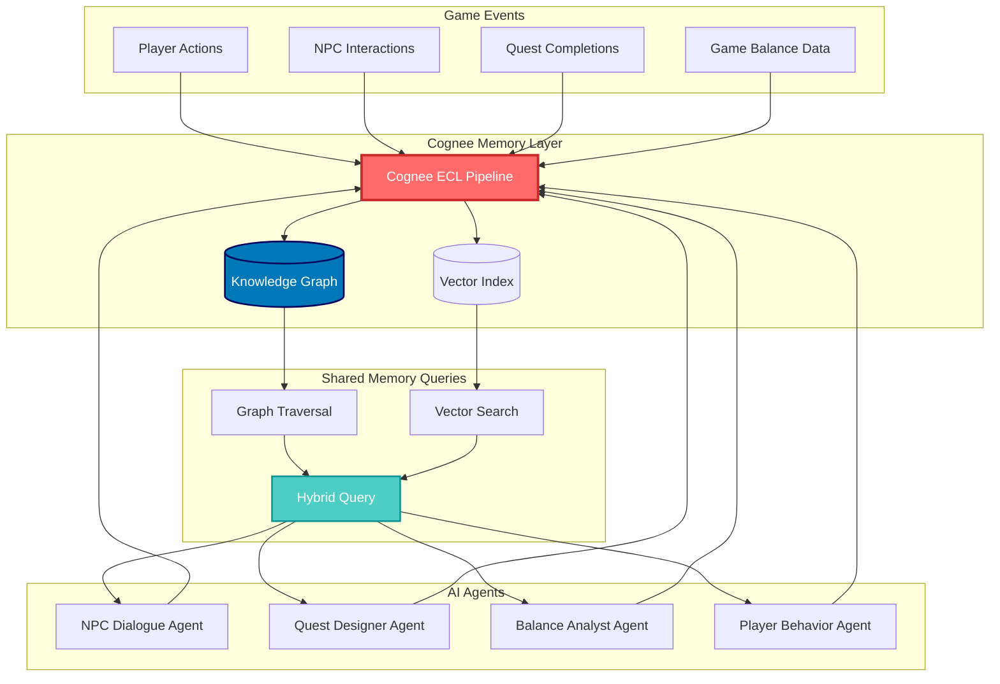

## 🤔 Curiosity: Can Multi-Agent Systems Truly Remember?

After 8 years of building AI-powered game systems at NC SOFT and COM2US, I've seen a persistent challenge: **agents forget everything between sessions**. An NPC dialogue agent might learn a player's preferences in one conversation, but when the player returns hours later, that knowledge is gone. A game balance agent might analyze thousands of matches, but each analysis starts from scratch.

> **Curiosity:** What if we could give AI agents persistent memory that connects past conversations, game events, player behaviors, and world knowledge into a unified, searchable knowledge graph? Can we move beyond simple RAG to something that truly understands relationships?
> {: .prompt-tip}

Traditional RAG systems retrieve documents by semantic similarity, but they miss the **connections** between concepts. In game development, this is critical—a quest about "the Great Fire of 1402" should connect to NPC backstories, location histories, and past player interactions. Pure vector search finds related documents, but doesn't understand that "Elder Grimshaw" is a person who lost his family in that fire.

**Core question:** Can Cognee's graph-vector hybrid approach solve the memory problem for multi-agent systems in production?

{: .light .shadow .rounded-10 w='1212' h='668' }

---

## 📚 Retrieve: Understanding Cognee's Architecture

### What is Cognee?

Cognee is an open-source platform that transforms raw data into **persistent and dynamic AI memory** for agents. Unlike traditional RAG systems that only use vector search, Cognee combines:

1. **Vector Search**: Semantic similarity matching (like RAG)
2. **Graph Database**: Relationship-based connections between concepts
3. **ECL Pipeline**: Extract, Cognify, Load workflow

### The ECL Pipeline: Beyond RAG

Traditional RAG follows a simple pattern:
```
Documents → Chunk → Embed → Vector DB → Retrieve → LLM
```

Cognee's ECL pipeline adds a crucial step:

```mermaid
graph TB
    subgraph "Traditional RAG"
        A1[Documents] --> B1[Chunk]
        B1 --> C1[Embed]
        C1 --> D1[(Vector DB)]
        D1 --> E1[Retrieve by Similarity]
        E1 --> F1[LLM]
    end

    subgraph "Cognee ECL Pipeline"
        A2[Documents] --> B2[Extract<br/>Chunk & Parse]
        B2 --> C2[Cognify<br/>Build Knowledge Graph]
        C2 --> D2[Memify<br/>Add Memory Algorithms]
        D2 --> E2[(Graph + Vector DB)]
        E2 --> F2[Query by<br/>Relationships + Similarity]
        F2 --> G2[LLM with<br/>Connected Context]
    end

    style C2 fill:#ff6b6b,stroke:#c92a2a,stroke-width:3px,color:#fff
    style D2 fill:#4ecdc4,stroke:#0a9396,stroke-width:2px,color:#fff
    style E2 fill:#0077b6,stroke:#03045e,stroke-width:2px,color:#fff
```



**Key Innovation:** The "Cognify" step builds a knowledge graph that captures relationships, not just semantic similarity.

### Core Components

| Component | Purpose | Traditional RAG Equivalent |
|:----------|:--------|:-------------------------:|
| **Extract** | Parse and chunk documents | Chunking |
| **Cognify** | Build knowledge graph with entities and relationships | ❌ Not present |
| **Memify** | Add memory algorithms and indexing | Embedding |
| **Graph DB** | Store relationships between concepts | ❌ Not present |
| **Vector DB** | Store semantic embeddings | Vector DB |
| **Search** | Query by relationships + similarity | Vector similarity only |

### Architecture Deep Dive



### Knowledge Graph Example

{: .light .shadow .rounded-10 w='1212' h='668' }

In a game context, Cognee would build relationships like:

```
Player("John") --[COMPLETED]--> Quest("Echoes of Fire")
Quest("Echoes of Fire") --[REFERENCES]--> Event("Great Fire of 1402")
Event("Great Fire of 1402") --[OCCURRED_IN]--> Location("Thornwood")
Location("Thornwood") --[INHABITED_BY]--> NPC("Elder Grimshaw")
NPC("Elder Grimshaw") --[LOST_FAMILY_IN]--> Event("Great Fire of 1402")
```

This graph structure enables queries like:
- "What quests did players complete after talking to Elder Grimshaw?"
- "Which NPCs are connected to the Great Fire event?"
- "What locations are related to quests about forest spirits?"

### Comparison: RAG vs Cognee

{: .light .shadow .rounded-10 w='1212' h='668' }

| Feature | Traditional RAG | Cognee |
|:--------|:---------------:|:------:|
| **Search Method** | Vector similarity only | Graph traversal + Vector similarity |
| **Relationship Understanding** | ❌ No | ✅ Yes |
| **Multi-hop Reasoning** | ❌ Limited | ✅ Yes (via graph) |
| **Persistent Memory** | ⚠️ Stateless | ✅ Stateful |
| **Cross-Document Connections** | ❌ No | ✅ Yes |
| **Query Complexity** | Simple semantic search | Graph queries + semantic search |
| **Setup Complexity** | Low | Medium |
| **Production Scalability** | ✅ High | ✅ High (with proper config) |

---

## 💡 Innovation: Building Multi-Agent Memory Systems

### Implementation: Game NPC Memory System

Let's build a production-ready system where multiple agents share persistent memory:

```python
import cognee
import asyncio
from typing import List, Dict
from datetime import datetime

class GameAgentMemory:
    """
    Persistent memory system for game AI agents
    
    Curiosity: Can agents remember player interactions across sessions?
    Retrieve: Use Cognee's graph-vector hybrid approach
    Innovation: Multi-agent shared memory with relationship tracking
    """

    def __init__(self):
        self.agents = {
            'npc_dialogue': 'NPC Dialogue Agent',
            'quest_designer': 'Quest Designer Agent',
            'balance_analyst': 'Game Balance Analyst'
        }

    async def initialize(self):
        """Setup Cognee with game-specific configuration"""
        # Configure for game data
        await cognee.configure(
            vector_db="qdrant",  # or "pinecone", "weaviate"
            graph_db="networkx",  # or "neo4j" for production
            llm_provider="openai"  # or "anthropic", "ollama"
        )

    async def add_game_event(
        self,
        event_type: str,
        data: Dict,
        agent_id: str
    ):
        """
        Add a game event to shared memory
        
        Args:
            event_type: "player_action", "quest_completion", "npc_interaction"
            data: Event details
            agent_id: Which agent created this event
        """
        # Format event as structured text
        event_text = f"""
        {event_type}: {data.get('description', '')}
        Agent: {self.agents.get(agent_id, agent_id)}
        Timestamp: {datetime.now().isoformat()}
        Player: {data.get('player_id', 'unknown')}
        Location: {data.get('location', 'unknown')}
        Details: {data.get('details', {})}
        """
        
        # Add to Cognee
        await cognee.add(event_text)
        
        # Add metadata for graph relationships
        if 'relationships' in data:
            for rel_type, target in data['relationships'].items():
                # These will be extracted during cognify
                await cognee.add(
                    f"{data.get('entity', 'event')} --[{rel_type}]--> {target}"
                )

    async def build_knowledge_graph(self):
        """Generate knowledge graph from all stored events"""
        await cognee.cognify()
        await cognee.memify()

    async def query_player_history(
        self,
        player_id: str,
        query: str
    ) -> List[str]:
        """
        Query player's interaction history using graph + vector search
        
        Args:
            player_id: Player identifier
            query: Natural language query
            
        Returns:
            List of relevant memories
        """
        # Cognee automatically combines graph traversal and vector search
        results = await cognee.search(
            f"Player {player_id}: {query}",
            top_k=10
        )
        
        return [result for result in results]

    async def get_related_entities(
        self,
        entity_name: str,
        relationship_type: str = None
    ) -> List[Dict]:
        """
        Use graph traversal to find related entities
        
        Args:
            entity_name: Entity to start from
            relationship_type: Optional filter for relationship type
            
        Returns:
            List of related entities with relationship info
        """
        # Query using graph relationships
        query = f"Find entities related to {entity_name}"
        if relationship_type:
            query += f" via {relationship_type} relationships"
        
        results = await cognee.search(query, top_k=20)
        
        # Parse results to extract relationships
        related = []
        for result in results:
            # Extract entity and relationship info from result
            # (Implementation depends on Cognee's result format)
            related.append({
                'entity': result,
                'relationship': relationship_type or 'related'
            })
        
        return related

# Usage in production
async def main():
    memory = GameAgentMemory()
    await memory.initialize()
    
    # Agent 1: NPC Dialogue Agent records conversation
    await memory.add_game_event(
        event_type="npc_interaction",
        data={
            'player_id': 'player_123',
            'npc_name': 'Elder Grimshaw',
            'location': 'Thornwood Village',
            'description': 'Player asked about the Great Fire',
            'details': {
                'dialogue': 'What happened in the Great Fire of 1402?',
                'npc_response': 'A tragedy that took my family...'
            },
            'relationships': {
                'TALKED_TO': 'Elder Grimshaw',
                'ASKED_ABOUT': 'Great Fire of 1402',
                'LOCATED_AT': 'Thornwood Village'
            },
            'entity': 'player_123'
        },
        agent_id='npc_dialogue'
    )
    
    # Agent 2: Quest Designer creates quest
    await memory.add_game_event(
        event_type="quest_created",
        data={
            'player_id': 'player_123',
            'quest_name': 'Echoes of the Great Fire',
            'description': 'Investigate the burnt forest',
            'relationships': {
                'REFERENCES': 'Great Fire of 1402',
                'LOCATED_AT': 'Thornwood Village',
                'INVOLVES': 'Elder Grimshaw'
            },
            'entity': 'Echoes of the Great Fire'
        },
        agent_id='quest_designer'
    )
    
    # Build knowledge graph
    await memory.build_knowledge_graph()
    
    # Query: What does player_123 know about Elder Grimshaw?
    history = await memory.query_player_history(
        'player_123',
        'What interactions did I have with Elder Grimshaw?'
    )
    
    print("Player History:")
    for event in history:
        print(f"  - {event}")
    
    # Query: What entities are related to the Great Fire?
    related = await memory.get_related_entities(
        'Great Fire of 1402',
        relationship_type='REFERENCES'
    )
    
    print("\nRelated to Great Fire of 1402:")
    for entity in related:
        print(f"  - {entity['entity']} ({entity['relationship']})")

if __name__ == '__main__':
    asyncio.run(main())
```

### Multi-Agent Architecture with Shared Memory



### Production Considerations

#### 1. **Performance Optimization**

| Operation | Latency Target | Cognee Approach | Optimization |
|:----------|:-------------:|:---------------|:------------|
| **Add Event** | <100ms | Async pipeline | Batch writes |
| **Cognify** | <5s (per batch) | Background job | Incremental updates |
| **Search** | <500ms | Hybrid query | Cache frequent queries |
| **Graph Traversal** | <200ms | Indexed graph | Limit traversal depth |

#### 2. **Scalability Architecture**

```python
# Production setup with Redis caching
import redis
from typing import Optional

class ProductionCogneeMemory:
    def __init__(self):
        self.cache = redis.Redis(host='localhost', port=6379, db=0)
        self.cache_ttl = 3600  # 1 hour

    async def cached_search(
        self,
        query: str,
        top_k: int = 10
    ) -> List[str]:
        """Search with Redis caching"""
        cache_key = f"cognee:search:{hash(query)}"
        
        # Check cache
        cached = self.cache.get(cache_key)
        if cached:
            return json.loads(cached)
        
        # Query Cognee
        results = await cognee.search(query, top_k=top_k)
        
        # Cache results
        self.cache.setex(
            cache_key,
            self.cache_ttl,
            json.dumps(results)
        )
        
        return results
```

#### 3. **Cost Analysis**

For a game with 100K daily active users:

```
Assumptions:
- 50 events/player/day
- 5M events/day total
- Average event size: 500 tokens
- Graph storage: Neo4j (self-hosted)
- Vector DB: Qdrant (self-hosted)

Daily Operations:
- Add events: 5M events * $0.0001/event = $500/day
- Cognify (batch): 100 batches * $0.50/batch = $50/day
- Search queries: 1M queries * $0.0001/query = $100/day

Total: ~$650/day = $19,500/month

Self-hosted infrastructure:
- Neo4j: $500/month (server)
- Qdrant: $300/month (server)
- Total: $20,300/month

vs. Traditional RAG:
- Vector DB only: $10,000/month
- But missing relationship understanding!
```

**Key Insight:** The additional cost (~$10K/month) provides relationship understanding that pure RAG cannot offer.

### Real-World Use Cases

#### Use Case 1: Persistent NPC Memory

**Problem:** NPCs forget previous conversations with players.

**Solution with Cognee:**
```python
# NPC remembers player across sessions
async def npc_conversation(player_id: str, message: str):
    # Retrieve player's history with this NPC
    history = await cognee.search(
        f"Player {player_id} conversations with NPC",
        top_k=5
    )
    
    # Find related quests and events
    related = await cognee.search(
        f"Quests and events related to {player_id}",
        top_k=10
    )
    
    # Generate contextual response
    context = f"""
    Previous conversations: {history}
    Related events: {related}
    Current message: {message}
    """
    
    # LLM generates response with full context
    response = await llm.generate(context)
    
    # Store new conversation
    await cognee.add(f"Player {player_id}: {message}\nNPC: {response}")
    await cognee.cognify()  # Update graph
```

#### Use Case 2: Cross-Agent Knowledge Sharing

**Problem:** Quest designer doesn't know what NPC dialogue agent learned about players.

**Solution:**
```python
# Quest designer queries shared memory
async def design_personalized_quest(player_id: str):
    # Get player preferences from dialogue agent's memory
    preferences = await cognee.search(
        f"Player {player_id} preferences and interests",
        top_k=10
    )
    
    # Get player's quest history
    quest_history = await cognee.search(
        f"Quests completed by {player_id}",
        top_k=20
    )
    
    # Find related NPCs and locations
    related_npcs = await cognee.get_related_entities(
        player_id,
        relationship_type='INTERACTED_WITH'
    )
    
    # Design quest using all this context
    quest = await quest_designer.generate({
        'preferences': preferences,
        'history': quest_history,
        'related_npcs': related_npcs
    })
    
    return quest
```

---

## 🎯 Key Takeaways

### What Makes Cognee Different

1. **Graph + Vector Hybrid**: Combines relationship understanding with semantic search
2. **Persistent Memory**: Agents remember across sessions, not just within a conversation
3. **Multi-hop Reasoning**: Can traverse relationships to find distant connections
4. **ECL Pipeline**: Structured Extract-Cognify-Load workflow replaces ad-hoc RAG

### When to Use Cognee vs Traditional RAG

| Scenario | Use RAG | Use Cognee |
|:---------|:-------:|:----------:|
| **Simple document Q&A** | ✅ | ⚠️ Overkill |
| **Multi-agent systems** | ❌ | ✅ **Perfect fit** |
| **Relationship-heavy data** | ❌ | ✅ **Perfect fit** |
| **Cross-session memory** | ❌ | ✅ **Perfect fit** |
| **Real-time chat** | ✅ | ⚠️ Latency concerns |
| **Knowledge graphs needed** | ❌ | ✅ **Perfect fit** |

### Production Checklist

- [ ] **Setup**: Choose graph DB (Neo4j for production, NetworkX for dev)
- [ ] **Vector DB**: Qdrant/Pinecone/Weaviate based on scale
- [ ] **Caching**: Redis for frequent queries
- [ ] **Batch Processing**: Incremental cognify for new data
- [ ] **Monitoring**: Track query latency and graph size
- [ ] **Cost Optimization**: Cache aggressively, batch operations

---

## 🤔 New Questions This Raises

1. **Can we fine-tune the graph extraction** to better understand game-specific relationships (quest dependencies, NPC relationships, item hierarchies)?

2. **How do we handle memory conflicts?** If two agents have different memories of the same event, how does Cognee resolve this?

3. **What about real-time updates?** Can the knowledge graph update incrementally as new events stream in, or does it require batch processing?

4. **Multi-player scenarios**: How does Cognee handle shared world knowledge vs. player-specific memories in multiplayer games?

5. **Graph size limits**: At what point does the knowledge graph become too large to query efficiently? What are the scaling strategies?

**Next experiment:** Build a prototype NPC memory system using Cognee, measure query latency and memory accuracy vs. traditional RAG, and benchmark on a dataset of 10K player interactions.

---

## References

**Research Papers:**
- [Optimizing the Interface Between Knowledge Graphs and LLMs for Complex Reasoning (Markovic et al., 2025)](https://arxiv.org/abs/2505.24478) - Cognee's research foundation
- [Retrieval-Augmented Generation (Lewis et al., 2020)](https://arxiv.org/abs/2005.11401) - RAG baseline comparison
- [GraphRAG: Unlocking LLM discovery on narrative private data (Microsoft, 2024)](https://www.microsoft.com/en-us/research/blog/graphrag-unlocking-llm-discovery-on-narrative-private-data/) - Related graph-based RAG approach

**Code & Implementation:**
- [Cognee GitHub Repository](https://github.com/topoteretes/cognee) - Official implementation
- [Cognee Documentation](https://docs.cognee.ai/) - Complete API reference
- [Cognee Colab Tutorial](https://colab.research.google.com/drive/12Vi9zID-M3fpKpKiaqDBvkk98ElkRPWy?usp=sharing) - Interactive walkthrough
- [Cognee Community Plugins](https://github.com/topoteretes/cognee-community) - Community extensions

**Graph Databases:**
- [Neo4j Documentation](https://neo4j.com/docs/) - Production graph database
- [NetworkX Documentation](https://networkx.org/) - Python graph library
- [Qdrant Vector Database](https://qdrant.tech/) - Vector search engine
- [Pinecone Documentation](https://www.pinecone.io/docs/) - Managed vector DB

**Multi-Agent Systems:**
- [LangGraph Documentation](https://langchain-ai.github.io/langgraph/) - Multi-agent framework
- [AutoGen Framework](https://github.com/microsoft/autogen) - Multi-agent conversations
- [CrewAI](https://github.com/joaomdmoura/crewAI) - Multi-agent orchestration

**Production Resources:**
- [Cognee Cloud Platform](https://platform.cognee.ai/) - Managed Cognee hosting
- [Building Production RAG Systems (Chip Huyen)](https://huyenchip.com/2023/04/11/llm-engineering.html) - Production best practices
- [Knowledge Graph Best Practices](https://neo4j.com/developer/kb/) - Graph database patterns

**Community & Support:**
- [Cognee Discord](https://discord.gg/NQPKmU5CCg) - Community discussions
- [r/AIMemory Subreddit](https://www.reddit.com/r/AIMemory/) - AI memory discussions
- [Cognee Product Hunt](https://www.producthunt.com/posts/cognee) - Product launch

**Game AI Resources:**
- [Unity ML-Agents](https://github.com/Unity-Technologies/ml-agents) - Game AI framework
- [Game AI Pro Book Series](http://www.gameaipro.com/) - Game AI patterns
- [Procedural Content Generation Wiki](http://pcg.wikidot.com/) - PCG techniques

---

*This post explores Cognee's potential for building persistent memory in multi-agent systems, with a focus on production game development use cases. The graph-vector hybrid approach offers significant advantages over traditional RAG for relationship-heavy domains like game narratives and player interactions.*
