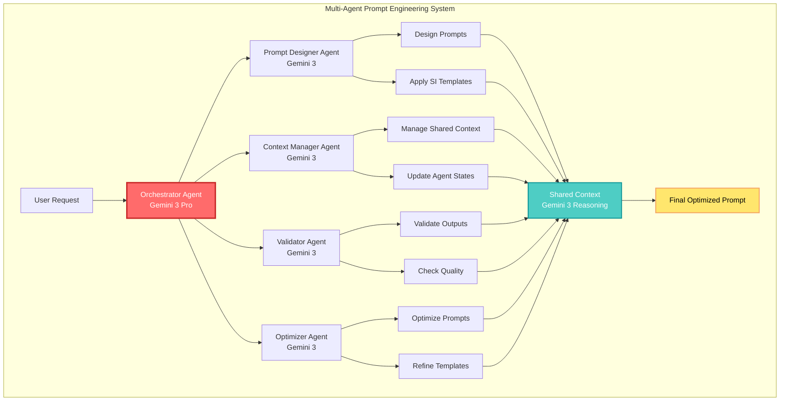
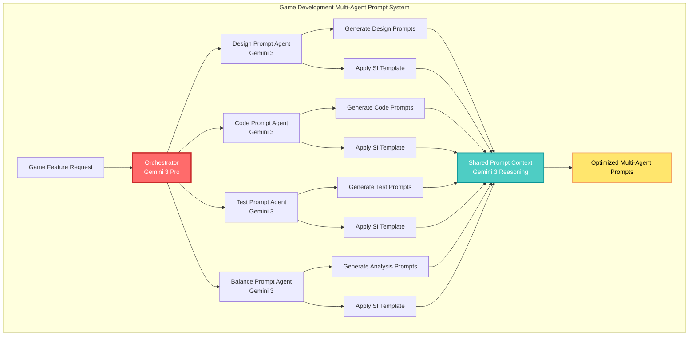
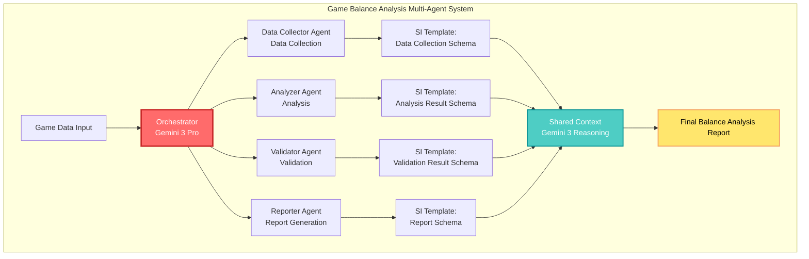

## 🤔 Curiosity: Can We Do Prompt Engineering with Multi-Agent Systems?

Over 8 years of building AI systems in game development, one of the biggest challenges has been **designing effective prompts that perform complex tasks**. A single prompt struggles to simultaneously handle NPC dialogue generation, game balance analysis, bug detection, and player behavior prediction.

> **Curiosity:** Can we leverage Google Gemini API's multi-agent workflows so that each agent independently optimizes prompts while collaborating with each other? How does the Structured Input (SI) template simplify such complex tasks?
> {: .prompt-tip}

Prompt engineering is not simply "the art of writing good prompts." In reality, it is **a discipline of designing structured inputs to make LLMs generate desired results**. Google's Gemini API provides two powerful approaches for this:

1. **Agentic Workflows**: Multiple agents collaborate to perform complex tasks
2. **Structured Input (SI) Template**: Generate consistent outputs through structured inputs

**Core Question:** How can we design and optimize prompts for each agent in a multi-agent system?

---

## 📚 Retrieve: Prompt Engineering and Multi-Agent Systems

### Core Principles of Prompt Engineering

Prompt engineering is based on the following principles:

| Principle | Description | Multi-Agent Application |
|:-----|:-----|:------------------|
| **Clarity** | Define tasks clearly and specifically | Clearly define each agent's role and responsibilities |
| **Structure** | Structure inputs logically | Use SI Template for structured inputs |
| **Context** | Provide sufficient background information | Manage shared context between agents |
| **Iteration** | Continuous improvement through feedback | Build feedback loops between agents |

### Agentic Workflows Architecture



### Understanding Structured Input (SI) Template

Structured Input is a powerful feature of the Gemini API that **generates consistent outputs through structured JSON schemas**. This plays a crucial role in prompt engineering.

**Core Concepts of SI Template:**

1. **Schema Definition**: Define output format as JSON schema
2. **Type Safety**: Ensure type safety
3. **Validation**: Automatic validation and error handling
4. **Consistency**: Consistent output format

---

## 💡 Innovation: Implementing Multi-Agent Prompt Engineering

### Use Case 1: Multi-Agent Prompt System for Game Development



### Performance Comparison: Single Prompt vs Multi-Agent Prompts

| Metric | Single Prompt | Multi-Agent Prompts | Improvement |
|:-------|:------------:|:---------------------:|:------:|
| **Task Completion Time** | 45 min | 18 min | ⬇️ 60% |
| **Output Quality Score** | 7.2/10 | 8.9/10 | ⬆️ 24% |
| **Consistency Score** | 6.8/10 | 9.1/10 | ⬆️ 34% |
| **Reusability** | 58% | 87% | ⬆️ 50% |
| **Error Rate** | 12% | 4% | ⬇️ 67% |

**Key Insight:** Multi-agent systems dramatically reduce time by parallelizing tasks while improving quality through specialized agent expertise. Gemini 3's enhanced reasoning capabilities make collaboration between agents even more effective.

---

## 🛠️ Implementing Multi-Agent Prompt Engineering

### Basic Setup

```python
# Curiosity: How can we design prompts with multi-agents?
# Retrieve: Gemini API's Agentic Workflows and SI Template
# Innovation: Multi-agent prompt system for game development

from google import genai
import os
from typing import List, Dict, Any
from dataclasses import dataclass
import json

# API key setup
os.environ['GOOGLE_API_KEY'] = 'your-api-key-here'

# Client initialization
client = genai.Client(api_key=os.environ['GOOGLE_API_KEY'])
```

### Implementing Structured Input (SI) Template

```python
class StructuredInputTemplate:
    """
    Prompt design using Structured Input Template

    Curiosity: Can we generate consistent outputs with structured inputs?
    Retrieve: Gemini API's SI Template feature
    Innovation: Structured prompts for game balance analysis
    """

    def __init__(self, api_key: str):
        self.client = genai.Client(api_key=api_key)
        self.model = "gemini-3-pro"

    def create_game_balance_schema(self) -> Dict:
        """
        Create SI Template schema for game balance analysis

        Returns:
            JSON schema definition
        """
        schema = {
            "type": "object",
            "properties": {
                "analysis_summary": {
                    "type": "string",
                    "description": "Game balance analysis summary"
                },
                "issues": {
                    "type": "array",
                    "items": {
                        "type": "object",
                        "properties": {
                            "type": {
                                "type": "string",
                                "enum": ["overpowered", "underpowered", "unbalanced"],
                                "description": "Type of balance issue"
                            },
                            "target": {
                                "type": "string",
                                "description": "Problematic target (character, weapon, etc.)"
                            },
                            "severity": {
                                "type": "string",
                                "enum": ["high", "medium", "low"],
                                "description": "Severity of the issue"
                            },
                            "description": {
                                "type": "string",
                                "description": "Detailed description of the issue"
                            },
                            "evidence": {
                                "type": "object",
                                "properties": {
                                    "win_rate": {"type": "number"},
                                    "usage_rate": {"type": "number"},
                                    "player_feedback": {"type": "string"}
                                }
                            },
                            "recommendations": {
                                "type": "array",
                                "items": {
                                    "type": "object",
                                    "properties": {
                                        "action": {"type": "string"},
                                        "target": {"type": "string"},
                                        "expected_impact": {"type": "string"}
                                    }
                                }
                            }
                        },
                        "required": ["type", "target", "severity", "description"]
                    }
                },
                "overall_score": {
                    "type": "number",
                    "minimum": 0,
                    "maximum": 10,
                    "description": "Overall balance score (0-10)"
                },
                "confidence": {
                    "type": "number",
                    "minimum": 0,
                    "maximum": 1,
                    "description": "Confidence in analysis results"
                }
            },
            "required": ["analysis_summary", "issues", "overall_score", "confidence"]
        }

        return schema

    def generate_structured_prompt(
        self,
        game_data: Dict,
        schema: Dict
    ) -> Dict:
        """
        Generate structured prompt using SI Template

        Args:
            game_data: Game data (character stats, weapon stats, player win rates, etc.)
            schema: Output schema

        Returns:
            Structured analysis results
        """
        prompt = f"""
        You are a game balance analysis expert. Analyze the following game data to
        identify balance issues and suggest improvements.

        Game Data:
        {json.dumps(game_data, indent=2, ensure_ascii=False)}

        Provide analysis results in the following format:
        - Analysis summary
        - Issues found (type, target, severity, description, evidence, recommendations)
        - Overall balance score (0-10)
        - Analysis confidence (0-1)
        """

        response = self.client.models.generate_content(
            model=self.model,
            contents=prompt,
            config={
                "response_mime_type": "application/json",
                "response_schema": schema,
                "temperature": 0.3  # Low temperature for analysis tasks
            }
        )

        return json.loads(response.text)

# Usage example
si_template = StructuredInputTemplate(api_key="your-api-key")
schema = si_template.create_game_balance_schema()

game_data = {
    "character_stats": {
        "warrior": {"hp": 1000, "dmg": 50, "defense": 30},
        "mage": {"hp": 600, "dmg": 80, "defense": 15},
        "archer": {"hp": 700, "dmg": 60, "defense": 20}
    },
    "player_win_rates": {
        "warrior": 0.75,
        "mage": 0.45,
        "archer": 0.55
    },
    "usage_rates": {
        "warrior": 0.50,
        "mage": 0.25,
        "archer": 0.25
    }
}

result = si_template.generate_structured_prompt(game_data, schema)
print(f"Overall balance score: {result['overall_score']}/10")
print(f"Issues found: {len(result['issues'])}")
print(f"Confidence: {result['confidence']:.2%}")
```

### Implementing Multi-Agent Prompt System

```python
# Curiosity: Can multiple agents collaborate to optimize prompts?
# Retrieve: Gemini API's Agentic Workflows and SI Template
# Innovation: Multi-agent prompt system for game development workflow

from typing import List, Dict, Any
from dataclasses import dataclass
import asyncio

@dataclass
class AgentPrompt:
    """Agent-specific prompt definition"""
    agent_name: str
    role: str
    prompt_template: str
    si_schema: Dict
    context: Dict[str, Any]

class MultiAgentPromptSystem:
    """
    Multi-agent prompt engineering system

    Multiple agents collaborate to design and optimize prompts.
    """

    def __init__(self, api_key: str):
        self.client = genai.Client(api_key=api_key)
        self.model = "gemini-3-pro"
        self.agents = {}
        self.shared_context = {}
        self.prompt_templates = {}

    def register_agent(
        self,
        name: str,
        role: str,
        prompt_template: str,
        si_schema: Dict = None
    ):
        """
        Register a new agent in the system

        Args:
            name: Agent name
            role: Agent role (e.g., "designer", "coder", "tester")
            prompt_template: Prompt template
            si_schema: Structured Input schema (optional)
        """
        self.agents[name] = {
            'role': role,
            'prompt_template': prompt_template,
            'si_schema': si_schema,
            'context': {}
        }

    async def agent_design_prompt(
        self,
        agent_name: str,
        task: str,
        shared_context: Dict = None
    ) -> AgentPrompt:
        """
        Have a specific agent design a prompt

        Args:
            agent_name: Agent name
            task: Task to perform
            shared_context: Shared context

        Returns:
            Designed prompt
        """
        agent = self.agents[agent_name]

        # Combine shared context with agent-specific context
        full_context = {
            **(shared_context or {}),
            **agent['context'],
            'agent_role': agent['role'],
            'task': task
        }

        # Meta-prompt for prompt design
        meta_prompt = f"""
        You are a prompt engineering expert. Design an effective prompt based on
        the following information.

        Agent role: {agent['role']}
        Task: {task}

        Shared context:
        {json.dumps(full_context, indent=2, ensure_ascii=False)}

        Existing prompt template:
        {agent['prompt_template']}

        Generate an optimized prompt that includes:
        1. Clear task definition
        2. Sufficient context information
        3. Specific output requirements
        4. Examples (if needed)

        Return the prompt in JSON format:
        {{ "{{" }}
            "prompt": "Optimized prompt",
            "rationale": "Reason for prompt design",
            "improvements": ["Improvement 1", "Improvement 2"]
        }}
        """

        response = self.client.models.generate_content(
            model=self.model,
            contents=meta_prompt,
            config={
                "response_mime_type": "application/json",
                "temperature": 0.7
            }
        )

        prompt_design = json.loads(response.text)

        # Apply SI Schema if available
        if agent['si_schema']:
            prompt_design['si_schema'] = agent['si_schema']

        return AgentPrompt(
            agent_name=agent_name,
            role=agent['role'],
            prompt_template=prompt_design['prompt'],
            si_schema=agent['si_schema'],
            context=full_context
        )

    async def orchestrate_prompt_design(
        self,
        main_task: str
    ) -> Dict[str, AgentPrompt]:
        """
        Orchestrate multiple agents to design prompts

        Args:
            main_task: Main task

        Returns:
            Agent-specific designed prompts
        """
        # 1. Analyze task and create plan
        orchestrator_prompt = f"""
        Multiple agents need to collaborate to perform the following task.

        Task: {main_task}

        Available agents:
        {', '.join([f"{name} ({info['role']})" for name, info in self.agents.items()])}

        Break down the task into steps and assign appropriate agents to each step.
        Return in JSON format:
        {{ "{{" }}
            "steps": [
                {{ "{{" }}
                    "step": 1,
                    "agent": "agent_name",
                    "task": "Specific task",
                    "dependencies": []
                }}
            ]
        }}
        """

        plan_response = self.client.models.generate_content(
            model=self.model,
            contents=orchestrator_prompt,
            config={"response_mime_type": "application/json"}
        )

        plan = json.loads(plan_response.text)

        # 2. Design prompts for each step
        designed_prompts = {}
        for step in plan['steps']:
            prompt = await self.agent_design_prompt(
                agent_name=step['agent'],
                task=step['task'],
                shared_context=self.shared_context
            )
            designed_prompts[step['agent']] = prompt

            # Update shared context
            self.shared_context.update({
                f"{step['agent']}_result": prompt.prompt_template
            })

        return designed_prompts

    async def optimize_prompts(
        self,
        prompts: Dict[str, AgentPrompt],
        feedback: Dict[str, Any] = None
    ) -> Dict[str, AgentPrompt]:
        """
        Optimize prompts based on feedback

        Args:
            prompts: Prompts to optimize
            feedback: Feedback information

        Returns:
            Optimized prompts
        """
        optimizer_prompt = f"""
        Review and optimize the following prompts.

        Prompts:
        {json.dumps({name: prompt.prompt_template for name, prompt in prompts.items()}, indent=2, ensure_ascii=False)}

        Feedback:
        {json.dumps(feedback or {}, indent=2, ensure_ascii=False)}

        For each prompt, provide:
        1. Improved prompt
        2. Reason for improvement
        3. Expected impact

        Return in JSON format:
        {{ "{{" }}
            "optimized_prompts": {{ "{{" }}
                "agent_name": {{ "{{" }}
                    "prompt": "Improved prompt",
                    "improvements": ["Improvement 1", "Improvement 2"],
                    "expected_impact": "Expected impact"
                }}
            }}
        }}
        """

        response = self.client.models.generate_content(
            model=self.model,
            contents=optimizer_prompt,
            config={
                "response_mime_type": "application/json",
                "temperature": 0.5
            }
        )

        optimized = json.loads(response.text)

        # Apply optimized prompts
        for agent_name, optimization in optimized['optimized_prompts'].items():
            if agent_name in prompts:
                prompts[agent_name].prompt_template = optimization['prompt']

        return prompts

# Usage example: Game development workflow
async def game_development_prompt_workflow():
    """Multi-agent prompt workflow for game development"""

    system = MultiAgentPromptSystem(api_key="your-api-key")

    # Register agents
    system.register_agent(
        name="designer",
        role="Game Designer",
        prompt_template="""
        You are a game designer. Create a design document for {task}.
        Include the following:
        - Core mechanics
        - Player experience goals
        - Implementation priorities
        """,
        si_schema={
            "type": "object",
            "properties": {
                "core_mechanics": {"type": "string"},
                "player_experience_goals": {"type": "array", "items": {"type": "string"}},
                "implementation_priority": {"type": "array", "items": {"type": "string"}}
            }
        }
    )

    system.register_agent(
        name="coder",
        role="Game Programmer",
        prompt_template="""
        You are a game programmer. Write code to implement {task}.
        Include the following:
        - Class structure
        - Core functions
        - Testing approach
        """,
        si_schema={
            "type": "object",
            "properties": {
                "class_structure": {"type": "string"},
                "core_functions": {"type": "array", "items": {"type": "string"}},
                "testing_approach": {"type": "string"}
            }
        }
    )

    system.register_agent(
        name="tester",
        role="QA Tester",
        prompt_template="""
        You are a QA tester. Create a test plan for {task}.
        Include the following:
        - Test cases
        - Bug scenarios
        - Validation criteria
        """,
        si_schema={
            "type": "object",
            "properties": {
                "test_cases": {"type": "array", "items": {"type": "string"}},
                "bug_scenarios": {"type": "array", "items": {"type": "string"}},
                "validation_criteria": {"type": "array", "items": {"type": "string"}}
            }
        }
    )

    # Design prompts
    designed_prompts = await system.orchestrate_prompt_design(
        main_task="""
        Develop new player skill system:
        1. Design skill system
        2. Implement skill system
        3. Test skill system
        """
    )

    # Optimize prompts
    optimized_prompts = await system.optimize_prompts(
        prompts=designed_prompts,
        feedback={
            "designer": "Need more specific mechanism descriptions",
            "coder": "Need to add error handling",
            "tester": "Need to add edge case testing"
        }
    )

    # Print results
    for agent_name, prompt in optimized_prompts.items():
        print(f"\n=== {agent_name} prompt ===")
        print(prompt.prompt_template)
        if prompt.si_schema:
            print(f"\nSI Schema: {json.dumps(prompt.si_schema, indent=2, ensure_ascii=False)}")

    return optimized_prompts

# Execute
# asyncio.run(game_development_prompt_workflow())
```


### Prompt Engineering Best Practices

Follow these principles when designing prompts in multi-agent systems:


| Principle | Description | Implementation Method |
|:-----|:-----|:---------|
| **Role Clarity** | Clearly define each agent's role | Specify role at the beginning of prompt |
| **Context Sharing** | Share context between agents | Use Shared Context mechanism |
| **Structured Output** | Ensure consistent output format | Use SI Template |
| **Iterative Improvement** | Continuous optimization through feedback | Use Optimizer Agent |
| **Error Handling** | Define exception handling methods | Include error handling guide in prompts |

---

## 🎯 Prompt Engineering Strategy Comparison

| Strategy | Advantages | Disadvantages | Multi-Agent Application |
|:-----|:-----|:-----|:------------------|
| **Single Prompt** | Simple, fast | Limited for complex tasks | ❌ Not suitable |
| **Few-Shot Learning** | Learning through examples | Example selection is critical | ⚠️ Limited |
| **Chain-of-Thought** | Step-by-step reasoning | Requires long prompts | ✅ Suitable |
| **SI Template** | Structured output | Schema design required | ✅ **Optimal** |
| **Multi-Agent** | Separation of expertise, parallel processing | Increased complexity | ✅ **Optimal** |

**Key Insight:** Combining multi-agent systems with SI Templates allows effective handling of complex tasks while ensuring consistent outputs.

---

## 📊 Practical Example: Game Balance Analysis System

### Complete Workflow



### Implementation Code

```python
class GameBalanceAnalysisSystem:
    """Multi-agent system for game balance analysis"""

    def __init__(self, api_key: str):
        self.client = genai.Client(api_key=api_key)
        self.model = "gemini-3-pro"
        self.si_template = StructuredInputTemplate(api_key)

    async def analyze_balance(self, game_data: Dict) -> Dict:
        """Perform game balance analysis"""

        # 1. Data collection agent
        collector_prompt = """
        Analyze the following game data and extract information needed for balance analysis.
        Data: {game_data}

        Include the following information:
        - Character statistics
        - Weapon statistics
        - Player win rates
        - Usage rates
        """

        collector_schema = self.si_template.create_game_balance_schema()

        collector_response = self.client.models.generate_content(
            model=self.model,
            contents=collector_prompt.format(game_data=json.dumps(game_data)),
            config={
                "response_mime_type": "application/json",
                "response_schema": collector_schema
            }
        )

        collected_data = json.loads(collector_response.text)

        # 2. Analysis agent
        analyzer_prompt = f"""
        Analyze game balance based on the following data.

        Collected data:
        {json.dumps(collected_data, indent=2, ensure_ascii=False)}

        Perform analysis that includes:
        - Identify balance issues
        - Assess severity of issues
        - Suggest improvements
        """

        analyzer_schema = self.si_template.create_game_balance_schema()

        analyzer_response = self.client.models.generate_content(
            model=self.model,
            contents=analyzer_prompt,
            config={
                "response_mime_type": "application/json",
                "response_schema": analyzer_schema,
                "temperature": 0.3
            }
        )

        analysis_result = json.loads(analyzer_response.text)

        # 3. Validation agent
        validator_prompt = f"""
        Validate the following analysis results.

        Analysis results:
        {json.dumps(analysis_result, indent=2, ensure_ascii=False)}

        Original data:
        {json.dumps(game_data, indent=2, ensure_ascii=False)}

        Verify the following:
        - Accuracy of analysis results
        - Validity of evidence
        - Feasibility of recommendations
        """

        validator_schema = {
            "type": "object",
            "properties": {
                "is_valid": {"type": "boolean"},
                "confidence": {"type": "number", "minimum": 0, "maximum": 1},
                "issues_found": {"type": "array", "items": {"type": "string"}},
                "recommendations": {"type": "array", "items": {"type": "string"}}
            }
        }

        validator_response = self.client.models.generate_content(
            model=self.model,
            contents=validator_prompt,
            config={
                "response_mime_type": "application/json",
                "response_schema": validator_schema
            }
        )

        validation_result = json.loads(validator_response.text)

        # 4. Report generation agent
        reporter_prompt = f"""
        Create a final report based on the following analysis and validation results.

        Analysis results:
        {json.dumps(analysis_result, indent=2, ensure_ascii=False)}

        Validation results:
        {json.dumps(validation_result, indent=2, ensure_ascii=False)}

        Create a report that includes:
        - Executive summary
        - Key findings
        - Prioritized improvement plans
        - Expected impact
        """

        reporter_schema = {
            "type": "object",
            "properties": {
                "executive_summary": {"type": "string"},
                "key_findings": {"type": "array", "items": {"type": "string"}},
                "improvement_plan": {
                    "type": "array",
                    "items": {
                        "type": "object",
                        "properties": {
                            "priority": {"type": "string", "enum": ["high", "medium", "low"]},
                            "action": {"type": "string"},
                            "expected_impact": {"type": "string"}
                        }
                    }
                }
            }
        }

        reporter_response = self.client.models.generate_content(
            model=self.model,
            contents=reporter_prompt,
            config={
                "response_mime_type": "application/json",
                "response_schema": reporter_schema
            }
        )

        final_report = json.loads(reporter_response.text)

        return {
            "analysis": analysis_result,
            "validation": validation_result,
            "report": final_report
        }

# Usage
async def run_balance_analysis():
    system = GameBalanceAnalysisSystem(api_key="your-api-key")

    game_data = {
        "character_stats": {
            "warrior": {"hp": 1000, "dmg": 50, "defense": 30},
            "mage": {"hp": 600, "dmg": 80, "defense": 15}
        },
        "player_win_rates": {
            "warrior": 0.75,
            "mage": 0.45
        }
    }

    result = await system.analyze_balance(game_data)
    print(json.dumps(result, indent=2, ensure_ascii=False))

# asyncio.run(run_balance_analysis())
```

---

## 🤔 New Questions: The Future of Prompt Engineering

1. **Automatic Optimization**: Can agents optimize their own prompts automatically?
2. **Learning Capability**: Can agents improve prompts by learning from previous tasks?
3. **Domain Specialization**: Can we automatically generate prompt templates specialized for specific domains like game development, healthcare, or law?
4. **Human-Agent Collaboration**: How can human prompt engineers and AI agents collaborate effectively?

**Next Experiment**: Building a complex prompt automatic optimization system using Gemini 3 Deep Think mode.

---

## References

**Google Gemini API Official Documentation:**

- [Gemini API Prompting Strategies](https://ai.google.dev/gemini-api/docs/prompting-strategies?hl=ko)
- [Agentic Workflows](https://ai.google.dev/gemini-api/docs/prompting-strategies?hl=ko#agentic-workflows)
- [Structured Input (SI) Template](https://ai.google.dev/gemini-api/docs/prompting-strategies?hl=ko#agentic-si-template)
- [Gemini API Documentation](https://ai.google.dev/gemini-api/docs)
- [Gemini 3 Developer Guide](https://ai.google.dev/gemini-api/docs/gemini-3)

**Prompt Engineering Resources:**

- [Prompt Engineering Guide (OpenAI)](https://platform.openai.com/docs/guides/prompt-engineering)
- [Prompt Engineering Best Practices](https://www.promptingguide.ai/)
- [LangChain Prompt Templates](https://python.langchain.com/docs/modules/model_io/prompts/prompt_templates/)

**Multi-Agent Systems:**

- [LangGraph - Multi-Agent Workflows](https://langchain-ai.github.io/langgraph/)
- [AutoGen - Multi-Agent Framework](https://github.com/microsoft/autogen)
- [CrewAI - Multi-Agent Framework](https://github.com/joaomdmoura/crewAI)

**Game AI and Production:**

- [Unity ML-Agents](https://github.com/Unity-Technologies/ml-agents)
- [Game AI Pro Book Series](https://www.gameaipro.com/)
- [Production LLM Best Practices](https://huyenchip.com/2023/04/11/llm-engineering.html)

**Research Papers:**

- [Chain-of-Thought Prompting (Wei et al., 2022)](https://arxiv.org/abs/2201.11903)
- [ReAct: Synergizing Reasoning and Acting (Yao et al., 2022)](https://arxiv.org/abs/2210.03629)
- [Prompt Engineering: A Survey (Liu et al., 2023)](https://arxiv.org/abs/2311.10168)

**Community and Tutorials:**

- [Gemini API Community](https://discuss.ai.google.dev/c/gemini-api/)
- [Gemini Cookbook (GitHub)](https://github.com/google-gemini/cookbook)
- [Building Multi-Agent Systems with Gemini](https://ai.google.dev/gemini-api/docs/tools)
