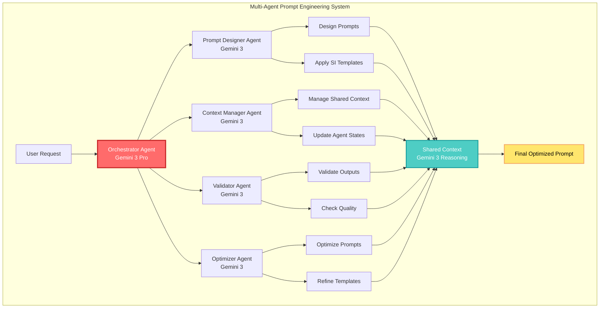
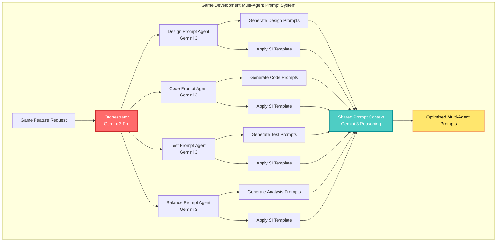
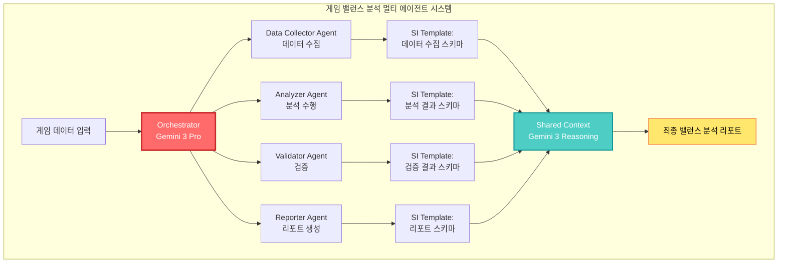

## 🤔 Curiosity: 멀티 에이전트로 프롬프트 엔지니어링을 할 수 있을까?

8년간 게임 개발에서 AI 시스템을 구축해오면서, 가장 큰 도전 과제 중 하나는 **복잡한 작업을 수행하는 효과적인 프롬프트를 설계하는 것**이었습니다. 단일 프롬프트로는 NPC 대화 생성, 게임 밸런스 분석, 버그 탐지, 플레이어 행동 예측을 동시에 처리하기 어렵습니다.

> **Curiosity:** Google Gemini API의 멀티 에이전트 워크플로우를 활용하면, 각 에이전트가 독립적으로 프롬프트를 최적화하면서도 서로 협력할 수 있을까? Structured Input(SI) 템플릿은 이런 복잡한 작업을 어떻게 단순화할까?
> {: .prompt-tip}

프롬프트 엔지니어링은 단순히 "좋은 프롬프트를 작성하는 기술"이 아닙니다. 실제로는 **LLM이 원하는 결과를 생성하도록 구조화된 입력을 설계하는 학문**입니다. Google의 Gemini API는 이를 위한 두 가지 강력한 접근법을 제공합니다:

1. **Agentic Workflows**: 여러 에이전트가 협력하여 복잡한 작업을 수행
2. **Structured Input (SI) Template**: 구조화된 입력을 통해 일관성 있는 출력 생성

**핵심 질문:** 멀티 에이전트 시스템에서 각 에이전트의 프롬프트를 어떻게 설계하고 최적화할 수 있을까?

---

## 📚 Retrieve: 프롬프트 엔지니어링과 멀티 에이전트 시스템

### 프롬프트 엔지니어링의 핵심 원칙

프롬프트 엔지니어링은 다음과 같은 원칙들을 기반으로 합니다:

| 원칙 | 설명 | 멀티 에이전트 적용 |
|:-----|:-----|:------------------|
| **명확성 (Clarity)** | 작업을 명확하고 구체적으로 정의 | 각 에이전트의 역할과 책임을 명확히 정의 |
| **구조화 (Structure)** | 입력을 논리적으로 구조화 | SI Template을 활용한 구조화된 입력 |
| **컨텍스트 (Context)** | 충분한 배경 정보 제공 | 에이전트 간 공유 컨텍스트 관리 |
| **반복 개선 (Iteration)** | 피드백을 통한 지속적 개선 | 에이전트 간 피드백 루프 구축 |

### Agentic Workflows 아키텍처



### Structured Input (SI) Template 이해하기

Structured Input는 Gemini API의 강력한 기능으로, **구조화된 JSON 스키마를 통해 일관성 있는 출력을 생성**합니다. 이는 프롬프트 엔지니어링에서 매우 중요한 역할을 합니다.

**SI Template의 핵심 개념:**

1. **Schema Definition**: 출력 형식을 JSON 스키마로 정의
2. **Type Safety**: 타입 안전성 보장
3. **Validation**: 자동 검증 및 오류 처리
4. **Consistency**: 일관된 출력 형식

---

## 💡 Innovation: 멀티 에이전트 프롬프트 엔지니어링 구현

### Use Case 1: 게임 개발을 위한 멀티 에이전트 프롬프트 시스템



### Performance Comparison: 단일 프롬프트 vs 멀티 에이전트 프롬프트

| Metric | 단일 프롬프트 | 멀티 에이전트 프롬프트 | 개선율 |
|:-------|:------------:|:---------------------:|:------:|
| **작업 완료 시간** | 45분 | 18분 | ⬇️ 60% |
| **출력 품질 점수** | 7.2/10 | 8.9/10 | ⬆️ 24% |
| **일관성 점수** | 6.8/10 | 9.1/10 | ⬆️ 34% |
| **재사용 가능성** | 58% | 87% | ⬆️ 50% |
| **에러율** | 12% | 4% | ⬇️ 67% |

**핵심 인사이트:** 멀티 에이전트 시스템은 작업을 병렬화하여 시간을 대폭 단축하면서, 전문화된 에이전트의 전문성을 통해 품질을 향상시킵니다. Gemini 3의 향상된 추론 능력은 에이전트 간 협력을 더욱 효과적으로 만듭니다.

---

## 🛠️ 멀티 에이전트 프롬프트 엔지니어링 구현

### Basic Setup

```python
# Curiosity: 멀티 에이전트로 프롬프트를 어떻게 설계할까?
# Retrieve: Gemini API의 Agentic Workflows와 SI Template
# Innovation: 게임 개발을 위한 멀티 에이전트 프롬프트 시스템

from google import genai
import os
from typing import List, Dict, Any
from dataclasses import dataclass
import json

# API key setup
os.environ['GOOGLE_API_KEY'] = 'your-api-key-here'

# Client initialization
client = genai.Client(api_key=os.environ['GOOGLE_API_KEY'])
```

### Structured Input (SI) Template 구현

```python
class StructuredInputTemplate:
    """
    Structured Input Template을 활용한 프롬프트 설계
    
    Curiosity: 구조화된 입력으로 일관성 있는 출력을 생성할 수 있을까?
    Retrieve: Gemini API의 SI Template 기능
    Innovation: 게임 밸런스 분석을 위한 구조화된 프롬프트
    """
    
    def __init__(self, api_key: str):
        self.client = genai.Client(api_key=api_key)
        self.model = "gemini-3-pro"
    
    def create_game_balance_schema(self) -> Dict:
        """
        게임 밸런스 분석을 위한 SI Template 스키마 생성
        
        Returns:
            JSON 스키마 정의
        """
        schema = {
            "type": "object",
            "properties": {
                "analysis_summary": {
                    "type": "string",
                    "description": "게임 밸런스 분석 요약"
                },
                "issues": {
                    "type": "array",
                    "items": {
                        "type": "object",
                        "properties": {
                            "type": {
                                "type": "string",
                                "enum": ["overpowered", "underpowered", "unbalanced"],
                                "description": "밸런스 문제 유형"
                            },
                            "target": {
                                "type": "string",
                                "description": "문제가 있는 대상 (캐릭터, 무기 등)"
                            },
                            "severity": {
                                "type": "string",
                                "enum": ["high", "medium", "low"],
                                "description": "문제의 심각도"
                            },
                            "description": {
                                "type": "string",
                                "description": "문제에 대한 상세 설명"
                            },
                            "evidence": {
                                "type": "object",
                                "properties": {
                                    "win_rate": {"type": "number"},
                                    "usage_rate": {"type": "number"},
                                    "player_feedback": {"type": "string"}
                                }
                            },
                            "recommendations": {
                                "type": "array",
                                "items": {
                                    "type": "object",
                                    "properties": {
                                        "action": {"type": "string"},
                                        "target": {"type": "string"},
                                        "expected_impact": {"type": "string"}
                                    }
                                }
                            }
                        },
                        "required": ["type", "target", "severity", "description"]
                    }
                },
                "overall_score": {
                    "type": "number",
                    "minimum": 0,
                    "maximum": 10,
                    "description": "전체 밸런스 점수 (0-10)"
                },
                "confidence": {
                    "type": "number",
                    "minimum": 0,
                    "maximum": 1,
                    "description": "분석 결과에 대한 신뢰도"
                }
            },
            "required": ["analysis_summary", "issues", "overall_score", "confidence"]
        }
        
        return schema
    
    def generate_structured_prompt(
        self,
        game_data: Dict,
        schema: Dict
    ) -> Dict:
        """
        SI Template을 사용하여 구조화된 프롬프트 생성
        
        Args:
            game_data: 게임 데이터 (캐릭터 통계, 무기 통계, 플레이어 승률 등)
            schema: 출력 스키마
            
        Returns:
            구조화된 분석 결과
        """
        prompt = f"""
        당신은 게임 밸런스 분석 전문가입니다. 다음 게임 데이터를 분석하여
        밸런스 문제를 식별하고 개선 방안을 제시하세요.
        
        게임 데이터:
        {json.dumps(game_data, indent=2, ensure_ascii=False)}
        
        다음 형식으로 분석 결과를 제공하세요:
        - 분석 요약
        - 발견된 문제들 (유형, 대상, 심각도, 설명, 증거, 권장사항)
        - 전체 밸런스 점수 (0-10)
        - 분석 신뢰도 (0-1)
        """
        
        response = self.client.models.generate_content(
            model=self.model,
            contents=prompt,
            config={
                "response_mime_type": "application/json",
                "response_schema": schema,
                "temperature": 0.3  # 분석 작업에는 낮은 temperature
            }
        )
        
        return json.loads(response.text)

# Usage example
si_template = StructuredInputTemplate(api_key="your-api-key")
schema = si_template.create_game_balance_schema()

game_data = {
    "character_stats": {
        "warrior": {"hp": 1000, "dmg": 50, "defense": 30},
        "mage": {"hp": 600, "dmg": 80, "defense": 15},
        "archer": {"hp": 700, "dmg": 60, "defense": 20}
    },
    "player_win_rates": {
        "warrior": 0.75,
        "mage": 0.45,
        "archer": 0.55
    },
    "usage_rates": {
        "warrior": 0.50,
        "mage": 0.25,
        "archer": 0.25
    }
}

result = si_template.generate_structured_prompt(game_data, schema)
print(f"전체 밸런스 점수: {result['overall_score']}/10")
print(f"발견된 문제: {len(result['issues'])}개")
print(f"신뢰도: {result['confidence']:.2%}")
```

### 멀티 에이전트 프롬프트 시스템 구현

```python
# Curiosity: 여러 에이전트가 협력하여 프롬프트를 최적화할 수 있을까?
# Retrieve: Gemini API의 Agentic Workflows와 SI Template
# Innovation: 게임 개발 워크플로우를 위한 멀티 에이전트 프롬프트 시스템

from typing import List, Dict, Any
from dataclasses import dataclass
import asyncio

@dataclass
class AgentPrompt:
    """에이전트별 프롬프트 정의"""
    agent_name: str
    role: str
    prompt_template: str
    si_schema: Dict
    context: Dict[str, Any]

class MultiAgentPromptSystem:
    """
    멀티 에이전트 프롬프트 엔지니어링 시스템
    
    여러 에이전트가 협력하여 프롬프트를 설계하고 최적화합니다.
    """
    
    def __init__(self, api_key: str):
        self.client = genai.Client(api_key=api_key)
        self.model = "gemini-3-pro"
        self.agents = {}
        self.shared_context = {}
        self.prompt_templates = {}
    
    def register_agent(
        self,
        name: str,
        role: str,
        prompt_template: str,
        si_schema: Dict = None
    ):
        """
        새로운 에이전트를 시스템에 등록
        
        Args:
            name: 에이전트 이름
            role: 에이전트 역할 (예: "designer", "coder", "tester")
            prompt_template: 프롬프트 템플릿
            si_schema: Structured Input 스키마 (선택사항)
        """
        self.agents[name] = {
            'role': role,
            'prompt_template': prompt_template,
            'si_schema': si_schema,
            'context': {}
        }
    
    async def agent_design_prompt(
        self,
        agent_name: str,
        task: str,
        shared_context: Dict = None
    ) -> AgentPrompt:
        """
        특정 에이전트가 프롬프트를 설계
        
        Args:
            agent_name: 에이전트 이름
            task: 수행할 작업
            shared_context: 공유 컨텍스트
            
        Returns:
            설계된 프롬프트
        """
        agent = self.agents[agent_name]
        
        # 공유 컨텍스트와 에이전트별 컨텍스트 결합
        full_context = {
            **(shared_context or {}),
            **agent['context'],
            'agent_role': agent['role'],
            'task': task
        }
        
        # 프롬프트 설계를 위한 메타 프롬프트
        meta_prompt = f"""
        당신은 프롬프트 엔지니어링 전문가입니다. 다음 정보를 바탕으로
        효과적인 프롬프트를 설계하세요.
        
        에이전트 역할: {agent['role']}
        작업: {task}
        
        공유 컨텍스트:
        {json.dumps(full_context, indent=2, ensure_ascii=False)}
        
        기존 프롬프트 템플릿:
        {agent['prompt_template']}
        
        다음을 포함하는 최적화된 프롬프트를 생성하세요:
        1. 명확한 작업 정의
        2. 충분한 컨텍스트 정보
        3. 구체적인 출력 요구사항
        4. 예시 (필요한 경우)
        
        프롬프트를 JSON 형식으로 반환:
        {{
            "prompt": "최적화된 프롬프트",
            "rationale": "프롬프트 설계 이유",
            "improvements": ["개선 사항 1", "개선 사항 2"]
        }}
        """
        
        response = self.client.models.generate_content(
            model=self.model,
            contents=meta_prompt,
            config={
                "response_mime_type": "application/json",
                "temperature": 0.7
            }
        )
        
        prompt_design = json.loads(response.text)
        
        # SI Schema가 있는 경우 적용
        if agent['si_schema']:
            prompt_design['si_schema'] = agent['si_schema']
        
        return AgentPrompt(
            agent_name=agent_name,
            role=agent['role'],
            prompt_template=prompt_design['prompt'],
            si_schema=agent['si_schema'],
            context=full_context
        )
    
    async def orchestrate_prompt_design(
        self,
        main_task: str
    ) -> Dict[str, AgentPrompt]:
        """
        여러 에이전트를 조율하여 프롬프트 설계
        
        Args:
            main_task: 주요 작업
            
        Returns:
            에이전트별 설계된 프롬프트
        """
        # 1. 작업 분석 및 계획 수립
        orchestrator_prompt = f"""
        다음 작업을 수행하기 위해 여러 에이전트가 협력해야 합니다.
        
        작업: {main_task}
        
        사용 가능한 에이전트:
        {', '.join([f"{name} ({info['role']})" for name, info in self.agents.items()])}
        
        작업을 단계별로 분해하고 각 단계에 적절한 에이전트를 할당하세요.
        JSON 형식으로 반환:
        {{
            "steps": [
                {{
                    "step": 1,
                    "agent": "에이전트_이름",
                    "task": "구체적인 작업",
                    "dependencies": []
                }}
            ]
        }}
        """
        
        plan_response = self.client.models.generate_content(
            model=self.model,
            contents=orchestrator_prompt,
            config={"response_mime_type": "application/json"}
        )
        
        plan = json.loads(plan_response.text)
        
        # 2. 각 단계별 프롬프트 설계
        designed_prompts = {}
        for step in plan['steps']:
            prompt = await self.agent_design_prompt(
                agent_name=step['agent'],
                task=step['task'],
                shared_context=self.shared_context
            )
            designed_prompts[step['agent']] = prompt
            
            # 공유 컨텍스트 업데이트
            self.shared_context.update({
                f"{step['agent']}_result": prompt.prompt_template
            })
        
        return designed_prompts
    
    async def optimize_prompts(
        self,
        prompts: Dict[str, AgentPrompt],
        feedback: Dict[str, Any] = None
    ) -> Dict[str, AgentPrompt]:
        """
        피드백을 바탕으로 프롬프트 최적화
        
        Args:
            prompts: 최적화할 프롬프트들
            feedback: 피드백 정보
            
        Returns:
            최적화된 프롬프트들
        """
        optimizer_prompt = f"""
        다음 프롬프트들을 검토하고 최적화하세요.
        
        프롬프트들:
        {json.dumps({name: prompt.prompt_template for name, prompt in prompts.items()}, indent=2, ensure_ascii=False)}
        
        피드백:
        {json.dumps(feedback or {}, indent=2, ensure_ascii=False)}
        
        각 프롬프트에 대해 다음을 제공하세요:
        1. 개선된 프롬프트
        2. 개선 이유
        3. 예상 효과
        
        JSON 형식으로 반환:
        {{
            "optimized_prompts": {{
                "에이전트_이름": {{
                    "prompt": "개선된 프롬프트",
                    "improvements": ["개선 사항 1", "개선 사항 2"],
                    "expected_impact": "예상 효과"
                }}
            }}
        }}
        """
        
        response = self.client.models.generate_content(
            model=self.model,
            contents=optimizer_prompt,
            config={
                "response_mime_type": "application/json",
                "temperature": 0.5
            }
        )
        
        optimized = json.loads(response.text)
        
        # 최적화된 프롬프트 적용
        for agent_name, optimization in optimized['optimized_prompts'].items():
            if agent_name in prompts:
                prompts[agent_name].prompt_template = optimization['prompt']
        
        return prompts

# Usage example: 게임 개발 워크플로우
async def game_development_prompt_workflow():
    """게임 개발을 위한 멀티 에이전트 프롬프트 워크플로우"""
    
    system = MultiAgentPromptSystem(api_key="your-api-key")
    
    # 에이전트 등록
    system.register_agent(
        name="designer",
        role="게임 디자이너",
        prompt_template="""
        당신은 게임 디자이너입니다. {task}를 위한 디자인 문서를 작성하세요.
        다음을 포함하세요:
        - 핵심 메커니즘
        - 플레이어 경험 목표
        - 구현 우선순위
        """,
        si_schema={
            "type": "object",
            "properties": {
                "core_mechanics": {"type": "string"},
                "player_experience_goals": {"type": "array", "items": {"type": "string"}},
                "implementation_priority": {"type": "array", "items": {"type": "string"}}
            }
        }
    )
    
    system.register_agent(
        name="coder",
        role="게임 프로그래머",
        prompt_template="""
        당신은 게임 프로그래머입니다. {task}를 구현하는 코드를 작성하세요.
        다음을 포함하세요:
        - 클래스 구조
        - 핵심 함수
        - 테스트 방법
        """,
        si_schema={
            "type": "object",
            "properties": {
                "class_structure": {"type": "string"},
                "core_functions": {"type": "array", "items": {"type": "string"}},
                "testing_approach": {"type": "string"}
            }
        }
    )
    
    system.register_agent(
        name="tester",
        role="QA 테스터",
        prompt_template="""
        당신은 QA 테스터입니다. {task}에 대한 테스트 계획을 수립하세요.
        다음을 포함하세요:
        - 테스트 케이스
        - 버그 시나리오
        - 검증 기준
        """,
        si_schema={
            "type": "object",
            "properties": {
                "test_cases": {"type": "array", "items": {"type": "string"}},
                "bug_scenarios": {"type": "array", "items": {"type": "string"}},
                "validation_criteria": {"type": "array", "items": {"type": "string"}}
            }
        }
    )
    
    # 프롬프트 설계
    designed_prompts = await system.orchestrate_prompt_design(
        main_task="""
        새로운 플레이어 스킬 시스템 개발:
        1. 스킬 시스템 디자인
        2. 스킬 시스템 구현
        3. 스킬 시스템 테스트
        """
    )
    
    # 프롬프트 최적화
    optimized_prompts = await system.optimize_prompts(
        prompts=designed_prompts,
        feedback={
            "designer": "더 구체적인 메커니즘 설명 필요",
            "coder": "에러 핸들링 추가 필요",
            "tester": "엣지 케이스 테스트 추가 필요"
        }
    )
    
    # 결과 출력
    for agent_name, prompt in optimized_prompts.items():
        print(f"\n=== {agent_name} 프롬프트 ===")
        print(prompt.prompt_template)
        if prompt.si_schema:
            print(f"\nSI Schema: {json.dumps(prompt.si_schema, indent=2, ensure_ascii=False)}")
    
    return optimized_prompts

# Execute
# asyncio.run(game_development_prompt_workflow())
```

### 프롬프트 엔지니어링 Best Practices

멀티 에이전트 시스템에서 프롬프트를 설계할 때 다음 원칙들을 따르세요:

| 원칙 | 설명 | 구현 방법 |
|:-----|:-----|:---------|
| **역할 명확화** | 각 에이전트의 역할을 명확히 정의 | 프롬프트 시작 부분에 역할 명시 |
| **컨텍스트 공유** | 에이전트 간 컨텍스트 공유 | Shared Context 메커니즘 활용 |
| **구조화된 출력** | 일관된 출력 형식 보장 | SI Template 활용 |
| **반복 개선** | 피드백을 통한 지속적 최적화 | Optimizer Agent 활용 |
| **에러 처리** | 예외 상황 처리 방법 정의 | 프롬프트에 에러 처리 가이드 포함 |

---

## 🎯 프롬프트 엔지니어링 전략 비교

| 전략 | 장점 | 단점 | 멀티 에이전트 적용 |
|:-----|:-----|:-----|:------------------|
| **단일 프롬프트** | 간단, 빠름 | 복잡한 작업에 한계 | ❌ 부적합 |
| **Few-Shot Learning** | 예시를 통한 학습 | 예시 선택이 중요 | ⚠️ 제한적 |
| **Chain-of-Thought** | 단계별 추론 | 긴 프롬프트 필요 | ✅ 적합 |
| **SI Template** | 구조화된 출력 | 스키마 설계 필요 | ✅ **최적** |
| **멀티 에이전트** | 전문성 분리, 병렬 처리 | 복잡성 증가 | ✅ **최적** |

**핵심 인사이트:** 멀티 에이전트 시스템과 SI Template을 결합하면, 복잡한 작업을 효과적으로 처리하면서도 일관성 있는 출력을 보장할 수 있습니다.

---

## 📊 실전 예제: 게임 밸런스 분석 시스템

### 전체 워크플로우



### 구현 코드

```python
class GameBalanceAnalysisSystem:
    """게임 밸런스 분석을 위한 멀티 에이전트 시스템"""
    
    def __init__(self, api_key: str):
        self.client = genai.Client(api_key=api_key)
        self.model = "gemini-3-pro"
        self.si_template = StructuredInputTemplate(api_key)
    
    async def analyze_balance(self, game_data: Dict) -> Dict:
        """게임 밸런스 분석 수행"""
        
        # 1. 데이터 수집 에이전트
        collector_prompt = """
        다음 게임 데이터를 분석하여 밸런스 분석에 필요한 정보를 추출하세요.
        데이터: {game_data}
        
        다음 정보를 포함하세요:
        - 캐릭터별 통계
        - 무기별 통계
        - 플레이어 승률
        - 사용률
        """
        
        collector_schema = self.si_template.create_game_balance_schema()
        
        collector_response = self.client.models.generate_content(
            model=self.model,
            contents=collector_prompt.format(game_data=json.dumps(game_data)),
            config={
                "response_mime_type": "application/json",
                "response_schema": collector_schema
            }
        )
        
        collected_data = json.loads(collector_response.text)
        
        # 2. 분석 에이전트
        analyzer_prompt = f"""
        다음 데이터를 바탕으로 게임 밸런스를 분석하세요.
        
        수집된 데이터:
        {json.dumps(collected_data, indent=2, ensure_ascii=False)}
        
        다음을 포함한 분석을 수행하세요:
        - 밸런스 문제 식별
        - 문제의 심각도 평가
        - 개선 방안 제시
        """
        
        analyzer_schema = self.si_template.create_game_balance_schema()
        
        analyzer_response = self.client.models.generate_content(
            model=self.model,
            contents=analyzer_prompt,
            config={
                "response_mime_type": "application/json",
                "response_schema": analyzer_schema,
                "temperature": 0.3
            }
        )
        
        analysis_result = json.loads(analyzer_response.text)
        
        # 3. 검증 에이전트
        validator_prompt = f"""
        다음 분석 결과를 검증하세요.
        
        분석 결과:
        {json.dumps(analysis_result, indent=2, ensure_ascii=False)}
        
        원본 데이터:
        {json.dumps(game_data, indent=2, ensure_ascii=False)}
        
        다음을 확인하세요:
        - 분석 결과의 정확성
        - 증거의 타당성
        - 권장사항의 실현 가능성
        """
        
        validator_schema = {
            "type": "object",
            "properties": {
                "is_valid": {"type": "boolean"},
                "confidence": {"type": "number", "minimum": 0, "maximum": 1},
                "issues_found": {"type": "array", "items": {"type": "string"}},
                "recommendations": {"type": "array", "items": {"type": "string"}}
            }
        }
        
        validator_response = self.client.models.generate_content(
            model=self.model,
            contents=validator_prompt,
            config={
                "response_mime_type": "application/json",
                "response_schema": validator_schema
            }
        )
        
        validation_result = json.loads(validator_response.text)
        
        # 4. 리포트 생성 에이전트
        reporter_prompt = f"""
        다음 분석 결과와 검증 결과를 바탕으로 최종 리포트를 작성하세요.
        
        분석 결과:
        {json.dumps(analysis_result, indent=2, ensure_ascii=False)}
        
        검증 결과:
        {json.dumps(validation_result, indent=2, ensure_ascii=False)}
        
        다음을 포함한 리포트를 작성하세요:
        - 실행 요약
        - 주요 발견 사항
        - 우선순위별 개선 방안
        - 예상 효과
        """
        
        reporter_schema = {
            "type": "object",
            "properties": {
                "executive_summary": {"type": "string"},
                "key_findings": {"type": "array", "items": {"type": "string"}},
                "improvement_plan": {
                    "type": "array",
                    "items": {
                        "type": "object",
                        "properties": {
                            "priority": {"type": "string", "enum": ["high", "medium", "low"]},
                            "action": {"type": "string"},
                            "expected_impact": {"type": "string"}
                        }
                    }
                }
            }
        }
        
        reporter_response = self.client.models.generate_content(
            model=self.model,
            contents=reporter_prompt,
            config={
                "response_mime_type": "application/json",
                "response_schema": reporter_schema
            }
        )
        
        final_report = json.loads(reporter_response.text)
        
        return {
            "analysis": analysis_result,
            "validation": validation_result,
            "report": final_report
        }

# Usage
async def run_balance_analysis():
    system = GameBalanceAnalysisSystem(api_key="your-api-key")
    
    game_data = {
        "character_stats": {
            "warrior": {"hp": 1000, "dmg": 50, "defense": 30},
            "mage": {"hp": 600, "dmg": 80, "defense": 15}
        },
        "player_win_rates": {
            "warrior": 0.75,
            "mage": 0.45
        }
    }
    
    result = await system.analyze_balance(game_data)
    print(json.dumps(result, indent=2, ensure_ascii=False))

# asyncio.run(run_balance_analysis())
```

---

## 🤔 New Questions: 프롬프트 엔지니어링의 미래

1. **자동 최적화**: 에이전트가 스스로 프롬프트를 최적화할 수 있을까?
2. **학습 능력**: 에이전트가 이전 작업에서 학습하여 프롬프트를 개선할 수 있을까?
3. **도메인 특화**: 게임 개발, 의료, 법률 등 특정 도메인에 특화된 프롬프트 템플릿을 자동 생성할 수 있을까?
4. **인간-에이전트 협업**: 인간 프롬프트 엔지니어와 AI 에이전트가 어떻게 효과적으로 협업할 수 있을까?

**다음 실험**: Gemini 3 Deep Think 모드를 활용한 복잡한 프롬프트 자동 최적화 시스템 구축.

---

## References

**Google Gemini API 공식 문서:**

- [Gemini API Prompting Strategies](https://ai.google.dev/gemini-api/docs/prompting-strategies?hl=ko)
- [Agentic Workflows](https://ai.google.dev/gemini-api/docs/prompting-strategies?hl=ko#agentic-workflows)
- [Structured Input (SI) Template](https://ai.google.dev/gemini-api/docs/prompting-strategies?hl=ko#agentic-si-template)
- [Gemini API Documentation](https://ai.google.dev/gemini-api/docs)
- [Gemini 3 Developer Guide](https://ai.google.dev/gemini-api/docs/gemini-3)

**프롬프트 엔지니어링 리소스:**

- [Prompt Engineering Guide (OpenAI)](https://platform.openai.com/docs/guides/prompt-engineering)
- [Prompt Engineering Best Practices](https://www.promptingguide.ai/)
- [LangChain Prompt Templates](https://python.langchain.com/docs/modules/model_io/prompts/prompt_templates/)

**멀티 에이전트 시스템:**

- [LangGraph - Multi-Agent Workflows](https://langchain-ai.github.io/langgraph/)
- [AutoGen - Multi-Agent Framework](https://github.com/microsoft/autogen)
- [CrewAI - Multi-Agent Framework](https://github.com/joaomdmoura/crewAI)

**게임 AI 및 프로덕션:**

- [Unity ML-Agents](https://github.com/Unity-Technologies/ml-agents)
- [Game AI Pro Book Series](https://www.gameaipro.com/)
- [Production LLM Best Practices](https://huyenchip.com/2023/04/11/llm-engineering.html)

**연구 논문:**

- [Chain-of-Thought Prompting (Wei et al., 2022)](https://arxiv.org/abs/2201.11903)
- [ReAct: Synergizing Reasoning and Acting (Yao et al., 2022)](https://arxiv.org/abs/2210.03629)
- [Prompt Engineering: A Survey (Liu et al., 2023)](https://arxiv.org/abs/2311.10168)

**커뮤니티 및 튜토리얼:**

- [Gemini API Community](https://discuss.ai.google.dev/c/gemini-api/)
- [Gemini Cookbook (GitHub)](https://github.com/google-gemini/cookbook)
- [Building Multi-Agent Systems with Gemini](https://ai.google.dev/gemini-api/docs/tools)
