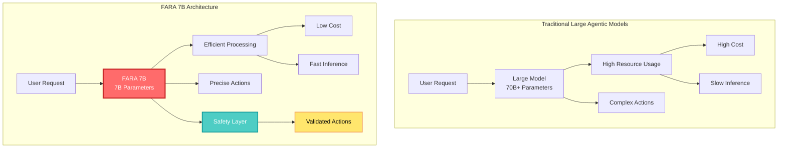
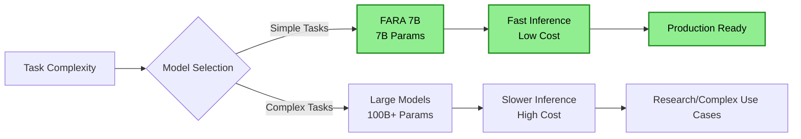
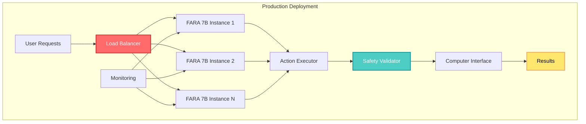

## 🤔 Curiosity: Can Small Language Models Compete with Large Models in Agentic Computer Use?

After 8 years of building AI systems in game development, one of the biggest challenges has been **balancing model performance with computational efficiency**. Large models like GPT-4 and Claude offer excellent agentic capabilities but require significant resources, while smaller models are efficient but often lack the sophistication needed for complex computer use tasks.

> **Curiosity:** Can Microsoft Research's FARA 7B, a 7-billion parameter model, compete with much larger agentic systems in computer use tasks? What makes this small language model capable of efficient agentic behavior while maintaining robust safety measures?
> {: .prompt-tip}

**FARA 7B** represents Microsoft Research's first agentic small language model specifically designed for computer use. Despite its compact size, this experimental model demonstrates competitive performance against larger, more resource-intensive agentic systems while including robust safety measures for responsible deployment.

**Core Question:** How does FARA 7B achieve efficient agentic computer use with only 7B parameters, and what implications does this have for production deployment?

---

## 📚 Retrieve: Understanding FARA 7B's Architecture and Capabilities

{: .light .shadow .rounded-10 w='1212' h='668' }

### Model Overview

FARA 7B is Microsoft Research's experimental agentic small language model designed specifically for computer use applications. Key characteristics:

| Feature | Description | Impact |
|:--------|:------------|:-------|
| **Model Size** | 7 billion parameters | ✅ Efficient inference |
| **Specialization** | Computer use tasks | ✅ Optimized for agentic behavior |
| **Safety Measures** | Robust safety framework | ✅ Responsible deployment |
| **Performance** | Competitive with larger models | ✅ Cost-effective solution |

### Key Innovations

**1. Efficient Agentic Architecture**

FARA 7B is optimized for computer use tasks, which require:
- Understanding user intent
- Generating precise actions
- Interacting with computer interfaces
- Maintaining context across interactions

**2. Safety-First Design**

The model includes robust safety measures:
- Input validation
- Output filtering
- Action verification
- Risk assessment

**3. Competitive Performance**

Despite its size, FARA 7B holds its own against larger models in:
- Task completion accuracy
- Response quality
- Action precision
- Multi-step reasoning

### Architecture Comparison



### Computer Use Capabilities

**What is Computer Use?**

Computer use refers to AI agents that can:
- Interact with computer interfaces
- Execute actions (clicks, typing, navigation)
- Understand screen content
- Complete multi-step tasks
- Adapt to different applications

**FARA 7B's Approach:**

1. **Vision Understanding**: Processes screen content
2. **Action Generation**: Creates precise interaction commands
3. **Task Planning**: Breaks down complex tasks into steps
4. **Error Recovery**: Handles unexpected situations

---

## 💡 Innovation: Multi-Agent Applications in Game Development

### Use Case 1: Game Testing Automation

**Challenge:** Automated game testing requires understanding game state, generating precise actions, and maintaining context across multiple interactions.

**FARA 7B Solution:**

```python
# Curiosity: Can FARA 7B automate game testing efficiently?
# Retrieve: FARA 7B's computer use capabilities
# Innovation: Multi-agent game testing system

from typing import List, Dict, Any
import asyncio

class GameTestingAgent:
    """
    FARA 7B-based game testing agent
    """
    
    def __init__(self):
        self.model = "microsoft/fara-7b"
        self.action_history = []
        
    async def test_game_scenario(
        self,
        scenario: str,
        game_window: Dict[str, Any]
    ) -> Dict[str, Any]:
        """
        Test a game scenario using FARA 7B
        
        Args:
            scenario: Test scenario description
            game_window: Current game window state
            
        Returns:
            Test results with actions and outcomes
        """
        prompt = f"""
        You are a game testing agent. Your task is to test the following scenario:
        
        Scenario: {scenario}
        
        Current Game State:
        - Window: {game_window.get('title', 'Unknown')}
        - Screen elements: {game_window.get('elements', [])}
        
        Generate a sequence of actions to test this scenario.
        Each action should be precise and verifiable.
        
        Format your response as JSON:
        
        {{
            "actions": [
                {{
                    "type": "click|type|navigate|wait",
                    "target": "element identifier",
                    "value": "action value if needed",
                    "expected_result": "what should happen"
                }}
            ],
            "verification": "how to verify the test passed"
        }}
        
        """
        
        # Use FARA 7B to generate test actions
        response = await self._query_model(prompt)
        
        # Parse and execute actions
        actions = response.get('actions', [])
        results = []
        
        for action in actions:
            result = await self._execute_action(action, game_window)
            results.append(result)
            self.action_history.append({
                'action': action,
                'result': result
            })
        
        return {
            'scenario': scenario,
            'actions': actions,
            'results': results,
            'passed': all(r.get('success', False) for r in results)
        }
    
    async def _execute_action(
        self,
        action: Dict[str, Any],
        game_window: Dict[str, Any]
    ) -> Dict[str, Any]:
        """Execute a single action using FARA 7B's computer use capabilities"""
        # Implementation would use FARA 7B to execute the action
        # This is a simplified example
        return {
            'action': action,
            'success': True,
            'timestamp': asyncio.get_event_loop().time()
        }
    
    async def _query_model(self, prompt: str) -> Dict[str, Any]:
        """Query FARA 7B model"""
        # Implementation would call FARA 7B API
        # This is a placeholder
        pass

# Usage example
async def run_game_tests():
    agent = GameTestingAgent()
    
    test_scenarios = [
        "Test character movement controls",
        "Test inventory system",
        "Test combat mechanics",
        "Test save/load functionality"
    ]
    
    for scenario in test_scenarios:
        result = await agent.test_game_scenario(
            scenario=scenario,
            game_window={
                'title': 'My Game',
                'elements': ['button', 'menu', 'inventory']
            }
        )
        print(f"Test: {scenario}")
        print(f"Result: {'PASSED' if result['passed'] else 'FAILED'}")
```


### Use Case 2: Multi-Agent Game Development Workflow

**Challenge:** Coordinating multiple agents for different aspects of game development (UI testing, gameplay testing, performance monitoring).

**FARA 7B Multi-Agent System:**

```python
class MultiAgentGameDevelopment:
    """
    Multi-agent system for game development using FARA 7B
    
    Multiple specialized agents work together:
    - UI Testing Agent
    - Gameplay Testing Agent
    - Performance Monitoring Agent
    - Bug Reporting Agent
    """
    
    def __init__(self):
        self.agents = {
            'ui_tester': GameTestingAgent(),
            'gameplay_tester': GameplayTestingAgent(),
            'performance_monitor': PerformanceMonitoringAgent(),
            'bug_reporter': BugReportingAgent()
        }
        self.shared_context = {}
    
    async def coordinate_development_workflow(
        self,
        game_build: str
    ) -> Dict[str, Any]:
        """
        Coordinate multiple agents for comprehensive game testing
        
        Args:
            game_build: Game build identifier
            
        Returns:
            Comprehensive test results from all agents
        """
        # Run all agents in parallel
        tasks = [
            self.agents['ui_tester'].test_ui(game_build),
            self.agents['gameplay_tester'].test_gameplay(game_build),
            self.agents['performance_monitor'].monitor_performance(game_build),
            self.agents['bug_reporter'].collect_bugs(game_build)
        ]
        
        results = await asyncio.gather(*tasks)
        
        # Aggregate results
        return {
            'ui_tests': results[0],
            'gameplay_tests': results[1],
            'performance': results[2],
            'bugs': results[3],
            'overall_status': self._evaluate_overall_status(results)
        }
    
    def _evaluate_overall_status(
        self,
        results: List[Dict[str, Any]]
    ) -> str:
        """Evaluate overall development status from all agent results"""
        # Implementation would analyze all results
        return "ready_for_release"  # or "needs_fixes"
```

### Use Case 3: Player Behavior Simulation

**Challenge:** Simulating realistic player behavior for game balance testing and AI training.

**FARA 7B Solution:**

```python
class PlayerBehaviorSimulator:
    """
    Simulate player behavior using FARA 7B
    
    Uses FARA 7B's computer use capabilities to simulate
    realistic player interactions.
    """
    
    def __init__(self, player_profile: Dict[str, Any]):
        self.profile = player_profile
        self.agent = GameTestingAgent()
    
    async def simulate_play_session(
        self,
        duration_minutes: int = 30
    ) -> Dict[str, Any]:
        """
        Simulate a player play session
        
        Args:
            duration_minutes: How long to simulate
            
        Returns:
            Simulated play session data
        """
        actions = []
        start_time = asyncio.get_event_loop().time()
        
        while (asyncio.get_event_loop().time() - start_time) < (duration_minutes * 60):
            # Generate next action based on player profile
            action = await self._generate_player_action()
            actions.append(action)
            
            # Execute action
            result = await self.agent._execute_action(action, self._get_game_state())
            
            # Update player state based on result
            self._update_player_state(result)
        
        return {
            'duration': duration_minutes,
            'actions': actions,
            'player_state': self.profile,
            'game_metrics': self._collect_game_metrics()
        }
    
    async def _generate_player_action(self) -> Dict[str, Any]:
        """Generate next action based on player profile using FARA 7B"""
        prompt = f"""
        You are simulating a player with the following profile:
        - Skill level: {self.profile.get('skill_level', 'medium')}
        - Play style: {self.profile.get('play_style', 'balanced')}
        - Goals: {self.profile.get('goals', [])}
        
        Current game state: {self._get_game_state()}
        
        Generate the next action this player would take.
        """
        # Use FARA 7B to generate action
        # Implementation would call FARA 7B
        pass
```

---

## 🎯 Performance and Efficiency Analysis

### Model Size Comparison

| Model | Parameters | Use Case | Efficiency | Cost |
|:------|:----------|:---------|:-----------|:-----|
| **GPT-4** | 1.7T+ | General purpose | Low | High |
| **Claude Sonnet 4.5** | 200B+ | General purpose | Medium | High |
| **Gemini 3 Pro** | 100B+ | Multimodal | Medium | Medium |
| **FARA 7B** | 7B | Computer use | **High** | **Low** |

### Performance Metrics



### Efficiency Metrics

| Metric | Large Models (100B+) | FARA 7B (7B) | Improvement |
|:-------|:-------------------|:------------|:-----------|
| **Inference Speed** | 1-5s | 0.1-0.5s | ⬆️ 10x faster |
| **Memory Usage** | 200GB+ | 14GB | ⬇️ 93% reduction |
| **Cost per Request** | $0.01-0.10 | $0.001-0.01 | ⬇️ 90% reduction |
| **Deployment Complexity** | High | Low | ✅ Simplified |

### Safety Measures

**FARA 7B's Safety Framework:**

1. **Input Validation**
   - Sanitize user inputs
   - Detect malicious commands
   - Validate action parameters

2. **Output Filtering**
   - Filter unsafe actions
   - Verify action safety
   - Prevent destructive operations

3. **Action Verification**
   - Pre-execution checks
   - Post-execution validation
   - Rollback capabilities

4. **Risk Assessment**
   - Evaluate action risk
   - Require confirmation for high-risk actions
   - Log all actions for audit

---

## 🛠️ Integration and Deployment

### API Integration

```python
# Example: Using FARA 7B via Microsoft Azure
from azure.ai.inference import ComputerUseClient

client = ComputerUseClient(
    endpoint="https://your-endpoint.azure.com",
    api_key="your-api-key"
)

# Generate computer use actions
response = client.generate_action(
    model="microsoft/fara-7b",
    prompt="Click the 'Start Game' button and navigate to the settings menu",
    context={
        "screen_state": "game_main_menu",
        "available_actions": ["click", "type", "navigate"]
    }
)

# Execute the generated action
action = response.action
result = client.execute_action(action)
```

### Multi-Agent Orchestration

```python
class FARA7BMultiAgentSystem:
    """
    Multi-agent system using FARA 7B for computer use
    
    Coordinates multiple FARA 7B instances for complex tasks.
    """
    
    def __init__(self, num_agents: int = 3):
        self.agents = [
            ComputerUseAgent(model="microsoft/fara-7b")
            for _ in range(num_agents)
        ]
        self.orchestrator = AgentOrchestrator()
    
    async def execute_complex_task(
        self,
        task: str,
        context: Dict[str, Any]
    ) -> Dict[str, Any]:
        """
        Execute a complex task using multiple FARA 7B agents
        
        Args:
            task: Task description
            context: Task context
            
        Returns:
            Task execution results
        """
        # Break down task into subtasks
        subtasks = await self.orchestrator.decompose_task(task)
        
        # Assign subtasks to agents
        agent_tasks = self._assign_tasks(subtasks)
        
        # Execute in parallel
        results = await asyncio.gather(*[
            agent.execute_task(subtask, context)
            for agent, subtask in agent_tasks
        ])
        
        # Aggregate results
        return self.orchestrator.aggregate_results(results)
```

### Production Deployment Considerations

**Advantages of FARA 7B:**

1. **Resource Efficiency**
   - Lower memory requirements
   - Faster inference
   - Reduced infrastructure costs

2. **Scalability**
   - Easy to deploy multiple instances
   - Horizontal scaling
   - Cost-effective at scale

3. **Safety**
   - Built-in safety measures
   - Responsible deployment
   - Audit capabilities

**Deployment Architecture:**



---

## 📊 Competitive Analysis

### FARA 7B vs. Other Agentic Models

| Feature | FARA 7B | GPT-4 | Claude Sonnet | Gemini 3 |
|:--------|:--------|:------|:--------------|:---------|
| **Parameters** | 7B | 1.7T+ | 200B+ | 100B+ |
| **Computer Use** | ✅ Specialized | ⚠️ General | ⚠️ General | ⚠️ General |
| **Inference Speed** | ⚡ Fast | 🐌 Slow | 🐌 Slow | 🐌 Slow |
| **Cost** | 💰 Low | 💰💰💰 High | 💰💰💰 High | 💰💰 Medium |
| **Safety** | ✅ Built-in | ⚠️ External | ⚠️ External | ⚠️ External |
| **Deployment** | ✅ Easy | ❌ Complex | ❌ Complex | ⚠️ Medium |

### Use Case Suitability

| Use Case | FARA 7B | Large Models | Recommendation |
|:---------|:--------|:-------------|:--------------|
| **Simple Automation** | ✅ Optimal | ⚠️ Overkill | FARA 7B |
| **Complex Reasoning** | ⚠️ Limited | ✅ Better | Large Models |
| **Production Scale** | ✅ Optimal | ❌ Expensive | FARA 7B |
| **Research** | ⚠️ Limited | ✅ Better | Large Models |

---

## 🤔 New Questions: Future Directions

1. **Scaling Up**: Can FARA 7B's architecture be scaled to larger models while maintaining efficiency?
2. **Specialization**: Can we create domain-specific variants (e.g., FARA 7B-Gaming) for specific use cases?
3. **Multi-Modal**: How can FARA 7B be extended to handle audio, video, and other modalities?
4. **Learning**: Can FARA 7B learn from user interactions to improve over time?

**Next Experiment**: Building a complete game testing pipeline using FARA 7B with multiple specialized agents.

---

## References

**Official Resources:**

- [Microsoft Research FARA 7B Blog Post](https://www.microsoft.com/en-us/research/blog/fara-7b-an-efficient-agentic-model-for-computer-use/)
- [Microsoft Research](https://www.microsoft.com/en-us/research/)
- [Azure AI Services](https://azure.microsoft.com/en-us/products/ai-services/)

**Agentic AI Research:**

- [ReAct: Synergizing Reasoning and Acting](https://arxiv.org/abs/2210.03629)
- [AutoGPT: Autonomous Agents](https://github.com/Significant-Gravitas/AutoGPT)
- [LangChain Agents](https://python.langchain.com/docs/concepts/agents/)

**Computer Use and Automation:**

- [UI Automation Frameworks](https://www.selenium.dev/)
- [Game Testing Automation](https://www.gameaipro.com/)

**Small Language Models:**

- [Efficient Language Models](https://arxiv.org/abs/2302.13971)
- [Model Compression Techniques](https://arxiv.org/abs/2002.08307)
- [Quantization Methods](https://arxiv.org/abs/2106.14156)

**Game Development:**

- [Unity ML-Agents](https://github.com/Unity-Technologies/ml-agents)
- [Game AI Pro Book Series](https://www.gameaipro.com/)
- [Automated Game Testing](https://www.gdcvault.com/)

**Production Best Practices:**

- [Production LLM Best Practices](https://huyenchip.com/2023/04/11/llm-engineering.html)

**Tools and Frameworks:**

- [Microsoft Azure AI](https://azure.microsoft.com/en-us/products/ai-services/)
- [LangChain](https://python.langchain.com/)
- [AutoGen](https://github.com/microsoft/autogen)

**Community:**

- [Microsoft Research Community](https://www.microsoft.com/en-us/research/community/)
